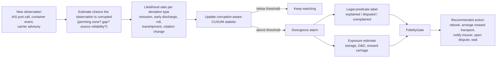
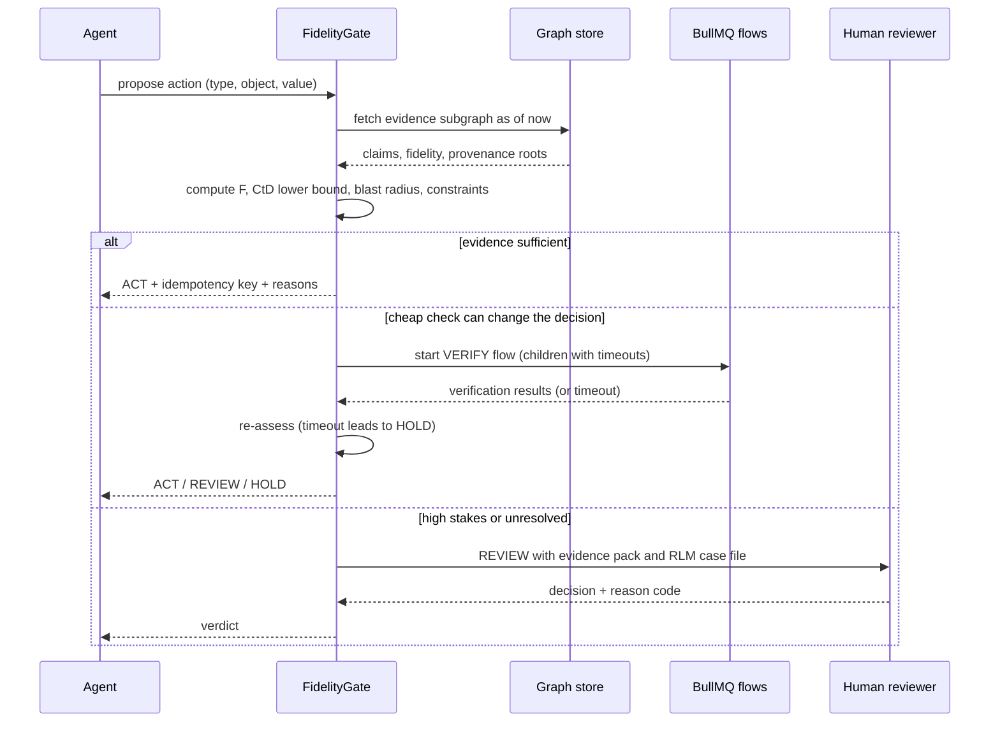
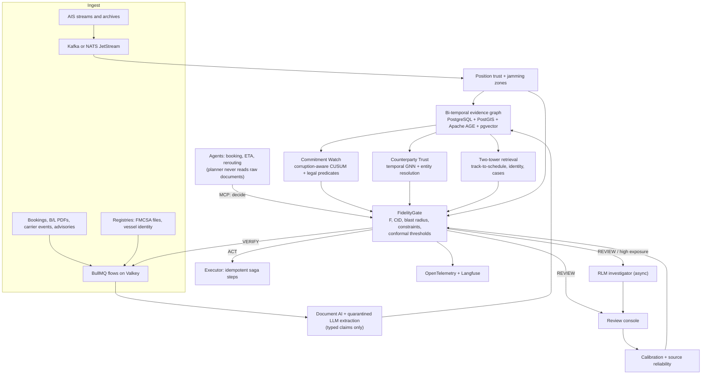

# Final Topic · When the Data Lies

*Fidelity-gated, spoof-resilient AI agents that check location, identity and carrier-commitment evidence before they act in maritime and freight logistics*

| Field | Detail |
|---|---|
| Paper title (working) | When the Data Lies: Decision-Weighted Fidelity and Cost-to-Deceive Gating for AI Agents Acting on Spoofed, Stolen and Broken Logistics Evidence |
| Problem in one line | Logistics AI agents now book, reroute and release cargo automatically, but the location, identity and carrier-promise data they act on is increasingly faked, hijacked or quietly broken. |
| Solution in one line | A decision gate that scores how trustworthy the evidence is for each specific action, how expensive it would be to fake, and how far a mistake would spread, then lets the agent act, verify, escalate or wait. |
| What it combines | Topic 2 (spoofing and identity) + Topic 1 (the decision gate) + your question on carriers leaving cargo at non-destination ports, which becomes a third evidence type, "commitment fidelity" |
| First paper scope | Maritime: location fidelity (AIS/GNSS) + commitment fidelity (declared voyage vs observed execution), with the 2026 Gulf/Hormuz disruption as the real-world case |
| Later papers | Identity fidelity (carrier and vessel identity fraud); the open benchmark; a practice/policy paper |
| Recent tech used | Recursive Language Models, typed "System One" decisions (TypeSafe Jev as an optional baseline, open DSPy/vLLM equivalent as the core), two-tower retrieval, BullMQ, temporal graph learning, conformal risk control, CaMeL-style control/data separation, MCP and A2A |
| Data | Open AIS archives (US, Denmark, Norway, Finland), a free live AIS stream, IMF PortWatch, Global Fishing Watch (research use), DCSA open standards, public carrier advisories, FMCSA public registry files; attacks and deviations injected synthetically with exact labels |
| Compute | One DGX Spark (128 GB) is enough for research and the prototype |
| Product | **TrackTrust**: Commitment Watch, Position Trust, Counterparty Trust and a FidelityGate decision API for agents |
| Honest verdict | Feasible with no budget for the research, an open benchmark and a working prototype. A Q1 paper is realistic but not guaranteed. A Gulf production service will eventually need better live AIS coverage and partner shipment data. |

---

## 0. The topic in short

**Heading:** *When the Data Lies: fidelity-gated AI agents for spoofed, stolen and broken logistics evidence.*

**Summary.** Shipping and freight companies are handing decisions to AI agents. Those agents trust three kinds of evidence. **Location** comes from AIS and GPS. In 2026, jamming made about 61% of logged Strait of Hormuz transits in one month false [[1]](#ref-1). **Identity** is who is carrying the cargo. Cargo theft in the US and Canada, increasingly carried out through hijacked carrier identities, cost about $725M in 2025 [[2]](#ref-2), [[3]](#ref-3). **Commitment** is what the carrier promised. In March 2026 several carriers declared "End of Voyage" and left Gulf-bound cargo at substitute ports, at the cargo owner's cost [[4]](#ref-4), [[5]](#ref-5), [[6]](#ref-6), [[7]](#ref-7).

Today's agent-security tools stop attackers from changing *what an agent is told to do* [[8]](#ref-8), [[9]](#ref-9). No published system we found checks *whether the facts it is given are true*. This research builds and tests that missing layer. For every action it estimates how reliable the evidence is for that action, how cheaply an attacker could fake it, and how far a mistake would spread. It then lets the agent act, verify, escalate or wait, with a measured error guarantee. It is shipped as an open benchmark and a real-time product.

**Honesty note.** Every factual claim below carries a numbered source. Numbers from vendors (Windward, Kpler, Highway, Verisk CargoNet and others) are unaudited. Several 2026 papers are preprints. Regulatory and conflict-related facts can change quickly. The sources were collected on 7–8 October 2026, and many publisher sites could not be opened directly from the research environment, so check each number against the original before citing it in a manuscript. Section 22 explains how every source was checked.

## 1. Honest verdict: can this be done with no budget, and can it be published?

| Question | Answer | Why, and what could go wrong |
|---|---|---|
| Can the research be done with open-source tools and no money? | **Yes** | Open AIS archives exist for US, Danish, Norwegian and Finnish waters [[10]](#ref-10), [[11]](#ref-11), [[12]](#ref-12), [[13]](#ref-13). The software stack (vLLM, DSPy, PyTorch Geometric, BullMQ, Valkey, Kafka/NATS, PostgreSQL) is OSI-licensed, and gpt-oss weights are Apache-2.0. Qwen3.5 weights are reported as Apache-2.0, but confirm on each model card [[14]](#ref-14), [[15]](#ref-15), [[16]](#ref-16), [[17]](#ref-17). One DGX Spark runs every model needed [[18]](#ref-18), [[19]](#ref-19). |
| Is there real ground truth? | **Partly** | Our searches found no public labelled AIS-spoofing, carrier-fraud or cargo-diversion benchmark (Section 5.9). Labels come from synthetic injection on real data (exact labels) plus documented real events for case studies, such as the 2026 Gulf End of Voyage notices [[4]](#ref-4), [[5]](#ref-5), [[6]](#ref-6), [[7]](#ref-7). Reviewers will check the synthetic-vs-real gap closely. |
| Can it run in real time? | **Yes, with the right design** | Rules, graph features and small models give sub-second decisions. A 120B model on one Spark decodes about 59 tokens/s, so large models are kept off the real-time path and used only for asynchronous investigation [[18]](#ref-18). |
| Can the commercial product be fully free? | **Not for every component** | Some data and models are non-commercial: Global Fishing Watch APIs (CC BY-NC) [[20]](#ref-20), TimesFM 3.0 and TabPFN-2.5+ [[21]](#ref-21), [[22]](#ref-22), and Jev is a paid API [[23]](#ref-23). The product must use only commercially usable parts. These remain fine as research baselines. |
| Is Gulf live coverage free? | **Uncertain** | The free real-time stream (aisstream.io) publishes no coverage or terms statement [[24]](#ref-24), [[25]](#ref-25). A product for Gulf customers may need paid AIS or a low-cost receiver feeding AISHub [[26]](#ref-26). |
| Can it be published in a Q1 journal? | **Realistic, not guaranteed** | The gaps are real and current (Section 6), and the target journals are Q1 in JCR 2025 [[27]](#ref-27). Acceptance depends on a formal contribution, leakage-aware evaluation [[28]](#ref-28), strong baselines [[29]](#ref-29) and a real-data case study. Expect 12–15 months to submission and several months of review. |
| Can it be done alone? | **Yes, if scope is controlled** | Paper 1 covers only maritime location and commitment fidelity. Identity fraud and the full product come later. Doing everything at once is the main risk. |

## 2. The problem in plain words

AI agents in logistics now act on their own. Brokers let AI agents answer inbound carrier calls and run carrier vetting [[30]](#ref-30), [[31]](#ref-31). Visibility platforms ship agents for exception handling and carrier communication [[32]](#ref-32), [[33]](#ref-33). Gartner predicts 60% of supply-chain disruptions will be resolved without human intervention by 2031 [[34]](#ref-34). These agents act on three kinds of evidence, and each can lie.

| Evidence type | The question it answers | How it lies in 2026 |
|---|---|---|
| **Location** | Where is the ship, truck or container? | GNSS jamming and spoofing move reported positions onto land or into circles and create port calls that never happened [[35]](#ref-35), [[36]](#ref-36). |
| **Identity** | Who is really carrying or calling about the cargo? | Criminals take over carrier and broker accounts, change registry records, and send a truck for a fictitious pickup [[3]](#ref-3), [[37]](#ref-37). Ships reuse the identities of scrapped vessels or invent IMO numbers [[38]](#ref-38). |
| **Commitment** | Will the cargo go where the carrier promised? | Carriers roll booked cargo or end the voyage at a substitute port. Shippers often learn late, through a notice or a container event [[4]](#ref-4), [[5]](#ref-5), [[39]](#ref-39), [[40]](#ref-40). |

**Story 1: location.** In March 2026, a forwarder's ETA agent reads AIS positions for a ship approaching Jebel Ali. Jamming in the Gulf has displaced hundreds of ships' reported positions [[41]](#ref-41), [[42]](#ref-42). The agent sees the ship "stopped" 40 nm off course and books expensive alternative trucking from Sohar. The ship was on schedule. Nothing in the pipeline asked whether the position data was physically plausible, or whether every ship nearby showed the same jump.

**Story 2: identity.** A carrier with a five-year-old USDOT number calls a broker's AI agent about a high-value load. The registry record looks clean, but its contact details were changed days ago. Highway reported that about half of Q1 2026 theft incidents involved carriers with legitimate numbers and clean histories [[37]](#ref-37). Static credentials are cheap to borrow, and the agent tenders the load.

**Story 3: commitment.** A Dubai importer's container is booked to Jebel Ali. On 3 March 2026 the carrier declares End of Voyage for all Gulf-bound cargo, discharges it at the "next safe port", charges USD 800 per container and transfers custody and onward costs to the cargo owner [[4]](#ref-4), [[43]](#ref-43). The importer's planning agent still shows the original ETA, because nothing compared the carrier's commitment with what the ship was actually doing.

**What is missing.** Agent-security research defends *instruction integrity*: it stops injected text from hijacking an agent's control flow [[8]](#ref-8), [[9]](#ref-9). A well-formed but false value still passes those defences: a spoofed position, a borrowed identity, or a promise the carrier is no longer keeping. In our searches we found no published system that estimates whether such a value is true, how costly it would be to fake, and what a wrong action would cost downstream, and then gates the agent's action on all three. That is the research gap (Section 6).

## 3. Your question: carriers leaving cargo at a non-destination port

You described ships that, mid-voyage, unload contracted cargo at a port that is not its destination so they can load a higher bidder's cargo. Here is what the evidence actually shows.

### 3.1 What is documented

| Pattern | Documented? | Stated reason | Key evidence |
|---|---|---|---|
| Carrier discharges cargo at a substitute port and ends the contract there ("End of Voyage", liberty clause) | **Yes, widely in 2026** | War risk, safety, port closure | MSC declared End of Voyage for all Arabian Gulf-bound cargo on 3 March 2026, discharging at the "next safe port" with a USD 800/container surcharge and moving custody and onward cost to the cargo owner [[4]](#ref-4), [[43]](#ref-43). RCL's March 2026 advisories ended voyages at substitute ports including Sohar, Khor Fakkan and Nhava Sheva (one destination was later revised) [[6]](#ref-6). Emirates Line invoked its Clause 8 liberties to discharge or tranship at Khor Fakkan at the merchant's risk and cost, and later notices added surcharges [[7]](#ref-7). Hapag-Lloyd omitted Jebel Ali on Indian Ocean services and moved dry-cargo discharge to Sohar [[44]](#ref-44), [[45]](#ref-45). Maersk placed India-discharged containers at the customer's disposal at an Indian port [[39]](#ref-39). Geodis estimated 15,000–18,000 containers affected in India [[46]](#ref-46). |
| Same pattern before 2026 | **Yes** | Port closure, strikes | After the Baltimore bridge collapse (March 2024), MSC ended delivery at alternate ports, with costs for the cargo's account [[47]](#ref-47). Around the October 2024 US port strike, Vizion estimated about 2,000 shipments may have been dropped at non-destination ports [[48]](#ref-48). |
| Carrier leaves booked cargo behind (rolls it) while loading better-paying cargo | **Yes, especially 2020–2022** | Commercial (spot rates far above contract rates) | Trade press documented contract cargo bumped for spot and premium cargo [[49]](#ref-49), [[50]](#ref-50). Ocean Insights measured average rollover at major transhipment ports rising from 22.2% (October 2019) to 28.5% (October 2020) and 37% (December 2020). project44 reported 39% in April 2021, though some port figures were disputed [[40]](#ref-40), [[51]](#ref-51). An FMC judge's initial decision (24 April 2026) awarded about USD 45.6M in reparations against OOCL to the Bed Bath & Beyond estate. It found refusal to deal and retaliation over missed space and price commitments in 2021–2022. The decision is not final: it is under Commission review and challenged in federal court [[52]](#ref-52), [[53]](#ref-53). In 2024 the FMC found Hamburg Süd liable for refusal to deal and retaliation and set reparations at about USD 17.6M [[54]](#ref-54). |
| Carrier offloads cargo **mid-voyage at an intermediate port** specifically to load a higher bidder's cargo | **Not reliably documented** | Commercial | Our first search found one trade-press headline (The Loadstar, apparently January 2020) saying some Asia–North Europe carriers left China-loaded boxes at transhipment hubs to make room for better-paid cargo [[55]](#ref-55). **A second, independent check could not find this article again, so treat it as unverified.** No 2024–2026 case of this exact behaviour was found. Absence in search results does not prove it never happens, but there is no solid public evidence for it today. |

**Legal context, in brief.** End of Voyage is not a doctrine of law. It comes from the carrier's own bill-of-lading clauses ("liberty", "special circumstances"), and whether cargo owners can successfully challenge it is largely untested [[56]](#ref-56), [[57]](#ref-57), [[58]](#ref-58). In the US, the FMC's 2024 rule on unreasonable refusal to deal gives examples of potentially unreasonable conduct when carriers refuse *cargo space* after booking. They include insufficient notice of blank sailings or schedule changes and *providing inaccurate or unreliable vessel information*. The D.C. Circuit upheld the rule on 31 March 2026 [[59]](#ref-59), [[60]](#ref-60), [[61]](#ref-61). This ties data fidelity directly to a legal standard. The UAE's 2023 maritime law reportedly limits clauses that reduce carrier liability, but this comes from law-firm commentary, not the official text [[62]](#ref-62).

### 3.2 Does it fit the topic?

**Yes, as a third evidence type: commitment fidelity.** A booking, a bill of lading and a published schedule are claims about the future: this cargo, on this vessel, will be discharged at this port. AIS port calls [[63]](#ref-63), [[64]](#ref-64), DCSA container events and schedule exceptions [[65]](#ref-65), [[66]](#ref-66), and carrier advisories are independent observations of what is actually happening. The gap between the two can be measured, scored for reliability and acted on, which is exactly the job of the fidelity gate.

**What AI can and cannot do here, honestly:**

- **Can:** detect early that execution is diverging from the commitment (an omitted port call, an unscheduled call, a container discharged at a port other than its destination with no onward loading), estimate the cost exposure (storage, demurrage and detention, onward carriage), attach the clause the carrier invoked, and recommend an action (rebook, arrange onward trucking, file a dispute, notify insurer).
- **Cannot:** prove *why* a carrier did it. Opportunism, force majeure and congestion look the same in the data. The product must report "divergence and exposure", never "the carrier cheated". Accusing carriers without evidence would be wrong and legally risky.
- **Needs care:** AIS port calls can themselves be spoofed [[36]](#ref-36), and the self-reported AIS destination field is wrong very often: about 40% for large bulk ships in one study [[67]](#ref-67). Commitment checking therefore needs the location-fidelity layer underneath it, which is why the two belong in one topic.

**Research opening.** Published work detects port skipping at vessel or service level from AIS [[63]](#ref-63), [[64]](#ref-64). None found works at shipment level, attributes cause, gives calibrated uncertainty, or is robust to AIS spoofing. None encodes liberty clauses, End of Voyage notices or the FMC examples as machine-checkable rules either. Both are new contributions this project can make.

## 4. Why this matters now (evidence)

| Signal | What it says | Source |
|---|---|---|
| Location data is corrupted at scale | A Georgia Tech measurement study of more than 367,000 vessels, reported in September 2026 as due at IEEE S&P 2027, found 31 persistent GNSS-spoofing areas and 17,936 anomalous episodes. The figures come from press coverage; the paper's arXiv listing could not be confirmed. | [[68]](#ref-68), [[35]](#ref-35) |
| Gulf 2026 | Windward reported more than 1,100 vessels with GPS/AIS interference within about 24 hours after hostilities began in early March 2026. Lloyd's List counted 1,735 events across 655 vessels by 3 March. | [[41]](#ref-41), [[42]](#ref-42), [[69]](#ref-69) |
| Records can be mostly false | An August 2026 analysis found 393 of 642 logged Hormuz transits (61%) were jamming artifacts (independent analysis; re-check before citing). | [[1]](#ref-1), [[70]](#ref-70) |
| Interference continued | JMIC advisories and P&I-club updates describe GNSS interference continuing in the Gulf region at varying intensity from March through at least mid-August 2026. | [[71]](#ref-71), [[72]](#ref-72), [[73]](#ref-73) |
| Spoofed port calls | Lloyd's List data showed ships calling at Polish ports with AIS tracks jumping to the Kaliningrad area. Analysts advised rebuilding port calls from position history. | [[36]](#ref-36) |
| Identity theft is the theft method | The FBI described an attack chain of account takeover, registry changes and freight diversion (30 April 2026). Verisk CargoNet reported about USD 725M in 2025 losses (+60%) and USD 304.6M in Q2 2026 alone, more than double Q2 2025. | [[3]](#ref-3), [[2]](#ref-2), [[74]](#ref-74) |
| Clean credentials are not enough | About 50% of Q1 2026 theft incidents involved carriers with legitimate numbers and clean histories. Communication-based attacks were 50% of fraud vectors in Q2 2026 (vendor data). | [[37]](#ref-37), [[75]](#ref-75) |
| Registry hardening moved the attack | FMCSA launched Motus with identity proofing in May 2026. Phishing that impersonates Motus followed within months. | [[76]](#ref-76), [[77]](#ref-77) |
| Maritime identity fraud | The IMO Legal Committee recorded 529 falsely flagged ships in a year (April 2026). Lloyd's List and SynMax documented tankers sailing under scrapped or invented IMO numbers. | [[78]](#ref-78), [[38]](#ref-38) |
| Commitment breaks | End of Voyage notices from MSC, RCL and Emirates Line. A Vizion executive estimated more than 270,000 TEU stranded. Outbound bookings across ten Gulf ports fell from about 4,000–5,000 TEU a day to near zero on several days in early March (vendor data). | [[4]](#ref-4), [[5]](#ref-5), [[6]](#ref-6), [[7]](#ref-7), [[79]](#ref-79), [[80]](#ref-80) |
| Schedules are unreliable | Sea-Intelligence reported global schedule reliability of 62.6% in June 2026. | [[81]](#ref-81) |
| AI value is not arriving | BCG's 2026 survey of 30 logistics players: 97% call AI a strategic priority, 13% see measurable financial impact. | [[82]](#ref-82) |
| Agents are the new target | OWASP's 2026 lists put Excessive Agency at #3 and name Cascading Failures and Memory & Context Poisoning among top agentic risks. | [[83]](#ref-83), [[84]](#ref-84) |

## 5. What already exists: literature review

This section maps the published work you will build on and cite. Each stream ends with what is still missing for this project. "Preprint" marks work not yet peer-reviewed.

### 5.1 AIS and GNSS spoofing and jamming detection

| Work | What it does | Status |
|---|---|---|
| Georgia Tech global GPS-spoofing measurement study [[68]](#ref-68), [[35]](#ref-35) | Measures GNSS spoofing across more than 367,000 vessels by finding groups of independent ships reporting physically impossible movement at the same place and time. Finds 31 persistent areas and 17,936 anomalous episodes. | Reported as due at IEEE S&P 2027; arXiv listing not confirmed |
| SeaSpoofFinder [[85]](#ref-85) | Two stages: physically impossible jumps, then clustering across vessels. Events found in the Baltic, Black Sea and eastern Mediterranean. | Preprint, 2026 |
| Multi-vessel coherence with communication-integrity filtering [[86]](#ref-86) | Removes AIS transmission artifacts (duplicate MMSIs, stale retransmissions), then applies IMM filtering and space-time DBSCAN. Reports a 98.6% false-alarm reduction on about 966M Korean AIS messages. | Preprint, 2026 (title differs between versions) |
| Track consistency with crowdsourced ADS-B [[87]](#ref-87) | Shows that aircraft navigation-integrity flags can stay high during position anomalies, so track checks are needed. A second sensor modality for coastal interference. | Preprint, 2026 |
| Low-cost receiver monitoring [[88]](#ref-88) | Calibrated commodity GNSS receivers separate nominal, jammed and spoofed signals. | Preprint, 2025 |
| Identity-layer AIS spoofing [[89]](#ref-89), [[90]](#ref-90), [[91]](#ref-91) | MMSI validity checks, MMSI-change detection, tutorials on AIS spoofing methods. | Peer-reviewed / tutorial |
| Gulf and Baltic field evidence [[41]](#ref-41), [[42]](#ref-42), [[71]](#ref-71), [[92]](#ref-92), [[36]](#ref-36), [[93]](#ref-93) | 2025–2026 vendor, advisory and press documentation of interference and spoofed port calls, including the MSC Antonia grounding attributed to interference. | Unaudited vendor and press data |

**Missing:** these papers stop at a detection label or cluster. None gives a per-decision reliability score, a cost-to-deceive measure, or a link to the actions an automated agent takes. No public, labelled, real-world AIS spoofing benchmark exists. Labels are synthetic or inferred from coherence [[94]](#ref-94), [[95]](#ref-95).

**Important for novelty:** multi-vessel coherence detection now exists [[35]](#ref-35), [[85]](#ref-85), [[86]](#ref-86). This project must not claim it as new. It uses coherence as one input to the decision gate.

### 5.2 Trajectory modelling, port calls and destination prediction

| Work | What it does |
|---|---|
| GeoTrackNet [[96]](#ref-96) | Variational recurrent model of AIS tracks plus a contrario anomaly detection (IEEE T-ITS). |
| TrAISformer [[97]](#ref-97) | Transformer over discretised AIS tokens for trajectory prediction (IEEE Access 2024). |
| DiffuTraj [[98]](#ref-98); AISFlow [[99]](#ref-99) | Diffusion-based stochastic prediction; flow matching for long-gap imputation (ICML 2026). |
| Physics-informed models [[100]](#ref-100), [[101]](#ref-101), [[102]](#ref-102) | Diffusion with kinematic constraints; space-time-prism reasoning about gaps; finite-difference kinematic losses. |
| Synthetic anomaly benchmark OMAD [[94]](#ref-94), [[103]](#ref-103) | Equation-grounded synthetic anomalies with an LLM used only as a plausibility scorer; MIT-licensed code; KDD 2026 (per README). |
| Leakage audit [[28]](#ref-28) | Shows that letting the same vessels appear in training and test data cut one-hour prediction error by 23–25% for transformer models, so reported gains are inflated. Vessel- and time-disjoint splits are required. |
| Destination and port-sequence prediction [[104]](#ref-104), [[105]](#ref-105), [[106]](#ref-106) | WAY (IEEE TAES) and a retrieval-enhanced, topology-masked transformer for multi-step port-of-call prediction (preprint). |
| AIS destination reliability [[67]](#ref-67), [[107]](#ref-107) | About 40% of AIS destination reports for large bulk ships were wrong (TR-E 2021); at least 52% erroneous in a German Bight study. |
| Port-call extraction [[108]](#ref-108), [[109]](#ref-109), [[110]](#ref-110) | Geofences, berth clustering and official-statistics methods. |
| Dark vessels [[111]](#ref-111), [[112]](#ref-112), [[113]](#ref-113), [[114]](#ref-114) | About 75% of industrial fishing vessels are not publicly tracked (Nature 2024). Suspected intentional AIS disabling events. Self-supervised shutdown detection. xView3-SAR dataset. |
| AIS representation learning [[115]](#ref-115), [[116]](#ref-116), [[117]](#ref-117) | Early work on masked-autoencoder and GPT-style AIS pretraining; a 2025 survey says trajectory foundation models lack systematic study. |
| LLMs on AIS [[118]](#ref-118) | AIS-LLM aligns a time-series encoder with an LLM for prediction plus natural-language explanation (preprint). |

**Missing:** these models predict where a ship *will* go or flag abnormal tracks. None tests a ship's observed track against the *contracted* port sequence for specific shipments, with uncertainty and with spoofing robustness.

### 5.3 Carrier commitments, schedules and liner revenue management

| Work | What it does |
|---|---|
| Port-skipping from AIS [[63]](#ref-63) | Data-driven framework uncovering port-skipping behaviour on about 2,000 container ships, 2016–2020 (TR-E 2023). |
| Port-call cancellations from AIS [[64]](#ref-64) | Measures cancellations on Europe–Far East services (MEL 2024). |
| Vessel Schedule Recovery Problem [[119]](#ref-119) | MIP for recovery actions including port omission (EJOR 2013). |
| Contract vs spot slot allocation [[120]](#ref-120), [[121]](#ref-121) | Risk-averse contract selection and slot allocation (TR-E 2022); dynamic programming for spot containers with cancellations (TR-E 2025). |
| Overbooking with mutual deposits [[122]](#ref-122) | Attributes overbooking to shipper–carrier mistrust and unenforceable contracts; proposes deposits with a 0.819-competitive policy (Operations Research 2026). |
| Booking cancellation prediction [[123]](#ref-123), [[124]](#ref-124) | Survival models for slot-booking cancellation (TR-C 2019, 2020). |
| Schedule unreliability [[125]](#ref-125), [[126]](#ref-126), [[81]](#ref-81) | Origins and costs of unreliability (MEL 2007); arrival punctuality prediction (MPM 2024); 2026 reliability statistics. |
| Container delay prediction [[127]](#ref-127) | Machine learning for container shipment delays (HICSS 2020). |
| Data standards [[65]](#ref-65), [[66]](#ref-66), [[128]](#ref-128), [[129]](#ref-129), [[130]](#ref-130), [[131]](#ref-131), [[132]](#ref-132) | DCSA Operational Vessel Schedules (port omission and blank sailing events), Commercial Schedules, Track & Trace, Booking 2.0, eBL 3.0 with digital signatures, Port Call 2.0; several repositories Apache-2.0. |
| US regulation [[133]](#ref-133), [[59]](#ref-59), [[61]](#ref-61), [[134]](#ref-134) | FMC rule on unreasonable refusal to deal (2024; upheld 2026); a commissioner's personal recommendations for a maritime transportation data system (2024). |

**Missing:** this research optimises the carrier's side or measures behaviour at fleet level. Our searches found no peer-reviewed system that gives shippers early, calibrated, spoof-robust warning that a specific booking's commitment is being broken. None encodes the relevant contract clauses or regulatory examples as checkable rules either.

### 5.4 Freight and maritime identity fraud and graph anomaly detection

| Work | What it does |
|---|---|
| GADBench [[29]](#ref-29) | Benchmarks supervised graph anomaly detection. Tree ensembles with neighbourhood aggregation often beat specialised GNNs. Any GNN claim must beat this baseline. |
| TGB and TGB 2.0 [[135]](#ref-135), [[136]](#ref-136) | Temporal graph benchmarks; simple heuristics often rival complex temporal models. |
| BWGNN [[137]](#ref-137); CARE-GNN [[138]](#ref-138) | Spectral band-pass filters for anomalies; camouflage-resistant fraud detection. |
| ARC [[139]](#ref-139); UniGAD [[140]](#ref-140) | Generalist and multi-level graph anomaly detection for cold-start graphs. |
| DyGLib [[141]](#ref-141) | Unified library for temporal graph models (TGAT, TGN, DyGFormer). |
| Customs fraud: DATE [[142]](#ref-142); GraphFC [[143]](#ref-143) | Deployed customs fraud ranking under an inspection budget; GNN under label scarcity. |
| Multigraph AML [[144]](#ref-144) | Directed multigraph GNNs and synthetic AML transaction data, a template for synthetic freight-fraud data. |
| Elliptic++ [[145]](#ref-145); Elliptic2 [[146]](#ref-146); DGraph [[147]](#ref-147) | Public fraud graph datasets, all from finance and crypto. |
| LLM + graph fraud detection [[148]](#ref-148) | 2025–2026 papers combining LLMs and GNNs (curated list; individual papers not opened). |
| Document tampering: DocTamper [[149]](#ref-149) | Tampered-text detection benchmark; excludes AI-generated tampering. |
| Maritime identity fraud [[78]](#ref-78), [[150]](#ref-150), [[38]](#ref-38) | False flags, fraudulent registries, zombie vessels reusing scrapped IMO numbers (IMO and vendor reports). |

**Missing:** our searches found no public labelled dataset or detector for freight-brokerage fraud (double brokering, fictitious pickups, carrier identity takeover). Graph attacks by fraud gangs are themselves a known threat to GNN detectors [[151]](#ref-151).

### 5.5 Entity resolution and two-tower (dual-encoder) models

| Work | What it does |
|---|---|
| DSSM [[152]](#ref-152); YouTube two-tower [[153]](#ref-153); DPR [[154]](#ref-154); CLIP [[155]](#ref-155) | The two-tower lineage: separate encoders for each side of a match, dot-product scoring, pre-computed candidate vectors and approximate nearest-neighbour search. |
| Hard negatives: ANCE [[156]](#ref-156); RocketQA [[157]](#ref-157); GradCache [[158]](#ref-158) | Negatives matter more than architecture; large contrastive batches on limited memory. |
| Retrieve and re-rank [[159]](#ref-159); Augmented SBERT [[160]](#ref-160) | Bi-encoder for recall, cross-encoder for precision; silver-labelling for scarce labels. |
| Late interaction: ColBERT [[161]](#ref-161); IntTower [[162]](#ref-162) | Ways to recover the fine interactions a single dot product loses. |
| Open embedders: BGE-M3 [[163]](#ref-163); Qwen3-Embedding [[164]](#ref-164); MTEB [[165]](#ref-165) | Local embedding and re-ranking models and their benchmark. |
| ER blocking: DeepBlocker [[166]](#ref-166); Sudowoodo [[167]](#ref-167); Sparkly [[168]](#ref-168) | Dense and contrastive blocking; BM25 blocking as a strong baseline. |
| ER matching: Ditto [[169]](#ref-169); Unicorn [[170]](#ref-170); MatchGPT [[171]](#ref-171); ComEM [[172]](#ref-172) | Cross-encoder and LLM matchers; "select among candidates" works best for LLMs. |
| Record linkage tools: Splink [[173]](#ref-173); Zingg [[174]](#ref-174) | Probabilistic linkage at scale; note Zingg is AGPL. |
| Trajectory representation: TrajCL [[175]](#ref-175); START [[176]](#ref-176); surveys [[177]](#ref-177), [[178]](#ref-178) | Contrastive trajectory encoders for road and taxi data; no vessel track-to-schedule model found. |

**Missing:** no two-tower model was found that matches vessel tracks against declared schedules or claimed identities. Adversarial entity resolution, where attackers deliberately create near-duplicate identities, is not addressed by mainstream tools [[179]](#ref-179), [[180]](#ref-180).

### 5.6 LLM agents in supply chains and their reliability

| Work | What it does |
|---|---|
| Agent bullwhip [[181]](#ref-181) | LLM agents in the Beer Game beat humans but show run-to-run instability that amplifies across echelons; GRPO post-training reduces tail events. |
| Agentic AI Autonomy Assessment [[182]](#ref-182) | Measures task-level autonomy; upstream tiers benefit from autonomy, downstream tiers are harmed. |
| SupChain-Bench [[183]](#ref-183) | Long-horizon tool orchestration in supply-chain SOPs remains unreliable (Findings of ACL 2026). |
| Helicase [[184]](#ref-184) | Multi-agent LLM construction of supply-chain knowledge graphs with per-fact uncertainty. |
| OptiGuide [[185]](#ref-185); InvAgent [[186]](#ref-186) | LLMs for supply-chain optimisation what-ifs; LLM multi-agent inventory management. |
| Neurosymbolic logistics planning [[187]](#ref-187) | LLM planning with uncertainty-triggered clarification. |
| AgentNoiseBench [[188]](#ref-188); τ-bench [[189]](#ref-189), [[190]](#ref-190) | Noise injected mid-trajectory hurts most; reliability over repeated runs (pass^k) falls sharply. |
| Error cascades [[191]](#ref-191), [[192]](#ref-192), [[193]](#ref-193), [[194]](#ref-194) | One false fact spreads through multi-agent systems; failure taxonomies; graph-based guards that cut infected edges. |

**Missing:** all of these use clean or randomly noisy data. None models deliberately falsified physical, identity or commitment evidence, and none gates actions on evidence reliability.

### 5.7 Agent security, provenance and governance

| Work | What it does |
|---|---|
| CaMeL [[8]](#ref-8) | Separates control flow from data flow so untrusted data cannot choose which tool runs. |
| FIDES [[9]](#ref-9) | Information-flow-control labels enforced deterministically. |
| Design patterns for securing agents [[195]](#ref-195) | Six patterns: Action-Selector, Plan-Then-Execute, LLM Map-Reduce, Dual LLM, Code-Then-Execute, Context-Minimization. |
| Benchmarks: AgentDojo [[196]](#ref-196); ASB [[197]](#ref-197); InjecAgent [[198]](#ref-198) | Prompt-injection benchmarks; ASB reports an average attack success rate of 46.91% across 13 model backbones. |
| Model hardening: StruQ [[199]](#ref-199); Meta SecAlign [[200]](#ref-200); detectors [[201]](#ref-201), [[202]](#ref-202) | Structured queries, preference-optimised open models, activation-delta and masked re-execution detectors. |
| Provenance [[203]](#ref-203), [[204]](#ref-204), [[205]](#ref-205) | Provenance integrity layers; verification-status laundering; survey of execution provenance. |
| OWASP LLM Top 10 2026 [[83]](#ref-83), [[206]](#ref-206); Agentic Top 10 [[84]](#ref-84); Agent Control Standard [[207]](#ref-207) | Excessive Agency at #3; authorisation in deterministic logic; a "Guardian" hook returning allow/deny/modify/ask/defer. |
| MCP specification [[208]](#ref-208), [[209]](#ref-209), [[210]](#ref-210); A2A [[211]](#ref-211) | Tool annotations must be treated as untrusted; human-in-the-loop is a SHOULD; MCP under Linux Foundation project governance; A2A v1.0. |

**Missing:** in the work we reviewed, these defences protect *instruction integrity*. A well-formed but false value (a spoofed position, a cloned identity, a broken promise) is not what they test for. The Agent Control Standard has no field for evidence reliability, which leaves room for a standards contribution.

### 5.8 Uncertainty, conformal guarantees and deferral

| Work | What it does |
|---|---|
| Conformal risk control [[212]](#ref-212) | Chooses a threshold so that expected loss stays below a target, with finite-sample guarantees under exchangeability. |
| Conformal language modelling, factuality, enhanced methods, alignment [[213]](#ref-213), [[214]](#ref-214), [[215]](#ref-215), [[216]](#ref-216) | Guarantees for sets of outputs, claim filtering and selecting trustworthy outputs. |
| Introspective planning (vs KnowNo) [[217]](#ref-217) | Conformal prediction for when a planner should ask for help. |
| AbstentionBench [[218]](#ref-218) | LLMs, especially reasoning models, rarely abstain when they should. An external gate is needed. |
| Learning to defer [[219]](#ref-219), [[220]](#ref-220) | When to hand a decision to a human, with consistent training objectives. |
| Uncertainty of Thoughts [[221]](#ref-221) | Choosing which question to ask next by expected information gain. |
| Tools: MAPIE [[222]](#ref-222); TorchCP [[223]](#ref-223); LM-Polygraph [[224]](#ref-224) | Open conformal and uncertainty libraries. |

**Missing:** conformal guarantees assume exchangeable data, and an adaptive attacker breaks that assumption. Guarantees for multi-step agent pipelines with cost-weighted actions are thin. Only one AIS application of conformal prediction was found [[225]](#ref-225).

### 5.9 Benchmarks and what is absent

| Benchmark | Domain | Gap for us |
|---|---|---|
| GADBench [[226]](#ref-226); TGB [[227]](#ref-227); DyGLib [[228]](#ref-228); TSB-AD [[229]](#ref-229); BOND/PyGOD [[230]](#ref-230) | Graph, temporal-graph and time-series anomalies | Finance, social and generic data only |
| AgentDojo [[231]](#ref-231); ASB [[232]](#ref-232); InjecAgent [[233]](#ref-233); τ²-bench [[234]](#ref-234) | Agent security and reliability | No logistics actions; no falsified evidence |
| SupChain-Bench [[235]](#ref-235) | Supply-chain tool use | Synthetic and clean |
| EnvShip-Bench [[11]](#ref-11); OMAD [[103]](#ref-103) | AIS trajectory prediction; synthetic maritime anomalies | Not spoofing, identity or commitment; not agent decisions |

A GitHub search found no established labelled benchmark for AIS spoofing, carrier-identity fraud, or booking-vs-actual discharge deviation, and none that scores agent decisions on falsified evidence [[236]](#ref-236). A GitHub search is not a literature search, so confirm with Google Scholar before claiming novelty in a manuscript.

## 6. The gap and the contributions

**One-sentence gap.** Detection research flags anomalies, and agent-security research protects instructions. In our searches, nothing decides, for a specific automated logistics action, whether the location, identity and commitment evidence behind it is reliable enough, hard enough to fake and worth the downstream risk.

| # | Contribution | Why it is new | Closest prior work |
|---|---|---|---|
| C1 | **Decision-weighted fidelity**: reliability of evidence defined per action, with blast-radius-aware thresholds | Data-quality and anomaly scores are action-agnostic | Selective prediction [[212]](#ref-212); Chow-style reject rules |
| C2 | **Cost-to-Deceive (CtD)**: the minimum cost for an attacker to make a harmful action look justified, computed on an evidence-dependency graph with coupled channels (one GNSS spoofer corrupts AIS, ELD and trackers together) | Detectors score anomalies; none we found measures how expensive the evidence is to fake | Multi-vessel coherence [[35]](#ref-35), [[85]](#ref-85); out-of-band verification advice [[3]](#ref-3) |
| C3 | **Commitment fidelity**: spoof-robust, shipment-level detection of divergence between declared voyage and observed execution, with a clause-aware explanation | Prior work we found is fleet-level, not spoof-robust, and not tied to contracts | Port-skipping from AIS [[63]](#ref-63), [[64]](#ref-64); DCSA events [[65]](#ref-65) |
| C4 | **Corruption-aware quickest change detection** for commitment divergence under jamming: each observation is a mixture of true signal and corruption, weighted by its estimated fidelity | We found no application of change detection with a per-observation corruption model to carrier commitments | Classic CUSUM; schedule recovery [[119]](#ref-119) |
| C5 | **A data-veracity layer for agents** that composes with CaMeL-style control/data separation and the OWASP Guardian interface, carrying a fidelity envelope between agents | Agent defences we found protect instructions, not truth | CaMeL [[8]](#ref-8); FIDES [[9]](#ref-9); ACS [[207]](#ref-207) |
| C6 | **FidelityBench-Logistics**: open benchmark with location, identity, commitment and agent-attack tracks, leakage-aware splits, an adaptive red-team and real-event case studies | Our searches found no such benchmark (Section 5.9) | OMAD [[103]](#ref-103); AgentDojo [[196]](#ref-196); RelBench as a design template [[237]](#ref-237) |

**What is deliberately not claimed as new:** multi-vessel spoofing detection, port-call extraction, GNN fraud detection and conformal prediction themselves. These are used as components and baselines.

## 7. Research questions and hypotheses

| # | Research question | Hypothesis (to be tested, not assumed) |
|---|---|---|
| RQ1 | Does action-specific fidelity reduce harmful agent actions on corrupted location data better than anomaly-score thresholds? | H1: At equal automation rate, fewer wrong reroutes and ETA-driven rebookings during jamming. |
| RQ2 | Can commitment divergence (port omission, early discharge, rolling) be detected earlier and more reliably when each observation's chance of corruption is modelled? | H2: Corruption-aware change detection gives shorter detection delay at the same false-alarm rate under Gulf-like jamming than unweighted or simply weighted detection. |
| RQ3 | Does Cost-to-Deceive gating stop more identity-fraud actions than risk scores alone? | H3: Fewer loads tendered to hijacked identities at equal automation; static credentials score low CtD. |
| RQ4 | Do conformal thresholds keep the harmful-action rate below target, and how badly do they break under an adaptive attacker? | H4: The target holds on in-distribution and drifted data. Under adaptive attack the violation is measurable, and adaptive conformal reduces it. |
| RQ5 | Is instruction integrity enough? | H5: CaMeL-style isolation blocks injected instructions but not well-formed false values; only the fidelity layer reduces the latter. |
| RQ6 | Does Recursive-LM investigation of long histories beat long-context prompting and RAG? | H6: Higher evidence recall and case-file accuracy at equal or lower cost. |
| RQ7 | Does two-tower track-to-schedule retrieval improve candidate recall for commitment matching? | H7: Higher recall than BM25 and heuristics for candidate generation; final decisions still need re-ranking and calibration. |

## 8. Concepts explained (what each one is, and how this project uses it)

Each concept below is explained simply first, then tied to its exact role in the system.

### 8.1 Domain concepts

**AIS (Automatic Identification System).** Ships broadcast their identity (MMSI, IMO number, name), position, speed, course and a hand-typed destination over VHF radio. Shore stations and satellites receive these messages. The position comes from the ship's own GNSS receiver, so if GNSS is jammed or spoofed, AIS faithfully rebroadcasts the wrong position [[238]](#ref-238), [[91]](#ref-91). *Use:* the main location evidence, always treated as a claim, never as truth.

**GNSS jamming vs spoofing.** Jamming drowns out satellite signals, so receivers lose position or report stale or erratic fixes. Spoofing transmits fake signals so receivers report a confident but false position [[91]](#ref-91), [[88]](#ref-88). Jamming affects every ship in an area. Targeted spoofing can affect one ship. *Use:* the gate treats these differently. Area-wide anomalies lower the fidelity of every position in the zone, while a single-ship anomaly raises suspicion about that ship.

**Multi-vessel coherence.** If many independent ships in the same area show the same impossible jump at the same time, the cause is the environment (interference), not the ships [[35]](#ref-35), [[85]](#ref-85), [[86]](#ref-86). *Use:* a region-level input to location fidelity, and a weak label source for the benchmark.

**Port call and port omission.** A port call is a stop at a berth or anchorage, detected from AIS speed and geofences [[108]](#ref-108), [[110]](#ref-110). A port omission is a scheduled call that never happens. DCSA schedules encode omissions and blank sailings as explicit exception events [[65]](#ref-65), [[66]](#ref-66). *Use:* the execution side of commitment checking.

**DCSA events.** DCSA standards define container events (LOAD, DISC, gate-in/out) and transport events (arrival, departure) with planned, estimated and actual classifiers [[65]](#ref-65), [[130]](#ref-130). A LOAD on a vessel other than the booked one indicates a roll. A DISC at a port other than the port of discharge, with no onward LOAD, indicates premature discharge [[65]](#ref-65). *Use:* typed commitment and execution events. The open conformance code is Apache-2.0 [[239]](#ref-239).

**End of Voyage, liberty clauses, deviation.** Bill-of-lading clauses let carriers end carriage at a substitute port in defined circumstances. Courts read them against the contract's main purpose, and the 2026 declarations are largely untested in court [[56]](#ref-56), [[57]](#ref-57), [[58]](#ref-58), [[240]](#ref-240), [[241]](#ref-241). *Use:* the legal-predicate layer labels each divergence as "explained by a notice", "disputed" or "unexplained". It never labels a divergence as fraud.

**Carrier identity takeover and double brokering.** Attackers take over real carrier or broker accounts, change registry contact details, post fake loads or re-tender real ones, and divert freight [[3]](#ref-3), [[37]](#ref-37). *Use:* the identity track and the counterparty check.

### 8.2 The project's own concepts

**Evidence fidelity vs data quality.** Data quality asks whether a record is complete and well-formed. Fidelity asks whether it faithfully represents the real world *for the decision being made*. A perfectly formatted spoofed position has high data quality and zero fidelity.

**Decision-weighted fidelity (DWDF).** The probability that acting on this evidence will not cause harm beyond a tolerance, *for this specific action*. The same AIS fix can be fit for "update the dashboard" and unfit for "book alternative trucking".

**Cost-to-Deceive (CtD).** The cheapest way an attacker could make a harmful action look justified. If the only evidence is one email, faking it is cheap. If the gate also needs a call-back to a phone number on file for years, a terminal gate event and a consistent multi-month track, faking it is expensive. The agent acts only when CtD exceeds what the action is worth to an attacker.

**Coupled channels.** Two sources are not independent if one attack corrupts both. A GNSS spoofer corrupts the AIS position, the truck ELD position and the container tracker at once. A carrier's own systems issue its booking confirmation, its schedule and its event feed. CtD counts coupled channels as one.

**Blast radius.** How far a wrong action spreads through dependent shipments, sites and agents. Computed on the dependency graph. Bigger blast radius means a stricter evidence threshold.

**Fidelity envelope.** Every message between agents carries its claim, fidelity estimate, provenance roots, verification status and CtD. Fidelity can only fall along a pipeline unless new independent evidence is added, which prevents "verification-status laundering" [[204]](#ref-204).

**Commitment fidelity.** How closely what is actually happening (port calls, container events) matches what was promised (booking, bill of lading, schedule), weighted by how trustworthy each observation is.

**Verdicts.** Every proposed action receives one of:

| Verdict | Meaning |
|---|---|
| **ACT** | Execute automatically |
| **VERIFY** | Run the cheapest verification step that would change the decision, then re-assess |
| **REVIEW** | Send to a human with the evidence pack |
| **HOLD** | Do nothing yet; re-check on a timer |
| **SHADOW** | Simulate and log only, used for new action types and new models |

### 8.3 Recent AI techniques and exactly where each fits

**Recursive Language Models (RLM).** Instead of stuffing a huge input into the prompt, the long input is stored as a variable in a sandboxed Python REPL. The model writes code to slice and filter it and recursively calls smaller models on the pieces [[242]](#ref-242), [[243]](#ref-243). The official library is MIT and works with local vLLM. DSPy 3.4 includes `dspy.RLM` [[244]](#ref-244). A natively recursive RLM-Qwen3-8B is reported in the paper's second version [[245]](#ref-245), and the repository has an RL training harness [[246]](#ref-246). *Use:* the investigator. Months of AIS history, a carrier's full registry-change history, email threads, carrier advisories and bills of lading are loaded as variables. The RLM finds the smallest evidence set that supports or refutes the action and writes a cited case file. It runs asynchronously, never on the real-time path.

**Jev and "System One" typed decisions.** TypeSafe's Jev (released 15 September 2026) generates no text. It answers typed questions about a supplied state: yes/no, choose-one, or score, with probabilities, in one parallel call [[23]](#ref-23), [[247]](#ref-247), [[248]](#ref-248). It is a paid, closed API with MIT SDKs [[249]](#ref-249), [[250]](#ref-250). Third parties report 70–500 ms latency [[248]](#ref-248). DSPy itself warns that derived confidence is not a calibrated probability [[244]](#ref-244). *Use:* an **optional baseline** for the gate's typed questions ("Is this position physically consistent?", "Verdict: ACT/VERIFY/REVIEW/HOLD"). The **reproducible core** is an open equivalent:
- DSPy 3.4's `Noul`/`Choice`/`Score` decision types running on a local model [[244]](#ref-244);
- its ReAnchor optimizer to fit thresholds [[244]](#ref-244);
- vLLM constrained decoding over the verdict enum, with probabilities from token log-probabilities [[251]](#ref-251);
- all of it calibrated with conformal risk control [[212]](#ref-212).
TypeSafe's own MIT adapter can emulate the System One API on top of a local model for side-by-side comparison [[252]](#ref-252).

**Two-tower (dual-encoder) models.** Two separate neural encoders turn each side of a match into vectors in one space, and similarity is a dot product. One side can be pre-computed and indexed, so millions of candidates are searched in milliseconds [[152]](#ref-152), [[153]](#ref-153), [[154]](#ref-154). Two-tower models are fast but lose fine interactions, so production systems retrieve with a two-tower and then re-rank with a cross-encoder or an LLM [[159]](#ref-159), [[161]](#ref-161), [[162]](#ref-162). *Use:* three retrieval jobs, never the final decision:
1. **Track-to-schedule:** one tower encodes an observed AIS track segment, with a fidelity mask over jammed points. The other encodes declared service rotations. This retrieves which declared voyage best explains a track, and flags tracks that match a different port sequence from the one contracted.
2. **Identity resolution:** one tower encodes a caller or new carrier profile (contacts, addresses, equipment, history), the other encodes registry entities. This retrieves look-alikes and past aliases, followed by Splink/Ditto/LLM matching [[173]](#ref-173), [[169]](#ref-169), [[171]](#ref-171).
3. **Similar-case retrieval:** embeds past case files so the investigator can find precedents.
Honest limits: scores are not probabilities, training needs hard negatives, and an attacker who controls the input controls the embedding. Two-tower models add fidelity only when they compare *independent* channels [[156]](#ref-156).

**Constrained decoding.** The model is forced to output only tokens that fit a JSON schema or grammar. XGrammar is the default backend in vLLM and SGLang, and llguidance computes masks in about 50 µs per token [[253]](#ref-253), [[254]](#ref-254). *Use:* every LLM output in the system is a typed object (claims, verdicts, case-file entries). Free text never drives an action.

**CaMeL-style control/data separation.** The planner sees only the trusted user task. Untrusted documents are parsed by a quarantined model into typed values that carry capability tags, and a policy checks them before any tool call [[8]](#ref-8), [[195]](#ref-195). *Use:* carrier emails, rate confirmations and advisories are parsed into typed claims. The fidelity score and provenance roots ride on each value's tag, and low-fidelity values may inform decisions but cannot authorise irreversible tools.

**Conformal risk control.** A statistical method that picks a threshold so that the expected rate of a bad outcome stays below a chosen level α, with a finite-sample guarantee, provided calibration and future data are exchangeable [[212]](#ref-212), [[222]](#ref-222). *Use:* gate thresholds per action class ("no more than 2% of automated reroutes based on false evidence"). Adaptive (online) variants handle drift during jamming episodes. Under an adaptive attacker the guarantee does not formally hold. The paper measures how badly it degrades instead of claiming it holds.

**Learning to defer and value of information.** Learning to defer trains a model to decide when a human should decide instead [[219]](#ref-219), [[220]](#ref-220). Value of information picks the next question that most reduces expected loss per unit cost [[221]](#ref-221). *Use:* the VERIFY branch chooses the cheapest verification step: a terminal API, a call-back to a registered phone number, satellite AIS, a request for a live location share.

**Quickest change detection (CUSUM).** A classic sequential test that raises an alarm as soon as evidence accumulates that a process has changed, with a controlled false-alarm rate. *Use:* commitment divergence. The process is "the ship follows its declared rotation". Each observation is modelled as possibly corrupted, so jammed positions count less without breaking the statistics (Section 9.5).

**Temporal heterogeneous graph learning.** Graph neural networks over typed nodes (vessel, carrier, phone, email domain, port, load) and time-stamped edges. TGN, TGAT and DyGFormer are implemented in DyGLib [[141]](#ref-141). *Use:* identity-hijack patterns (a contact change, then a booking burst, then a pickup far from usual lanes) and vessel behaviour. Baselines must include tree ensembles with neighbourhood features, which often win [[29]](#ref-29).

**Entity resolution.** Deciding whether two records refer to the same real-world entity: block candidates, then match pairs [[166]](#ref-166), [[167]](#ref-167), [[169]](#ref-169). *Use:* carrier, broker and vessel identities across registries, emails and documents.

**Bi-temporal knowledge graphs.** Every fact records when it was true in the world and when the system learned it. Old facts are invalidated, not deleted [[255]](#ref-255). *Use:* the evidence store. Any past decision can be replayed exactly as the agent saw it, which is essential for audit and for honest evaluation.

**GraphRAG and LightRAG.** Retrieval over a knowledge graph built from documents [[256]](#ref-256), [[257]](#ref-257). *Use:* answering "which clause did the carrier invoke and what does it allow?" over carrier terms and advisories, with citations. A human still validates the rule.

**Document AI.** Open OCR and vision-language models such as olmOCR-2, DeepSeek-OCR and Granite-Docling via Docling read scanned bills of lading and rate confirmations [[258]](#ref-258), [[259]](#ref-259), [[260]](#ref-260). None of them detects forgery, so provenance and cross-source consistency checks do that job [[149]](#ref-149), [[261]](#ref-261).

**Time-series foundation models.** Pretrained forecasters give an "expected value" to compare against, for ETAs, dwell times and sensor streams. Chronos-2 and TimesFM 2.5 are Apache-2.0. TimesFM 3.0 is non-commercial [[262]](#ref-262), [[21]](#ref-21). *Use:* plausibility features in the fidelity estimator.

**RL post-training and prompt optimisation.** GRPO and its successors (DAPO, GSPO and others) are available in TRL [[263]](#ref-263), [[264]](#ref-264). GEPA optimises prompts from execution traces with far fewer runs [[265]](#ref-265). *Use:* GEPA or DSPy optimisation first, because it is cheap. RL post-training of the small gate model is an optional extension.

### 8.4 Infrastructure concepts

**BullMQ.** An MIT-licensed job queue on Redis-compatible servers, with Node.js, Python, Rust and other clients [[266]](#ref-266), [[267]](#ref-267). *Use:* the job and workflow layer. Its open-source features fit the design directly:
- **Flows:** a parent job ("verify this tender") waits atomically for child jobs ("call-back", "ELD check", "terminal event") and collects their results.
- **Job Schedulers:** periodic re-checks of HOLD decisions and of open commitments.
- **Deduplication:** debounce and throttle repeated alerts for the same shipment.
- **Rate limiting:** stay within external API limits.
- **Retries:** exponential backoff with jitter.
- **Telemetry:** OpenTelemetry traces and metrics through `bullmq-otel`.

Groups, batches and observables are **Pro-only (paid)**, so per-tenant fairness must be built manually [[266]](#ref-266). The Python client is a "close port" that does not support every Node feature [[268]](#ref-268). Run it on **Valkey** (BSD-3) to avoid Redis 8's licence choices [[16]](#ref-16).

**Temporal (durable execution).** An MIT workflow engine that persists every step, so long-running sagas survive crashes. It has first-party integrations that route LLM and tool calls through durable activities [[269]](#ref-269), [[270]](#ref-270). *Use:* optional, for multi-day per-shipment sagas (commitment watch from booking to delivery). BullMQ remains the default for short jobs.

**Kafka and NATS JetStream.** Durable event logs for high-volume streams. Kafka 4.x is KRaft-only, and its share groups make it usable as a work queue. NATS JetStream adds message-ID deduplication [[271]](#ref-271), [[272]](#ref-272). *Use:* raw AIS and event ingestion, partitioned by H3 region. Avoid Redpanda (BSL 1.1, not OSI open source) [[273]](#ref-273).

**Sagas, idempotency, outbox and circuit breakers.**
- A saga is a chain of steps with compensations.
- An idempotent consumer with a transactional outbox gives effectively-once side effects.
- A circuit breaker stops calls to a failing dependency [[274]](#ref-274), [[275]](#ref-275), [[276]](#ref-276).

*Use:* every tender, reroute or filing is a saga step with an idempotency key. Releasing cargo is the "pivot" step, after which nothing can be undone, so it gets the strictest gate.

**MCP and A2A.** MCP connects agents to tools. Its spec says tool annotations from untrusted servers must be treated as untrusted [[208]](#ref-208). A2A connects agents to each other [[211]](#ref-211). *Use:* TrackTrust is exposed as MCP tools (`check_position`, `check_counterparty`, `watch_commitment`, `decide`). The gate is enforced in the host or client, outside the LLM, so a poisoned tool description cannot tell the agent to skip it. A2A messages carry the fidelity envelope.

**OpenTelemetry GenAI conventions and Langfuse.** Standard trace attributes for model and agent spans. These are still in "Development" status, so pin a version [[277]](#ref-277). Langfuse is MIT outside its enterprise folders and self-hostable [[278]](#ref-278). *Use:* every gate decision is a trace with its features, model versions, tokens and latency.

### 8.5 Recent generative-AI developments at a glance (2025 – October 2026)

Package versions and release dates come from registry and repository pages read on 8 October 2026. They change quickly, so re-check them before you build.

| Development | When | Open? | Role in this project | Source |
|---|---|---|---|---|
| Recursive Language Models; `rlms` library; `dspy.RLM` | Paper Dec 2025 (v2 2026); DSPy 3.4.0 on 25 Sep 2026 | MIT | Investigator over long histories | [[242]](#ref-242), [[243]](#ref-243), [[279]](#ref-279) |
| RLM training harness (example RLM-trained Qwen3-30B-A3B checkpoint) | 2026 | MIT | Optional fine-tuning of the investigator | [[246]](#ref-246) |
| TypeSafe Jev ("System One" typed decisions) | 15 Sep 2026 | Paid API; MIT SDKs | Optional gate baseline | [[23]](#ref-23), [[249]](#ref-249) |
| DSPy decision types (Noul/Choice/Score) and ReAnchor threshold fitting | DSPy 3.4.0, Sep 2026 | MIT | Open typed gate | [[244]](#ref-244) |
| Qwen3.5 / Qwen3.6 / Qwen3.8 open-weight families | Feb / Apr / Aug 2026 | Weights reported Apache-2.0 (check each card) | Agents and gate models; mid-size MoE fits one Spark | [[280]](#ref-280), [[281]](#ref-281) |
| gpt-oss-120b / 20b | 2025 | Apache-2.0 | Large offline model; fast small model | [[15]](#ref-15) |
| Gemma 4 (E2B, E4B, 26B-A4B, 31B); Nemotron 3 family | 2026 | Code Apache-2.0; weight licences to check | Alternatives for small agents | [[282]](#ref-282), [[283]](#ref-283) |
| GLM-5.x (744B), Kimi K2.5 (1T) | 2026 | Open weights | Too large for one Spark; not used | [[284]](#ref-284), [[285]](#ref-285) |
| XGrammar (incl. XGrammar-2, May 2026), llguidance | 2024–2026 | Apache-2.0 / MIT | Schema-constrained outputs | [[253]](#ref-253), [[254]](#ref-254) |
| GRPO successors (DAPO, GSPO, GDPO and others) in TRL | 2025–2026 | Apache-2.0 | Optional RL post-training of the gate model | [[263]](#ref-263), [[264]](#ref-264) |
| GEPA prompt evolution; Agentic Context Engineering (ACE) | 2025–2026 | MIT / Apache-2.0 | Cheap optimisation of agent programs | [[265]](#ref-265), [[286]](#ref-286) |
| MCP spec 2025-11-25 (tasks, elicitation) and 2026-07-28 (stateless revision); Linux Foundation project governance | Nov 2025; Jul 2026 | Apache-2.0 | Tool interface for TrackTrust | [[209]](#ref-209), [[287]](#ref-287), [[210]](#ref-210) |
| A2A v1.0.0 | 12 Mar 2026 | Apache-2.0 (Linux Foundation) | Agent-to-agent messages carrying fidelity envelopes | [[211]](#ref-211), [[288]](#ref-288) |
| Graphiti temporal graphs; Mem0 new memory algorithm; Letta | 2025–2026 | Apache-2.0 | Bi-temporal evidence memory | [[255]](#ref-255), [[289]](#ref-289), [[290]](#ref-290) |
| LightRAG (merged RAG-Anything, May 2026); HippoRAG 2 (ICML 2025); GraphRAG in maintenance | 2025–2026 | MIT | Clause and regulation retrieval | [[256]](#ref-256), [[291]](#ref-291), [[257]](#ref-257) |
| olmOCR-2; DeepSeek-OCR (Oct 2025) and DeepSeek-OCR 2; Docling with Granite-Docling | 2025–2026 | Apache-2.0 / MIT | Reading bills of lading and advisories | [[258]](#ref-258), [[259]](#ref-259), [[292]](#ref-292), [[260]](#ref-260) |
| Chronos-2 (Oct 2025); TimesFM 2.5; Toto 2.0 (Apr 2026) | 2025–2026 | Apache-2.0 (TimesFM 3.0 is non-commercial) | Plausibility forecasts | [[262]](#ref-262), [[21]](#ref-21), [[293]](#ref-293) |
| TabPFN-2.5 and later | 2025–2026 | Non-commercial weights | Research baseline only | [[22]](#ref-22) |
| RelBench v2/v3 | Jan / Aug 2026 | MIT | Benchmark design template | [[237]](#ref-237) |
| V-JEPA 2 / 2.1 world models | Jun 2025 / Mar 2026 | Mostly MIT | Low relevance now; possible future camera evidence | [[294]](#ref-294) |
| OWASP LLM Top 10 2026; Agentic Top 10; Agent Control Standard v0.1 | Dec 2025 – Aug 2026 | CC-BY-SA / open | Threat model and Guardian interface | [[83]](#ref-83), [[84]](#ref-84), [[207]](#ref-207) |
| CaMeL, FIDES, Meta SecAlign | 2025 | Apache-2.0 / open weights | Instruction-integrity layer under the fidelity layer | [[8]](#ref-8), [[9]](#ref-9), [[200]](#ref-200) |

## 9. Formal model

### 9.1 Objects

- **Channels** *c* with compromise cost *κ_c*, grouped into **coupling groups** *g*. A group is a set of channels that one attack corrupts together, such as one GNSS spoofer, or one carrier's IT systems.
- **Sources** *s*: AIS feed, carrier event API, terminal system, registry, phone line, email account, advisory page.
- **Claims** *k*: (subject, predicate, value, valid time, recorded time, source, provenance roots).
- **Evidence-dependency graph** *D*: channels → sources → claims → decision rule.
- **Commitment** *C_b* for booking *b*: vessel, voyage, port of loading, port of discharge *d\**, declared port sequence *π_b*, planned times. Commitments are versioned with recorded time.
- **Actions** *a* with loss *L(a, S)* under the latent true state *S*, tolerance *δ_a*, review cost *r_a*, and value to an attacker *B_a*.

### 9.2 Decision-weighted fidelity

F(E, a) = P( L(a, S) − L(a\*(S), S) ≤ δ_a | E )

It is estimated by a calibrated model F̂ over features:
- kinematic residuals;
- multi-vessel coherence;
- distinct provenance roots;
- contradiction density;
- evidence age relative to process speed;
- per-source reliability (a Beta posterior updated from outcomes);
- forecast residuals;
- two-tower agreement between independent channels.

### 9.3 Cost-to-Deceive

CtD(a′; E) = min over sets of coupling groups U of Σ_{g ∈ U} κ_g,
subject to: an attacker who controls U can produce evidence E′ that passes every consistency check and makes the decision rule choose the harmful action a′.

**Proposition 1 (to be proven; assumptions stated).** Assume:
- the decision rule accepts a claim only when it is supported by at least *m* coupling groups that share no ancestor in *D* (an "m-of-n independent support" rule);
- consistency checks are passed only if those supports agree;
- an attacker can forge the output of a coupling group only by controlling it.

Then to make the rule accept a false claim, the attacker must control at least *m* of the groups that can supply support. So CtD ≥ the sum of the *m* smallest compromise costs among those groups.

For general decision rules, a minimum weighted vertex cut between the attacker super-source and the decision node bounds the cost of **blocking** genuine evidence. Turning that into a bound on **forging** evidence needs extra structure, which is part of the proof work. Until then, the paper uses the m-of-n bound, which can be computed exactly.

### 9.4 The gate

ACT on *a* if and only if all three hold:
1. F̂(E, a) ≥ τ_a;
2. CtD_lb(a) ≥ B_a;
3. hard constraints pass (physics, capacity, legal).

Otherwise the gate chooses VERIFY with step v\* = argmax_v [ expected loss reduction(v) − cost(v) − λ·delay(v) ], or REVIEW, or HOLD.

**Threshold (cost-sensitive reject rule with blast radius, to be proven).** With review cost *r_a*, local harm *h_a* and blast-radius multiplier *β_a* = (1/h_a) Σ_j p_aj h_j on the dependency graph:

τ_a\* = 1 − r_a / ( h_a (1 + β_a) )

This follows from comparing expected costs. ACT costs (1 − F)·h_a(1 + β_a) in expectation, and REVIEW costs r_a. Acting is cheaper exactly when F ≥ 1 − r_a / (h_a(1 + β_a)).

So actions whose mistakes spread further need stronger evidence. Three caveats come with the formula:
- If r_a ≥ h_a(1 + β_a), the threshold is at or below zero and the action should always run, because review costs more than any possible harm.
- It assumes a calibrated F and that review is correct. A fallible reviewer adds an error term.
- It ignores the cost of delaying a correct action. The HOLD and VERIFY options in the full model add that term.

**Calibration.** τ̂_a is chosen by conformal risk control so that E[ 1{harm and executed} ] ≤ α_a [[212]](#ref-212). The method needs a loss that is monotone in the threshold, which holds here: raising τ can only reduce the set of executed actions. It also needs calibration and test data to be exchangeable. Seasonal drift and jamming episodes violate that, so adaptive (online) conformal updates are used, and exchangeability tests report when the guarantee is void [[222]](#ref-222). An adaptive attacker breaks exchangeability by design, so under attack the violation is measured and reported, not assumed away.

**Fidelity envelope composition.** Suppose a downstream action is harmless whenever all the claims it relies on (k₁…k_n) are true. Then F_down ≥ 1 − Σ_i (1 − F(k_i)). This is a union bound and needs no independence assumption. If the action can be harmful even when every claim is true, add that residual risk as a separate term.

### 9.5 Commitment divergence as corruption-aware quickest change detection

For booking *b*:
- **H₀:** execution follows *C_b*.
- **H₁ʲ:** a deviation of type *j* starts at an unknown time ν. Types: port omission, early discharge or End of Voyage, roll to another vessel, unscheduled transhipment, rotation change.

Each observation *o_t* comes from coupling group *g* and has an estimated probability *w_t* = F̂(o_t) ∈ [0, 1] of being uncorrupted. For example, an AIS fix inside an active jamming cluster gets a low *w_t*. Model every observation as a mixture: with probability *w_t* it follows the true process, otherwise a corruption distribution *g_c* (for example, a broad distribution over positions for jamming). The log-likelihood ratio becomes

Λ_t = log [ ( w_t f₁ʲ(o_t) + (1 − w_t) g_c(o_t) ) / ( w_t f₀(o_t) + (1 − w_t) g_c(o_t) ) ]

and the CUSUM statistic is Sₜʲ = max( 0, Sₜ₋₁ʲ + Λ_t ), with an alarm when Sₜʲ ≥ hʲ.

As *w_t* → 0, Λ_t → 0, so corrupted observations neither trigger nor mask an alarm. Because Λ_t is a true likelihood ratio under the mixture model, standard CUSUM false-alarm theory still applies as long as the model holds. A simpler heuristic, multiplying the plain log-likelihood ratio by *w_t*, is kept as a baseline, but its thresholds must be calibrated purely by simulation.

Likelihood features:
- two-tower similarity between the observed track segment and the declared rotation;
- port-call match;
- remaining time slack;
- typed carrier-advisory events extracted by the LLM (for example "End of Voyage, region R, from date t");
- DCSA event mismatches (LOAD vessel ≠ booked vessel; DISC location ≠ *d\** with no onward LOAD within N days).

*hʲ* is calibrated on clean and jammed replays of vessels that kept their schedules, to hit a target average run length before a false alarm. The research question is whether the corruption-aware statistic shortens detection delay at that fixed false-alarm rate when observations are jammed (H2). Mis-specifying *g_c* or *w_t* is a known risk, so the paper reports sensitivity to both.

**Legal-predicate layer.** Typed rules label each alarm, for example:
- divergence ∧ advisory(EoV, carrier, region, t) → "explained by a published notice (liberty invoked)";
- divergence ∧ no advisory ∧ notice lead time < X days on a US trade → "review against FMC 46 CFR 542 examples" [[59]](#ref-59);
- otherwise → "unexplained".

Labels never assert intent.

**Exposure.** Expected cost to the cargo owner = storage + demurrage and detention + onward carriage + delay penalties − recoverable amounts. Exposure feeds *h_a* and *β_a*.

### 9.6 Metrics defined

| Metric | Definition |
|---|---|
| Harmful-action rate | Share of executed actions whose outcome exceeds the loss tolerance |
| Automation rate | Share of proposed actions executed without a human |
| Risk–coverage curve | Harmful-action rate as a function of automation rate |
| Detection delay | Time from deviation onset to alarm, at a fixed false-alarm rate |
| Cost-to-deceive achieved | Minimum red-team budget needed to cause a harmful action |
| Calibration error | Gap between predicted fidelity and observed harm frequency (ECE, Brier) |
| Fidelity-induced bullwhip | Extra variance in downstream orders or reroutes caused by corrupted evidence, against a clean twin run |
| Latency | p50/p95/p99 time from event to verdict |

## 10. Requirements

Priorities: **M** = must have for the first paper and MVP; **S** = should have; **C** = could have later.

### 10.1 Functional requirements

| ID | Requirement | Priority | Acceptance check |
|---|---|---|---|
| FR-01 | Ingest AIS from archives (NOAA, Danish, Norwegian, Finnish) and from a live stream, decoding NMEA with `pyais` | M | Replays one month of a region at real-time speed without loss |
| FR-02 | Clean communication-layer artifacts (duplicate MMSI, stale retransmissions, timestamp errors) before any spoofing inference [[86]](#ref-86) | M | Artifact rate reported per region; cleaned and raw counts logged |
| FR-03 | Score every position for physical plausibility (speed, turn rate, land mask, gaps) | M | Per-message score with reasons |
| FR-04 | Detect area interference by multi-vessel coherence and publish active jamming zones (H3 cells × time) | M | Zones match documented 2025–2026 events in replay |
| FR-05 | Detect port calls from AIS and mark calls made inside jamming zones or gaps as low-fidelity | M | Port-call precision/recall on labelled samples |
| FR-06 | Register commitments from bookings, bills of lading (PDF via document AI) and DCSA-style schedules, versioned bi-temporally | M | Every commitment has version history and source document link |
| FR-07 | Ingest carrier advisories (End of Voyage, port omissions, surcharges) and extract typed events with the clause invoked | M | Extraction F1 on a hand-labelled set of 2026 advisories |
| FR-08 | Run corruption-aware change detection per active booking and raise typed divergence alarms | M | Detection delay and false-alarm rate reported |
| FR-09 | Estimate cargo-owner exposure (storage, D&D, onward carriage) per alarm | S | Exposure within a stated error band on case studies |
| FR-10 | Label each alarm with the legal-predicate layer (explained / disputed / unexplained), never asserting intent | M | No alarm text accuses a party; legal labels traceable to a rule version |
| FR-11 | Counterparty check at tender: identity-change timeline, shared-contact graph, entity resolution against registries | S (paper 2) | Risk–coverage curve on the identity track |
| FR-12 | Compute decision-weighted fidelity, blast radius and Cost-to-Deceive for every proposed action | M | Values logged with every verdict |
| FR-13 | Return ACT / VERIFY / REVIEW / HOLD / SHADOW with reasons, required evidence and an idempotency key | M | 100% of verdicts carry reasons and keys |
| FR-14 | Run verification flows (terminal API, carrier API, call-back task, satellite cross-check) with timeouts, and re-assess | M | A timeout leads to HOLD, never to ACT |
| FR-15 | Generate RLM investigator case files with cited evidence for REVIEW items | S | Claim-level accuracy on labelled cases |
| FR-16 | Human review console: evidence pack, accept/override, reason codes fed back to calibration | M | Overrides stored with reason codes |
| FR-17 | Expose everything as MCP tools and a REST API; carry fidelity envelopes in A2A messages | M | A reference agent cannot execute a gated tool without a verdict |
| FR-18 | Benchmark harness: replay, attack and deviation injection, scoring, leaderboard export | M | One command reproduces every paper table |
| FR-19 | Red-team generator: adaptive attacker with a budget, synthetic data only | S | Attack success vs budget curves |
| FR-20 | Audit replay: reconstruct any past verdict exactly from the bi-temporal store | M | Replayed verdict identical to the logged one |

### 10.2 Non-functional requirements

| ID | Requirement | Target (to be measured, not assumed) |
|---|---|---|
| NFR-01 | Position scoring latency | p95 under 100 ms per message on the fast path |
| NFR-02 | Gate latency for ACT/VERIFY decisions | p95 under 300 ms without LLM; p95 under 5 s when a small typed model is called |
| NFR-03 | Investigator latency | Case file under 2 minutes (asynchronous) |
| NFR-04 | Throughput on one DGX Spark | Sustained replay of a regional AIS feed (for example the Gulf or the Danish straits) at real-time speed or faster; measured and reported |
| NFR-05 | Availability of the gate API | 99.9% target for the hosted product |
| NFR-06 | Fail-safe behaviour | Any missing model, source or timeout → HOLD or REVIEW; never fail-open on irreversible actions |
| NFR-07 | Idempotency | Duplicate events never cause duplicate tenders, reroutes or filings |
| NFR-08 | Explainability | Every verdict lists the top evidence items, their sources and fidelity |
| NFR-09 | Auditability | Every verdict stores graph snapshot, model, prompt, rule and policy versions |
| NFR-10 | Calibration | Harmful-action rate at or below the per-class target on held-out data; violation under attack reported |
| NFR-11 | Security | Untrusted text never becomes instructions; tool descriptions pinned and hashed; gate enforced outside the LLM |
| NFR-12 | Privacy | Contact identifiers hashed; minimal personal data; retention limits |
| NFR-13 | Licensing | Product dependencies OSI-approved; non-commercial data and models used only for research baselines |
| NFR-14 | Reproducibility | Seeds, versions, data hashes and configs released with the benchmark |
| NFR-15 | Observability | OpenTelemetry traces for every job and gate decision; dashboards for latency, deferral rate and drift |

### 10.3 Data, model, legal and ethical requirements

| ID | Requirement |
|---|---|
| DR-01 | Separate real public data from synthetic injections in every file and table; label every synthetic record |
| DR-02 | Vessel-disjoint and time-disjoint splits for all trajectory tasks [[28]](#ref-28) |
| DR-03 | Record the licence and terms of each data source; block non-commercial sources from product builds [[20]](#ref-20) |
| MR-01 | Every learned model must beat the strongest simple baseline (rules, tree ensembles with neighbour features) [[29]](#ref-29) |
| MR-02 | LLMs never make the final decision on irreversible actions; they extract, explain and investigate |
| MR-03 | All LLM outputs are schema-constrained typed objects [[251]](#ref-251) |
| LR-01 | No live RF spoofing or jamming. Illegal and unnecessary; all attacks are synthetic data |
| LR-02 | Never label a real carrier, vessel or person as fraudulent in public outputs; release only synthetic identities |
| LR-03 | Divergence reports describe facts and exposure, not motive |
| LR-04 | State that the tool supports, and does not replace, legal and operational judgement |

## 11. Processes

### P1 · Position ingestion and trust scoring (real time)

1. The AIS stream arrives on Kafka or NATS, partitioned by H3 region.
2. Decode with `pyais`, validate the schema, and drop or flag communication-layer artifacts.
3. Compute physics residuals against the vessel's recent state and type.
4. Update the H3 cell × 10-minute coherence statistic. If many independent vessels show the same impossible jump, open or extend a **jamming zone**.
5. Emit a position-trust score with reasons. Store raw and scored positions in the bi-temporal store.
6. Publish zone updates to subscribers (gate, commitment watch, dashboards).

### P2 · Commitment registration

1. The user uploads a booking confirmation or bill of lading, or connects a carrier event API.
2. Document AI extracts the fields. Typed claims are created (vessel, voyage, POL, POD, ETA, clauses).
3. Entity resolution links the vessel (IMO/MMSI/name) and carrier to known entities. Two-tower retrieval proposes candidates and a matcher confirms.
4. A commitment record is created with version 1. Every later change from the carrier creates a new version; nothing is overwritten.
5. A BullMQ Job Scheduler starts a watch for the commitment.

### P3 · Commitment watch (divergence detection)



### P4 · Carrier advisory ingestion

1. A scheduled job fetches public advisory pages and carrier notices (respecting robots and terms).
2. The quarantined LLM extracts typed events: carrier, notice type (End of Voyage, port omission, surcharge), region, affected services and vessels, effective date, clause invoked, charges.
3. Events are linked to open commitments by vessel, service and region.
4. Each linked commitment's watch gets a new observation (P3).

### P5 · Counterparty check at tender (identity, paper 2)

1. The booking agent proposes "tender load L to carrier X".
2. The gate calls `check_counterparty`. This builds the identity-change timeline from registry snapshots, finds shared contacts across carriers, scores with the temporal graph model, and computes CtD over the evidence channels.
3. If CtD is below the load's value to a thief, a VERIFY flow starts: call back the phone number on file for the longest time, request a live location share, check equipment.
4. Re-assess. ACT, or REVIEW with the evidence pack.

### P6 · Gate decision and verification ladder



### P7 · Investigation (asynchronous)

1. REVIEW items and high-exposure alarms enqueue an investigation job.
2. The RLM loads the full history as REPL variables: tracks, registry changes, advisories, emails, documents.
3. It writes code to filter, calls sub-models on slices, and assembles a case file. Every claim cites an evidence ID.
4. Conformal claim filtering marks low-confidence claims [[214]](#ref-214).
5. The case file is attached to the review item.

### P8 · Human review and feedback

1. The reviewer sees the verdict, evidence, case file and recommended action.
2. They accept, override or request more evidence, with a reason code.
3. Outcomes (was the evidence true? was the action harmful?) update per-source reliability and the calibration set.

### P9 · Calibration and model lifecycle

1. Nightly: recompute calibration per action class; run exchangeability and drift tests.
2. If the harmful-action rate on recent outcomes exceeds target, tighten thresholds automatically and alert.
3. New models go through shadow mode, then canary (one lane or region), then promotion. Every step is evaluated on the benchmark and on shadow traffic.

### P10 · Benchmark and red-team cycle

1. Build scenario: pick region, period, vessels and synthetic commitments.
2. Inject attacks and deviations with versioned, seeded operators.
3. Run each agent configuration and baseline; score; export tables.
4. Red-team: the adaptive attacker gets a budget and tries to cause harmful actions. Record cost-to-deceive achieved.
5. Publish the leaderboard with the exact commit hash.

### P11 · Incident response

1. Trigger: deferral rate spikes, a new jamming zone opens, or many divergence alarms fire on one carrier or region.
2. A circuit breaker moves the affected action classes to REVIEW-only.
3. On-call checks dashboards and sources; communicates with users.
4. Post-incident: add the pattern to the benchmark as a new scenario.

## 12. System architecture



### 12.1 Components and licences (all OSI-approved unless marked)

| Layer | Choice | Licence | Note |
|---|---|---|---|
| Stream bus | Apache Kafka 4.x (KRaft) or NATS JetStream | Apache-2.0 | [[271]](#ref-271), [[272]](#ref-272) |
| Job workflows | BullMQ (open-source features only) on Valkey | MIT; BSD-3 | Pro features are paid [[266]](#ref-266), [[16]](#ref-16) |
| Long sagas (optional) | Temporal | MIT | [[269]](#ref-269) |
| Store | PostgreSQL + PostGIS + Apache AGE + pgvector | PostgreSQL; GPL-2.0+; Apache-2.0; PostgreSQL | Neo4j CE is GPLv3; FalkorDB (SSPL) and Memgraph (BSL) are not OSI [[295]](#ref-295), [[296]](#ref-296), [[297]](#ref-297) |
| Temporal memory | Graphiti | Apache-2.0 | [[255]](#ref-255) |
| Spatial index | H3 | Apache-2.0 | |
| Analytics | DuckDB + spatial | MIT | |
| LLM serving | vLLM or SGLang; llama.cpp | Apache-2.0; MIT | [[14]](#ref-14), [[298]](#ref-298) |
| Structured outputs | XGrammar / llguidance via vLLM | Apache-2.0 / MIT | [[253]](#ref-253), [[254]](#ref-254) |
| Models | gpt-oss-120b/20b; Qwen3.5/3.6 MoE; Gemma 4 | Apache-2.0 for gpt-oss; check each Qwen and Gemma weight licence | [[15]](#ref-15), [[280]](#ref-280), [[282]](#ref-282) |
| Agent programs | DSPy 3.4 (RLM, decision types, GEPA) | MIT | [[279]](#ref-279), [[244]](#ref-244) |
| Graph ML | PyTorch Geometric, DyGLib, PyGOD | MIT / BSD | [[141]](#ref-141), [[299]](#ref-299) |
| Conformal | MAPIE, TorchCP | BSD-3; LGPL | [[222]](#ref-222), [[223]](#ref-223) |
| Entity resolution | Splink; Sentence-Transformers; FAISS/Qdrant | MIT; Apache-2.0; MIT/Apache-2.0 | Avoid Zingg (AGPL) in the product [[173]](#ref-173), [[174]](#ref-174) |
| Document AI | Docling + Granite-Docling; olmOCR-2 | MIT; Apache-2.0 | [[260]](#ref-260), [[258]](#ref-258) |
| Forecasting | Chronos-2; TimesFM 2.5 | Apache-2.0 | Not TimesFM 3.0 in the product [[262]](#ref-262), [[21]](#ref-21) |
| Observability | OpenTelemetry; Langfuse | Apache-2.0; MIT (non-ee) | Phoenix is Elastic License 2.0 [[278]](#ref-278), [[300]](#ref-300) |
| Testing | pytest, Hypothesis, Locust; Chaos Mesh | MIT / MPL / Apache-2.0 | k6 is AGPL (fine as an unmodified test tool) |

## 13. Data plan

| Data | Access | Use | Terms caveat |
|---|---|---|---|
| NOAA MarineCadastre AIS (US waters; daily files for 2025) | Free download | Training, replay, benchmark | Metadata gives no licence; redistribution terms ambiguous [[301]](#ref-301), [[10]](#ref-10), [[11]](#ref-11) |
| Danish Maritime Authority AIS | Free download | Training, replay; used by TrAISformer and EnvShip-Bench | Conditions of use apply [[302]](#ref-302), [[303]](#ref-303) |
| Norwegian Coastal Administration AIS | Open API tier | Replay, validation | Open tier excludes small craft [[12]](#ref-12), [[304]](#ref-304) |
| Finnish AIS dataset (2021–2022) | Zenodo, CC BY 4.0 | Training | Record count disputed between sources [[13]](#ref-13) |
| aisstream.io live stream | Free API key | Live demo, Gulf monitoring | No published SLA, coverage or terms [[24]](#ref-24), [[25]](#ref-25) |
| Global Fishing Watch APIs (port visits, AIS gaps, SAR detections) | Free token | Research labels and cross-checks | CC BY-NC: research only, not product [[20]](#ref-20), [[305]](#ref-305) |
| Copernicus Sentinel-1 SAR | Free tier (12 TB/month) | Dark-vessel and spoof cross-checks for case studies | Revisit is days, not real time [[306]](#ref-306) |
| IMF PortWatch chokepoint transits | Free | Context for Hormuz and Red Sea case studies | Terms not verified [[307]](#ref-307) |
| DCSA standards and conformance code | Free, Apache-2.0 | Event and schedule schemas | Newest Track & Trace 3.0 public only in H2 2027 [[308]](#ref-308), [[239]](#ref-239) |
| Carrier advisories (MSC, RCL, Emirates Line, Hapag-Lloyd, Maersk) | Public web pages | Hand-built 2026 End of Voyage dataset linked to vessels | Respect site terms; store citations [[4]](#ref-4), [[5]](#ref-5), [[6]](#ref-6), [[7]](#ref-7), [[39]](#ref-39), [[44]](#ref-44) |
| CMA CGM Track & Trace API (DCSA based) | API key | Real container events for test bookings | Free tier not confirmed [[309]](#ref-309) |
| FMCSA Company Census and authority files | Public domain | Identity track (paper 2) | Real small-company contact data: release only synthetic identities [[310]](#ref-310) |
| Synthetic commitments, attacks and deviations | Generated | Exact labels | Always labelled synthetic |

**The 2026 Gulf case study.** Build a small, documented dataset from the public 2026 notices: carrier, date, region, clause invoked, substitute ports, named vessels where given (RCL named several) [[6]](#ref-6). Link it to AIS tracks of those vessels where coverage exists (GFW for research use). This gives real, citable examples of commitment divergence under heavy jamming, which no existing benchmark has.

## 14. Benchmark: FidelityBench-Logistics

| Track | Base data | Injected cases (labelled) | Agent decisions scored |
|---|---|---|---|
| Location | NOAA, Danish, Norwegian, Finnish AIS | Area jamming (circle and airport-displacement patterns), targeted spoofing, MMSI cloning, spoofed port calls, dark periods | ETA updates, reroutes, alternative-transport bookings |
| Commitment | Real tracks + synthetic bookings on real services; 2026 Gulf notices as real cases | Port omission, early discharge/End of Voyage, roll, unscheduled transhipment, rotation change; with and without jamming | Rebook, arrange onward transport, dispute, wait |
| Identity | FMCSA public data → synthetic identities; vessel identity records | Contact-change hijack, dormant-authority reactivation, shared-contact rings, double brokering, zombie IMO reuse | Tender or not; which verification |
| Agent attack | Synthetic emails, rate confirmations, advisories | Prompt injection, authority framing, forged documents, well-formed false values | Whether the agent's decision changes |

**Rules.**
- Vessel- and time-disjoint splits [[28]](#ref-28).
- Fixed seeds.
- Every operator versioned.
- Clean twin runs for every corrupted run.
- Adaptive red-team rounds with fixed budgets.
- Leaderboard on the RelBench pattern: fixed tasks, temporal splits, submission validator [[237]](#ref-237).
- Code Apache-2.0. Data released only where source terms allow, with download scripts otherwise.

## 15. Experiments, baselines and statistics

| ID | Baseline | Why it is there |
|---|---|---|
| B0 | Rules (speed, land mask, registry checks, schedule diff) | What industry does today |
| B1 | Single-track detectors (GeoTrackNet-style, Bi-LSTM, autoencoder) | Literature baselines [[96]](#ref-96) |
| B2 | Multi-vessel coherence detector | Strongest 2026 detection idea [[35]](#ref-35), [[85]](#ref-85) |
| B3 | Tree ensemble with neighbour features; static and temporal GNNs | Graph baselines that must be beaten [[29]](#ref-29), [[141]](#ref-141) |
| B4 | LLM agent with tools, no gate | Naive autonomy |
| B5 | Agent with LLM self-confidence gate | Tests "the model knows when it is wrong" (it usually does not) [[218]](#ref-218) |
| B6 | Agent with CaMeL-style isolation, no fidelity layer | Tests instruction integrity alone [[8]](#ref-8) |
| B7 | Jev as the typed gate (optional) | Proprietary System One comparator [[23]](#ref-23) |
| Full | Fidelity + CtD + corruption-aware change detection + conformal thresholds + RLM investigator | Proposed system |

**Experiments:**
1. Harm map: fault type × severity × action type.
2. Risk–coverage curves for all gates.
3. Detection delay at fixed false-alarm rate for commitment divergence, with and without jamming.
4. Adaptive red-team: harmful actions vs attacker budget.
5. Instruction-integrity vs data-veracity ablation (B6 vs Full).
6. RLM vs long-context vs RAG investigation at equal cost.
7. Two-tower vs BM25 vs heuristics for candidate recall.
8. Systems test: bursts, slow sources, worker kills, duplicate events.
9. Gulf 2026 case study.

**Statistics.**
- Paired runs on the same latent world.
- At least 30 seeds per configuration.
- Bootstrap confidence intervals.
- Holm correction for multiple comparisons.
- Pre-registered primary metrics: harmful-action rate at fixed automation, and detection delay at a fixed false-alarm rate.

## 16. Compute plan (one DGX Spark)

| Workload | Model or tool | Evidence it fits |
|---|---|---|
| Large planner / investigator / red team (offline) | gpt-oss-120b (MXFP4) | Measured on one Spark: about 58.7 tokens/s decode and about 2,444 tokens/s prefill at empty context; about 42.8 tokens/s decode at 32k context (llama.cpp) [[18]](#ref-18) |
| Fast typed gate | Qwen3.5 small model (4B–9B) or gpt-oss-20b, constrained decoding | gpt-oss-20b measured at about 83 tokens/s decode on one Spark [[18]](#ref-18) |
| Mid-size agent model | Qwen3.5-35B-A3B or Qwen3.6-35B-A3B | Released Feb–Apr 2026; single-Spark recipes exist but throughput not verified [[280]](#ref-280), [[311]](#ref-311) |
| RLM sub-calls | Small Qwen or gpt-oss-20b | As above |
| GNNs, entity resolution, change detection | PyTorch Geometric, Splink, NumPy | CPU/GPU, small memory |
| Embeddings | BGE-M3 or Qwen3-Embedding | Local [[163]](#ref-163), [[164]](#ref-164) |

**Design consequence:** at about 59 tokens/s, a 500-token answer from the 120B model takes several seconds. The real-time gate therefore uses rules, graph features and small models, and the large model works only asynchronously [[18]](#ref-18), [[19]](#ref-19). LMSYS likewise found the Spark better suited to smaller models and batching than to large-model production serving [[19]](#ref-19).

## 17. Product: TrackTrust

**What it is.** A real-time trust layer for logistics decisions, with four modules sharing one evidence graph:

| Module | Question it answers | First users |
|---|---|---|
| **Commitment Watch** (MVP) | "Is my container still going where I paid for it to go? If not, what will it cost me and what should I do?" | Dubai and India importers, exporters and forwarders hit by 2026 End of Voyage discharges [[46]](#ref-46), [[39]](#ref-39) |
| **Position Trust** | "Can I trust this ship's position and ETA right now?" | Forwarders, port and terminal planners, marine insurers |
| **Counterparty Trust** | "Is this carrier or caller really who they claim to be?" | Small and mid-size brokers and shippers |
| **FidelityGate API** | "Should my AI agent act on this?" | Teams building booking, dispatch and voice agents |

**MVP scope (months 6–10).**
- Commitment Watch and Position Trust for Gulf, Red Sea and India lanes.
- Inputs: bookings and bill-of-lading PDFs, live AIS (free stream plus any partner feed), public advisories, carrier event APIs where available.
- Outputs: divergence alerts with exposure estimate, clause context and an evidence pack the user can attach to a dispute or insurance notice.

**API sketch.**

```json
POST /v1/decide
{
  "action": {"type": "book_onward_trucking", "shipment_id": "SHP-88213", "value_usd": 4200},
  "evidence_refs": ["ais:pos:9876543:2026-03-04T06:10Z", "adv:MSC:EoV:2026-03-03", "dcsa:DISC:SHP-88213"],
  "context": {"region": "Arabian Gulf"}
}

200 OK
{
  "verdict": "VERIFY",
  "fidelity": 0.58,
  "threshold": 0.85,
  "cost_to_deceive_lower_bound_usd": 300,
  "blast_radius": 1.8,
  "reasons": [
    "vessel position inside active jamming zone H3:8a2a... since 05:40Z",
    "End of Voyage notice from carrier covers this region and date",
    "no DISC event yet at the substitute port"
  ],
  "next_evidence": [{"type": "terminal_event_check", "port": "OMSOH", "max_wait_s": 900}],
  "idempotency_key": "SHP-88213:book_onward_trucking:v2",
  "decision_id": "dec_..."
}
```

**Production hardening (so it does not break).**

| Concern | Practice |
|---|---|
| Duplicate side effects | Idempotency keys; idempotent consumers with transactional outbox; saga steps with compensations [[275]](#ref-275), [[276]](#ref-276) |
| Dependency outage | Circuit breakers; rules-only fallback with stricter thresholds; default HOLD for irreversible actions [[274]](#ref-274) |
| Jamming bursts | Partition streams by region; queue-based load levelling; backpressure; autoscaling consumers |
| Verification hangs | BullMQ flows with timeouts; timeout leads to HOLD |
| Prompt injection via documents | Quarantined extraction into typed claims; planner never reads raw text; tool descriptions pinned and hashed; gate enforced in the host [[8]](#ref-8), [[208]](#ref-208) |
| Silent drift | Nightly calibration; drift and exchangeability tests; automatic threshold tightening |
| Audit | Event-sourced decision log with all versions; bi-temporal replay |
| Release safety | Shadow mode, then canary region, then promotion; benchmark gate in CI |
| Testing | Property-based tests, load tests with Locust, chaos tests (kill workers, delay sources) with Chaos Mesh |

**Business model.**
- Open core: the gate engine, benchmark and connectors are Apache-2.0.
- A free tier for small exporters (limited shipments per month).
- Paid: hosted service, premium AIS sources, ERP and TMS connectors, compliance reports.
- Data cost is the main running cost. Start with free sources and a partner forwarder's own data.

**Competitors.** Maritime intelligence (Windward, Kpler, Pole Star), visibility platforms (project44, FourKites, Vizion) and carrier vetting (Highway). All are closed. TrackTrust differs in four ways:
- it is agent-native, through MCP tools and a decision API;
- it measures cost-to-deceive explicitly;
- it puts clause context on divergences;
- its benchmark and method are open, and it is priced for small and mid-size firms in the Gulf and India.

## 18. Risks, ethics and legal

| Risk | Mitigation |
|---|---|
| Novelty challenged (multi-vessel detection now exists) | Claim the decision layer, CtD, commitment fidelity and the benchmark, not detection; cite the 2026 papers directly [[35]](#ref-35), [[85]](#ref-85) |
| Synthetic labels criticised | Real-event case studies (Gulf 2026 notices, Baltic events), hand-labelled samples, leakage-aware splits |
| Gulf live coverage too thin | Use archives for science; position the live product as best-effort until a partner feed exists; a low-cost receiver can feed AISHub [[26]](#ref-26) |
| Conformal guarantee broken by attackers | Report it honestly; use adaptive conformal; red-team evaluation as a primary result |
| Defamation / accusing carriers | Report divergence and exposure only; legal labels from published notices; human review |
| Licence violations | Research-only data and models kept out of product builds (GFW, TimesFM 3.0, TabPFN-2.5+, Jev) [[20]](#ref-20), [[21]](#ref-21), [[22]](#ref-22) |
| Dual use (attackers learn) | Publish methods and synthetic benchmark; keep production thresholds private; responsible-disclosure note |
| Personal data (FMCSA contacts) | Hash identifiers; never publish real identities; synthetic release only |
| Scope creep | Paper 1 = maritime location + commitment only |
| Regulatory change | Rules as versioned code with effective dates [[61]](#ref-61) |

**Do not claim:**
- that the system detects all spoofing or proves carrier motive;
- that synthetic attack rates reflect real-world frequency;
- that Jev is open;
- that conformal guarantees hold against adaptive attackers;
- that the product is "production-safe" before the stress tests in Section 15 are passed.

## 19. Plan (15 months, October 2026 to December 2027)

| Months | Work | Output |
|---|---|---|
| Oct–Nov 2026 | Read the core papers in full; formal model; proofs of Propositions; data pipeline for NOAA/DMA/Norway/Finland | Problem-formulation draft |
| Nov 2026–Jan 2027 | Location track (coherence, physics, port calls); commitment schema; 2026 Gulf advisory dataset | Benchmark v0.1 |
| Jan–Mar 2027 | Baselines B0–B6; corruption-aware change detection; first gate | First results tables |
| Mar–May 2027 | CtD, conformal calibration, RLM investigator; red-team; benchmark v1.0 | Benchmark paper submission (NeurIPS 2027 Datasets & Benchmarks track, deadline expected around May 2027; inferred, check) [[312]](#ref-312) |
| May–Aug 2027 | TrackTrust MVP (Commitment Watch + Position Trust); pilot with a forwarder if possible | Working product |
| Aug–Oct 2027 | Full experiments, Gulf case study, writing | **Paper 1** submitted to TR-E or TR-C |
| Oct–Dec 2027 | Identity track; Counterparty Trust | **Paper 2** draft (IEEE T-ITS or Computers & Security) |

Journal review typically takes several months to a year, so a Q1 acceptance is most likely in 2028.

## 20. Target venues

JCR 2025 impact factors and quartiles below come from a third-party compilation of Clarivate data [[27]](#ref-27). Confirm them through your library before relying on them.

| Venue | JCR 2025 IF / quartile | Best for |
|---|---|---|
| Transportation Research Part E | 9.3 / Q1 | Paper 1 (logistics, commitment, maritime) |
| Transportation Research Part C | 8.4 / Q1 | Paper 1 (real-time AI in transport) |
| IEEE Transactions on Intelligent Transportation Systems | 9.1 / Q1 | Spoof-resilient trajectory and graph methods |
| Reliability Engineering & System Safety | 13.7 / Q1 | Risk-controlled gate and guarantees |
| Decision Support Systems | 7.5 / Q1 | Decision-gating framing |
| Computers & Security | 6.8 / Q1 | Identity and adversarial track (paper 2) |
| Maritime Economics & Logistics | 6.8 / Q1 | Commitment breaches and policy companion paper |
| Maritime Policy & Management | 4.4 / Q2 | Policy and legal-informatics angle |
| International Journal of Production Economics; IJPR; EJOR | 10.6; 8.7; 7.0 / Q1 | Operations framing |

**Conferences** (from the community ccf-deadlines files; confirm on official sites) [[312]](#ref-312), [[313]](#ref-313):
- Most deadlines still open in late 2026 are too soon for full results: The Web Conference 2027 (25 Oct 2026), ICDE 2027 round 2 (11 Nov 2026), IEEE S&P 2027 second deadline (17 Nov 2026).
- USENIX Security 2027 cycle 2 (26 Jan 2027) could suit an early agent-attack study.
- NeurIPS 2027 Datasets & Benchmarks (expected about May 2027) and KDD 2027 round 2 (date not yet listed) suit the benchmark.

## 21. References

Numbered in order of first citation. Each entry ends with how it was checked: *re-verified* (an independent second check confirmed it), *re-verified with corrections*, *seen once* (found by one researcher in search results or a fetched page and not re-checked), or *CHECK* (open the original before citing). Vendor statistics are unaudited.

<a id="ref-1"></a>1. TIMEWELL (column). *Hormuz Strait transit data analysis (August 2026: 393 of 642 logged transits were jamming artifacts)*. timewell.jp, 2026. <https://timewell.jp/en/columns/hormuz-strait-transit-data-analysis> — seen in search results.

<a id="ref-2"></a>2. CCJ (reporting Verisk CargoNet). *CargoNet: Cargo theft losses surged 60% in 2025*. CCJ, 2026. <https://www.ccjdigital.com/regulations/article/15815405/cargo-theft-activity-flat-losses-surged-in-2025-cargonet> — re-verified.

<a id="ref-3"></a>3. FBI / IC3. *Internet Crime Complaint Center (IC3) PSA I-043026-PSA: Cyber-Enabled Strategic Cargo Theft Surging*. FBI Internet Crime Complaint Center, 2026. <https://www.ic3.gov/PSA/2026/PSA260430> — re-verified.

<a id="ref-4"></a>4. *Important Notice - End of Voyage Declaration for Shipments to the Arabian Gulf*. MSC customer advisory, 2026. <https://www.msc.com/en/newsroom/customer-advisories/2026/march/important-notice-end-of-voyage-declaration-for-shipments-to-the-arabian-gulf> — seen in search results.

<a id="ref-5"></a>5. MSC Mediterranean Shipping Company. *Important Notice - End of Voyage Declaration for Exports from the Arabian and Persian Gulf*. MSC customer advisory, 2026. <https://www.msc.com/en/newsroom/customer-advisories/2026/march/important-notice-end-of-voyage-declaration-for-exports-from-the-arabian-and-persian-gulf> — re-verified.

<a id="ref-6"></a>6. Regional Container Lines (RCL). *CUSTOMER ADVISORY #04 : Service RWG2 Update to Middle East*. RCL customer advisories #03-1, #04, #05 and #06-1 (March 2026), 2026. <https://rclgroup.com/PressReleaseArticle/NEWS1332> — re-verified with corrections.

<a id="ref-7"></a>7. Emirates Shipping Line. *Customer Advisory ESL BUSAN 2606*. Emirates Line customer advisories (also https://www.emiratesline.com/wp-content/uploads/2026/04/Customer-Advisory-ESL-Sana-v-2605-RED-SEA.pdf), 2026 (24 March 2026 advisory; follow-up notices 7 and 17 April 2026). <https://www.emiratesline.com/wp-content/uploads/2026/03/Customer-Advisory-ESL-BUSAN-2606.pdf> — re-verified with corrections.

<a id="ref-8"></a>8. Edoardo Debenedetti, Ilia Shumailov, Tianqi Fan, Jamie Hayes, Nicholas Carlini, Daniel Fabian, Christoph Kern, Chongyang Shi, Florian Tramèr. *CaMeL: Defeating Prompt Injections by Design (code for paper 'Defeating Prompt Injections by Design', arXiv 2503.18813)*. Google / Google DeepMind / ETH Zurich (arXiv), 2025. <https://github.com/google-research/camel-prompt-injection> — re-verified.

<a id="ref-9"></a>9. Manuel Costa, Boris Köpf, Aashish Kolluri, Andrew Paverd, Mark Russinovich, Ahmed Salem, Shruti Tople, Lukas Wutschitz, Santiago Zanella-Béguelin. *Securing AI Agents with Information-Flow Control*. Microsoft; arXiv 2505.23643, 2025. <https://github.com/microsoft/fides> — re-verified.

<a id="ref-10"></a>10. *ocm-marinecadastre/ais-vessel-traffic*. NOAA Office for Coastal Management (GitHub), 2025-2026. <https://github.com/ocm-marinecadastre/ais-vessel-traffic> — fetched page.

<a id="ref-11"></a>11. mark000071 (GitHub handle). *EnvShip-Bench: An Environment-Enhanced Benchmark for Short-Term Vessel Trajectory Prediction (code release 'Ship-Env')*. GitHub / Hugging Face; MM 2026 Dataset Track (under review), 2026. <https://github.com/mark000071/EnvShip-Bench_Large_Dataset_Pipeline_and_datasets> — re-verified with corrections.

<a id="ref-12"></a>12. *Access to all AIS data (Kystverket)*. Norwegian Coastal Administration, n.d.. <https://kystverket.no/en/navigation-and-monitoring/ais/access-to-ais-data> — seen in search results.

<a id="ref-13"></a>13. Debayan Bhattacharya, Carlos Pichardo Vicencio, Ikram Ul Haq, Sébastien Lafond (Åbo Akademi). *A Large-Scale AIS Dataset from Finnish Water*. arXiv; Zenodo dataset under CC BY 4.0, 2026. <https://arxiv.org/pdf/2609.12938> — re-verified.

<a id="ref-14"></a>14. vLLM project. *vllm-project/vllm LICENSE*. GitHub, 2026. <https://raw.githubusercontent.com/vllm-project/vllm/main/LICENSE> — fetched page.

<a id="ref-15"></a>15. *openai/gpt-oss*. GitHub (OpenAI), 2025. <https://github.com/openai/gpt-oss> — re-verified.

<a id="ref-16"></a>16. Valkey contributors; Redis Ltd. (2006-2020). *valkey-io/valkey COPYING*. GitHub, 2024. <https://raw.githubusercontent.com/valkey-io/valkey/unstable/COPYING> — re-verified with corrections.

<a id="ref-17"></a>17. *QwenLM/Qwen3*. GitHub (Alibaba Qwen), 2025. <https://github.com/QwenLM/Qwen3> — fetched page.

<a id="ref-18"></a>18. ggml-org. *llama.cpp benches/dgx-spark/dgx-spark.md*. GitHub, 2026 (undated; build 7941). <https://raw.githubusercontent.com/ggml-org/llama.cpp/master/benches/dgx-spark/dgx-spark.md> — re-verified.

<a id="ref-19"></a>19. Jerry Zhou, Richard Chen (LMSYS Org). *NVIDIA DGX Spark In-Depth Review: A New Standard for Local AI Inference*. LMSYS blog, 2025. <https://raw.githubusercontent.com/lm-sys/lm-sys.github.io/main/blog/2025-10-13-nvidia-dgx-spark.md> — re-verified.

<a id="ref-20"></a>20. *License and Rate Limits (Global Fishing Watch APIs)*. Global Fishing Watch, n.d.. <https://globalfishingwatch.org/our-apis/documentation/docs/license-rate-limits> — re-verified.

<a id="ref-21"></a>21. *google-research/timesfm*. GitHub (Google Research), 2025-2026. <https://github.com/google-research/timesfm> — re-verified.

<a id="ref-22"></a>22. *PriorLabs/TabPFN*. GitHub (Prior Labs), 2025-2026. <https://github.com/PriorLabs/TabPFN> — re-verified.

<a id="ref-23"></a>23. TypeSafe AI <support@typesafe.ai>. *typesafe-sdk (PyPI JSON metadata and wheel 0.7.2 source)*. PyPI, 2026. <https://pypi.org/pypi/typesafe-sdk/json> — re-verified.

<a id="ref-24"></a>24. *aisstream/aisstream*. GitHub (aisstream.io), n.d.. <https://github.com/aisstream/aisstream> — fetched page.

<a id="ref-25"></a>25. aisstream.io. *aisstream (GitHub org and repos: aisstream, example, issues, ais-message-models)*. GitHub, 2026. <https://github.com/aisstream> — fetched page.

<a id="ref-26"></a>26. *AISHub provider profile*. API Evangelist (third-party), n.d.. <https://providers.apievangelist.com/providers/aishub/> — seen in search results.

<a id="ref-27"></a>27. hitfyd (compiler); underlying data Clarivate JCR. *ShowJCR (JCR 2025 / CAS partition data compilation) – JCR2025-UTF8.csv*. GitHub, 2026. <https://github.com/hitfyd/ShowJCR> — re-verified.

<a id="ref-28"></a>28. Zobeir Raisi et al.. *Protocol before progress: leakage-aware evaluation of AIS trajectory prediction*. arXiv (22 Sep 2026), 2026. <https://arxiv.org/pdf/2609.25827> — re-verified with corrections.

<a id="ref-29"></a>29. Jianheng Tang, Fengrui Hua, Ziqi Gao, Peilin Zhao, Jia Li. *GADBench: Revisiting and Benchmarking Supervised Graph Anomaly Detection*. NeurIPS 2023 Datasets and Benchmarks, 2023. <https://proceedings.neurips.cc/paper_files/paper/2023/hash/5eaafd67434a4cfb1cf829722c65f184-Abstract.html> — re-verified.

<a id="ref-30"></a>30. Highway (press release). *CloneOps.ai and Highway Announce Strategic Integration to Automate Carrier Screening and Fraud Prevention*. Highway, 2025. <https://highway.com/press-releases/cloneops-ai-and-highway-announce-strategic-integration-to-automate-carrier-screening-and-fraud-prevention> — seen in search results.

<a id="ref-31"></a>31. FreightWaves. *Transfix integrates Highway carrier vetting into TMS*. FreightWaves, 2026. <https://www.freightwaves.com/news/transfix-integrates-highway-carrier-vetting-into-tms> — seen in search results.

<a id="ref-32"></a>32. Rework. *Best AI Agents for Supply Chain in 2026: 14 Agents for Planning, Procurement, and Disruption Response*. Rework resources, 2026. <https://resources.rework.com/tools/ai-agents/best-ai-agents-for-supply-chain-2026> — seen in search results.

<a id="ref-33"></a>33. IT Brief UK. *FourKites unveils AI agents Tracy & Sam for efficiency boost*. IT Brief, 2025. <https://itbrief.co.uk/story/fourkites-unveils-ai-agents-tracy-sam-for-efficiency-boost> — seen in search results.

<a id="ref-34"></a>34. Gartner. *Gartner Predicts 60% of Supply Chain Disruptions Will Be Resolved Without Human Intervention by 2031*. Gartner press release 18 March 2026, 2026. <https://www.gartner.com/en/newsroom/press-releases/2026-03-18-gartner-predicts-60-percent-of-supply-chain-disruptions-will-be-resolved-without-human-intervention-by-2031> — re-verified.

<a id="ref-35"></a>35. Georgia Institute of Technology researchers (per news coverage; individual names not captured). *Measurement study of large-scale GPS spoofing in global maritime traffic (first seen under the title 'She Spoofed Sea Ships by the Sea Shore'; arXiv listing not confirmed)*. arXiv (cs.CR); reported to appear at IEEE S&P 2027, 2026. <https://arxiv.org/abs/2609.37676> — CHECK: could not re-confirm.

<a id="ref-36"></a>36. *AIS Spoofing surges in Baltic and Barents Seas*. Kuehne+Nagel (relaying Lloyd's List), 2025. <https://mykn.kuehne-nagel.com/news/article/ais-spoofing-surges-in-baltic-and-barents-sea-31-Mar-2025> — re-verified.

<a id="ref-37"></a>37. AJOT (reporting Highway Q1 2026 index). *Vetted carriers are behind half of all freight theft as fraud hits a Q1 record*. American Journal of Transportation, 2026. <https://www.ajot.com/news/vetted-carriers-are-behind-half-of-all-freight-theft-as-fraud-hits-a-q1-record> — re-verified.

<a id="ref-38"></a>38. Lloyd's List (with SynMax Intelligence). *From zombie tankers to fake IMO numbers: the identity frauds now playing out at sea*. Lloyd's List, 2025. <https://www.lloydslist.com/LL1155512/From-zombie-tankers-to-fake-IMO-numbers-the-identity-frauds-now-playing-out-at-sea> — re-verified.

<a id="ref-39"></a>39. *Maersk advisory: Hormuz disruption, detention and storage at Indian ports*. Maersk, 2026 (1 April 2026). <https://www.maersk.com/news/articles/2026/04/01/hormuz-disruption-detention-storage-india-ports> — re-verified with corrections.

<a id="ref-40"></a>40. *Cargo rollovers rise as Maersk rolls more than 1 in 3 shipments in October*. Supply Chain Dive (Ocean Insights data); April 2021 figures are project44 data reported by The Loadstar and gCaptain, 2020. <https://www.supplychaindive.com/news/rolled-cargo-port-maersk-msc-coronavirus-singapore/589626/> — re-verified with corrections.

<a id="ref-41"></a>41. *Widespread GPS Jamming Hits 1,000-plus Ships in the Middle East*. Windward, 2026. <https://windward.ai/blog/gps-jamming-disrupts-1100-ships-in-the-middle-east-gulf/> — re-verified.

<a id="ref-42"></a>42. *War zone GNSS interference surges across the Middle East Gulf*. Lloyd's List (4 Mar 2026), 2026. <https://www.lloydslist.com/LL1156512/War-zone-GNSS-interference-surges-across-the-Middle-East-Gulf> — re-verified.

<a id="ref-43"></a>43. *MSC terminates all Arabian Gulf shipments*. Seatrade Maritime News, 2026. <https://www.seatrade-maritime.com/containers/msc-terminates-all-arabian-gulf-shipments> — re-verified.

<a id="ref-44"></a>44. *Hapag-Lloyd operational update, Middle East, week 12 (2026)*. Hapag-Lloyd operational update, 2026. <https://www.hapag-lloyd.com/en/services-information/operational-updates/updates/2026/03/ops-update-middle-east-week12.html> — re-verified with corrections.

<a id="ref-45"></a>45. Hapag-Lloyd. *Hapag-Lloyd operational update, Middle East, week 13 (2026)*. Hapag-Lloyd operational updates, 2026. <https://www.hapag-lloyd.com/en/services-information/operational-updates/updates/2026/03/ops-update-middle-east-week13.html> — seen in search results.

<a id="ref-46"></a>46. GEODIS. *Middle East Situation*. GEODIS customer advisory, 20 March 2026 (rolling page), 2026. <https://geodis.com/customer-advisory/middle-east-situation> — re-verified.

<a id="ref-47"></a>47. Lori Ann LaRocco (CNBC). *Baltimore port crisis: World's largest container ship company, MSC, dumps diverted cargo problem on U.S. companies*. CNBC, 2024. <https://www.cnbc.com/2024/03/28/worlds-biggest-shipping-firm-dumps-port-cargo-problem-on-us-companies.html> — re-verified with corrections.

<a id="ref-48"></a>48. Lori Ann LaRocco. *Chaos is building for shippers as U.S. port strike continues and costs rise (syndicated as 'East and Gulf Coast ports strike: Chaos and costs are starting to rise')*. CNBC, 2024. <https://www.cnbc.com/2024/10/03/ports-strike-chaos-costs-starting-to-rise.html> — re-verified with corrections.

<a id="ref-49"></a>49. *Container premiums: shippers compete for equipment, space as premium rates climb higher*. S&P Global Commodity Insights (Platts), 2021. <https://www.spglobal.com/energy/en/news-research/latest-news/shipping/060421-container-premiums-shippers-compete-for-equipment-space-as-premium-rates-climb-higher> — re-verified.

<a id="ref-50"></a>50. Husch Blackwell (International Trade Insights blog). *The disappearance of the service contract in ocean shipping and resurgence of ocean tramp practices*. Husch Blackwell, 2021. <https://www.internationaltradeinsights.com/2021/06/the-disappearance-of-the-service-contract-in-ocean-shipping-and-resurgence-of-ocean-tramp-practices/> — seen in search results.

<a id="ref-51"></a>51. *Up to a third of cargo rolled over at transhipment hubs: Ocean Insights*. Seatrade Maritime, 2020. <https://www.seatrade-maritime.com/containers/up-to-a-third-of-cargo-rolled-over-at-transhipment-hubs-ocean-insights> — seen in search results.

<a id="ref-52"></a>52. Chief ALJ Erin Wirth. *DK Butterfly-1, Inc. v. Orient Overseas Container Line Ltd. et al., FMC Docket No. 23-02, Initial Decision (public version)*. FMC Office of Administrative Law Judges, 2026. <https://www2.fmc.gov/readingroom/docs/23-02/(143)%2023-02%20Initial%20Decision%20(public%20version).pdf/> — re-verified with corrections.

<a id="ref-53"></a>53. *OOCL challenges FMC court system after $45m ruling - Splash247*. Splash247, 2026. <https://splash247.com/oocl-challenges-fmc-court-system-after-45m-ruling/> — re-verified.

<a id="ref-54"></a>54. Holland & Knight. *FMC Potpourri: Notable Rulings, Filed Agreements, New Commission Policy Guidance*. Holland & Knight, 17 Sep 2024 (the USD 17.6M figure was also reported by Export Compliance Daily, 29 Aug 2024), 2024. <https://www.hklaw.com/en/insights/publications/2024/09/fmc-potpourri-notable-rulings-filed-agreements> — re-verified with corrections.

<a id="ref-55"></a>55. *Asia-Europe carriers leave boxes on quays as they eye better-paid cargo - The Loadstar*. The Loadstar, 2020. <https://theloadstar.com/asia-europe-carriers-leave-boxes-on-quays-as-they-eye-better-paid-cargo/> — CHECK: could not re-confirm.

<a id="ref-56"></a>56. Hill Dickinson LLP. *'End of Voyage' declarations: a growing trend*. Hill Dickinson (law firm insight), 2026. <https://www.hilldickinson.com/our-view/articles/end-of-voyage-declarations-a-growing-trend/> — re-verified.

<a id="ref-57"></a>57. Shaan Burton (Kennedys). *Carrier voyage termination, force majeure and cargo insurance (reprinted as 'Iran War Impact on Force Majeure and Cargo Insurance')*. Kennedys Law LLP, 2026. <https://www.kennedyslaw.com/en/thought-leadership/article/2026/carrier-voyage-termination-force-majeure-and-cargo-insurance> — re-verified with corrections.

<a id="ref-58"></a>58. *'End of Voyage' declarations: a growing trend*. Hill Dickinson, 2026. <https://www.hilldickinson.com/our-view/articles/end-of-voyage-declarations-a-growing-trend/> — re-verified.

<a id="ref-59"></a>59. *Definition of Unreasonable Refusal To Deal or Negotiate With Respect to Vessel Space Accommodations*. Federal Register 89 FR 59648 (FR Doc. 2024-16148, 23 July 2024), Federal Maritime Commission final rule; 46 CFR 542.1(j) and 542.99 delayed to 3 Feb 2025 by FR Doc. 2024-31017, 2024. <https://www.federalregister.gov/documents/2024/07/23/2024-16148/definition-of-unreasonable-refusal-to-deal-or-negotiate-with-respect-to-vessel-space-accommodations> — re-verified with corrections.

<a id="ref-60"></a>60. Federal Maritime Commission. *FMC Publishes Final Rule on Unreasonable Refusal to Deal*. FMC; Federal Register 89 FR 59648 (https://www.federalregister.gov/documents/2024/07/23/2024-16148/definition-of-unreasonable-refusal-to-deal-or-negotiate-with-respect-to-vessel-space-accommodations), 2024. <https://www.fmc.gov/articles/fmc-publishes-final-rule-on-unreasonable-refusal-to-deal/> — re-verified with corrections.

<a id="ref-61"></a>61. *US Court upholds FMC rule on carrier refusals to deal with shippers*. Container News, 2026. <https://container-news.com/us-court-upholds-fmc-rule-on-carrier-refusals-to-deal-with-shippers> — re-verified.

<a id="ref-62"></a>62. *An Insurer’s Guide to the Key Changes in the UAE’s New Maritime Law - UAE Federal Decree No. (43) of 2023*. The Shipowners' Club, 2024. <https://www.shipownersclub.com/latest-updates/news/insurers-guide-key-changes-uaes-new-maritime-law-uae-federal-decree-no-43-2023/> — re-verified.

<a id="ref-63"></a>63. Lingye Zhang, Dong Yang, Xiwen Bai, Kee-hung Lai. *How liner shipping heals schedule disruption: A data-driven framework to uncover the strategic behavior of port-skipping*. Transportation Research Part E 176, 103229, 2023. <https://ideas.repec.org/a/eee/transe/v176y2023ics136655452300217x.html> — re-verified.

<a id="ref-64"></a>64. Carlos Pais-Montes, Jean-Claude Thill, David Guerrero. *Identification of shipping schedule cancellations with AIS data: an application to the Europe-Far East route before and during the COVID-19 pandemic*. Maritime Economics & Logistics 26(3):490-508, 2024. <https://ideas.repec.org/a/pal/marecl/v26y2024i3d10.1057_s41278-023-00264-y.html> — re-verified with corrections.

<a id="ref-65"></a>65. Digital Container Shipping Association (DCSA). *Operational Vessel Schedules standard*. DCSA; also Track & Trace https://dcsa.org/standards/track-and-trace and the self-certification checklist https://dcsa.org/wp-content/uploads/2020/10/20210621_DCSA_SCC-for-TT-1.2.pdf, 2024. <https://dcsa.org/standards/operational-vessel-schedules> — seen in search results.

<a id="ref-66"></a>66. *Operational Vessel Schedules*. DCSA, n.d. (OVS standard page, accessed October 2026). <https://dcsa.org/standards/operational-vessel-schedules/documentation-operational-vessel-schedules> — re-verified with corrections.

<a id="ref-67"></a>67. Yang, D.; Wu, L.X.; Wang, S.A.. *Can we trust the AIS destination port information for bulk ships?–Implications for shipping policy and practice*. Transportation Research Part E 149, 102308 (DOI 10.1016/j.tre.2021.102308), 2021. <https://research.polyu.edu.hk/en/publications/can-we-trust-the-ais-destination-port-information-for-bulk-shipsi/> — re-verified.

<a id="ref-68"></a>68. *367,000-Ship Study Finds Global GPS Spoofing, Red Sea Activity Before Grounding*. Hackread, 2026. <https://hackread.com/ship-study-global-gps-spoofing-red-sea-activity/> — seen in search results.

<a id="ref-69"></a>69. *More Than 1,100 Ships Hit by Widespread GPS Disruption After Iran Strikes*. OCCRP (5 Mar 2026), 2026. <https://www.occrp.org/en/news/more-than-1100-ships-hit-by-widespread-gps-disruption-after-iran-strikes> — re-verified.

<a id="ref-70"></a>70. The Maritime Executive. *Dark Transits of Hormuz and Spoofing Increase as Ships Avoid Omani Route*. The Maritime Executive, 2026. <https://maritime-executive.com/article/dark-transits-of-hormuz-and-spoofing-increase-as-ships-avoid-omani-route> — seen in search results.

<a id="ref-71"></a>71. *Update 015 JMIC Advisory Note 15 MAR 2026 FINAL*. JMIC (hosted by MSCIO), 2026. <https://mscio.eu/media/documents/Update_015_-_JMIC_Advisory_Note_15_MAR_2026_FINAL.pdf> — re-verified.

<a id="ref-72"></a>72. *Update 031 JMIC Advisory Note 12 April FINAL*. JMIC (hosted by MSCIO), 2026. <https://mscio.eu/media/documents/Update_031_-_JMIC_Advisory_Note_12_April_FINAL.pdf> — seen in search results.

<a id="ref-73"></a>73. *Maritime security update: Gulf Region / Strait of Hormuz and Red Sea - Skuld*. Skuld (P&I club), 2026. <https://www.skuld.com/topics/port/port-news/asia/maritime-security-update-gulf-region--strait-of-hormuz-and-red-sea/> — seen in search results.

<a id="ref-74"></a>74. Verisk CargoNet. *Cargo Theft Losses More Than Double to $304 Million in Q2 Despite a Drop in Thefts, Driven by High-Value Metals and Technology Heists*. Verisk newsroom, 2026. <https://www.verisk.com/company/newsroom/cargo-theft-losses-more-than-double-to-$304-million-in-q2-despite-a-drop-in-thefts-driven-by-high-value-metals-and-technology-heists/> — re-verified.

<a id="ref-75"></a>75. Highway. *Q2 2026 Freight Fraud Index: Half of All Incidents Now Tied to Communication Based Attacks*. Highway (press release via Yahoo Finance), 2026. <https://highway.com/press-releases/q2-2026-freight-fraud-index-half-of-all-incidents-now-tied-to-communication-based-attacks> — re-verified.

<a id="ref-76"></a>76. FMCSA, US DOT. *Federal Register :: Availability of Motus, FMCSA's New Registration System*. Federal Register, 2026. <https://www.federalregister.gov/documents/2026/04/29/2026-08334/availability-of-motus-fmcsas-new-registration-system> — re-verified.

<a id="ref-77"></a>77. CCJ. *Motus rollout creates opportunities for threat actors*. CCJ, 2026. <https://www.ccjdigital.com/technology/cybersecurity/article/15836500/cybercriminals-find-new-fraud-target-in-fmcsas-motus-system> — re-verified with corrections.

<a id="ref-78"></a>78. MarineLink. *IMO Approves New Guidelines on Ship Registration*. MarineLink, 2026. <https://www.marinelink.com/news/imo-approves-new-guidelines-ship-538223> — re-verified.

<a id="ref-79"></a>79. *over 270000 teu stranded as container carriers halt gulf cargo bookings*. Shipping Position (Nigeria), 2026. <https://shippingposition.com.ng/over-270000-teu-stranded-as-container-carriers-halt-gulf-cargo-bookings/> — seen in search results.

<a id="ref-80"></a>80. Vizion. *Strait of Hormuz disruption sends container booking activity plummeting across Arabian Gulf ports*. Vizion blog (related: https://www.vizionapi.com/blog/gulf-container-booking-recovery-hormuz), 2026. <https://www.vizionapi.com/blog/strait-of-hormuz-disruption-sends-container-booking-activity-plummeting-across-arabian-gulf-ports> — re-verified with corrections.

<a id="ref-81"></a>81. *400 global schedule reliability drops to 62 6 in june 2026*. Sea-Intelligence, 2026. <https://sea-intelligence.com/press-room/400-global-schedule-reliability-drops-to-62-6-in-june-2026> — re-verified with corrections.

<a id="ref-82"></a>82. Martin Fink et al. (8 authors), BCG. *Why AI Isn't Delivering ROI in Logistics*. BCG, 2026 (dated 24 Aug 2026 per search summary). <https://www.bcg.com/publications/2026/why-ai-isnt-delivering-roi-logistics> — re-verified with corrections.

<a id="ref-83"></a>83. OWASP GenAI Security Project. *GenAI-LLM-Top10 2026 final (repository folder)*. OWASP, 2026. <https://github.com/GenAI-Security-Project/GenAI-LLM-Top10/tree/main/2026/final> — fetched page.

<a id="ref-84"></a>84. OWASP GenAI Security Project. *GenAI-Security-Advisor corpus MANIFEST (entry: OWASP Top 10 for Agentic Applications 2026 v1.0)*. OWASP, 2025. <https://github.com/GenAI-Security-Project/GenAI-Security-Advisor/blob/main/corpus/MANIFEST.yaml> — re-verified.

<a id="ref-85"></a>85. Jón Winkel, Tom Willems, Cillian O'Driscoll, Ignacio Fernandez-Hernandez. *SeaSpoofFinder – Potential GNSS Spoofing Event Detection Using AIS*. arXiv, 2026. <https://arxiv.org/abs/2602.16257> — re-verified.

<a id="ref-86"></a>86. Sanghyeon Park, DeukJae Cho, Pyo-Woong Son. *Wide-Area GNSS Spoofing and Jamming Detection Using AIS-Derived Spatiotemporal Integrity Monitoring (v1; a later version uses a different title)*. arXiv, 2026. <https://arxiv.org/abs/2603.11055> — re-verified with corrections.

<a id="ref-87"></a>87. Sanghyeon Park, Halim Lee, Pyo-Woong Son. *Track-Consistency-Based GNSS RFI Monitoring Using Crowdsourced ADS-B Sensor Networks*. arXiv:2607.09700 [eess.SP], 2026 (cite version explicitly; v1/v2 dates unverified), 2026. <https://arxiv.org/abs/2607.09700> — re-verified with corrections.

<a id="ref-88"></a>88. Argyris Kriezis, Yu-Hsuan Chen, Dennis Akos, Sherman Lo, Todd Walter. *GNSS Jamming and Spoofing Monitoring Using Low-Cost COTS Receivers*. arXiv (intended for ION NAVIGATION), 2025. <https://arxiv.org/abs/2509.13600v1> — seen in search results.

<a id="ref-89"></a>89. Tao Zhang et al.. *Detection of AIS Closing Behavior and MMSI Spoofing Behavior of Ships Based on Spatiotemporal Data*. Remote Sensing (MDPI), CC BY 4.0, 2020. <https://doi.org/10.3390/rs12040702> — seen in search results.

<a id="ref-90"></a>90. *An approach to detect identity spoofing in AIS messages*. Expert Systems with Applications (Elsevier, per PII), c.2024 (inferred from PII; not confirmed). <https://www.sciencedirect.com/science/article/abs/pii/S0957417424011230> — seen in search results.

<a id="ref-91"></a>91. Gary C. Kessler. *AIS Spoofing: A Tutorial for Researchers*. MarCaS 2024 (slides), 2024. <https://www.garykessler.net/gck/202410_MarCaS_AIS_Spoofing.pdf> — seen in search results.

<a id="ref-92"></a>92. *Study: Baltic GPS Disruption Comes From a Tactically-Controlled Network*. The Maritime Executive (22 Dec 2025), 2025. <https://maritime-executive.com/article/study-baltic-gps-disruption-comes-from-a-tactically-controlled-network> — re-verified.

<a id="ref-93"></a>93. *MSC Antonia Grounding in the Red Sea Attributed to Suspected GNSS Spoofing*. Inside GNSS, 2025. <https://insidegnss.com/msc-antonia-grounding-in-the-red-sea-attributed-to-suspected-gps-spoofing/> — re-verified with corrections.

<a id="ref-94"></a>94. Youngseok Hwang, Sungho Bae, Dohun Lee, Jaeeun Seo, Jeehong Kim, Wonhee Lee, Hyunwoo Park. *Redefining Maritime Anomaly Detection via Equation-Grounded Synthetic Anomalies*. KDD 2026 (AI4Sciences Track, Oral); arXiv:2606.29721, 2026. <https://arxiv.org/pdf/2606.29721> — re-verified.

<a id="ref-95"></a>95. Ines Agrebi (University of Victoria). *Synthetic GPS Dataset for AI-Based Spoofing Detection on Maritime Autonomous Surface Ships*. IEEE DataPort, 2025. <https://ieee-dataport.org/documents/synthetic-gps-dataset-ai-based-spoofing-detection-maritime-autonomous-surface-ships> — seen in search results.

<a id="ref-96"></a>96. Duong Nguyen, Rodolphe Vadaine, Guillaume Hajduch, René Garello, Ronan Fablet. *GeoTrackNet-A Maritime Anomaly Detector using Probabilistic Neural Network Representation of AIS Tracks and A Contrario Detection*. IEEE Transactions on Intelligent Transportation Systems (DOI 10.1109/TITS.2021.3055614), 2021. <https://arxiv.org/pdf/1912.00682> — re-verified.

<a id="ref-97"></a>97. Duong Nguyen, Ronan Fablet. *TrAISformer -- A Transformer Network with Sparse Augmented Data Representation and Cross Entropy Loss for AIS-based Vessel Trajectory Prediction*. IEEE Access (Jan 2024 per DOAJ record), 2024 (IEEE Access; arXiv 2021). <https://arxiv.org/abs/2109.03958> — re-verified.

<a id="ref-98"></a>98. *DiffuTraj: A Stochastic Vessel Trajectory Prediction Approach via Guided Diffusion Process*. arXiv (12 Oct 2024), 2024. <https://arxiv.org/pdf/2410.09550> — re-verified.

<a id="ref-99"></a>99. Sungho Bae, Youngseok Hwang, Geonwoo Lee, Jaeeun Seo, Dohun Lee, Hyunwoo Park. *AISFlow: Boundary-Informed Flow Matching for Long-Term AIS Trajectory Imputation*. ICML 2026, 2026. <https://icml.cc/virtual/2026/73576> — re-verified with corrections.

<a id="ref-100"></a>100. Arun Sharma, Mingzhou Yang, Majid Farhadloo, Subhankar Ghosh, Bharat Jayaprakash, Shashi Shekhar. *Towards Physics-informed Diffusion for Anomaly Detection in Trajectories*. arXiv cs.LG, 2025. <https://arxiv.org/abs/2506.06999> — re-verified with corrections.

<a id="ref-101"></a>101. Arun Sharma, Shashi Shekhar. *Physics-Guided Abnormal Trajectory Gap Detection*. arXiv; ACM record lists 'Physics-Based Abnormal Trajectory Gap Detection' (12 Oct 2024), 2024. <https://arxiv.org/abs/2403.06268v1> — seen in search results.

<a id="ref-102"></a>102. Alam, Soares, Rodrigues-Jr, Spadon (per citing papers). *Physics-Informed Vessel Trajectory Prediction via Finite Difference Kinematic Losses*. Research Square (posted 19 Dec 2025), 2025. <https://www.researchsquare.com/article/rs-8291452/v1> — seen in search results.

<a id="ref-103"></a>103. Hwang, Bae, Lee, Seo, Kim, Lee, Park. *snudial/open-maritime-anomaly-detection (omad)*. GitHub, 2026. <https://github.com/snudial/open-maritime-anomaly-detection> — fetched page.

<a id="ref-104"></a>104. Kim, Park, Shin, Park, Han (Korea University; SeaVantage). *WAY: Estimation of Vessel Destination in Worldwide AIS Trajectory*. IEEE Transactions on Aerospace and Electronic Systems (DOI 10.1109/TAES.2023.3269729 per arXiv page), 2023 (IEEE TAES; arXiv posting Dec 2025). <https://arxiv.org/pdf/2512.13190> — re-verified.

<a id="ref-105"></a>105. Yanzhao Su, Fang He, Yineng Wang. *A Retrieval-Enhanced Transformer for Multi-Step Port-of-Call Sequence Prediction in Global Liner Shipping*. arXiv, 2026. <https://arxiv.org/pdf/2605.15937> — re-verified.

<a id="ref-106"></a>106. *Beyond the Next Port: A Multi-Task Transformer for Forecasting Future Voyage Segment Durations*. arXiv, 2026. <https://arxiv.org/abs/2601.08013v1> — seen in search results.

<a id="ref-107"></a>107. Steidel, Lamm, Feuerstack, Hahn (as shown in search extract). *Correcting the Destination Information in Automatic Identification System Messages*. OFFIS publication record, unknown. <https://www.offis.de/offis/publikation/correcting-the-destination-information-in-automatic-identification-system-messages.html> — seen in search results.

<a id="ref-108"></a>108. Iphar et al.. *Port call extraction from vessel location data for characterising harbour traffic*. Ocean Engineering, 2024. <https://isidore.science/document/10670/1.caaae0e34fc26425321ecb18676d9f995f7b25ff> — seen in search results.

<a id="ref-109"></a>109. Hadjipieris et al.. *Unsupervised Port Berth Localization from Automatic Identification System Data*. Sensors (MDPI); arXiv 2505.12046, 2025. <https://doi.org/10.3390/s25226845> — seen in search results.

<a id="ref-110"></a>110. *Data Source, Methods and Quality Port Visits Using Real-Time Shipping Data*. Central Statistics Office (Ireland), n.d.. <https://www.cso.ie/en/releasesandpublications/fp/fp-pvrts/portvisitsusingreal-timeshippingdata/datasourcemethodsandquality/> — seen in search results.

<a id="ref-111"></a>111. Fernando S. Paolo, David Kroodsma, et al.. *Satellite mapping reveals extensive industrial activity at sea*. Nature 625(7993):85-91 (2024), DOI 10.1038/s41586-023-06825-8, 2024. <https://pmc.ncbi.nlm.nih.gov/articles/PMC10764273> — re-verified.

<a id="ref-112"></a>112. Heather Welch et al. (UCSC, Global Fishing Watch, NOAA Fisheries). *Hot spots of unseen fishing vessels*. Science Advances 8(44): eabq2109, 2022. <https://repository.library.noaa.gov/view/noaa/63172> — re-verified.

<a id="ref-113"></a>113. Pierre Bernabé, Arnaud Gotlieb, Bruno Legeard, Dusica Marijan, Frank Olaf Sem-Jacobsen, Helge Spieker. *Detecting Intentional AIS Shutdown in Open Sea Maritime Surveillance Using Self-Supervised Deep Learning*. IEEE Transactions on Intelligent Transportation Systems (arXiv 2310.15586), 2023. <https://ieeexplore.ieee.org/document/10287194> — re-verified.

<a id="ref-114"></a>114. Fernando Paolo et al. (8 authors; first author verified, full list not re-checked). *xView3-SAR: Detecting Dark Fishing Activity Using Synthetic Aperture Radar Imagery*. NeurIPS 2022 Datasets and Benchmarks, 2022. <https://proceedings.neurips.cc/paper_files/paper/2022/hash/f4d4a021f9051a6c18183b059117e8b5-Abstract.html> — re-verified.

<a id="ref-115"></a>115. Sean Bin Yang, Ying Sun, Yunyao Cheng, Yan Lin, Kristian Torp, Jilin Hu. *Spatio-Temporal Trajectory Foundation Model - Recent Advances and Future Directions*. arXiv, 2025. <https://arxiv.org/html/2511.20729v1> — seen in search results.

<a id="ref-116"></a>116. *Representation Learning for Maritime Vessel Behaviour: A Three-Stage Pipeline for Robust Trajectory Embeddings*. Journal of Marine Science and Engineering (MDPI), 2026. <https://doi.org/10.3390/jmse14050507> — seen in search results.

<a id="ref-117"></a>117. Chen et al.. *TG‐GPT: A Generative Pre‐Trained Transformer With Gated Recurrent Units for AIS‐Based Ship Trajectory Prediction*. The Journal of Engineering (IET/Wiley), 2026. <https://ietresearch.onlinelibrary.wiley.com/doi/10.1049/tje2.70151> — seen in search results.

<a id="ref-118"></a>118. Hyobin Park, Sekil Park, Deukjae Cho, et al. (full list on arXiv). *AIS-LLM: A Unified Framework for Maritime Trajectory Prediction, Anomaly Detection, and Collision Risk Assessment with Explainable Forecasting*. arXiv, 2025. <https://arxiv.org/abs/2508.07668> — re-verified with corrections.

<a id="ref-119"></a>119. Brouer, Dirksen, Pisinger, Plum, Vaaben. *The Vessel Schedule Recovery Problem (VSRP) – A MIP model for handling disruptions in liner shipping*. European Journal of Operational Research 224(2):362–374, 2013. <https://iaorifors.com/paper/77372> — seen in search results.

<a id="ref-120"></a>120. Yadong Wang, Yuyun Gu, Tingsong Wang, Jun Zhang. *A risk-averse approach for joint contract selection and slot allocation in liner container shipping*. Transportation Research Part E 164, 2022. <https://www.sciencedirect.com/science/article/abs/pii/S1366554522001727> — re-verified.

<a id="ref-121"></a>121. Yuyun Gu, Yadong Wang, Tingsong Wang. *An approximate dynamic programming approach to dynamic slot allocation of spot containers with random arrivals, cancellations, and no-shows*. Transportation Research Part E 193, 2025. <https://www.sciencedirect.com/science/article/abs/pii/S1366554524004289> — re-verified.

<a id="ref-122"></a>122. Jacob Feldman, Yukai Huang, Panos Kouvelis. *Prophet Inequalities for a New Class of Overbooking Problems in Container Shipping*. Operations Research (articles in advance), 2026. <https://pubsonline.informs.org/doi/10.1287/opre.2024.0842> — re-verified.

<a id="ref-123"></a>123. Hui Zhao, Qiang Meng, Yadong Wang. *probability estimation model for the cancellation of container sl*. Transportation Research Part C 119, 102731, 2020. <https://research.polyu.edu.hk/en/publications/probability-estimation-model-for-the-cancellation-of-container-sl/> — seen in search results.

<a id="ref-124"></a>124. Hui Zhao, Qiang Meng, Yadong Wang. *exploratory data analysis for the cancellation of slot booking in*. Transportation Research Part C 106:243–263, 2019. <https://research.polyu.edu.hk/en/publications/exploratory-data-analysis-for-the-cancellation-of-slot-booking-in/> — seen in search results.

<a id="ref-125"></a>125. Bert Vernimmen, Wout Dullaert, Steve Engelen. *Schedule Unreliability in Liner Shipping: Origins and Consequences for the Hinterland Supply Chain*. Maritime Economics & Logistics 9(3):193-213 (Sept 2007), 2007. <https://research.vu.nl/en/publications/schedule-unreliability-in-liner-shipping-origins-and-consequences/> — re-verified with corrections.

<a id="ref-126"></a>126. Zhong Chu, Ran Yan, Shuaian Wang. *Evaluation and prediction of punctuality of vessel arrival at port: a case study of Hong Kong*. Maritime Policy & Management 51(6):1096–1124, 2024. <https://nanyangtechnologicaluniv.demo.elsevierpure.com/en/publications/evaluation-and-prediction-of-punctuality-of-vessel-arrival-at-por> — seen in search results.

<a id="ref-127"></a>127. Viellechner, A.; Spinler, S.. *Novel Data Analytics Meets Conventional Container Shipping: Predicting Delays by Comparing Various Machine Learning Algorithms*. HICSS 2020 (DOI 10.24251/HICSS.2020.158), 2020. <https://scholarspace.manoa.hawaii.edu/items/85219e6c-7ceb-4529-8f10-16b91e60a8eb/full> — seen in search results.

<a id="ref-128"></a>128. *Commercial Schedules 1.0*. DCSA, 2024. <https://dcsa.org/standards/commercial-schedules/documentation-commerical-schedule-1> — seen in search results.

<a id="ref-129"></a>129. *DCSA releases final versions of Booking 2.0 and Bill of Lading 3.0 standards*. DCSA, 2025. <https://dcsa.org/newsroom/final-versions-of-booking-bill-of-lading-standards-released> — re-verified.

<a id="ref-130"></a>130. *dcsa releases track trace interface standard version 2 2*. DCSA, 2021. <https://dcsa.org/newsroom/dcsa-releases-track-trace-interface-standard-version-2-2> — seen in search results.

<a id="ref-131"></a>131. *DCSA Reference Documentation / Standards / Standard Releases / Port Call / Port Call v2.0.0*. DCSA, 2025. <https://reference.dcsa.org/content/standards/releases/port-call/v2-0-0/port-call-v2-0-0-purpose-and-scope> — re-verified.

<a id="ref-132"></a>132. *github.com/dcsaorg (GitHub organization page)*. GitHub, 2026. <https://github.com/dcsaorg> — fetched page.

<a id="ref-133"></a>133. *fmc publishes final rule on unreasonable refusal to deal*. Federal Maritime Commission, 2024. <https://www.fmc.gov/articles/fmc-publishes-final-rule-on-unreasonable-refusal-to-deal/> — seen in search results.

<a id="ref-134"></a>134. *Final Recommendations on the MTDS Requirements*. Federal Maritime Commission website (personal recommendations of Commissioner Carl W. Bentzel, 13 Dec 2024), 2024. <https://www.fmc.gov/wp-content/uploads/2024/12/Final-Recommendations-on-the-MTDS-Requirements.pdf> — re-verified with corrections.

<a id="ref-135"></a>135. Shenyang Huang et al. (incl. Jure Leskovec, Michael Bronstein). *Temporal Graph Benchmark for Machine Learning on Temporal Graphs*. NeurIPS 2023 Datasets and Benchmarks, 2023. <https://neurips.cc/virtual/2023/poster/73456> — re-verified.

<a id="ref-136"></a>136. Julia Gastinger et al.. *TGB 2.0: A Benchmark for Learning on Temporal Knowledge Graphs and Heterogeneous Graphs*. NeurIPS 2024 Datasets and Benchmarks, 2024. <https://proceedings.neurips.cc/paper_files/paper/2024/hash/fda026cf2423a01fcbcf1e1e43ee9a50-Abstract.html> — re-verified.

<a id="ref-137"></a>137. Jianheng Tang, Jiajin Li, Ziqi Gao, Jia Li. *Rethinking Graph Neural Networks for Anomaly Detection*. ICML 2022, PMLR 162:21076-21089, 2022. <https://proceedings.mlr.press/v162/tang22b.html> — re-verified.

<a id="ref-138"></a>138. Yingtong Dou, Zhiwei Liu, Li Sun, Yutong Deng, Hao Peng, Philip S. Yu. *Enhancing Graph Neural Network-based Fraud Detectors against Camouflaged Fraudsters (CARE-GNN repository)*. CIKM 2020, 2020. <https://github.com/YingtongDou/CARE-GNN> — re-verified.

<a id="ref-139"></a>139. Yixin Liu, Shiyuan Li, Yu Zheng, Qingfeng Chen, Chengqi Zhang, Shirui Pan. *ARC: A Generalist Graph Anomaly Detector with In-Context Learning*. NeurIPS 2024, 2024. <https://proceedings.neurips.cc/paper_files/paper/2024/hash/5acb720a361eecb34ee62d356859d246-Abstract.html> — re-verified.

<a id="ref-140"></a>140. Yiqing Lin et al.. *UniGAD: Unifying Multi-level Graph Anomaly Detection*. NeurIPS 2024, 2024. <https://papers.neurips.cc/paper_files/paper/2024/hash/f57de20ab7bb1540bcac55266ebb5401-Abstract-Conference.html> — seen in search results.

<a id="ref-141"></a>141. Yu et al. (BUAA). *Towards Better Dynamic Graph Learning: New Architecture and Unified Library (DyGLib)*. NeurIPS 2023, 2023. <https://github.com/yule-BUAA/DyGLib> — fetched page.

<a id="ref-142"></a>142. Sundong Kim, Yu-Che Tsai, Karandeep Singh, Yeonsoo Choi, Etim Ibok, Cheng-Te Li, Meeyoung Cha. *DATE: Dual Attentive Tree-aware Embedding for Customs Fraud Detection*. KDD 2020, 2020. <https://koasas.kaist.ac.kr/handle/10203/277526?mode=full> — re-verified.

<a id="ref-143"></a>143. Karandeep Singh, Yu-Che Tsai, Cheng-Te Li, Meeyoung Cha, Shou-De Lin. *GraphFC: Customs Fraud Detection with Label Scarcity*. CIKM 2023 (arXiv), 2023. <https://arxiv.org/pdf/2305.11377> — re-verified.

<a id="ref-144"></a>144. Egressy et al.; Altman et al. (IBM). *Multi-GNN (Provably Powerful Graph Neural Networks for Directed Multigraphs; Realistic Synthetic Financial Transactions for Anti-Money Laundering Models)*. AAAI 2024; NeurIPS 2023, 2023-2024. <https://github.com/IBM/Multi-GNN> — fetched page.

<a id="ref-145"></a>145. Youssef Elmougy, Ling Liu. *Demystifying Fraudulent Transactions and Illicit Nodes in the Bitcoin Network for Financial Forensics (Elliptic++)*. KDD 2023, 2023. <https://github.com/git-disl/EllipticPlusPlus> — fetched page.

<a id="ref-146"></a>146. MIT-IBM Watson AI Lab / Elliptic (per repo org). *The Shape of Money Laundering: Subgraph Representation Learning on the Blockchain with the Elliptic2 Dataset*. arXiv preprint 2404.19109, 2024. <https://github.com/MITIBMxGraph/Elliptic2> — fetched page.

<a id="ref-147"></a>147. Xuanwen Huang, Yang Yang et al.. *DGraph: A Large-Scale Financial Dataset for Graph Anomaly Detection*. NeurIPS 2022 Datasets and Benchmarks, 2022. <https://proceedings.neurips.cc/paper_files/paper/2022/hash/8f1918f71972789db39ec0d85bb31110-Abstract.html> — seen in search results.

<a id="ref-148"></a>148. safe-graph maintainers. *graph-fraud-detection-papers (safe-graph curated list)*. GitHub, 2026 (maintained). <https://github.com/safe-graph/graph-fraud-detection-papers> — fetched page.

<a id="ref-149"></a>149. qcf-568 (authors not listed in fetched summary). *Towards Robust Tampered Text Detection in Document Image: New Dataset and New Solution (DocTamper)*. CVPR 2023, 2023. <https://github.com/qcf-568/DocTamper> — fetched page.

<a id="ref-150"></a>150. Windward. *False Flags, Fraudulent Registries, and the Dark Fleet*. Windward, 2025-2026. <https://windward.ai/knowledge-base/false-flags-fraudulent-registries-and-the-dark-fleet/> — seen in search results.

<a id="ref-151"></a>151. MALA Lab (survey authors). *Awesome-Deep-Graph-Anomaly-Detection (companion to 'Deep Graph Anomaly Detection: A Survey and New Perspectives', IEEE TKDE 2025)*. GitHub / IEEE TKDE 2025, 2025. <https://github.com/mala-lab/Awesome-Deep-Graph-Anomaly-Detection> — fetched page.

<a id="ref-152"></a>152. Po-Sen Huang, Xiaodong He, Jianfeng Gao, Li Deng, Alex Acero, Larry Heck. *Learning Deep Structured Semantic Models for Web Search using Clickthrough Data*. ACM CIKM 2013 (Microsoft Research page), 2013. <https://www.microsoft.com/en-us/research/publication/learning-deep-structured-semantic-models-for-web-search-using-clickthrough-data/> — fetched page.

<a id="ref-153"></a>153. Ji Yang, Lichan Hong, Lukasz Heldt, Aditee Kumthekar, Zhe Zhao, Li Wei, et al. (Google). *Sampling-Bias-Corrected Neural Modeling for Large Corpus Item Recommendations (as cited in torch-rechub youtube_sbc.py)*. ACM RecSys 2019 (per citing sources), 2019. <https://github.com/datawhalechina/torch-rechub/blob/main/torch_rechub/models/matching/youtube_sbc.py> — re-verified with corrections.

<a id="ref-154"></a>154. Vladimir Karpukhin, Barlas Oguz, Sewon Min, Patrick Lewis, Ledell Wu, Sergey Edunov, Danqi Chen, Wen-tau Yih. *Dense Passage Retrieval for Open-Domain Question Answering (facebookresearch/DPR)*. EMNLP 2020, pp. 6769–6781, DOI 10.18653/v1/2020.emnlp-main.550, 2020. <https://github.com/facebookresearch/DPR> — re-verified.

<a id="ref-155"></a>155. Alec Radford, Jong Wook Kim, et al.. *Learning Transferable Visual Models From Natural Language Supervision (CLIP; OpenCLIP)*. ICML 2021, 2021. <https://github.com/mlfoundations/open_clip> — fetched page.

<a id="ref-156"></a>156. Lee Xiong, Chenyan Xiong, Ye Li, Kwok-Fung Tang, Jialin Liu, Paul Bennett, Junaid Ahmed, Arnold Overwijk. *Approximate Nearest Neighbor Negative Contrastive Learning for Dense Text Retrieval (ANCE)*. ICLR 2021, 2021. <https://www.microsoft.com/en-us/research/publication/approximate-nearest-neighbor-negative-contrastive-learning-for-dense-text-retrieval/> — re-verified.

<a id="ref-157"></a>157. Yingqi Qu et al.; Ruiyang Ren et al.. *RocketQA: An Optimized Training Approach to Dense Passage Retrieval for Open-Domain Question Answering; RocketQAv2: A Joint Training Method for Dense Passage Retrieval and Passage Re-ranking*. NAACL 2021; EMNLP 2021; PAIR in ACL Findings 2021, 2021. <https://github.com/PaddlePaddle/RocketQA> — re-verified.

<a id="ref-158"></a>158. Luyu Gao, Yunyi Zhang, Jiawei Han, Jamie Callan. *Scaling Deep Contrastive Learning Batch Size under Memory Limited Setup (GradCache)*. Proceedings of the 6th Workshop on Representation Learning for NLP, 2021. <https://github.com/luyug/GradCache> — fetched page.

<a id="ref-159"></a>159. *Retrieve & Re-Rank (Sentence-Transformers documentation)*. Hugging Face / Sentence-Transformers, 2026. <https://github.com/huggingface/sentence-transformers/blob/main/examples/sentence_transformer/applications/retrieve_rerank/README.md> — fetched page.

<a id="ref-160"></a>160. Nandan Thakur, Nils Reimers, Johannes Daxenberger, Iryna Gurevych. *Augmented SBERT: Data Augmentation Method for Improving Bi-Encoders for Pairwise Sentence Scoring Tasks*. arXiv:2010.08240 (2020); conference version reportedly NAACL 2021, not verified here, 2020. <https://github.com/huggingface/sentence-transformers/blob/main/examples/sentence_transformer/training/data_augmentation/README.md> — re-verified with corrections.

<a id="ref-161"></a>161. *ColBERT: Efficient and Effective Passage Search via Contextualized Late Interaction over BERT; ColBERTv2; PLAID*. SIGIR'20; ColBERTv2 NAACL'22; PLAID CIKM'22, 2020. <https://github.com/stanford-futuredata/ColBERT> — re-verified.

<a id="ref-162"></a>162. Xiangyang Li, Bo Chen, Huifeng Guo, et al., Ruiming Tang. *IntTower: the Next Generation of Two-Tower Model for Pre-ranking System*. CIKM 2022 (also DLP-KDD 2022 best paper), 2022. <https://github.com/archersama/IntTower> — fetched page.

<a id="ref-163"></a>163. Jianlv Chen, Shitao Xiao, Peitian Zhang, Kun Luo, Defu Lian, Zheng Liu. *BGE M3-Embedding: Multi-Lingual, Multi-Functionality, Multi-Granularity Text Embeddings Through Self-Knowledge Distillation (FlagEmbedding)*. BAAI; technical report arXiv 2402.03216, 2024. <https://github.com/FlagOpen/FlagEmbedding> — re-verified.

<a id="ref-164"></a>164. *Qwen3 Embedding: Advancing Text Embedding and Reranking Through Foundation Models*. Qwen team; arXiv 2506.05176, 2025. <https://github.com/QwenLM/Qwen3-Embedding> — fetched page.

<a id="ref-165"></a>165. Muennighoff, Tazi, Magne, Reimers; Enevoldsen et al.. *MTEB: Massive Text Embedding Benchmark; MMTEB: Massive Multilingual Text Embedding Benchmark*. arXiv 2210.07316; arXiv 2502.13595, 2025. <https://github.com/embeddings-benchmark/mteb> — fetched page.

<a id="ref-166"></a>166. *Deep Learning for Blocking in Entity Matching: A Design Space Exploration (DeepBlocker)*. VLDB 2021 (PVLDB vol. 14), 2021. <https://github.com/saravanan-thirumuruganathan/DeepBlocker> — fetched page.

<a id="ref-167"></a>167. Runhui Wang, Yuliang Li, Jin Wang. *Sudowoodo: Contrastive Self-supervised Learning for End-to-End Data Integration*. IEEE ICDE 2023, 2023. <https://github.com/megagonlabs/sudowoodo> — re-verified.

<a id="ref-168"></a>168. *Sparkly: TF/IDF Blocking for Entity Matching*. GitHub README (anhaidgroup/sparkly); paper in PVLDB vol. 16, p. 1507 (2023) per the README link, 2023. <https://github.com/anhaidgroup/sparkly> — re-verified.

<a id="ref-169"></a>169. Yuliang Li, Jinfeng Li, Yoshihiko Suhara, AnHai Doan, Wang-Chiew Tan. *Deep Entity Matching with Pre-Trained Language Models (Ditto)*. Proceedings of the VLDB Endowment (PVLDB) 14(1):50-60, DOI 10.14778/3421424.3421431, 2020 (vol. 14 no. 1; the PVLDB reference format prints 2021). <https://github.com/megagonlabs/ditto> — re-verified with corrections.

<a id="ref-170"></a>170. *Unicorn: A Unified Multi-tasking Model for Supporting Matching Tasks in Data Integration*. SIGMOD 2023 (DOI 10.1145/3588938), 2023. <https://github.com/ruc-datalab/Unicorn> — re-verified.

<a id="ref-171"></a>171. Ralph Peeters, Aaron Steiner, Christian Bizer (Univ. Mannheim). *Entity Matching using Large Language Models; Using ChatGPT for Entity Matching (MatchGPT)*. ADBIS 2023 (first paper); arXiv 2310.11244 (second), 2023. <https://github.com/wbsg-uni-mannheim/MatchGPT> — fetched page.

<a id="ref-172"></a>172. Tianshu Wang et al.. *Match, Compare, or Select? An Investigation of Large Language Models for Entity Matching (ComEM)*. COLING 2025 (aclanthology 2025.coling-main.8), 2025. <https://github.com/tshu-w/ComEM> — fetched page.

<a id="ref-173"></a>173. Robin Linacre, Sam Lindsay, Theodore Manassis, Zoe Slade, Tom Hepworth, Ross Kennedy, Andrew Bond. *Splink: Free software for probabilistic record linkage at scale.*. International Journal of Population Data Science 7(3), DOI 10.23889/ijpds.v7i3.1794, 2022. <https://github.com/moj-analytical-services/splink> — fetched page.

<a id="ref-174"></a>174. *Zingg — ML-based entity resolution*. Zingg (AGPL-3.0), 2026. <https://github.com/zinggAI/zingg> — fetched page.

<a id="ref-175"></a>175. Yanchuan Chang, Jianzhong Qi, Yuxuan Liang, Egemen Tanin. *Contrastive Trajectory Similarity Learning with Dual-Feature Attention (TrajCL)*. IEEE ICDE 2023, pp. 2933–2945, 2023. <https://github.com/changyanchuan/TrajCL> — re-verified.

<a id="ref-176"></a>176. Jiawei Jiang, Dayan Pan, Houxing Ren, Xiaohan Jiang, Chao Li, Jingyuan Wang. *Self-supervised Trajectory Representation Learning with Temporal Regularities and Travel Semantics (START)*. IEEE ICDE 2023, 2023. <https://github.com/aptx1231/START> — re-verified.

<a id="ref-177"></a>177. Yuchen Fang, Hao Miao, Yuxuan Liang, et al., Kai Zheng. *Awesome Spatio-Temporal Foundation Models (companion to 'Unraveling Spatio-Temporal Foundation Models via the Pipeline Lens: A Comprehensive Review')*. Survey arXiv 2506.01364; GitHub curated list, 2025. <https://github.com/LMissher/Awesome-Spatio-Temporal-Foundation-Models> — fetched page.

<a id="ref-178"></a>178. *Awesome-Trajectory-Computing (companion to 'Deep Learning for Trajectory Data Management and Mining: A Survey and Beyond')*. Survey arXiv 2403.14151; GitHub curated list, 2024. <https://github.com/yoshall/Awesome-Trajectory-Computing> — fetched page.

<a id="ref-179"></a>179. Runhui Wang, Yuliang Li, Jin Wang. *Sudowoodo: Contrastive Self-supervised Learning for End-to-End Data Integration*. IEEE ICDE 2023, 2023. <https://github.com/megagonlabs/sudowoodo> — re-verified.

<a id="ref-180"></a>180. Linacre et al. (UK Ministry of Justice). *Splink: Free software for probabilistic record linkage at scale*. International Journal of Population Data Science 7(3), 2022. <https://github.com/moj-analytical-services/splink> — fetched page.

<a id="ref-181"></a>181. Carol Xuan Long, David Simchi-Levi, Feng Zhu, Huangyuan Su, Andre P. Calmon, Flavio P. Calmon. *Reliability and Effectiveness of Autonomous AI Agents in Supply Chain Management*. arXiv 2605.17036, 2026. <https://arxiv.org/abs/2605.17036> — re-verified.

<a id="ref-182"></a>182. Lennart Trumpler et al. (5 authors; University of Southern Denmark, Université de Sherbrooke, Copenhagen Business School). *Agentic AI Autonomy Assessment: A Decision-Support Framework Towards Governed Supply Chain Systems*. arXiv 2607.25405, 2026. <https://arxiv.org/abs/2607.25405> — re-verified with corrections.

<a id="ref-183"></a>183. Shengyue Guan, Yihao Liu, Lang Cao. *SupChain-Bench: Benchmarking Large Language Models for Real-World Supply Chain Management*. Findings of ACL 2026, pp. 7526-7550 (arXiv 2602.07342), 2026. <https://aclanthology.org/2026.findings-acl.371/> — re-verified.

<a id="ref-184"></a>184. Yunbo Long, Haolang Zhao, Ge Zheng, Alexandra Brintrup. *Helicase: Uncertainty-Guided Supply Chain Knowledge Graph Construction with Autonomous Multi-Agent LLMs*. arXiv 2605.26835, 2026. <https://arxiv.org/abs/2605.26835> — re-verified with corrections.

<a id="ref-185"></a>185. Beibin Li, Konstantina Mellou, Bo Zhang, Jeevan Pathuri, Ishai Menache. *Large Language Models for Supply Chain Optimization (OptiGuide)*. Microsoft; arXiv 2307.03875, 2023. <https://github.com/microsoft/OptiGuide> — fetched page.

<a id="ref-186"></a>186. Yinzhu Quan, Zefang Liu. *InvAgent: A Large Language Model based Multi-Agent System for Inventory Management in Supply Chains*. arXiv 2407.11384, 2024. <https://github.com/zefang-liu/InvAgent> — fetched page.

<a id="ref-187"></a>187. Yunhao Yang, Neel P. Bhatt, Christian Ellis, Samuel Li, Alvaro Velasquez, Zhangyang Wang, Ufuk Topcu. *Foundation Models for Logistics: Toward Certifiable, Conversational Planning Interfaces*. arXiv 2507.11352, 2025. <https://arxiv.org/abs/2507.11352> — re-verified with corrections.

<a id="ref-188"></a>188. Ruipeng Wang, Yuxin Chen, et al. (11 authors incl. Tat-Seng Chua). *AgentNoiseBench: Benchmarking Robustness of Tool-Using LLM Agents Under Noisy Condition*. arXiv 2602.11348; ICML 2026 (poster), 2026. <https://arxiv.org/abs/2602.11348> — re-verified.

<a id="ref-189"></a>189. Shunyu Yao, Noah Shinn, Pedram Razavi, Karthik Narasimhan. *τ-bench: A Benchmark for Tool-Agent-User Interaction in Real-World Domains*. arXiv 2406.12045, 2024. <https://github.com/sierra-research/tau-bench> — re-verified.

<a id="ref-190"></a>190. Sierra Research; τ²-Bench by Victor Barres, Honghua Dong, Soham Ray, Xujie Si, Karthik Narasimhan; SABER by Cuadron et al.. *τ²-bench repository (cites τ²-Bench arXiv 2506.07982; τ-Knowledge arXiv 2603.04370; τ-Voice arXiv 2603.13686; SABER: Small Actions, Big Errors — Safeguarding Mutating Steps in LLM Agents, arXiv 2512.07850)*. GitHub, 2026. <https://github.com/sierra-research/tau2-bench> — fetched page.

<a id="ref-191"></a>191. Yizhe Xie et al. (8 authors). *From Spark to Fire: Modeling and Mitigating Error Cascades in LLM-Based Multi-Agent Collaboration*. arXiv 2603.04474v2 (11 May 2026). The >=89% wording is from v2., 2026. <https://arxiv.org/abs/2603.04474> — re-verified with corrections.

<a id="ref-192"></a>192. Saeid Jamshidi, Arghavan Moradi Dakhel, Kawser Wazed Nafi, Foutse Khomh. *Hallucination Cascade: Analyzing Error Propagation in Multi-Agent LLM Systems*. arXiv 2606.07937, 2026. <https://arxiv.org/abs/2606.07937> — re-verified.

<a id="ref-193"></a>193. Mert Cemri, Melissa Z. Pan, Shuyi Yang, Lakshya A. Agrawal, Bhavya Chopra, Rishabh Tiwari, Kurt Keutzer, Aditya Parameswaran, Dan Klein, Kannan Ramchandran, et al.. *Why Do Multi-Agent LLM Systems Fail?*. arXiv 2503.13657, 2025. <https://github.com/multi-agent-systems-failure-taxonomy/MAST> — re-verified with corrections.

<a id="ref-194"></a>194. Shilong Wang, Guibin Zhang, Miao Yu, Guancheng Wan, Fanci Meng, Chongye Guo, Kun Wang, Yang Wang. *G-Safeguard: A Topology-Guided Security Lens and Treatment on LLM-based Multi-agent Systems*. ACL 2025 Main (arXiv 2502.11127), 2025. <https://github.com/wslong20/G-safeguard> — re-verified.

<a id="ref-195"></a>195. Luca Beurer-Kellner, Beat Buesser, Ana-Maria Creţu, Edoardo Debenedetti, Daniel Dobos, Daniel Fabian, Marc Fischer, David Froelicher, Kathrin Grosse, Daniel Naeff, Ezinwanne Ozoani, Andrew Paverd, Florian Tramèr, Václav Volhejn. *Design Patterns for Securing LLM Agents against Prompt Injections*. arXiv 2506.08837, 2025. <https://arxiv.org/abs/2506.08837 (paper); keep the GitHub repo as the code-sample reference> — re-verified with corrections.

<a id="ref-196"></a>196. Edoardo Debenedetti, Jie Zhang, Mislav Balunović, Luca Beurer-Kellner, Marc Fischer, Florian Tramèr. *AgentDojo: A Dynamic Environment to Evaluate Prompt Injection Attacks and Defenses for LLM Agents*. NeurIPS 2024 Datasets and Benchmarks Track, 2024. <https://github.com/ethz-spylab/agentdojo> — re-verified with corrections.

<a id="ref-197"></a>197. Hanrong Zhang, Jingyuan Huang, Kai Mei, Yifei Yao, Zhenting Wang, Chenlu Zhan, Hongwei Wang, Yongfeng Zhang. *Agent Security Bench (ASB): Formalizing and Benchmarking Attacks and Defenses in LLM-based Agents*. ICLR 2025 (arXiv 2410.02644), 2025. <https://github.com/agiresearch/ASB> — re-verified.

<a id="ref-198"></a>198. *InjecAgent: Benchmarking Indirect Prompt Injections in Tool-Integrated Large Language Model Agents*. arXiv 2403.02691 (venue not shown on the page), 2024. <https://github.com/uiuc-kang-lab/InjecAgent> — fetched page.

<a id="ref-199"></a>199. Sizhe Chen, Julien Piet, Chawin Sitawarin, David Wagner. *StruQ: Defending Against Prompt Injection with Structured Queries*. USENIX Security 2025 (arXiv 2402.06363), 2025. <https://github.com/Sizhe-Chen/StruQ> — fetched page.

<a id="ref-200"></a>200. Sizhe Chen, Arman Zharmagambetov, David Wagner, Chuan Guo. *Meta SecAlign: A Secure Foundation LLM Against Prompt Injection Attacks*. arXiv 2507.02735, 2025. <https://github.com/facebookresearch/Meta_SecAlign> — fetched page.

<a id="ref-201"></a>201. Sahar Abdelnabi, Aideen Fay, Giovanni Cherubin, Ahmed Salem, Mario Fritz, Andrew Paverd. *Get my drift? Catching LLM Task Drift with Activation Deltas*. SaTML 2025 (arXiv 2406.00799), 2025. <https://github.com/microsoft/TaskTracker> — fetched page.

<a id="ref-202"></a>202. Kaijie Zhu, Xianjun Yang, Jindong Wang, Wenbo Guo, William Yang Wang. *MELON: Provable Defense Against Indirect Prompt Injection Attacks in AI Agents*. ICML 2025 (arXiv 2502.05174), 2025. <https://github.com/kaijiezhu11/MELON> — fetched page.

<a id="ref-203"></a>203. Jesus Salas. *Correct Is Not Governed: Provenance Integrity in Agentic Workflows*. arXiv 2608.12761, 2026. <https://arxiv.org/abs/2608.12761> — re-verified.

<a id="ref-204"></a>204. *Silence Is Endorsement: Verification-Status Laundering in LLM Agent Pipelines*. arXiv 2609.20211, 2026. <https://arxiv.org/abs/2609.20211> — re-verified with corrections.

<a id="ref-205"></a>205. Wang et al.. *From Agent Traces to Trust: A Survey of Evidence Tracing and Execution Provenance in LLM Agents*. arXiv 2606.04990, 2026. <https://arxiv.org/abs/2606.04990> — re-verified.

<a id="ref-206"></a>206. OWASP GenAI Security Project. *LLM03_ExcessiveAgency.md (OWASP GenAI LLM Top 10 2026)*. OWASP, 2026. <https://github.com/GenAI-Security-Project/GenAI-LLM-Top10/blob/main/2026/final/LLM03_ExcessiveAgency.md> — fetched page.

<a id="ref-207"></a>207. OWASP GenAI Security Project. *Agent Control Standard (ACS)*. OWASP, 2026. <https://github.com/GenAI-Security-Project/agent-control-standard> — re-verified.

<a id="ref-208"></a>208. Model Context Protocol project. *Model Context Protocol specification 2026-07-28: server/tools.mdx*. modelcontextprotocol (GitHub), 2026. <https://github.com/modelcontextprotocol/modelcontextprotocol/blob/main/docs/specification/2026-07-28/server/tools.mdx> — re-verified.

<a id="ref-209"></a>209. *MCP specification 2026-07-28 changelog.mdx*. GitHub, 2026. <https://github.com/modelcontextprotocol/modelcontextprotocol/blob/main/docs/specification/2026-07-28/changelog.mdx> — re-verified.

<a id="ref-210"></a>210. *MCP GOVERNANCE.md*. GitHub, 2025-2026. <https://github.com/modelcontextprotocol/modelcontextprotocol/blob/main/GOVERNANCE.md> — fetched page.

<a id="ref-211"></a>211. *a2aproject/A2A*. GitHub / Linux Foundation, 2025-2026. <https://github.com/a2aproject/A2A> — re-verified.

<a id="ref-212"></a>212. Anastasios N. Angelopoulos, Stephen Bates, Adam Fisch, Lihua Lei, Tal Schuster. *Conformal Risk Control*. arXiv 2208.02814 (the repo cites the preprint), 2022. <https://github.com/aangelopoulos/conformal-risk> — re-verified.

<a id="ref-213"></a>213. Victor Quach, Adam Fisch, Tal Schuster, Adam Yala, Jae Ho Sohn, Tommi S. Jaakkola, Regina Barzilay. *Conformal Language Modeling*. arXiv 2306.10193, 2023. <https://github.com/Varal7/conformal-language-modeling> — fetched page.

<a id="ref-214"></a>214. Christopher Mohri, Tatsunori Hashimoto. *Language Models with Conformal Factuality Guarantees*. Not shown on the page, 2024. <https://github.com/tatsu-lab/conformal-factual-lm> — fetched page.

<a id="ref-215"></a>215. John J. Cherian, Isaac Gibbs, Emmanuel J. Candès. *Large language model validity via enhanced conformal prediction methods*. arXiv (the ID is a placeholder on the page), 2024. <https://github.com/jjcherian/conformal-safety> — fetched page.

<a id="ref-216"></a>216. Not shown on the fetched page. *Conformal Alignment (repository)*. GitHub, 2024. <https://github.com/yugjerry/conformal-alignment> — fetched page.

<a id="ref-217"></a>217. Kaiqu Liang, Zixu Zhang, Jaime Fernández Fisac. *Introspective Planning: Aligning Robots' Uncertainty with Inherent Task Ambiguity*. NeurIPS 2024 (arXiv 2402.06529), 2024. <https://github.com/kevinliang888/IntroPlan> — re-verified with corrections.

<a id="ref-218"></a>218. Polina Kirichenko, Mark Ibrahim, Kamalika Chaudhuri, Samuel J. Bell. *AbstentionBench: Reasoning LLMs Fail on Unanswerable Questions*. arXiv 2506.09038, 2025. <https://github.com/facebookresearch/AbstentionBench> — re-verified.

<a id="ref-219"></a>219. Hussein Mozannar, David Sontag. *Consistent Estimators for Learning to Defer to an Expert*. ICML 2020 (arXiv 2006.01862), 2020. <https://github.com/clinicalml/learn-to-defer> — re-verified.

<a id="ref-220"></a>220. Hussein Mozannar, Hunter Lang, Dennis Wei, Prasanna Sattigeri, Subhro Das, David Sontag. *Who Should Predict? Exact Algorithms For Learning to Defer to Humans*. AISTATS 2023 (arXiv 2301.06197), 2023. <https://github.com/clinicalml/human_ai_deferral> — fetched page.

<a id="ref-221"></a>221. Zhiyuan Hu, Chumin Liu, Xidong Feng, Yilun Zhao, See-Kiong Ng, Anh Tuan Luu, Junxian He, Pang Wei Koh, Bryan Hooi. *Uncertainty of Thoughts: Uncertainty-Aware Planning Enhances Information Seeking in Large Language Models*. NeurIPS 2024 (arXiv 2402.03271), 2024. <https://github.com/zhiyuanhubj/UoT> — fetched page.

<a id="ref-222"></a>222. scikit-learn-contrib. *MAPIE*. GitHub (BSD-3-Clause), 2025. <https://github.com/scikit-learn-contrib/MAPIE> — fetched page.

<a id="ref-223"></a>223. Hongxin Wei's group (SUSTech). *TorchCP: A Python Library for Conformal Prediction*. JMLR vol. 26 (2025); technical report arXiv 2402.12683, 2025. <https://github.com/ml-stat-Sustech/TorchCP> — fetched page.

<a id="ref-224"></a>224. IINemo and contributors. *LM-Polygraph*. TACL 2025 ('Benchmarking Uncertainty Quantification Methods for Large Language Models with LM-Polygraph'); EMNLP 2023 demo; ACL 2025 tutorial, 2025. <https://github.com/IINemo/lm-polygraph> — fetched page.

<a id="ref-225"></a>225. *Enhancing Maritime Safety: Estimating Collision Probabilities with Trajectory Prediction Boundaries Using Deep Learning Models*. PMC (journal not captured), n.d. (likely 2025; not confirmed). <https://pmc.ncbi.nlm.nih.gov/articles/PMC11902398/> — seen in search results.

<a id="ref-226"></a>226. Jianheng Tang, Fengrui Hua, Ziqi Gao, Peilin Zhao, Jia Li. *GADBench: Revisiting and Benchmarking Supervised Graph Anomaly Detection*. NeurIPS 2023 Datasets and Benchmarks Track, 2023. <https://github.com/squareRoot3/GADBench> — re-verified.

<a id="ref-227"></a>227. Shenyang Huang et al.. *TGB: Temporal Graph Benchmark (repo); papers 'Temporal Graph Benchmark for Machine Learning on Temporal Graphs' and 'TGB 2.0: A Benchmark for Learning on Temporal Knowledge Graphs and Heterogeneous Graphs'*. NeurIPS Datasets and Benchmarks Track, 2023-2024. <https://github.com/shenyangHuang/TGB> — fetched page.

<a id="ref-228"></a>228. Le Yu et al. (BUAA). *Towards Better Dynamic Graph Learning: New Architecture and Unified Library (DyGLib)*. NeurIPS 2023, 2023. <https://github.com/yule-BUAA/DyGLib> — fetched page.

<a id="ref-229"></a>229. Qinghua Liu, John Paparrizos. *The Elephant in the Room: Towards A Reliable Time-Series Anomaly Detection Benchmark (TSB-AD)*. NeurIPS 2024 Datasets and Benchmarks Track, 2024. <https://github.com/thedatumorg/TSB-AD> — fetched page.

<a id="ref-230"></a>230. PyGOD team. *PyGOD: A Python Library for Graph Outlier Detection; BOND: Benchmarking Unsupervised Outlier Node Detection on Static Attributed Graphs*. JMLR 2024; NeurIPS 2022 D&B, 2022-2024. <https://github.com/pygod-team/pygod> — fetched page.

<a id="ref-231"></a>231. Edoardo Debenedetti, Jie Zhang, Mislav Balunović, Luca Beurer-Kellner, Marc Fischer, Florian Tramèr. *AgentDojo: A Dynamic Environment to Evaluate Prompt Injection Attacks and Defenses for LLM Agents*. NeurIPS 2024 Datasets and Benchmarks Track, 2024. <https://github.com/ethz-spylab/agentdojo> — fetched page.

<a id="ref-232"></a>232. AGI Research (agiresearch). *Agent Security Bench (ASB): Formalizing and Benchmarking Attacks and Defenses in LLM-based Agents*. ICLR 2025, 2025. <https://github.com/agiresearch/ASB> — fetched page.

<a id="ref-233"></a>233. UIUC Kang Lab. *InjecAgent: Benchmarking Indirect Prompt Injections in Tool-Integrated Large Language Model Agents*. arXiv, 2024. <https://github.com/uiuc-kang-lab/InjecAgent> — fetched page.

<a id="ref-234"></a>234. Barres, Dong, Ray, Si, Narasimhan. *τ²-Bench: Evaluating Conversational Agents in a Dual-Control Environment (tau2-bench repo)*. arXiv / Sierra Research, 2025. <https://github.com/sierra-research/tau2-bench> — fetched page.

<a id="ref-235"></a>235. Shengyue Guan, Yihao Liu, Lang Cao. *SupChain-Bench: Benchmarking Large Language Models for Real-World Supply Chain Management*. ACL 2026 Findings (per README), 2026. <https://github.com/Damon-GSY/SC-bench> — re-verified.

<a id="ref-236"></a>236. various. *GitHub repository search results for 'AIS spoofing detection' (e.g. FogProtocol/ais-spoof-detector, cognis-digital/spoofwatch)*. GitHub, 2026. <https://github.com/FogProtocol/ais-spoof-detector> — fetched page.

<a id="ref-237"></a>237. *snap-stanford/relbench*. GitHub (Stanford SNAP), 2024-2026. <https://github.com/snap-stanford/relbench> — fetched page.

<a id="ref-238"></a>238. *IALA GUIDELINE 1082 AN OVERVIEW OF AIS Edition 2.0 June 2016*. IALA (hosted by USCG NAVCEN), 2016. <https://www.navcen.uscg.gov/sites/default/files/pdf/IALA_Guideline_1082_An_Overview_of_AIS.pdf> — seen in search results.

<a id="ref-239"></a>239. DCSA. *DCSA Conformance-Gateway – DCSA conformance framework and reference implementations*. GitHub, 2026. <https://github.com/dcsaorg/Conformance-Gateway> — fetched page.

<a id="ref-240"></a>240. *GH Renton & Co Ltd v Palmyra Trading Corp*. CMI case database, 1956. <https://cmlcmidatabase.org/gh-renton-co-ltd-v-palmyra-trading-corp> — seen in search results.

<a id="ref-241"></a>241. *285 F3d 808 Sea-Land Service Inc v. Lozen International Llc Llc*. OpenJurist (9th Cir.), 2002. <https://m.openjurist.org/285/f3d/808> — seen in search results.

<a id="ref-242"></a>242. Alex L. Zhang, Tim Kraska, Omar Khattab (MIT OASYS lab). *GitHub - alexzhang13/rlm: General plug-and-play inference library for Recursive Language Models (RLMs), supporting various sandboxes.*. GitHub, 2025-2026. <https://github.com/alexzhang13/rlm> — re-verified.

<a id="ref-243"></a>243. Alex L. Zhang, Tim Kraska, Omar Khattab. *Recursive Language Models*. arXiv, 2025 (Dec; BibTeX year 2026). <https://arxiv.org/abs/2512.24601> — re-verified.

<a id="ref-244"></a>244. Stanford NLP / DSPy contributors. *dspy-3.4.0-py3-none-any.whl (package source: dspy/predict/rlm.py, dspy/clients/typesafe.py, dspy/adapters/types/decision.py, dspy/teleprompt/reanchor)*. PyPI (files.pythonhosted.org), 2026. <https://files.pythonhosted.org/packages/17/96/31628d4231b5dd7edbe9eaf5c975d1055f4b79b337062a1f957dca6dd931/dspy-3.4.0-py3-none-any.whl> — re-verified.

<a id="ref-245"></a>245. Alex L. Zhang, Tim Kraska, Omar Khattab. *Recursive Language Models (v2, adds RLM-Qwen3-8B)*. arXiv 2512.24601v2, 2026. <https://arxiv.org/html/2512.24601v2> — seen in search results.

<a id="ref-246"></a>246. *alexzhang13/rlm training harness (training/ directory)*. GitHub, 2026. <https://github.com/alexzhang13/rlm/tree/main/training> — fetched page.

<a id="ref-247"></a>247. not stated. *jev (PyPI package: 'Decorator that compiles Python function definitions into Jev (TypeSafe System One) queries')*. PyPI, 2026. <https://pypi.org/pypi/jev/json> — fetched page.

<a id="ref-248"></a>248. DigitalOcean resources. *Jev / System One launch coverage (What is Jev? TypeSafe AI's System One decision model)*. DigitalOcean, 2026. <https://www.digitalocean.com/resources/articles/what-is-jev> — seen in search results.

<a id="ref-249"></a>249. *TypeSafe AI GitHub organisation (typesafe-ai)*. GitHub, 2026. <https://github.com/typesafe-ai> — fetched page.

<a id="ref-250"></a>250. *@typesafe-ai/sdk (npm registry metadata)*. npm, 2026. <https://registry.npmjs.org/@typesafe-ai%2fsdk> — fetched page.

<a id="ref-251"></a>251. vLLM project. *vLLM docs: Structured Outputs*. GitHub (docs source), 2026. <https://raw.githubusercontent.com/vllm-project/vllm/main/docs/features/structured_outputs.md> — fetched page.

<a id="ref-252"></a>252. *typesafe-ai/system-one-adapter-python*. GitHub, 2026. <https://github.com/typesafe-ai/system-one-adapter-python> — re-verified.

<a id="ref-253"></a>253. *mlc-ai/xgrammar*. GitHub, 2024-2026. <https://github.com/mlc-ai/xgrammar> — fetched page.

<a id="ref-254"></a>254. *guidance-ai/llguidance*. GitHub, 2025-2026. <https://github.com/guidance-ai/llguidance> — fetched page.

<a id="ref-255"></a>255. *getzep/graphiti*. GitHub (Zep), 2025-2026. <https://github.com/getzep/graphiti> — re-verified.

<a id="ref-256"></a>256. *HKUDS/LightRAG*. GitHub (HKU), 2024-2026. <https://github.com/HKUDS/LightRAG> — fetched page.

<a id="ref-257"></a>257. *microsoft/graphrag*. GitHub (Microsoft), 2024-2026. <https://github.com/microsoft/graphrag> — fetched page.

<a id="ref-258"></a>258. Allen Institute for AI. *allenai/olmocr*. GitHub, 2025-2026. <https://github.com/allenai/olmocr> — fetched page.

<a id="ref-259"></a>259. Haoran Wei, Yaofeng Sun, Yukun Li. *deepseek-ai/DeepSeek-OCR (DeepSeek-OCR: Contexts Optical Compression, arXiv:2510.18234)*. GitHub / arXiv, 2025. <https://github.com/deepseek-ai/DeepSeek-OCR> — fetched page.

<a id="ref-260"></a>260. *docling-project/docling*. GitHub (LF AI & Data), 2024-2026. <https://github.com/docling-project/docling> — fetched page.

<a id="ref-261"></a>261. Global Trade Review (reporting on ABS Trade Finance Registry and SGTraDex). *Singapore ups fight against fraud with real-time BL verification tool*. GTR, 2025 (launch 12 Feb 2025). <https://www.gtreview.com/news/asia/singapore-ups-fight-against-fraud-with-real-time-bl-verification-tool/> — re-verified with corrections.

<a id="ref-262"></a>262. *amazon-science/chronos-forecasting (Chronos-2: From Univariate to Universal Forecasting, arXiv:2510.15821)*. GitHub (Amazon), 2025. <https://github.com/amazon-science/chronos-forecasting> — re-verified.

<a id="ref-263"></a>263. *huggingface/trl docs/source/paper_index.md*. GitHub (Hugging Face), 2026. <https://github.com/huggingface/trl/blob/main/docs/source/paper_index.md> — fetched page.

<a id="ref-264"></a>264. *BytedTsinghua-SIA/DAPO*. GitHub (ByteDance Seed / Tsinghua AIR), 2025. <https://github.com/BytedTsinghua-SIA/DAPO> — fetched page.

<a id="ref-265"></a>265. Lakshya A. Agrawal, Shangyin Tan, ... Matei Zaharia, Omar Khattab. *gepa-ai/gepa (GEPA: Reflective Prompt Evolution Can Outperform Reinforcement Learning, arXiv:2507.19457)*. GitHub / arXiv, 2025-2026. <https://github.com/gepa-ai/gepa> — fetched page.

<a id="ref-266"></a>266. Taskforce.sh. *bullmq README.md*. GitHub, 2026. <https://raw.githubusercontent.com/taskforcesh/bullmq/master/README.md> — re-verified.

<a id="ref-267"></a>267. *taskforcesh/bullmq*. GitHub (Taskforce.sh), 2026. <https://github.com/taskforcesh/bullmq> — re-verified.

<a id="ref-268"></a>268. Taskforce.sh. *BullMQ Python: Introduction*. GitHub (docs source), 2026. <https://raw.githubusercontent.com/taskforcesh/bullmq/master/docs/gitbook/python/introduction.md> — re-verified.

<a id="ref-269"></a>269. Temporal Technologies. *temporalio/temporal LICENSE*. GitHub, 2025. <https://raw.githubusercontent.com/temporalio/temporal/main/LICENSE> — fetched page.

<a id="ref-270"></a>270. Temporal Technologies. *temporalio/sdk-python temporalio/contrib directory*. GitHub, 2026. <https://github.com/temporalio/sdk-python/tree/main/temporalio/contrib> — fetched page.

<a id="ref-271"></a>271. Apache Software Foundation. *Apache Kafka docs: upgrade.md*. GitHub (docs source), 2026. <https://raw.githubusercontent.com/apache/kafka/trunk/docs/getting-started/upgrade.md> — fetched page.

<a id="ref-272"></a>272. Synadia / NATS maintainers. *Releases · nats-io/nats-server*. GitHub, 2026. <https://github.com/nats-io/nats-server/releases> — fetched page.

<a id="ref-273"></a>273. Redpanda Data, Inc.. *redpanda-data/redpanda licenses/bsl.md*. GitHub, 2026. <https://raw.githubusercontent.com/redpanda-data/redpanda/dev/licenses/bsl.md> — re-verified.

<a id="ref-274"></a>274. Microsoft. *Circuit Breaker pattern (Azure Architecture Center source)*. Microsoft Azure Architecture Center, 2026. <https://raw.githubusercontent.com/MicrosoftDocs/architecture-center/main/docs/patterns/circuit-breaker.md> — seen in search results.

<a id="ref-275"></a>275. Microsoft. *Saga pattern (Azure Architecture Center source)*. Microsoft Azure Architecture Center, 2026. <https://raw.githubusercontent.com/MicrosoftDocs/architecture-center/main/docs/patterns/saga-content.md> — fetched page.

<a id="ref-276"></a>276. Microsoft. *Idempotent Consumer pattern (Azure Architecture Center source)*. Microsoft Azure Architecture Center, 2026. <https://raw.githubusercontent.com/MicrosoftDocs/architecture-center/main/docs/patterns/idempotent-consumer.md> — fetched page.

<a id="ref-277"></a>277. OpenTelemetry. *open-telemetry/semantic-conventions-genai*. GitHub / CNCF OpenTelemetry, 2026. <https://github.com/open-telemetry/semantic-conventions-genai> — re-verified.

<a id="ref-278"></a>278. Langfuse. *langfuse/langfuse LICENSE*. GitHub, 2026. <https://raw.githubusercontent.com/langfuse/langfuse/main/LICENSE> — re-verified.

<a id="ref-279"></a>279. *dspy (PyPI JSON metadata, version 3.4.0)*. PyPI, 2026. <https://pypi.org/pypi/dspy/json> — fetched page.

<a id="ref-280"></a>280. *QwenLM Qwen3.5 / Qwen3.6 repository page*. GitHub (Alibaba Qwen), 2026. <https://github.com/QwenLM/Qwen3.6> — re-verified.

<a id="ref-281"></a>281. Qwen Team, Alibaba Group. *QwenLM/Qwen3.8 (reached via github.com/QwenLM/Qwen3.5)*. GitHub, 2026. <https://github.com/QwenLM/Qwen3.8> — fetched page.

<a id="ref-282"></a>282. *google-deepmind/gemma and gemma 4.0.1 PyPI wheel*. GitHub / PyPI (Google DeepMind), 2026. <https://github.com/google-deepmind/gemma> — fetched page.

<a id="ref-283"></a>283. *NVIDIA-NeMo/Nemotron*. GitHub (NVIDIA), 2026. <https://github.com/NVIDIA-NeMo/Nemotron> — fetched page.

<a id="ref-284"></a>284. *zai-org/GLM-5*. GitHub (Z.ai), 2026. <https://github.com/zai-org/GLM-5> — fetched page.

<a id="ref-285"></a>285. *MoonshotAI/Kimi-K2.5*. GitHub (Moonshot AI), 2026. <https://github.com/MoonshotAI/Kimi-K2.5> — fetched page.

<a id="ref-286"></a>286. Qizheng Zhang, Changran Hu, Shubhangi Upasani, ... James Zou, Kunle Olukotun. *ace-agent/ace (Agentic Context Engineering: Evolving Contexts for Self-Improving Language Models, arXiv 2510.04618)*. GitHub / arXiv, 2025. <https://github.com/ace-agent/ace> — fetched page.

<a id="ref-287"></a>287. *MCP specification 2025-11-25 changelog.mdx*. GitHub, 2025. <https://github.com/modelcontextprotocol/modelcontextprotocol/blob/main/docs/specification/2025-11-25/changelog.mdx> — fetched page.

<a id="ref-288"></a>288. *a2aproject/A2A releases*. GitHub, 2025-2026. <https://github.com/a2aproject/A2A/releases> — fetched page.

<a id="ref-289"></a>289. *mem0ai/mem0*. GitHub, 2025-2026. <https://github.com/mem0ai/mem0> — fetched page.

<a id="ref-290"></a>290. *letta-ai/letta*. GitHub, 2026. <https://github.com/letta-ai/letta> — fetched page.

<a id="ref-291"></a>291. *OSU-NLP-Group/HippoRAG*. GitHub (Ohio State NLP), 2025. <https://github.com/OSU-NLP-Group/HippoRAG> — fetched page.

<a id="ref-292"></a>292. *deepseek-ai/DeepSeek-OCR-2 (DeepSeek-OCR 2: Visual Causal Flow, arXiv 2601.20552)*. GitHub / arXiv, 2026. <https://github.com/deepseek-ai/DeepSeek-OCR-2> — fetched page.

<a id="ref-293"></a>293. *DataDog/toto*. GitHub (Datadog), 2025-2026. <https://github.com/DataDog/toto> — fetched page.

<a id="ref-294"></a>294. *facebookresearch/vjepa2*. GitHub (Meta FAIR), 2025-2026. <https://github.com/facebookresearch/vjepa2> — fetched page.

<a id="ref-295"></a>295. Neo4j, Inc.. *neo4j/neo4j LICENSE.txt*. GitHub, 2026. <https://raw.githubusercontent.com/neo4j/neo4j/dev/LICENSE.txt> — fetched page.

<a id="ref-296"></a>296. FalkorDB. *FalkorDB LICENSE.txt*. GitHub, 2026. <https://raw.githubusercontent.com/FalkorDB/FalkorDB/master/LICENSE.txt> — fetched page.

<a id="ref-297"></a>297. Memgraph Ltd. *memgraph/memgraph LICENSE*. GitHub, 2026. <https://raw.githubusercontent.com/memgraph/memgraph/master/LICENSE> — fetched page.

<a id="ref-298"></a>298. The ggml authors. *ggml-org/llama.cpp LICENSE*. GitHub, 2026. <https://raw.githubusercontent.com/ggml-org/llama.cpp/master/LICENSE> — fetched page.

<a id="ref-299"></a>299. PyGOD team. *PyGOD: A Python Library for Graph Outlier Detection*. JMLR vol. 25 (2024), 2024. <https://github.com/pygod-team/pygod> — fetched page.

<a id="ref-300"></a>300. Arize AI. *Arize-ai/phoenix LICENSE*. GitHub, 2026. <https://raw.githubusercontent.com/Arize-ai/phoenix/main/LICENSE> — fetched page.

<a id="ref-301"></a>301. *Nationwide Automatic Identification System 2025*. NOAA InPort (Office for Coastal Management), 2025. <https://www.fisheries.noaa.gov/inport/item/77594> — seen in search results.

<a id="ref-302"></a>302. *AIS data management policy (Danish Maritime Authority)*. Danish Maritime Authority, n.d.. <https://dma.dk/safety-at-sea/navigational-information/ais-data/ais-data-management-policy-> — seen in search results.

<a id="ref-303"></a>303. CIA-Oceanix (IMT Atlantique group). *TrAISformer – A generative transformer for AIS trajectory prediction (repo)*. arXiv / GitHub, 2021. <https://github.com/CIA-Oceanix/TrAISformer> — fetched page.

<a id="ref-304"></a>304. sondreskarsten. *kystverket-ais-collector – Cloud Run Job: AIS positions collector for kystdatahuset*. GitHub, 2026. <https://github.com/sondreskarsten/kystverket-ais-collector> — fetched page.

<a id="ref-305"></a>305. Global Fishing Watch. *gfw-api-python-client (Global Fishing Watch API Python client)*. GitHub / PyPI, 2026. <https://github.com/GlobalFishingWatch/gfw-api-python-client> — re-verified.

<a id="ref-306"></a>306. eu-cdse (Copernicus Data Space Ecosystem). *Copernicus Data Space Ecosystem documentation – Quotas and Limitations (Quotas.qmd)*. GitHub (official CDSE org), 2026. <https://github.com/eu-cdse/documentation/blob/main/Quotas.qmd> — re-verified.

<a id="ref-307"></a>307. pipeworx-io. *mcp-imf-portwatch – IMF PortWatch MCP (global maritime trade & chokepoint signals)*. GitHub, 2026. <https://github.com/pipeworx-io/mcp-imf-portwatch> — re-verified.

<a id="ref-308"></a>308. *DCSA publishes Track & Trace 3.0.0, expanding standard to cover IoT and reefer visibility - Cyprus Shipping News*. Cyprus Shipping News, 2026. <https://cyprusshippingnews.com/2026/10/06/dcsa-publishes-track-trace-3-0-0-expanding-standard-to-cover-iot-and-reefer-visibility/> — re-verified.

<a id="ref-309"></a>309. Cellpap. *cma-cgm_client – Ruby gem for the Logistic Tracking service API (DCSA OpenAPI Track & Trace v2.2.0)*. GitHub, 2023. <https://github.com/Cellpap/cma-cgm_client> — fetched page.

<a id="ref-310"></a>310. canblmz1. *fmcsa-mirror-data – Daily mirror of public-domain FMCSA datasets (L&I authority + company census)*. GitHub, 2026. <https://github.com/canblmz1/fmcsa-mirror-data> — fetched page.

<a id="ref-311"></a>311. eugr (community). *eugr/spark-vllm-docker*. GitHub, 2026. <https://github.com/eugr/spark-vllm-docker> — fetched page.

<a id="ref-312"></a>312. ccfddl community. *ccf-deadlines – conference YAML files (nips, aaai, iclr, icml, MX/www, aamas, acl, ijcai, ecai, icde, wsdm, icdm, cikm, ndss, uss, sp, ccs)*. GitHub, 2026. <https://raw.githubusercontent.com/ccfddl/ccf-deadlines/main/conference/MX/www.yml> — re-verified.

<a id="ref-313"></a>313. ccfddl community. *ccf-deadlines – conference/DB/sigkdd.yml (KDD deadlines)*. GitHub, 2026. <https://raw.githubusercontent.com/ccfddl/ccf-deadlines/main/conference/DB/sigkdd.yml> — seen in search results.

## 22. How the sources were checked

This document follows five honesty rules: flag uncertainty, never invent sources, flag statistics, mark facts that may have changed, and never put words in anyone's mouth. In practice:

1. **Collection (8 October 2026).** Nine research agents searched the web in parallel, one per domain. These covered cargo diversion incidents, carriage law, AIS/GNSS research, fraud and identity, agent reliability, generative AI, two-tower models, infrastructure licences, and datasets and venues. A source was recorded only if it appeared in a search result or a successfully fetched page. Remembered but unconfirmed papers were listed separately and are **not** cited here.
2. **Adversarial re-check.** Nine further agents tried to refute 181 of the most important sources: existence, exact title, year, venue, URL, and whether the source supports the sentence that cites it.
3. **Result for the 313 references cited in this document:** 109 re-verified, 42 re-verified with corrections (applied above), 2 could not be re-confirmed (marked CHECK and worded cautiously in the text), 0 needed the claim rewritten, and 160 were found once and not re-checked.
4. **What changed after the re-check.** The single report of a carrier unloading cargo mid-voyage for a higher bidder could not be found again and is now marked unverified. A Vortexa claim about zombie tankers was dropped. A JMIC threat-level detail was dropped. Rollover statistics were split between Ocean Insights and project44. The OOCL figure is described as reparations in a non-final initial decision. The FMC examples are attributed to cargo-space refusals. The Vizion booking figures were rewritten to match the cited post.
5. **Limits.** Many publisher sites (arXiv, Elsevier, Taylor & Francis, IEEE, carriers, regulators) were blocked from the research environment. For those, checks relied on search-engine extracts, which can be truncated or out of date. Before submitting a manuscript, open every cited source yourself, starting with any entry marked CHECK, and confirm dates and figures, especially for events in 2026.
