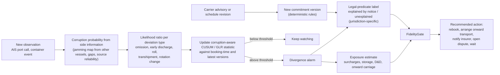
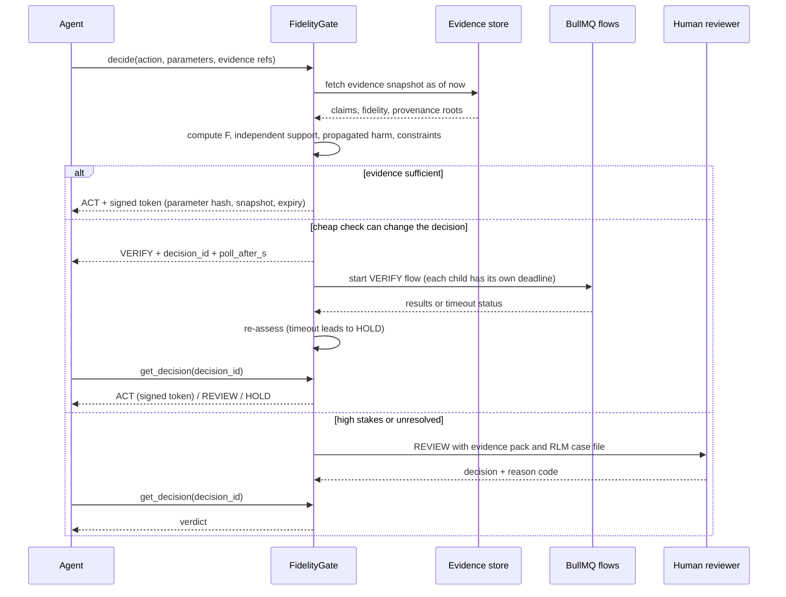
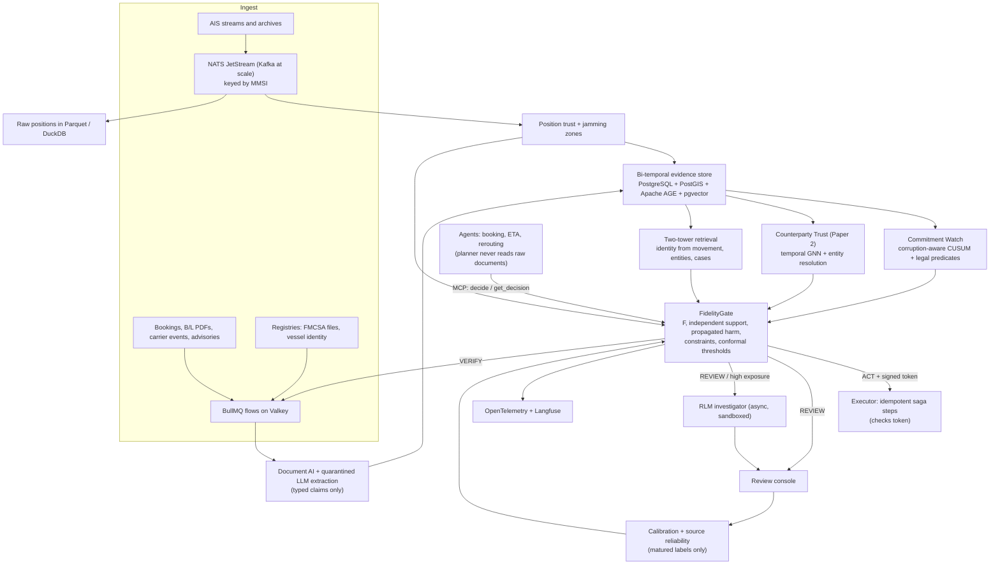

# Final Topic · When the Data Lies

*Fidelity-gated, spoof-resilient AI agents that check location, identity and carrier-commitment evidence before they act in maritime and freight logistics*

| Field | Detail |
|---|---|
| Research programme | When the Data Lies: fidelity-gated AI agents for spoofed, stolen and broken logistics evidence |
| Paper 1 title (working) | Fidelity-Gated Automation for Liner-Shipping Commitments under GNSS Interference: Corruption-Aware Divergence Detection and Risk-Controlled Decisions |
| Problem in one line | Logistics AI agents now book, reroute and release cargo automatically, but the location, identity and carrier-promise data they act on is increasingly faked, hijacked or quietly broken. |
| Solution in one line | A decision gate that scores how trustworthy the evidence is for each specific action, how hard it would be to fake, and how far a mistake would spread, then lets the agent act, verify, escalate or wait. |
| What it combines | Topic 2 (spoofing and identity) + Topic 1 (the decision gate) + your question on carriers leaving cargo at non-destination ports, which becomes a third evidence type, "commitment fidelity" |
| Paper 1 scope | Maritime only: location fidelity (AIS/GNSS) + commitment fidelity (declared voyage vs observed execution). Real-world case: the March–August 2026 Gulf/Hormuz disruption, treated as a historical episode |
| Later outputs | Paper 2: identity fidelity and cost-to-deceive (carrier and vessel identity fraud). An open benchmark paper. Optional: a measurement paper on rolls vs spot–contract rate spread |
| Recent tech used | Recursive Language Models, DSPy programs, typed "System One" decisions (TypeSafe Jev as an optional paid baseline; an open DSPy/vLLM equivalent as the core), two-tower retrieval, BullMQ, temporal graph learning, conformal risk control, CaMeL-style control/data separation, MCP and A2A |
| Data | Open AIS archives (US, Denmark, Norway, Finland), a free live AIS stream (demo and research recording only), IMF PortWatch, Global Fishing Watch (research use only), DCSA open standards, public carrier advisories, FMCSA public registry files; attacks and deviations injected synthetically with exact labels |
| Compute | One DGX Spark (128 GB) is enough for research and the prototype, if models are scheduled rather than all loaded at once (Section 16) |
| Product | **TrackTrust**: Commitment Watch (first), Position Trust, Counterparty Trust and a FidelityGate decision API for agents |
| Honest verdict | Feasible with no budget for the research, an open benchmark and a working prototype. A Q1 paper is realistic but not guaranteed. A paid, always-on product will need some money later: hosting, a licensed live AIS feed for the Gulf, and partner shipment data (Section 1). |

---

## 0. The topic in short

**Heading:** *When the Data Lies: fidelity-gated AI agents for spoofed, stolen and broken logistics evidence.*

**Summary.** Shipping and freight companies are handing decisions to AI agents. Those agents trust three kinds of evidence, and each one failed at scale in 2025–2026.

- **Location** comes from AIS and GPS. Within about 24 hours of the 28 February 2026 strikes on Iran, Windward reported more than 1,100 vessels with GPS/AIS interference in the Gulf (vendor data) [[1]](#ref-1), [[2]](#ref-2). Lloyd's List Intelligence counted 1,735 interference events across 655 vessels up to 2 March (vendor data) [[3]](#ref-3).
- **Identity** is who is carrying the cargo. Verisk CargoNet put US and Canada cargo-theft losses at about USD 725M in 2025 (vendor data). The FBI describes the attacks as increasingly done by taking over real carriers' accounts and registry records [[4]](#ref-4), [[5]](#ref-5).
- **Commitment** is what the carrier promised. In March 2026 several carriers declared "End of Voyage" and left Gulf-bound cargo at substitute ports, with onward cost for the cargo owner [[6]](#ref-6), [[7]](#ref-7), [[8]](#ref-8), [[9]](#ref-9).

Agent-security tools stop attackers from changing *what an agent is told to do* [[10]](#ref-10), [[11]](#ref-11). In our searches we found no published system that checks whether the physical-world evidence behind a logistics action (a position, an identity, a carrier's commitment) is true and how hard it would be to fake, and then gates the agent's action on that. This research builds and tests that missing layer. For every proposed action it estimates how reliable the evidence is for that action and how far a mistake would spread. It then lets the agent act, verify, escalate or wait. The error-rate target holds only under stated assumptions; how far it degrades under drift and adaptive attack is measured and reported. The output is an open benchmark, papers, and a real-time product.

**Your cargo question, in one paragraph.** Yes, it fits, as *commitment fidelity*. Two things are well documented. Carriers ended voyages at substitute ports in 2026, citing war risk. Carriers rolled contract cargo while better-paying cargo moved in 2020–2022, and the FMC found two of them liable for refusal to deal and retaliation. A carrier unloading cargo mid-voyage *specifically to take a higher bidder's cargo* is **not reliably documented**. The only report we found (The Loadstar, apparently 2020) could not be found again on a second check [[12]](#ref-12). The system can detect the divergence early and price the exposure. It cannot prove the carrier's motive. Details are in Section 3.

**Honesty note.** Every factual claim below carries a numbered source. Numbers from vendors (Windward, Kpler, Highway, Verisk CargoNet and others) are unaudited and marked "vendor data". Several 2026 papers are preprints. Regulatory and conflict-related facts can change quickly. The sources were collected on 7–8 October 2026, and many publisher sites could not be opened directly from the research environment. Check each number against the original before citing it in a manuscript. Section 23 explains how every source was checked.

## 1. Honest verdict: can this be done with no budget, and can it be published?

| Question | Answer | Why, and what could go wrong |
|---|---|---|
| Can the research be done with open-source tools and no money? | **Yes** | Open AIS archives exist for US, Danish, Norwegian and Finnish waters [[13]](#ref-13), [[14]](#ref-14), [[15]](#ref-15), [[16]](#ref-16). The software stack (vLLM, DSPy, PyTorch Geometric, BullMQ, Valkey, NATS/Kafka, PostgreSQL) is OSI-licensed [[17]](#ref-17), [[18]](#ref-18). gpt-oss weights are Apache-2.0 [[19]](#ref-19). Qwen3 weights are Apache-2.0 [[20]](#ref-20). The Qwen3.5/3.6/3.8 repositories point to licence files shipped with the weights, which we could not read, so their licence is **unverified** [[21]](#ref-21). Until it is checked, the default models are gpt-oss-20b/120b. One DGX Spark has measured throughput for gpt-oss-120b and 20b [[22]](#ref-22), [[23]](#ref-23). It can run each model the project needs, but not all at once (Section 16). |
| Is there real ground truth? | **Partly** | Our searches found no public labelled real-world AIS-spoofing benchmark (only small synthetic sets such as [[24]](#ref-24)), and no carrier-fraud or cargo-diversion benchmark (Section 5.10) [[25]](#ref-25). Labels come from synthetic injection on real data (exact labels), an independent validation set (ADS-B interference maps, JMIC advisories, selected satellite images; Section 13), and documented real events for case studies, such as the 2026 Gulf End of Voyage notices [[6]](#ref-6), [[7]](#ref-7), [[8]](#ref-8), [[9]](#ref-9). Reviewers will check the synthetic-vs-real gap closely. |
| Is there free Gulf data for the case study? | **Only partly** | We found no free historical source of Gulf **position tracks** for March 2026. The open archives do not cover the Gulf. aisstream.io is live-only. The GFW API gives events and gridded presence, not raw tracks, and only for non-commercial use [[26]](#ref-26), [[27]](#ref-27), [[28]](#ref-28). The Gulf case study therefore uses carrier notices, GFW port-visit and gap events, PortWatch aggregates, and a Gulf recorder started now (Section 13). |
| Can it run in real time? | **Yes, with the right design** | Rules, graph features and small models give sub-second decisions. A 120B model on one Spark decodes about 59 tokens/s in one llama.cpp benchmark, so large models are kept off the real-time path and used only for asynchronous investigation [[22]](#ref-22). |
| Can the commercial product be fully free? | **Not for every component** | Some data and models are non-commercial: Global Fishing Watch data (CC BY-NC; its FAQ says this is not enough even for internal commercial use) [[27]](#ref-27), [[29]](#ref-29), TimesFM 3.0 and TabPFN-2.5+ [[30]](#ref-30), [[31]](#ref-31). Anything *derived* from them (labels, thresholds, trained models) is research-only too (DR-04). These remain fine as research baselines. |
| What will still cost money? | **A little, later** | (1) Jev, if used as baseline B7: input tokens are billed. It is optional and can be dropped [[32]](#ref-32). (2) Hosting for paying pilots: a second small machine or VM (Section 17.6). (3) An optional AIS receiver, if contributing to AISHub; AISHub gives access only in exchange for a feed, and one receiver covers only its local area [[33]](#ref-33). (4) Publication: hybrid journals can be published in without open-access fees through the subscription route, and arXiv preprints are free. Conferences charge registration. Fees not verified; check each venue's page. |
| Is Gulf live coverage free? | **Uncertain** | aisstream.io publishes no coverage statement, terms or licence grant [[26]](#ref-26), [[28]](#ref-28). Use it only for the demo and research recording. A product for Gulf customers will need a licensed AIS feed or a receiver [[33]](#ref-33). |
| Can it be published in a Q1 journal? | **Realistic, not guaranteed** | The gaps are real and current in our searches (Section 6). The main target journals are Q1 in JCR 2025; Maritime Policy & Management is Q2 [[34]](#ref-34). Acceptance depends on a formal contribution, leakage-aware evaluation [[35]](#ref-35), strong baselines [[36]](#ref-36) and a real-data case study. Expect about 12 months to the first submission and several months of review. |
| Can it be done alone? | **Yes, if scope is controlled** | Paper 1 covers only maritime location and commitment fidelity. Identity fraud, cost-to-deceive and the full product come later (Section 19). Doing everything at once is the main risk. |

## 2. The problem in plain words

AI agents in logistics now act on their own. Brokers let AI agents answer inbound carrier calls and run carrier vetting [[37]](#ref-37), [[38]](#ref-38). Visibility platforms ship agents for exception handling and carrier communication [[39]](#ref-39), [[40]](#ref-40). Gartner predicts that 60% of supply-chain disruptions will be resolved without human intervention by 2031 (a forecast; Gartner limits full automation to low-risk decisions for now) [[41]](#ref-41). These agents act on three kinds of evidence, and each can lie.

| Evidence type | The question it answers | How it lies in 2026 |
|---|---|---|
| **Location** | Where is the ship, truck or container? | GNSS jamming and spoofing move reported positions onto land or into circles and create port calls that never happened [[42]](#ref-42), [[43]](#ref-43). |
| **Identity** | Who is really carrying or calling about the cargo? | Criminals take over carrier and broker accounts, change registry records, and send a truck for a fictitious pickup [[5]](#ref-5), [[44]](#ref-44). Ships reuse the identities of scrapped vessels or invent IMO numbers [[45]](#ref-45). |
| **Commitment** | Will the cargo go where the carrier promised? | Carriers roll booked cargo or end the voyage at a substitute port. Shippers often learn late, through a notice or a container event [[6]](#ref-6), [[7]](#ref-7), [[46]](#ref-46), [[47]](#ref-47). |

*Illustrative scenarios (hypothetical; only the cited facts are real).*

**Story 1 (illustrative): location.** In March 2026, a forwarder's ETA agent reads AIS positions for a ship approaching Jebel Ali. Jamming in the Gulf has displaced hundreds of ships' reported positions [[1]](#ref-1), [[3]](#ref-3). The agent sees the ship "stopped" 40 nm off course and books expensive alternative trucking from Sohar. The ship was on schedule. Nothing in the pipeline asked whether the position was physically plausible, or whether every ship nearby showed the same jump.

**Story 2 (illustrative): identity.** A carrier with a five-year-old USDOT number calls a broker's AI agent about a high-value load. The registry record looks clean, but its contact details were changed days ago. Highway reported that about half of Q1 2026 theft incidents involved carriers with legitimate numbers and clean histories (vendor data) [[44]](#ref-44). The agent tenders the load.

**Story 3 (illustrative): commitment.** A Dubai importer's container is booked to Jebel Ali. On 3 March 2026 MSC declares End of Voyage for Gulf-bound cargo on board. The cargo is to be discharged at the "next safe port", with a USD 800 per container charge and handling and storage for the cargo's account [[6]](#ref-6), [[48]](#ref-48). The importer's planning agent still shows the original ETA, because nothing compared the carrier's commitment with what the ship was actually doing.

**What is missing.** Agent-security research defends *instruction integrity*: it stops injected text from hijacking an agent's control flow [[10]](#ref-10), [[11]](#ref-11). A well-formed but false value still passes those defences: a spoofed position, a borrowed identity, or a promise the carrier is no longer keeping. In our searches we found no agent-security defence that tests the physical, identity or commitment truth of well-formed, tool-returned values before an automated logistics action. That is the research gap (Section 6).

## 3. Your question: carriers leaving cargo at a non-destination port

You described ships that, mid-voyage, unload contracted cargo at a port that is not its destination so they can load a higher bidder's cargo. Here is what the evidence actually shows.

### 3.1 What is documented

| Pattern | Documented? | Stated reason | Key evidence |
|---|---|---|---|
| Carrier discharges cargo at a substitute port and ends the contract there ("End of Voyage", liberty clause) | **Yes, widely in 2026** | War risk, safety, port closure | On 3 March 2026 MSC declared End of Voyage for Gulf-bound cargo on board, discharging at the "next safe port" with a USD 800/container charge and handling and storage for the cargo's account under bill-of-lading Clause 13 [[6]](#ref-6), [[48]](#ref-48). A 9 March MSC notice for Gulf *exports* stated that custody, risk and responsibility pass to cargo interests on discharge [[7]](#ref-7). RCL's March 2026 advisories ended voyages at Sohar (USD 500–1,000 per container) and changed the port of discharge to Nhava Sheva or Colombo for some vessels; one Nhava Sheva change was later revised to Hambantota [[8]](#ref-8). Emirates Line invoked its Clause 8 liberties to discharge or tranship at Khor Fakkan at the merchant's risk and cost [[9]](#ref-9). Hapag-Lloyd omitted Jebel Ali on Indian Ocean services and moved dry-cargo discharge to Sohar [[49]](#ref-49), [[50]](#ref-50). Maersk placed containers discharged in India at the customer's disposal at an Indian port [[46]](#ref-46). Geodis estimated 15,000–18,000 containers affected in India as of 20 March 2026 (rolling advisory) [[51]](#ref-51). |
| Same pattern before 2026 | **Yes** | Conflict, port closure, strikes, congestion, schedule recovery | Red Sea, January 2024: Maersk dropped Djibouti calls and discharged Djibouti cargo at Salalah for on-carriage [[52]](#ref-52). After the Baltimore bridge collapse (March 2024), MSC ended delivery at alternate ports, with costs for the cargo's account [[53]](#ref-53). Around the October 2024 US port strike, Vizion estimated about 2,000 shipments may have been dropped at non-destination ports (vendor estimate) [[54]](#ref-54). January 2025: Maersk Vilnius cut and run from Cape Town; all US calls were omitted, cargo was discharged at Freeport, and some units were short-shipped [[55]](#ref-55). November 2020: MSC diverted more than 20 ships away from congested Colombo and discharged Colombo-bound boxes at Indian ports and Singapore; some had to be routed back at extra cost (seen once) [[56]](#ref-56). **This last case is the closest documented one to a commercial (not war-related) reason.** |
| Carrier insolvency or abandonment strands cargo | **Yes** | Insolvency | Hanjin's 2016 collapse stranded up to about USD 14bn of goods at sea [[57]](#ref-57). A record 410 ships were abandoned in 2025 (ITF data) [[58]](#ref-58). |
| Carrier leaves booked cargo behind (rolls it) while better-paying cargo moves | **Yes, especially 2020–2022** | Commercial (spot rates far above contract rates) | Trade press documented contract cargo bumped for spot and premium cargo [[59]](#ref-59), [[60]](#ref-60). Ocean Insights measured average rollover at major transhipment ports rising from 22.2% (October 2019) to 28.5% (October 2020) and 37% (December 2020). project44 reported 39% in April 2021, though some port figures were disputed [[47]](#ref-47), [[61]](#ref-61). **Allegations, not findings:** MCS Industries alleged that MSC and COSCO supplied only 35% and 1.6% of contracted space in May–July 2021 and resold space on the spot market [[62]](#ref-62). The 2023 ruling against MSC was a default sanction, not a decision on the merits [[63]](#ref-63). The Bed Bath & Beyond estate alleged that MSC allocated space to higher-priced cargo (FMC Docket 23-12; MSC denies this) [[64]](#ref-64). **Findings:** an FMC judge's initial decision (24 April 2026) awarded about USD 45.6M in reparations against OOCL to the Bed Bath & Beyond estate, for missed space and price commitments in 2021–2022, doubled for retaliation [[65]](#ref-65). As of May 2026 it was not final: it was under Commission review and challenged by OOCL in federal court [[66]](#ref-66). Check the current status. In August 2024 the Commission affirmed that Hamburg Süd was liable for refusal to deal and retaliation, with reparations recalculated to about USD 17.6M. We understand a petition for review is pending in the D.C. Circuit; check the current status [[67]](#ref-67). **Counter-evidence:** the FMC's Fact Finding 29 (2022) found no profiteering and recommended mutually enforceable contracts [[68]](#ref-68). |
| Closest tramp-shipping analogue | Yes (different market) | Commercial | In rising charter markets, owners have withdrawn chartered vessels on technical grounds to re-fix them at higher rates [[69]](#ref-69). This is about whole vessels, not cargo dumped mid-voyage. |
| Carrier offloads cargo **mid-voyage at an intermediate port** specifically to load a higher bidder's cargo | **Not reliably documented** | Commercial | Our first search found one trade-press headline (The Loadstar, apparently January 2020) saying some Asia–North Europe carriers left China-loaded boxes at transhipment hubs to make room for better-paid cargo [[12]](#ref-12). **A second, independent check could not find this article again, so treat it as unverified.** We found no 2024–2026 case of this exact behaviour. Absence in search results does not prove it never happens, but there is no solid public evidence for it today. |

**Legal context, in brief.** End of Voyage is not a concept of English common law. It comes from the carrier's own bill-of-lading clauses ("liberty", "special circumstances") [[70]](#ref-70). Commentary says "any port" liberty clauses are read narrowly and against the carrier (contra proferentem), and advises cargo owners to accept delivery under protest (seen once) [[71]](#ref-71). Whether the 2026 declarations can be successfully challenged had not been tested in court in the commentary we found [[70]](#ref-70), [[72]](#ref-72). In the US:

- The FMC's 2024 rule on unreasonable refusal to deal gives examples of potentially unreasonable conduct when carriers refuse *cargo space* after booking. They include insufficient notice of blank sailings or schedule changes and *providing inaccurate or unreliable vessel information*. The D.C. Circuit upheld the rule on 31 March 2026 [[73]](#ref-73), [[74]](#ref-74), [[75]](#ref-75). This ties data fidelity directly to a legal standard.
- On 23 March 2026 the FMC denied four carrier requests to impose war or conflict surcharges on less than 30 days' notice [[76]](#ref-76).
- The FMC demurrage and detention billing rule (46 CFR 541) took effect in May 2024; the D.C. Circuit set aside one part of it in September 2025 [[77]](#ref-77), [[78]](#ref-78).

Other jurisdictions matter for the first users (Dubai and India importers):

- **UAE.** Federal Decree-Law 43/2023 replaced the 1981 maritime law from 29 March 2024 [[79]](#ref-79). Secondary commentary (not captured as a source here) says the new law voids bill-of-lading terms that reduce carrier liability. Check the official text before relying on it.
- **India.** The Carriage of Goods by Sea Act 2025 and the Bills of Lading Act 2025 have been in force since 10 September 2025 (seen once) [[80]](#ref-80), [[81]](#ref-81). India's DG Shipping issued a circular on 8 April 2026 on passing port relief to exporters and on war-risk premiums, and an advisory on predatory pricing (seen once) [[82]](#ref-82).
- **Charter parties.** BIMCO replaced its VOYWAR and CONWARTIME war-risk clauses with 2025 editions (seen once) [[83]](#ref-83).
- **Time bar.** The UK Supreme Court held in *Giant Ace* that the Hague-Visby one-year time bar also covers misdelivery claims (seen once) [[84]](#ref-84). Evidence packs must be ready well within a year.

None of this is legal advice. Every legal rule in the product needs review by a maritime lawyer.

> **Status box (as of 8 October 2026; check before relying on it).** We could not confirm whether the MSC, Maersk, RCL and Emirates Line End of Voyage measures are still in force. The latest sourced Gulf interference report is a P&I club update dated 17 August 2026 [[85]](#ref-85). Live trackers disagree about Hormuz traffic in early October: one tracker described the strait as effectively closed to commercial traffic, while Windward counted 18 crossings on 7 October [[86]](#ref-86). Windward's dashboard showed 157 vessels jammed in the Gulf and Gulf of Oman on 7 October, 40% above its 7-day average (vendor data, live dashboard) [[87]](#ref-87). An interim truce reportedly broke down on 8 July (Wikipedia, context only) [[88]](#ref-88). The situation changes weekly. This project treats the Gulf as a **historical March–August 2026 episode** and does not assume the Gulf market for the MVP will persist.

### 3.2 Does it fit the topic?

**Yes, as a third evidence type: commitment fidelity.** A booking, a bill of lading and a published schedule are claims about the future: this cargo, on this vessel, will be discharged at this port. AIS port calls [[89]](#ref-89), [[90]](#ref-90), DCSA container events and schedule exceptions [[91]](#ref-91), [[92]](#ref-92), and carrier advisories are independent observations of what is actually happening. The gap between the two can be measured, scored for reliability and acted on, which is exactly the job of the fidelity gate.

**What AI can and cannot do here, honestly:**

- **Can:** detect early that execution is diverging from the commitment (an omitted port call, an unscheduled call, a container discharged at a port other than its destination with no onward loading). It can estimate the cost exposure (carrier surcharges, storage, demurrage and detention, onward carriage), attach the notice and clause the carrier published, and recommend an action (rebook, arrange onward trucking, file a dispute, notify the insurer).
- **Cannot:** prove *why* a carrier did it. Opportunism, force majeure and congestion look the same in the data. The product must report "divergence and exposure", never "the carrier cheated". Accusing carriers without evidence would be wrong and legally risky.
- **Needs care:** AIS port calls can themselves be spoofed [[43]](#ref-43), and the self-reported AIS destination field is often wrong: about 40% of the time for large bulk ships in one study [[93]](#ref-93). Commitment checking therefore needs the location-fidelity layer underneath it, which is why the two belong in one topic.

**Research opening.** Published work detects port skipping at vessel or service level from AIS [[89]](#ref-89), [[90]](#ref-90). None we found gives calibrated uncertainty or is robust to AIS spoofing, and none links a divergence to the published notice or clause that explains it. We also found no work that encodes liberty clauses, End of Voyage notices or the FMC examples as machine-checkable rules. In our searches these appear to be open, so they are candidate contributions. The project works at voyage level first and maps the result to shipments. Shipment-level results stay synthetic until partner bookings are available (Section 6). It does not attribute motive.

## 4. Why this matters now (evidence)

| Signal | What it says | Source |
|---|---|---|
| Location data is corrupted at scale | Press coverage reports a Georgia Tech measurement study of more than 367,000 vessels, said to be due at IEEE S&P 2027. It found 31 persistent anomaly hotspots (at least 22 with strong evidence of spoofing) and 17,936 anomalous episodes between late November 2024 and early February 2025. The paper's listing could not be confirmed, so these figures come from press coverage only. | [[42]](#ref-42) |
| Gulf 2026 | Windward reported more than 1,100 vessels with GPS/AIS interference within about 24 hours of the 28 February 2026 strikes (vendor data). Lloyd's List Intelligence counted 1,735 events across 655 vessels up to 2 March; later counts were higher (vendor data). | [[1]](#ref-1), [[2]](#ref-2), [[3]](#ref-3) |
| Records can be mostly false | One unaudited company column reported that 393 of 642 logged Hormuz transits in August 2026 (61%) were jamming artifacts. It was seen only as a search extract and not re-verified; check the primary data before citing it. | [[94]](#ref-94), [[95]](#ref-95) |
| Interference continued | JMIC advisories and P&I-club updates describe GNSS interference continuing in the Gulf region at varying intensity from March through at least 17 August 2026. Windward counted about 978,000 jamming events in Q1 2026, 98% of them in the Middle East Gulf (vendor data). | [[96]](#ref-96), [[97]](#ref-97), [[85]](#ref-85), [[98]](#ref-98) |
| Spoofed port calls | Lloyd's List data showed ships calling at Polish ports with AIS tracks jumping to the Kaliningrad area. Analysts advised rebuilding port calls from position history. | [[43]](#ref-43) |
| Identity theft is the theft method | The FBI described an attack chain of account takeover, registry changes and freight diversion (30 April 2026). Verisk CargoNet reported about USD 725M in 2025 losses (+60%) and USD 304.6M in Q2 2026 alone, more than double Q2 2025 (vendor data). | [[5]](#ref-5), [[4]](#ref-4), [[99]](#ref-99) |
| Clean credentials are not enough | About 50% of Q1 2026 theft incidents involved carriers with legitimate numbers and clean histories. Communication-based attacks were 50% of fraud vectors in Q2 2026 (vendor data). | [[44]](#ref-44), [[100]](#ref-100) |
| Registry hardening moved the attack | FMCSA launched Motus with identity proofing in May 2026. Phishing that impersonates Motus followed within months. | [[101]](#ref-101), [[102]](#ref-102) |
| Maritime identity fraud | The IMO Legal Committee recorded 529 falsely flagged ships in a year (April 2026). Lloyd's List and SynMax documented tankers sailing under scrapped or invented IMO numbers. | [[103]](#ref-103), [[45]](#ref-45) |
| Commitment breaks | End of Voyage notices from MSC, RCL and Emirates Line. A Vizion executive estimated more than 270,000 TEU stranded (vendor estimate, single secondary source). Outbound bookings across ten Gulf ports fell from about 4,000–5,000 TEU a day to near zero on several days in early March (vendor data). | [[6]](#ref-6), [[7]](#ref-7), [[8]](#ref-8), [[9]](#ref-9), [[104]](#ref-104), [[105]](#ref-105) |
| Carriers added charges to cargo already moving | Maersk applied an emergency freight increase of USD 1,800–3,800 per container to cargo in transit as well as new bookings (2 March 2026). Other carriers added emergency or war-risk charges of about USD 1,500–3,000 per TEU or FEU. | [[106]](#ref-106), [[107]](#ref-107), [[108]](#ref-108) |
| Schedules are unreliable, and the number depends on the method | Sea-Intelligence reported 56.4% global schedule reliability for July 2026, the lowest of 2026 (June: 62.6%). Xeneta reported about 29% on-time for January and August 2026 (27% in February). Xeneta scores against the *initial* schedule and Sea-Intelligence against the *latest*, and cancelled sailings are excluded from on-time figures. The two methods differ by more than 25 points (vendor data). So TrackTrust must say which schedule version counts as "the commitment" (Section 9.1). | [[109]](#ref-109), [[110]](#ref-110), [[111]](#ref-111) |
| AI value is not arriving | BCG's 2026 survey of 30 logistics players: 97% call AI a strategic priority, 13% see measurable financial impact. | [[112]](#ref-112) |
| Agents are the new target | OWASP's 2026 lists put Excessive Agency at #3 and name Cascading Failures and Memory & Context Poisoning among the top agentic risks. | [[113]](#ref-113), [[114]](#ref-114) |

## 5. What already exists: literature review

This section maps the published work you will build on and cite. Each stream ends with what is still missing for this project. "Preprint" marks work not yet peer-reviewed. All "missing" statements describe what *our searches* found (Section 23 lists the limits); confirm them with a Google Scholar search before claiming novelty in a manuscript.

### 5.1 AIS and GNSS spoofing and jamming detection

| Work | What it does | Status |
|---|---|---|
| Georgia Tech global GPS-spoofing measurement study [[42]](#ref-42) | Measures GNSS spoofing across more than 367,000 vessels by finding groups of independent ships reporting physically impossible movement at the same place and time. Reports 31 persistent anomaly hotspots (at least 22 with strong evidence of spoofing) and 17,936 anomalous episodes, November 2024 to February 2025. | Reported in the press as due at IEEE S&P 2027; we could not confirm the paper's listing, so cite only as context |
| SeaSpoofFinder [[115]](#ref-115) | Two stages: physically impossible jumps, then clustering across vessels. Events found in the Baltic, Black Sea and eastern Mediterranean. | Preprint, 2026 |
| Multi-vessel coherence with communication-integrity filtering [[116]](#ref-116) | Removes AIS transmission artifacts (duplicate MMSIs, stale retransmissions), then applies IMM filtering and space-time DBSCAN. Reports 98.6% fewer false alarms than naive clustering on about 966M Korean AIS messages. | Preprint, 2026 (title differs between versions) |
| Track consistency with crowdsourced ADS-B [[117]](#ref-117) | Shows that aircraft navigation-integrity flags (NIC/NACp) can stay high during position anomalies, so track checks are needed. A second sensor modality for coastal interference, and an independent validation source for this project. | Preprint, 2026 |
| Low-cost receiver monitoring [[118]](#ref-118) | Calibrated commodity GNSS receivers separate nominal, jammed and spoofed signals. | Preprint, 2025 |
| GNSS integrity monitoring [[119]](#ref-119) | Receiver autonomous integrity monitoring (RAIM) computes a protection level and compares it with an application-specific *alert limit*. If the protection level exceeds the limit, the position must not be used for that operation. | Peer-reviewed survey, 2025 |
| Identity-layer AIS spoofing [[120]](#ref-120), [[121]](#ref-121), [[122]](#ref-122) | MMSI validity checks, MMSI-change detection, tutorials on AIS spoofing methods. | Peer-reviewed / tutorial |
| Gulf and Baltic field evidence [[1]](#ref-1), [[3]](#ref-3), [[96]](#ref-96), [[123]](#ref-123), [[43]](#ref-43), [[124]](#ref-124) | 2025–2026 vendor, advisory and press documentation of interference and spoofed port calls, including the MSC Antonia grounding attributed to interference. | Unaudited vendor and press data |

**Missing:** these papers stop at a detection label or cluster. None we found gives a per-decision reliability score, a cost-to-deceive measure, or a link to the actions an automated agent takes. Our searches found no public labelled real-world AIS-spoofing benchmark; labels in the work we found are synthetic or inferred from coherence [[125]](#ref-125), [[24]](#ref-24).

**Important for novelty:** multi-vessel coherence detection now exists [[115]](#ref-115), [[116]](#ref-116). This project must not claim it as new. It uses coherence as one input to the decision gate. GNSS integrity monitoring is the closest idea to "fidelity for a specific use": it already sets operation-specific alert limits for one sensor [[119]](#ref-119). This project extends that idea to multi-source logistics evidence and to actions whose harm spreads downstream (Section 6).

### 5.2 Trajectory modelling, ETA, port calls and destination prediction

| Work | What it does |
|---|---|
| GeoTrackNet [[126]](#ref-126) | Variational recurrent model of AIS tracks plus a contrario anomaly detection (IEEE T-ITS). |
| TrAISformer [[127]](#ref-127) | Transformer over discretised AIS tokens for trajectory prediction (IEEE Access 2024). |
| DiffuTraj [[128]](#ref-128); AISFlow [[129]](#ref-129) | Diffusion-based stochastic prediction; flow matching for long-gap imputation (ICML 2026). |
| Physics-informed models [[130]](#ref-130), [[131]](#ref-131), [[132]](#ref-132) | Diffusion with kinematic constraints; space-time-prism reasoning about gaps; finite-difference kinematic losses. |
| ETA prediction [[133]](#ref-133), [[134]](#ref-134), [[135]](#ref-135) | Stacked gradient-boosted and AutoML models on Baltic AIS (Maritime Transport Research 2025); a cross-Pacific neural ETA and next-destination model (TRR 2025); a 2025 review noting that most models predict the remaining sailing time and convert it to an ETA (MPM). None of these models the chance that the input positions are spoofed. |
| Synthetic anomaly benchmark OMAD [[125]](#ref-125), [[136]](#ref-136) | Equation-grounded synthetic anomalies with an LLM used only as a plausibility scorer; MIT-licensed code; KDD 2026 (per README). |
| Leakage audit [[35]](#ref-35) | Shows that letting the same vessels appear in training and test data cut one-hour prediction error by 23–25% for transformer models, so reported gains are inflated. Vessel- and time-disjoint splits are required. |
| Destination and port-sequence prediction [[137]](#ref-137), [[138]](#ref-138), [[139]](#ref-139) | WAY (IEEE TAES) and a retrieval-enhanced, topology-masked transformer for multi-step port-of-call prediction (preprint). |
| AIS destination reliability [[93]](#ref-93), [[140]](#ref-140) | About 40% of AIS destination reports for large bulk ships were wrong (TR-E 2021); at least 52% erroneous in a German Bight study. |
| Port-call extraction [[141]](#ref-141), [[142]](#ref-142), [[143]](#ref-143) | Geofences, berth clustering and official-statistics methods. |
| Dark vessels [[144]](#ref-144), [[145]](#ref-145), [[146]](#ref-146), [[147]](#ref-147) | 72–76% of industrial fishing vessels were not publicly tracked in 2017–2021 (Nature 2024). Suspected intentional AIS disabling events. Self-supervised shutdown detection. xView3-SAR dataset. |
| AIS representation learning [[148]](#ref-148), [[149]](#ref-149), [[150]](#ref-150) | Early work on masked-autoencoder and GPT-style AIS pretraining; a 2025 survey says trajectory foundation models lack systematic study. |
| LLMs on AIS [[151]](#ref-151) | AIS-LLM aligns a time-series encoder with an LLM for prediction plus natural-language explanation (preprint). |

**Missing:** these models predict where a ship *will* go, when it will arrive, or flag abnormal tracks. None we found tests a ship's observed track against the *contracted* port sequence, with calibrated uncertainty and with spoofing robustness.

### 5.3 Carrier commitments, schedules and liner revenue management

| Work | What it does |
|---|---|
| Port-skipping from AIS [[89]](#ref-89) | Data-driven framework uncovering port-skipping behaviour on about 2,000 container ships, 2016–2020 (TR-E 2023). |
| Port-call cancellations from AIS [[90]](#ref-90) | Measures cancellations on Europe–Far East services (MEL 2024). |
| Vessel Schedule Recovery Problem [[152]](#ref-152) | MIP for recovery actions including port omission (EJOR 2013). |
| Contract vs spot slot allocation [[153]](#ref-153), [[154]](#ref-154) | Risk-averse contract selection and slot allocation (TR-E 2022); dynamic programming for spot containers with cancellations (TR-E 2025). |
| Overbooking with mutual deposits [[155]](#ref-155) | Attributes overbooking to shipper–carrier mistrust and unenforceable contracts; proposes deposits with a 0.819-competitive policy (Operations Research 2026). |
| Booking cancellation prediction [[156]](#ref-156), [[157]](#ref-157) | Survival models for slot-booking cancellation (TR-C 2019, 2020). |
| Schedule unreliability [[158]](#ref-158), [[159]](#ref-159), [[109]](#ref-109), [[110]](#ref-110) | Origins and costs of unreliability (MEL 2007); arrival punctuality prediction (MPM 2024); 2026 reliability statistics, which differ by more than 25 points depending on whether the initial or latest schedule is used. |
| Container delay prediction [[160]](#ref-160) | Machine learning for container shipment delays (HICSS 2020). |
| Data standards [[91]](#ref-91), [[92]](#ref-92), [[161]](#ref-161), [[162]](#ref-162), [[163]](#ref-163), [[164]](#ref-164), [[165]](#ref-165) | DCSA Operational Vessel Schedules (port omission and blank sailing events), Commercial Schedules, Track & Trace, Booking 2.0, eBL 3.0 with digital signatures, Port Call 2.0; several repositories Apache-2.0. |
| US regulation [[74]](#ref-74), [[73]](#ref-73), [[75]](#ref-75), [[166]](#ref-166), [[76]](#ref-76) | FMC rule on unreasonable refusal to deal (2024; upheld 2026); denial of short-notice war surcharges (March 2026); a commissioner's personal recommendations for a maritime transportation data system (2024). |

**Missing:** this research optimises the carrier's side or measures behaviour at fleet level. Our searches found no peer-reviewed system that gives shippers early, calibrated, spoof-robust warning that the voyage carrying a specific booking is diverging from its commitment. We also found none that encodes the relevant contract clauses or regulatory examples as checkable rules.

### 5.4 Freight and maritime identity fraud and graph anomaly detection

| Work | What it does |
|---|---|
| GADBench [[36]](#ref-36) | Benchmarks supervised graph anomaly detection. Tree ensembles with neighbourhood aggregation often beat specialised GNNs. Any GNN claim must beat this baseline. |
| TGB and TGB 2.0 [[167]](#ref-167), [[168]](#ref-168) | Temporal graph benchmarks; simple heuristics often rival complex temporal models. |
| BWGNN [[169]](#ref-169); CARE-GNN [[170]](#ref-170) | Spectral band-pass filters for anomalies; camouflage-resistant fraud detection. |
| ARC [[171]](#ref-171); UniGAD [[172]](#ref-172) | Generalist and multi-level graph anomaly detection for cold-start graphs. |
| DyGLib [[173]](#ref-173) | Unified library for temporal graph models (TGAT, TGN, DyGFormer). |
| Supply-chain graph fraud [[174]](#ref-174), [[175]](#ref-175), [[176]](#ref-176), [[177]](#ref-177) | Heterogeneous graph representation learning for supply-chain fraud (2026); MultiFraud, a multitask heterogeneous GNN with explanations for supply-chain finance; a dynamic heterogeneous GNN scoring node and edge anomalies; an interpretable heterogeneous GCN on supply-chain knowledge graphs. All seen only in search results, with low confidence on details. These are the closest prior work for Paper 2. |
| GNN fraud reviews [[178]](#ref-178), [[179]](#ref-179) | A 2025 review of more than 100 GNN financial-fraud papers. A 2026 survey reports 12–25% AUROC gains of graph models over XGBoost. That claim conflicts with GADBench [[36]](#ref-36) and must be tested, not assumed. |
| Customs fraud: DATE [[180]](#ref-180); GraphFC [[181]](#ref-181) | Deployed customs fraud ranking under an inspection budget; GNN under label scarcity. |
| Multigraph AML [[182]](#ref-182) | Directed multigraph GNNs and synthetic AML transaction data, a template for synthetic freight-fraud data. |
| Elliptic++ [[183]](#ref-183); Elliptic2 [[184]](#ref-184); DGraph [[185]](#ref-185) | Public fraud graph datasets, from finance and crypto. |
| LLM + graph fraud detection [[186]](#ref-186) | 2025–2026 papers combining LLMs and GNNs (curated list; individual papers not opened). |
| Document tampering: DocTamper [[187]](#ref-187) | Tampered-text detection benchmark; excludes AI-generated tampering. |
| Maritime identity fraud [[103]](#ref-103), [[188]](#ref-188), [[45]](#ref-45) | False flags, fraudulent registries, zombie vessels reusing scrapped IMO numbers (IMO and vendor reports). |

**Missing:** our searches found no public labelled dataset or detector for freight-brokerage fraud (double brokering, fictitious pickups, carrier identity takeover). Graph attacks by fraud gangs are themselves a known threat to GNN detectors [[189]](#ref-189).

### 5.5 Entity resolution and two-tower (dual-encoder) models

| Work | What it does |
|---|---|
| DSSM [[190]](#ref-190); YouTube two-tower [[191]](#ref-191); DPR [[192]](#ref-192); CLIP [[193]](#ref-193) | The two-tower lineage: separate encoders for each side of a match, dot-product scoring, pre-computed candidate vectors and approximate nearest-neighbour search. The YouTube paper introduced streaming frequency estimates to correct the sampling bias of in-batch negatives. |
| Sampling-bias correction [[194]](#ref-194) | A 2025 paper argues the standard "logQ" correction for in-batch negatives does not fully remove the bias and proposes a corrected derivation (preprint). |
| Hard negatives: ANCE [[195]](#ref-195); RocketQA [[196]](#ref-196); GradCache [[197]](#ref-197) | Negatives matter more than architecture; large contrastive batches on limited memory. |
| Retrieve and re-rank [[198]](#ref-198); Augmented SBERT [[199]](#ref-199) | Bi-encoder for recall, cross-encoder for precision; silver-labelling for scarce labels. |
| Late interaction: ColBERT [[200]](#ref-200); IntTower [[201]](#ref-201) | Ways to recover the fine interactions a single dot product loses. |
| Open embedders: BGE-M3 [[202]](#ref-202); Qwen3-Embedding [[203]](#ref-203); MTEB [[204]](#ref-204) | Local embedding and re-ranking models and their benchmark. |
| ER blocking: DeepBlocker [[205]](#ref-205); Sudowoodo [[206]](#ref-206); Sparkly [[207]](#ref-207) | Dense and contrastive blocking; BM25 blocking as a strong baseline. |
| ER matching: Ditto [[208]](#ref-208); Unicorn [[209]](#ref-209); MatchGPT [[210]](#ref-210); ComEM [[211]](#ref-211) | Cross-encoder and LLM matchers; "select among candidates" works best for LLMs. |
| Record linkage tools: Splink [[212]](#ref-212); Zingg [[213]](#ref-213) | Probabilistic linkage at scale; note Zingg is AGPL. |
| Trajectory representation: TrajCL [[214]](#ref-214); START [[215]](#ref-215); surveys [[216]](#ref-216), [[217]](#ref-217) | Contrastive trajectory encoders for road and taxi data. |

**Missing:** we found no two-tower model that matches vessel tracks against claimed identities or declared schedules. Adversarial entity resolution, where attackers deliberately create near-duplicate identities, is not addressed by the mainstream ER tools and papers we reviewed.

### 5.6 LLM agents in supply chains and their reliability

| Work | What it does |
|---|---|
| Agent bullwhip [[218]](#ref-218) | LLM agents in the MIT Beer Game show run-to-run decision instability that amplifies across echelons ("agent bullwhip"); GRPO post-training reduces tail events (preprint). |
| Agentic AI Autonomy Assessment [[219]](#ref-219) | Measures task-level autonomy; upstream tiers benefit from autonomy, downstream tiers are harmed. |
| SupChain-Bench [[220]](#ref-220) | Long-horizon tool orchestration in supply-chain SOPs remains unreliable (Findings of ACL 2026). |
| Helicase [[221]](#ref-221) | Multi-agent LLM construction of supply-chain knowledge graphs with per-fact uncertainty. |
| OptiGuide [[222]](#ref-222); InvAgent [[223]](#ref-223) | LLMs for supply-chain optimisation what-ifs; LLM multi-agent inventory management. |
| Neurosymbolic logistics planning [[224]](#ref-224) | LLM planning with uncertainty-triggered clarification. |
| AgentNoiseBench [[225]](#ref-225); τ-bench [[226]](#ref-226), [[227]](#ref-227) | Mid-trajectory noise hurts most for most of the model families tested; reliability over repeated runs (pass^k) falls sharply. |
| Error cascades [[228]](#ref-228), [[229]](#ref-229), [[230]](#ref-230), [[231]](#ref-231) | One false fact spreads through multi-agent systems; failure taxonomies; graph-based guards that cut infected edges. |

**Missing:** in the work we reviewed, falsified inputs are generic (injected noise or a seeded false fact). None models physically or adversarially falsified location, identity or commitment evidence, and none gates actions on evidence reliability.

### 5.7 Agent security, provenance and governance

| Work | What it does |
|---|---|
| CaMeL [[10]](#ref-10) | Separates control flow from data flow so untrusted data cannot choose which tool runs. Apache-2.0 research artifact; its authors say it likely contains bugs and is not fully secure, so re-implement the pattern rather than ship the code. |
| FIDES [[11]](#ref-11) | Information-flow-control labels enforced deterministically. |
| Design patterns for securing agents [[232]](#ref-232) | Six patterns: Action-Selector, Plan-Then-Execute, LLM Map-Reduce, Dual LLM, Code-Then-Execute, Context-Minimization. |
| Benchmarks: AgentDojo [[233]](#ref-233); ASB [[234]](#ref-234); InjecAgent [[235]](#ref-235) | Prompt-injection benchmarks; ASB reports an average attack success rate of 46.91% across 13 model backbones. |
| Model hardening: StruQ [[236]](#ref-236); Meta SecAlign [[237]](#ref-237); detectors [[238]](#ref-238), [[239]](#ref-239) | Structured queries; preference-optimised open models (weight licence unverified, reportedly Llama-based, so check before product use); activation-delta and masked re-execution detectors. |
| Guardrail runtimes and scanners [[240]](#ref-240), [[241]](#ref-241), [[242]](#ref-242), [[243]](#ref-243), [[244]](#ref-244), [[245]](#ref-245) | NeMo Guardrails (Apache-2.0; its execution rails on tool inputs and outputs could host the FidelityGate); LlamaFirewall (PromptGuard 2, AlignmentCheck); Progent privilege control; spotlighting and the instruction hierarchy; mcp-scan for MCP tool poisoning and shadowing. |
| Provenance [[246]](#ref-246), [[247]](#ref-247), [[248]](#ref-248) | Provenance integrity layers; verification-status laundering; survey of execution provenance. |
| OWASP LLM Top 10 2026 [[113]](#ref-113), [[249]](#ref-249); Agentic Top 10 [[114]](#ref-114); Agent Control Standard [[250]](#ref-250) | Excessive Agency at #3; authorisation in deterministic logic; a "Guardian" hook returning allow/deny/modify/ask/defer. |
| MCP specification [[251]](#ref-251), [[252]](#ref-252), [[253]](#ref-253); A2A [[254]](#ref-254) | Tool annotations must be treated as untrusted; human-in-the-loop is a SHOULD; MCP under Linux Foundation project governance; A2A v1.0. |

**Missing:** in the work we reviewed, these defences protect *instruction integrity*. A well-formed but false value (a spoofed position, a cloned identity, a broken promise) is not what they test for. The Agent Control Standard has no field for evidence reliability, which leaves room for a standards contribution.

### 5.8 Uncertainty, conformal guarantees, deferral and robust estimation

| Work | What it does |
|---|---|
| Reject option [[255]](#ref-255); selective classification [[256]](#ref-256) | Chow's optimum rule for when to abstain, given an error cost and a reject cost. Selective classification for deep networks: a user-set risk target and the risk–coverage trade-off. |
| Conformal risk control [[257]](#ref-257) | Chooses a threshold so that the expected value of a monotone loss stays below a target, with finite-sample guarantees under exchangeability. |
| Conformal selection [[258]](#ref-258) | Controls the false discovery rate among the units a model selects. This is the tool for a *conditional* error rate among executed actions. |
| Adaptive conformal inference [[259]](#ref-259) | Keeps long-run coverage under distribution shift, without exchangeability. |
| Conformal language modelling, factuality, enhanced methods, alignment [[260]](#ref-260), [[261]](#ref-261), [[262]](#ref-262), [[263]](#ref-263) | Guarantees for sets of outputs, claim filtering and selecting trustworthy outputs. |
| Introspective planning (vs KnowNo) [[264]](#ref-264) | Conformal prediction for when a planner should ask for help. |
| AbstentionBench [[265]](#ref-265) | LLMs, especially reasoning models, rarely abstain when they should. An external gate is needed. |
| Learning to defer [[266]](#ref-266), [[267]](#ref-267) | When to hand a decision to a human, with consistent training objectives. The closest cost-sensitive deferral work to this project's gate. |
| Selective labels [[268]](#ref-268) | Outcomes are observed only for cases where someone acted, which biases evaluation. Deferred and held actions in this project have the same problem (Section 9.7). |
| Uncertainty of Thoughts [[269]](#ref-269) | Choosing which question to ask next by expected information gain. |
| Secure estimation [[270]](#ref-270) | State estimation when an attacker controls a subset of sensors; reconstruction is impossible once half or more are attacked. The closest formal analogue to this project's "m independent groups" rule. |
| Data quality as fitness for use [[271]](#ref-271) | Data quality must be judged within the context of the task at hand. Fidelity narrows this to the probability that acting on the evidence causes harm for a specific action. |
| Tools: MAPIE [[272]](#ref-272); TorchCP [[273]](#ref-273); LM-Polygraph [[274]](#ref-274) | Open conformal and uncertainty libraries. |

**Missing:** conformal guarantees assume exchangeable data, and an adaptive attacker breaks that assumption. Guarantees for multi-step agent pipelines with cost-weighted actions are thin in the work we found. We found only one AIS application of conformal prediction [[275]](#ref-275).

### 5.9 Quickest change detection

| Work | What it does |
|---|---|
| CUSUM [[276]](#ref-276); Lorden's criterion [[277]](#ref-277) | The cumulative-sum procedure and the worst-case detection-delay criterion under which CUSUM-type rules are asymptotically optimal. |
| Unified theory and GLR rules [[278]](#ref-278) | Window-limited generalised likelihood ratio (GLR) rules for an unknown post-change parameter. |
| Robust quickest change detection [[279]](#ref-279) | Detection when the pre- and post-change distributions are only known to lie in uncertainty classes (least favourable distributions). |
| Bayesian online change-point detection [[280]](#ref-280) | Online inference of the time since the last change. A baseline for commitment divergence. |

**Missing:** we found no change-detection work that models a per-observation corruption probability driven by an external jamming map, applied to carrier commitments (Section 9.5).

### 5.10 Benchmarks and what is absent

| Benchmark | Domain | Gap for us |
|---|---|---|
| GADBench [[36]](#ref-36); TGB [[167]](#ref-167); DyGLib [[173]](#ref-173); TSB-AD [[281]](#ref-281); BOND/PyGOD [[282]](#ref-282) | Graph, temporal-graph and time-series anomalies | Finance, social and generic data only |
| AgentDojo [[233]](#ref-233); ASB [[234]](#ref-234); InjecAgent [[235]](#ref-235); τ²-bench [[227]](#ref-227) | Agent security and reliability | No logistics actions; no falsified evidence |
| SupChain-Bench [[220]](#ref-220) | Supply-chain tool use | Synthetic and clean |
| EnvShip-Bench [[14]](#ref-14); OMAD [[136]](#ref-136) | AIS trajectory prediction; synthetic maritime anomalies | Not spoofing, identity or commitment; not agent decisions |

A GitHub search found no established labelled benchmark for AIS spoofing, carrier-identity fraud, or booking-vs-actual discharge deviation, and none that scores agent decisions on falsified evidence [[25]](#ref-25). A GitHub search is not a literature search, so confirm with Google Scholar before claiming novelty in a manuscript.

## 6. The gap and the contributions

**One-sentence gap.** Detection research flags anomalies, and agent-security research protects instructions. In our searches, we found no agent-security defence that tests whether well-formed, tool-returned location, identity or commitment values are true before an automated logistics action, and no method that weighs that reliability against the action's downstream cost.

**Formal problem statement.** Given a proposed action *a*, evidence *E* from coupled channels, and a loss that spreads over a dependency graph of downstream actions, choose a verdict in {ACT, VERIFY, REVIEW, HOLD} that minimises expected cost (harm from wrong actions plus the cost of checks, review and delay), subject to P(harm ∧ ACT) ≤ α. Section 9 gives the model.

**Why a plain anomaly threshold is not enough (a worked example).** Suppose two ships each show a 30 nm position jump. Ship A is alone in clear water; its AIS, the shipper's container tracker and the terminal feed all agree with the jump. Ship B sits inside a jamming zone that every nearby ship shares, and its AIS, tracker and truck ELD all take position from the same GNSS receiver area. An anomaly score ranks both the same. But B's three "independent" confirmations are one channel (they share one spoofable source), so the true evidence is weaker. If the action is "cancel the Jebel Ali trucking and book Sohar", B's mistake also cascades into three downstream bookings. A single anomaly threshold either over-blocks A or under-blocks B. A gate that models channel coupling and blast radius can ACT on A and VERIFY on B at the same overall error rate. Experiment 1 tests whether this advantage is real in replayed data.

| # | Contribution | Paper | Why it is new | Closest prior work |
|---|---|---|---|---|
| C1 | **Decision-weighted fidelity**: reliability of evidence defined per action, with a Chow-type threshold that adds loss propagated over a dependency graph (Lemma 1), calibrated by conformal risk control | Paper 1 | GNSS integrity monitoring and fitness-for-use data quality already set operation-specific requirements, but for a single sensor or record type. C1 extends this to multi-source logistics evidence with coupled channels, downstream loss and calibrated thresholds. Before submission, run a targeted search on decision-dependent data quality and position C1 against it. | Learning to defer [[266]](#ref-266), [[267]](#ref-267); reject option [[255]](#ref-255); GNSS integrity [[119]](#ref-119); fitness for use [[271]](#ref-271); calibration method [[257]](#ref-257) |
| C2 | **Cost-to-Deceive (CtD)**: the minimum attacker effort, in declared cost tiers, to make a harmful action look justified, computed on an evidence-dependency graph with coupled channels (one GNSS spoofer corrupts AIS, ELD and trackers together) | Paper 2 (Paper 1 uses only the simple "m independent groups" rule) | Detectors score anomalies; none we found measures how hard the evidence is to fake | Secure estimation [[270]](#ref-270); multi-vessel coherence [[115]](#ref-115), [[116]](#ref-116); out-of-band verification advice [[5]](#ref-5) |
| C3 | **Commitment fidelity**: spoof-robust, voyage-level detection of divergence between declared voyage and observed execution, with a mapping to shipment-level exposure and a notice-and-clause-aware explanation | Paper 1 | Prior work we found is fleet-level, not spoof-robust, and not tied to contracts. Shipment-level validation needs partner bookings or the author's own test bookings through a carrier Track & Trace API; until then, shipment-level results are synthetic and labelled so. | Port-skipping from AIS [[89]](#ref-89), [[90]](#ref-90); DCSA events [[91]](#ref-91) |
| C4 | **Corruption-aware quickest change detection** for commitment divergence under jamming: each observation is a mixture of true signal and corruption, with the corruption probability taken from an external jamming map | Paper 1 | We found no application of change detection with an externally driven, per-observation corruption model to carrier commitments | Classical and robust quickest change detection [[276]](#ref-276), [[277]](#ref-277), [[278]](#ref-278), [[279]](#ref-279) |
| C5 | **A data-veracity layer for agents** that composes with CaMeL-style control/data separation and the OWASP Guardian interface, carrying a fidelity envelope between agents | Paper 1 (ablation) and the product | Agent defences we found protect instructions, not truth | CaMeL [[10]](#ref-10); FIDES [[11]](#ref-11); ACS [[250]](#ref-250) |
| C6 | **FidelityBench-Logistics**: open benchmark with location, identity, commitment and agent-attack tracks, leakage-aware splits, an adaptive red team and real-event case studies | Benchmark paper (Paper 1 uses the location and commitment tracks) | Our searches found no such benchmark (Section 5.10) | OMAD [[136]](#ref-136); AgentDojo [[233]](#ref-233); RelBench as a design template [[283]](#ref-283) |

**Contribution-to-paper map (to avoid overlap).**

- **Paper 1** (TR-E or TR-C): C1 as Lemma 1 plus calibration; C3 + C4; C5 as an ablation; the location and commitment tracks of C6; the Gulf 2026 case study and the value-of-early-warning analysis. It answers RQ1, RQ2, RQ4 and RQ5.
- **Paper 2** (identity): C2, RQ3 and the identity track.
- **Benchmark paper**: the full C6 (data, injection operators, splits, baseline leaderboard) and the benchmark side of RQ4. Paper 1 cites it and discloses the overlap in its cover letter.
- **Product write-up or appendix**: RQ6 and RQ7.
- **Optional measurement paper**: RQ8.

**What is deliberately not claimed as new:** multi-vessel spoofing detection, port-call extraction, ETA prediction, GNN fraud detection, CUSUM, Chow's rule and conformal prediction themselves. These are used as components and baselines. The novelty claimed for C1 is in estimating the propagated loss on the dependency graph and the empirical comparison with a plain Chow rule, not in the threshold formula.

## 7. Research questions and hypotheses

| # | Research question | Hypothesis (to be tested, not assumed) |
|---|---|---|
| RQ1 | Does action-specific fidelity reduce harmful agent actions on corrupted location data better than anomaly-score thresholds? | H1: At equal automation rate, fewer wrong reroutes and ETA-driven rebookings during jamming. Secondary: lower variance of reroutes and rebookings relative to a clean twin run, by fault severity ("fidelity-induced bullwhip"). |
| RQ2 | Can commitment divergence (port omission, early discharge, rolling) be detected earlier and more reliably when each observation's chance of corruption is modelled? | H2: Corruption-aware change detection gives shorter detection delay at the same false-alarm probability under Gulf-like jamming than plain, weighted or robust CUSUM and BOCPD. H2b: On vessels named in 2026 advisories, the detector, with the advisories withheld from its inputs, alarms before the advisory was published, at a fixed false-alarm rate on matched vessels that kept schedule. This is descriptive, with small numbers. |
| RQ3 (Paper 2) | Does Cost-to-Deceive gating stop more identity-fraud actions than risk scores alone? | H3: Fewer loads tendered to hijacked identities at equal automation rate, tested against independently observed attack outcomes. |
| RQ4 | Do conformal thresholds keep the harmful-action rate below target, and how badly do they break under an adaptive attacker? | H4: Split conformal risk control keeps the joint rate (harmful automated actions per 100 proposed actions) at or below target on exchangeable held-out replay data. Under drift, online calibration keeps the long-run average rate within a stated tolerance of target. Under adaptive attack, the worst rolling-window (for example 24-hour) rate is measured and reported. |
| RQ5 | Is instruction integrity enough? | H5 (effect size): under CaMeL-style isolation, well-formed false values still cause X% of harmful actions; the fidelity layer reduces this by Y at equal automation rate. |
| RQ6 (product) | Does Recursive-LM investigation of long histories beat long-context prompting and RAG? | H6: Higher evidence recall and case-file accuracy at equal or lower cost. |
| RQ7 (product) | Does two-tower retrieval improve candidate recall for vessel identity-from-movement and carrier entity resolution? | H7: Higher recall@k than port-sequence edit distance, DTW or Hausdorff distance on port-call sequences, and a TrajCL-style contrastive encoder [[214]](#ref-214). BM25 remains the baseline for text-based identity blocking (Sparkly) [[207]](#ref-207). Final decisions still need re-ranking and calibration. |
| RQ8 (optional measurement paper) | Do rolls and non-contractual discharges increase with the spot–contract rate spread, controlling for disruptions? | Candidate evidence: FMC dockets [[65]](#ref-65), [[67]](#ref-67) and rollover series [[47]](#ref-47), [[61]](#ref-61). A spot-rate index source and its licence are still to be found. Feasibility with no budget is uncertain, because roll labels need container events. |

## 8. Concepts explained (what each one is, and how this project uses it)

Each concept below is explained simply first, then tied to its exact role in the system. Acronyms are defined in the Glossary (Section 21).

### 8.1 Domain concepts

**AIS (Automatic Identification System).** Ships broadcast their identity (MMSI, IMO number, name), position, speed, course and a hand-typed destination over VHF radio. Shore stations and satellites receive these messages. The position comes from the ship's own GNSS receiver, so if GNSS is jammed or spoofed, AIS faithfully rebroadcasts the wrong position [[284]](#ref-284), [[122]](#ref-122). *Use:* the main location evidence, always treated as a claim, never as truth.

**GNSS jamming vs spoofing.** Jamming drowns out satellite signals, so receivers lose position or report stale or erratic fixes. Spoofing transmits fake signals so receivers report a confident but false position [[122]](#ref-122), [[118]](#ref-118). Jamming affects every ship in an area. Targeted spoofing can affect one ship. *Use:* the gate treats these differently. Area-wide anomalies lower the fidelity of every position in the zone, while a single-ship anomaly raises suspicion about that ship.

**GNSS integrity monitoring.** Aviation receivers compute a *protection level* (a bound on position error) and compare it with an *alert limit* set for each phase of flight. If the protection level is larger, the position must not be used for that phase [[119]](#ref-119). *Use:* the conceptual ancestor of decision-weighted fidelity. This project generalises "fit for this operation" from one sensor to many coupled logistics sources.

**Multi-vessel coherence.** If many independent ships in the same area show the same impossible jump at the same time, the cause is the environment (interference), not the ships [[42]](#ref-42), [[115]](#ref-115), [[116]](#ref-116). *Use:* a region-level input to location fidelity, and a weak label source for the benchmark.

**Port call and port omission.** A port call is a stop at a berth or anchorage, detected from AIS speed and geofences [[141]](#ref-141), [[143]](#ref-143). A port omission is a scheduled call that never happens. DCSA schedules encode omissions and blank sailings as explicit exception events [[91]](#ref-91), [[92]](#ref-92). *Use:* the execution side of commitment checking.

**DCSA events.** DCSA standards define container events (LOAD, DISC, gate-in/out) and transport events (arrival, departure) with planned, estimated and actual classifiers [[91]](#ref-91), [[163]](#ref-163). This project tests events against the booked *route* π_b, because transhipment through Gulf and India hubs is normal. It *infers* a roll when a LOAD is on a vessel not booked for that leg, and possible premature discharge when a DISC is at a port not in π_b, or at a planned transhipment port with no LOAD on the booked next-leg vessel by the planned connection time plus a slack. The "no onward LOAD" evidence grows with elapsed time rather than waiting a fixed number of days. These are project rules built on DCSA event types, not DCSA definitions. *Use:* typed commitment and execution events. The open conformance code is Apache-2.0 [[285]](#ref-285).

**End of Voyage, liberty clauses, deviation.** Bill-of-lading clauses let carriers end carriage at a substitute port in defined circumstances. Courts read liberty clauses narrowly, but a clause that sets out substitute performance for a stated event can be valid. In *Renton v Palmyra* (The Caspiana, [1957] AC 149), discharge at Hamburg after strikes counted as due delivery [[286]](#ref-286). In US COGSA cases, a liberty clause cannot authorise an unreasonable deviation [[287]](#ref-287). In our reading of the commentary, the 2026 declarations have not yet been tested in court [[70]](#ref-70), [[72]](#ref-72). *Use:* the legal-predicate layer labels each End of Voyage divergence only as "explained by a published notice" or "unexplained". It never labels a divergence as fraud.

**Carrier identity takeover and double brokering.** Attackers take over real carrier or broker accounts, change registry contact details, post fake loads or re-tender real ones, and divert freight [[5]](#ref-5), [[44]](#ref-44). *Use:* the identity track and the counterparty check (Paper 2).

### 8.2 The project's own concepts

**Evidence fidelity vs data quality.** Data quality is classically defined as fitness for use, judged within the context of the task [[271]](#ref-271). In practice, most data-quality checks ask whether a record is complete and well-formed. Fidelity narrows "fitness for use" to one number: the probability that acting on the evidence causes harm above a tolerance, *for a specific action*. A perfectly formatted spoofed position has high data quality and zero fidelity.

**Decision-weighted fidelity (DWF), written F(E, a).** The probability that acting on evidence E will not cause harm beyond a tolerance, *for this specific action a*. The same AIS fix can be fit for "update the dashboard" and unfit for "book alternative trucking".

**Cost-to-Deceive (CtD).** The cheapest way an attacker could make a harmful action look justified, measured in declared cost tiers (for example: email < phone number < registry record with identity proofing < multi-month consistent AIS track). If the only evidence is one email, faking it is cheap. If the gate also needs a call-back to a phone number on file for years, a terminal gate event and a consistent multi-month track, faking it is expensive. Paper 1 uses only a simple version: an action needs support from *m* independent coupling groups. The full CtD is Paper 2.

**Cost-to-deny.** The cheapest way an attacker could push a *beneficial* action into HOLD or REVIEW past its deadline, for example by jamming an area so every position looks unreliable. A gate that holds everything under jamming is safe but useless, so this is reported alongside the harmful-action rate.

**Coupled channels.** Two sources are not independent if one attack corrupts both. A GNSS spoofer corrupts the AIS position, the truck ELD position and the container tracker at once. A carrier's own systems issue its booking confirmation, its schedule and its event feed. Coupled channels count as one group.

**Blast radius.** How far a wrong action spreads through dependent shipments, sites and agents, computed on the dependency graph. A bigger blast radius means a stricter evidence threshold (Lemma 1, Section 9.4).

**Fidelity envelope.** Every message between agents carries its claim, fidelity estimate, provenance roots, verification status and support groups. Fidelity can only fall along a pipeline unless new independent evidence is added, which prevents "verification-status laundering" [[247]](#ref-247).

**Commitment fidelity.** How closely what is actually happening (port calls, container events) matches what was promised (booking, bill of lading, schedule), weighted by how trustworthy each observation is.

**Verdicts.** Every proposed action receives one of:

| Verdict | Meaning |
|---|---|
| **ACT** | Execute automatically |
| **VERIFY** | Run the verification step with the largest expected value of information minus its cost and delay, then re-assess (Section 9.4) |
| **REVIEW** | Send to a human with the evidence pack |
| **HOLD** | Do nothing yet; re-check on a timer |
| **SHADOW** | Simulate and log only, used for new action types and new models |

### 8.3 Recent AI techniques and exactly where each fits

**DSPy.** An MIT Python framework in which an LLM pipeline is written as typed *signatures* and *modules*, and an *optimizer* tunes the prompts, examples or weights against a metric you supply. Releases ran from 3.0 (August 2025) to 3.4.0 (25 September 2026) [[288]](#ref-288). Version 3.4.0 ships the optimizers GEPA and GRPO, the ReAnchor decision calibrator, `dspy.RLM` (marked experimental), and a TypeSafe client [[289]](#ref-289). *Use:* every LLM step (advisory extraction, typed gate questions, the investigator) is a DSPy program. It can therefore be optimised, and moved between Jev and local models, without rewriting.

**Recursive Language Models (RLM).** Instead of stuffing a huge input into the prompt, the long input is stored as a variable in a sandboxed Python REPL. The model writes code to slice and filter it and recursively calls itself, or another (often cheaper) language model, on the pieces [[290]](#ref-290), [[291]](#ref-291). The official library is MIT and works with local vLLM. DSPy 3.4 includes `dspy.RLM`, marked experimental, with a WASM sandbox [[289]](#ref-289). A search extract of the paper's second version reports an RLM-Qwen3-8B; we could not open the arXiv page to confirm it [[292]](#ref-292). The repository's confirmed example is an RLM-trained Qwen3-30B-A3B checkpoint in its RL training harness [[293]](#ref-293). *Use:* the investigator. Months of AIS history, a carrier's full registry-change history, email threads, carrier advisories and bills of lading are loaded as variables. The RLM assembles a compact evidence set that supports or refutes the action and writes a cited case file. There is no guarantee that the set is minimal, and every cited item is checked against the evidence store. It runs asynchronously, never on the real-time path. **Security:** the RLM runs model-written code over attacker-controlled text, so a prompt injection could become code execution. It runs only in an isolated sandbox (the DSPy WASM sandbox, or a Docker container with no network, no mounted credentials, read-only data and resource limits). The library's `local` environment is forbidden for untrusted documents (NFR-16). Pin the version.

**Jev and "System One" typed decisions.** TypeSafe's Jev (released 15 September 2026) generates no text. It answers typed questions about a supplied state: yes/no, choose-one, or a bounded score, with probabilities, in one parallel call [[32]](#ref-32), [[294]](#ref-294), [[295]](#ref-295). It is a paid, closed API with MIT SDKs [[296]](#ref-296), [[297]](#ref-297). **Limits:** it answers only booleans, enum choices (up to 255 options) and bounded scores; no strings, lists or nested types; no streaming [[294]](#ref-294). Input tokens are billed and output is currently free [[32]](#ref-32). One third-party article reports 70–500 ms latency; this is unverified, as we could not read any official latency, pricing or rate limits [[295]](#ref-295). We found no technical paper or independent benchmark of Jev. DSPy itself warns that derived confidence is not a calibrated probability [[289]](#ref-289). *Use:* an **optional, paid baseline** (B7) for the gate's typed questions ("Is this position physically consistent?", "Verdict: ACT/VERIFY/REVIEW/HOLD"). DSPy 3.4's TypeSafe client lets B7 reuse the same DSPy program [[289]](#ref-289). The **reproducible core** is an open equivalent:
- DSPy 3.4's `Noul`/`Choice`/`Score` decision types running on a local model [[289]](#ref-289);
- its ReAnchor optimizer to fit thresholds [[289]](#ref-289);
- vLLM constrained decoding over the verdict options [[298]](#ref-298). Use single-token option labels (A–E mapped to verdicts) or score each option's full sequence likelihood, then renormalise over the allowed set. Check in the pinned vLLM version whether returned log-probabilities are taken before or after the grammar mask;
- the result treated only as a score, calibrated with conformal risk control [[257]](#ref-257). DSPy's local decision types take the probabilities the model writes in its constrained JSON (self-reported), which is a different source from token log-probabilities. Both are treated as uncalibrated inputs and compared against Jev.
- Three disjoint data splits: (1) train F̂ and the typed models; (2) tune with ReAnchor, GEPA or other optimisers; (3) conformal calibration only. Reusing the tuning data for calibration would void the guarantee.

TypeSafe's own MIT adapter can emulate the System One API on top of a local model for side-by-side comparison [[299]](#ref-299).

**Two-tower (dual-encoder) models.** Two separate neural encoders turn each side of a match into vectors in one space, and similarity is a dot product. One side can be pre-computed and indexed, so millions of candidates are searched in milliseconds [[190]](#ref-190), [[191]](#ref-191), [[192]](#ref-192). Two-tower models are fast but lose fine interactions, so production systems retrieve with a two-tower and then re-rank with a cross-encoder or an LLM [[198]](#ref-198), [[200]](#ref-200), [[201]](#ref-201). *Use:* candidate retrieval where candidate sets are large, never the final decision:
1. **Vessel identity from movement:** a track tower embeds a vessel's recent movement; the other tower embeds the historical movement profile of the identity it claims (MMSI/IMO). A low match, or a closer match to another identity, flags MMSI cloning and identity reuse ("zombie" IMO numbers) [[45]](#ref-45).
2. **Carrier and registry entity resolution:** one tower encodes a caller or new carrier profile (contacts, addresses, equipment, history), the other encodes registry entities. This retrieves look-alikes and past aliases, followed by Splink/Ditto/LLM matching [[212]](#ref-212), [[208]](#ref-208), [[210]](#ref-210).
3. **Similar-case retrieval:** embeds past case files so the investigator can find precedents.

For commitment checking, a two-tower is used only when the vessel's identity is itself uncertain. Otherwise the observed port calls are aligned directly with the booked rotation, which is simpler and easier to explain.

**Two-tower training recipe (for use 1).**
1. *Positive pairs:* (AIS track segment, identity profile) where a terminal or carrier event independently confirms the vessel's identity and call.
2. *Loss:* in-batch sampled softmax with a sampling-bias ("logQ") correction and accidental-hit removal, so frequent ports and vessels do not dominate [[191]](#ref-191), [[300]](#ref-300). A 2025 preprint shows this correction is itself imperfect, so compare both variants [[194]](#ref-194).
3. *Negatives:* ANCE-style refreshed nearest-neighbour negatives [[195]](#ref-195), plus synthetic near-misses: a kinematically plausible spoofed track, a track from a sister ship on the same service, an identity that shares a phone number with the real one. GradCache allows large batches on limited memory [[197]](#ref-197).
4. *Fine structure:* per-port-call vectors scored with ColBERT-style late interaction (MaxSim), so one swapped port is not averaged away. This is a hypothesis to test [[200]](#ref-200).
5. *Serving:* pgvector HNSW inside PostgreSQL, using iterative index scans for filtered queries (plain post-filtering can return too few rows); FAISS for offline experiments [[301]](#ref-301), [[302]](#ref-302). TorchRec's retrieval example is a reference design [[303]](#ref-303).
6. *Metrics:* Recall@k and MRR against port-sequence edit distance, DTW and a TrajCL-style encoder (RQ7).
7. *Caveat:* AIS alone cannot tell which ports belong to the same liner route, because ships are redeployed. Declared rotations come from curated or DCSA schedules [[304]](#ref-304).

Honest limits: scores are not probabilities or likelihoods, training needs hard negatives [[195]](#ref-195), and an attacker who controls the input controls the embedding. In our assessment (not a published result), two-tower models add fidelity only when they compare *independent* channels.

**Constrained decoding.** The model is forced to output only tokens that fit a JSON schema or grammar. XGrammar is the default backend in vLLM and SGLang, and llguidance computes masks in about 50 µs per token [[305]](#ref-305), [[306]](#ref-306). *Use:* every LLM output in the system is a typed object (claims, verdicts, case-file entries). Free text never drives an action.

**CaMeL-style control/data separation.** The planner sees only the trusted user task. Untrusted documents are parsed by a quarantined model into typed values that carry capability tags, and a policy checks them before any tool call [[10]](#ref-10), [[232]](#ref-232). *Use:* carrier emails, rate confirmations and advisories are parsed into typed claims. The fidelity score and provenance roots ride on each value's tag, and low-fidelity values may inform decisions but cannot authorise irreversible tools. The pattern is re-implemented; the CaMeL research code is not shipped.

**Conformal risk control.** A statistical method that picks a threshold so that the expected value of a monotone loss stays below a chosen level α, with a finite-sample guarantee, provided calibration and future data are exchangeable [[257]](#ref-257), [[272]](#ref-272). *Use:* gate thresholds per action class, with the target stated as a **joint** rate: "at most 2 harmful automated reroutes per 100 *proposed* reroutes". If 20% of proposed reroutes are automated, that joint target still allows up to 10 harmful reroutes per 100 *executed* ones, so the rate among executed actions is reported as an empirical number. Bounding it needs a selection procedure such as conformal selection [[258]](#ref-258). Conditions for the split guarantee: the loss is bounded in [0, 1] and non-increasing in the threshold; F̂ is trained on data disjoint from calibration; calibration and test data are exchangeable; and the guarantee holds in expectation over the calibration draw, so one deployed threshold can still exceed α. Online variants such as adaptive conformal inference bound only the *long-run average* error, for any sequence, provided outcomes arrive promptly [[259]](#ref-259). Delayed labels and short bursts of harm are not covered. So under drift and adaptive attack the paper measures how badly the target degrades instead of claiming it holds.

**Reject option, learning to defer and value of information.** Chow's rule says when to abstain, given the cost of an error and the cost of abstaining [[255]](#ref-255). Learning to defer trains a model to decide when a human should decide instead [[266]](#ref-266), [[267]](#ref-267). Value of information picks the next question that most reduces expected loss per unit cost [[269]](#ref-269). *Use:* the gate's threshold is a Chow-type rule extended with downstream loss (Lemma 1). The VERIFY branch picks the step with the largest expected value of sample information minus its cost and delay (Section 9.4). Uncertainty of Thoughts chooses questions by expected information gain; this project uses a decision-theoretic version of the same idea. In the zero-budget prototype the steps are: cross-vessel coherence and port-call reconstruction from AIS history; DCSA Track & Trace events, using the customer's own carrier credentials where provided [[307]](#ref-307); and human tasks (a call-back to a registered phone number, a request for a live location share). Satellite AIS and terminal APIs are paid or partner integrations for later, and satellite imagery revisits every few days, so it is used only for after-the-fact validation.

**Quickest change detection (CUSUM).** A classic sequential test that raises an alarm as soon as evidence accumulates that a process has changed, with a controlled false-alarm rate [[276]](#ref-276), [[277]](#ref-277). Generalised likelihood ratio (GLR) versions handle unknown post-change parameters [[278]](#ref-278), robust versions handle uncertain distributions [[279]](#ref-279), and Bayesian online change-point detection is an alternative [[280]](#ref-280). *Use:* commitment divergence. The process is "the ship follows its declared rotation". Each observation is modelled as possibly corrupted, with the corruption probability taken from an external jamming map, so jammed positions count less (Section 9.5).

**Temporal heterogeneous graph learning.** Graph neural networks over typed nodes (vessel, carrier, phone, email domain, port, load) and time-stamped edges. TGN, TGAT and DyGFormer are implemented in DyGLib [[173]](#ref-173). DyGLib's models take one stream of timestamped edges, so node and edge types (vessel, carrier, phone, port, load) are encoded as features, or a heterogeneous temporal model is built separately; check the repository before claiming native heterogeneity. *Use:* identity-hijack patterns (a contact change, then a booking burst, then a pickup far from usual lanes) and vessel behaviour. Baselines must include tree ensembles with neighbourhood features, which often win [[36]](#ref-36).

**Entity resolution.** Deciding whether two records refer to the same real-world entity: block candidates, then match pairs [[205]](#ref-205), [[206]](#ref-206), [[208]](#ref-208). *Use:* carrier, broker and vessel identities across registries, emails and documents.

**Bi-temporal evidence store.** Every fact records when it was true in the world (valid time) and when the system learned it (recorded time). Old facts are invalidated, not deleted [[308]](#ref-308). *Use:* the evidence store, built as plain PostgreSQL tables with valid-time and recorded-time ranges, so any past decision can be replayed exactly as the agent saw it. This is essential for audit and for honest evaluation. Graphiti implements the same idea as a temporal knowledge graph, but it needs Neo4j (GPLv3), FalkorDB (SSPL) or Amazon Neptune, so it is optional and research-only here [[308]](#ref-308), [[309]](#ref-309), [[310]](#ref-310).

**Agent memory.** Stores that let agents remember facts across sessions. Graphiti keeps time-stamped facts [[308]](#ref-308). Mem0's reported benchmark scores come from its managed platform, not the open-source SDK [[311]](#ref-311). Letta (formerly MemGPT) now develops in a separate letta-code repository [[312]](#ref-312). *Use:* only the bi-temporal evidence store above. Agents do not keep free-form memories that could be poisoned.

**GraphRAG and LightRAG.** Retrieval over a knowledge graph built from documents [[313]](#ref-313), [[314]](#ref-314). *Use:* answering "which clause did the carrier invoke and what does it allow?" over carrier terms and advisories, with citations. A human still validates the rule.

**Document AI.** Open OCR and vision-language models such as olmOCR-2, DeepSeek-OCR and Granite-Docling via Docling read scanned bills of lading and rate confirmations [[315]](#ref-315), [[316]](#ref-316), [[317]](#ref-317). None of them detects forgery, so provenance and cross-source consistency checks do that job [[187]](#ref-187), [[318]](#ref-318).

**Time-series foundation models.** Pretrained forecasters give an "expected value" to compare against, for ETAs, dwell times and sensor streams. Chronos-2 and TimesFM 2.5 are Apache-2.0. TimesFM 3.0 is non-commercial [[319]](#ref-319), [[30]](#ref-30). *Use:* plausibility features in the fidelity estimator.

**Open-weight models, Mixture-of-Experts and quantization.** *Open-weight* means the weights can be downloaded; the licence still decides commercial use. In a *Mixture-of-Experts* (MoE) model only some parameters run per token: gpt-oss-120b has 117B parameters in total but 5.1B active [[19]](#ref-19), so it needs memory for 117B but decodes like a much smaller model. *Quantization* formats such as MXFP4 and NVFP4 store weights in about 4 bits and are supported by vLLM [[320]](#ref-320), [[321]](#ref-321). *Use:* these three facts decide what fits on one DGX Spark (Section 16).

**RL post-training and prompt optimisation.** *RL with verifiable rewards* trains a model on tasks whose answers a program can check. GRPO samples several answers per prompt and moves the model toward the better-than-average ones. DAPO, Dr. GRPO, GSPO and GDPO (multi-reward) refine it, and all are indexed in TRL [[322]](#ref-322), [[323]](#ref-323). The `verifiers` library (MIT) packages tasks as RL environments for prime-rl, and the RLM training harness is built on it [[324]](#ref-324), [[293]](#ref-293). GEPA instead evolves prompts from execution traces; its README claims 100–500 evaluations versus 5,000–25,000+ for GRPO (author-reported) [[325]](#ref-325). ACE keeps an evolving "playbook" context and reports +10.6% on AppWorld (author-reported) [[326]](#ref-326). *Use:* the benchmark simulator is the verifier, with reward = correct verdict minus cost-weighted harm. Order of work on one box: DSPy/GEPA first, LoRA fine-tuning second, GRPO last and optional.

### 8.4 Infrastructure concepts

**BullMQ.** An MIT-licensed job queue on Redis-compatible servers, with Node.js, Python, Rust and other clients [[327]](#ref-327), [[328]](#ref-328). Its open-source features [[329]](#ref-329):
- **Flows:** a parent job ("verify this tender") and its child jobs ("call-back", "terminal event") are *added* atomically. The parent runs only after all children complete, and collects their results with `getChildrenValues()` [[330]](#ref-330). A failed or hanging child leaves the parent waiting unless the child is added with `failParentOnFailure`, `ignoreDependencyOnFailure` or `removeDependencyOnFailure`. We found no per-job timeout option in the documentation we read, so each child enforces its own deadline inside its processor; check the BullMQ version used for a native timeout.
- **Job Schedulers:** periodic re-checks of HOLD decisions and of open commitments [[331]](#ref-331).
- **Deduplication:** simple, throttle and debounce modes for repeated alerts on the same shipment [[332]](#ref-332).
- **Rate limiting:** global per queue [[333]](#ref-333). Per-API limits therefore need one queue per external API.
- **Retries:** fixed or exponential backoff with jitter [[334]](#ref-334).
- **Telemetry:** OpenTelemetry through the Node package `bullmq-otel` [[335]](#ref-335), [[336]](#ref-336).

Groups, batches and observables are **Pro-only (paid)** [[327]](#ref-327), [[337]](#ref-337). Per-tenant fairness therefore uses per-tenant queues or an application-level token bucket. The Python package is described as experimental and as a "close port" that lacks some Node features [[338]](#ref-338), [[339]](#ref-339). **Design decision:** Node/TypeScript workers own flows, Job Schedulers, deduplication and telemetry. Python ML code runs as HTTP services called from those workers, or as Python workers that use only basic job processing, with a pinned version and integration tests for every flow they join. Run BullMQ on **Valkey** (BSD-3) to avoid Redis 8's licence choices [[18]](#ref-18). The BullMQ README describes a Valkey GLIDE adapter [[327]](#ref-327); test it in CI. Valkey needs `maxmemory-policy noeviction` and append-only persistence so jobs are never evicted.

**TrackTrust queue design.**

| Queue | Job | Settings |
|---|---|---|
| `advisory-fetch` | Fetch public carrier and JMIC advisories | Job Scheduler; one queue per site so each has its own rate limit |
| `doc-extract` | Read bills of lading and notices (Document AI) | GPU concurrency 1; Python ML service |
| `verify-flow` | Parent "verify this action" with children `coherence-check`, `dcsa-event-check`, `callback-task` | Each child enforces its own deadline and returns `{status: "timeout"}` instead of throwing; a delayed `deadline` job forces HOLD if the flow has not finished by `max_wait_s` |
| `commitment-watch` | Re-score one open booking | One Job Scheduler per open booking |
| `investigate` | RLM case file | Concurrency 1; low priority; sandboxed |
| `notify` | Alert the customer | Debounce deduplication per shipment |
| `dead-letter` | Jobs that failed N attempts | Alert the maintainer |

**Temporal (durable execution).** An MIT workflow engine that records each workflow's event history and replays deterministic workflow code to recover after crashes [[340]](#ref-340). LLM, tool and API calls must therefore run as Activities, with retries and timeouts. It adds a server and a database to operate. It has first-party integrations for the OpenAI Agents SDK (generally available) and LangGraph (experimental), among others [[341]](#ref-341), [[342]](#ref-342), [[343]](#ref-343). We found none for DSPy, so DSPy calls would be wrapped in Activities by hand. *Use:* add Temporal only if BullMQ Job Schedulers prove insufficient for multi-week commitment sagas.

**NATS JetStream and Kafka.** Durable event logs for high-volume streams. NATS JetStream adds "exactly once" publishing through unique message IDs [[344]](#ref-344), [[345]](#ref-345). Kafka 4.x runs only in KRaft mode, and from Kafka 4.2 share groups (KIP-932) make it usable as a work queue [[346]](#ref-346). *Use:* NATS JetStream is the default bus for one machine; Kafka is an option at larger scale. The AIS stream is keyed by vessel (MMSI) so each vessel's messages stay in order (Section 11, P1). Avoid Redpanda (BSL 1.1, not OSI open source) [[347]](#ref-347).

**Sagas, idempotency, outbox and circuit breakers.**
- A saga is a chain of steps with compensations, with compensable, pivot and retryable steps [[348]](#ref-348).
- An idempotent consumer with a transactional outbox gives effectively-once *processing* inside the system [[349]](#ref-349). Side effects in external systems (a carrier tender API, a filing, a cargo release) are effectively-once only if the external API honours an idempotency key. Otherwise the executor queries the external state before any retry.
- A circuit breaker stops calls to a failing dependency [[350]](#ref-350).

*Use:* every tender, reroute or filing is a saga step with an idempotency key. Releasing cargo is the "pivot" step, after which nothing can be undone, so it gets the strictest gate and a single-use, signed ACT token (FR-21).

**MCP and A2A.** MCP connects agents to tools. Its spec says tool annotations from untrusted servers must be treated as untrusted [[251]](#ref-251). The 2026-07-28 revision removes protocol sessions and moves tasks to an official extension [[252]](#ref-252). A2A connects agents to each other; v0.3.0 added signed Agent Cards and mTLS [[254]](#ref-254), [[351]](#ref-351). *Use:* TrackTrust is exposed as MCP tools (`check_position`, `check_counterparty`, `watch_commitment`, `decide`, `get_decision`). `decide` returns at once with a `decision_id`, because a VERIFY flow can take minutes; clients poll `get_decision` or receive a webhook, or use the MCP Tasks extension where supported. The 2026-07-28 revision has no protocol sessions, so `watch_commitment` returns a watch ID backed by a server-side BullMQ Job Scheduler, and updates arrive through `subscriptions/listen` or the Tasks extension. The server pins the spec versions it supports. The gate is enforced in the host or client, outside the LLM, so a poisoned tool description cannot tell the agent to skip it. A2A messages carry the fidelity envelope.

**OpenTelemetry GenAI conventions and Langfuse.** Standard trace attributes for model and agent spans. These are still in "Development" status, so pin a version [[352]](#ref-352). Langfuse is MIT outside its enterprise folders and self-hostable [[353]](#ref-353). Self-hosted Langfuse sends usage statistics by default, so set `TELEMETRY_ENABLED=false`; it has been part of ClickHouse since January 2026, so re-check the licence before each upgrade [[354]](#ref-354). *Use:* every gate decision is a trace with its features, model versions, tokens and latency.

### 8.5 Recent generative-AI developments at a glance (2025 – October 2026)

Package versions and release dates come from registry and repository pages read on 7–8 October 2026. They change quickly, so re-check them before you build.

| Development | When | Open? | Role in this project | Source |
|---|---|---|---|---|
| Recursive Language Models; `rlms` library; `dspy.RLM` (experimental) | Paper Dec 2025 (v2 2026); DSPy 3.4.0 on 25 Sep 2026 | MIT | Investigator over long histories (sandboxed) | [[290]](#ref-290), [[291]](#ref-291), [[288]](#ref-288) |
| RLM training harness (example RLM-trained Qwen3-30B-A3B checkpoint) | 2026 | MIT | Optional fine-tuning of the investigator | [[293]](#ref-293) |
| DSPy 3.x (signatures, optimizers, decision types Noul/Choice/Score, ReAnchor) | 3.0 Aug 2025 → 3.4.0 Sep 2026 | MIT | Every LLM step; open typed gate | [[288]](#ref-288), [[289]](#ref-289) |
| TypeSafe Jev ("System One" typed decisions) | 15 Sep 2026 | Paid API; MIT SDKs | Optional paid baseline (B7) | [[32]](#ref-32), [[296]](#ref-296) |
| Qwen3.5 / Qwen3.6 / Qwen3.8 open-weight families | Feb / Apr / Aug 2026 | Repository Apache-2.0; weight licence files not read, so **unverified** (Qwen3 weights are Apache-2.0) | Candidate agent and gate models once the licence is checked | [[21]](#ref-21), [[355]](#ref-355), [[20]](#ref-20) |
| gpt-oss-120b / 20b | 2025 | Apache-2.0 (verified) | Default models: large offline investigator; small gate model | [[19]](#ref-19) |
| Gemma 4 (E2B, E4B, 26B-A4B, 31B) | 2026 | Code Apache-2.0; weight licence unverified | Alternative small agent | [[356]](#ref-356) |
| Nemotron 3 family; Nemotron 3.5 Lightning (30B-A3B) | 2026 | Lightning: weights, data and recipes under OpenMDW-1.1; others vary | Alternative small agent with open data | [[357]](#ref-357) |
| Llama 4 Scout and Maverick | Apr 2025 | Licence not read | Not used until checked | [[358]](#ref-358) |
| DeepSeek V4 / V4.1 | 2026 | Referenced only in DeepSeek's prompt-encoding code; no model repository or specs found | Not used | [[359]](#ref-359), [[360]](#ref-360) |
| GLM-5.x (744B), Kimi K2.5 (1T) | 2026 | Open weights | Too large for one Spark; not used | [[361]](#ref-361), [[362]](#ref-362) |
| XGrammar (incl. XGrammar-2, May 2026), llguidance | 2024–2026 | Apache-2.0 / MIT | Schema-constrained outputs | [[305]](#ref-305), [[306]](#ref-306) |
| vLLM with MXFP4/NVFP4 quantization; NVIDIA DGX Spark playbooks | 2026 | Apache-2.0 | Serving on the Spark | [[320]](#ref-320), [[321]](#ref-321), [[363]](#ref-363) |
| GRPO successors (DAPO, Dr. GRPO, GSPO, GDPO and others) in TRL; `verifiers` + prime-rl | 2025–2026 | Apache-2.0 / MIT | Optional RL post-training of the gate model | [[322]](#ref-322), [[323]](#ref-323), [[324]](#ref-324) |
| GEPA prompt evolution; Agentic Context Engineering (ACE) | 2025–2026 | MIT / Apache-2.0 | Cheap optimisation of agent programs | [[325]](#ref-325), [[326]](#ref-326) |
| MCP spec 2025-11-25 (tasks, elicitation, OAuth client metadata) and 2026-07-28 (stateless revision); Linux Foundation project governance | Nov 2025; Jul 2026 | Apache-2.0 | Tool interface for TrackTrust | [[252]](#ref-252), [[364]](#ref-364), [[253]](#ref-253) |
| A2A v1.0.0 (v0.3.0 added signed Agent Cards and mTLS) | 12 Mar 2026 | Apache-2.0 (Linux Foundation) | Agent-to-agent messages carrying fidelity envelopes | [[254]](#ref-254), [[351]](#ref-351) |
| Graphiti temporal graphs; Mem0; Letta | 2025–2026 | Apache-2.0 (Graphiti needs a GPL/SSPL/cloud graph database; Mem0's headline scores are from its managed platform) | Design reference for the bi-temporal store; not deployed | [[308]](#ref-308), [[311]](#ref-311), [[312]](#ref-312) |
| LightRAG (merged RAG-Anything, May 2026); HippoRAG 2 (ICML 2025); GraphRAG in maintenance | 2025–2026 | MIT | Clause and regulation retrieval | [[313]](#ref-313), [[365]](#ref-365), [[314]](#ref-314) |
| olmOCR-2; DeepSeek-OCR (Oct 2025) and DeepSeek-OCR 2; Docling with Granite-Docling | 2025–2026 | Apache-2.0 / MIT | Reading bills of lading and advisories | [[315]](#ref-315), [[316]](#ref-316), [[366]](#ref-366), [[317]](#ref-317) |
| Chronos-2 (Oct 2025); TimesFM 2.5; Toto 2.0 (Apr 2026) | 2025–2026 | Apache-2.0 (TimesFM 3.0 is non-commercial) | Plausibility forecasts | [[319]](#ref-319), [[30]](#ref-30), [[367]](#ref-367) |
| TabPFN-2.5 and later | 2025–2026 | Non-commercial weights | Research baseline only | [[31]](#ref-31) |
| RelBench v2/v3 | Jan / Aug 2026 | MIT | Benchmark design template | [[283]](#ref-283) |
| V-JEPA 2 / 2.1 world models | Jun 2025 / Mar 2026 | Mostly MIT | Low relevance now; possible future camera evidence | [[368]](#ref-368) |
| OWASP LLM Top 10 2026; Agentic Top 10; Agent Control Standard v0.1 | Dec 2025 – Aug 2026 | CC-BY-SA / open | Threat model and Guardian interface | [[113]](#ref-113), [[114]](#ref-114), [[250]](#ref-250) |
| CaMeL (research artifact its authors call not fully secure); FIDES; Meta SecAlign (open weights, licence unverified, reportedly Llama-based) | 2025 | Apache-2.0 code / weights to check | Instruction-integrity layer under the fidelity layer (pattern re-implemented) | [[10]](#ref-10), [[11]](#ref-11), [[237]](#ref-237) |

## 9. Formal model

> **In plain words.** Before an agent acts, the gate asks three questions. How likely is it that acting on this evidence is safe *for this action* (F)? Does the evidence come from enough independent sources that faking it would take more than one attack (the *m*-of-*n* rule; the full "cost to deceive" is Paper 2)? How far would a mistake spread (the propagated harm H)? It acts only if all pass. Otherwise it checks, asks a human or waits, and it counts the cost of waiting too. Section 9.5 is a statistical alarm that rings when a ship stops following its promised route, while giving little weight to readings from areas that other ships show are jammed.

**Notation.**

| Symbol | Meaning |
|---|---|
| a, u | A proposed action; u indexes actions downstream of a in the dependency graph |
| E, S | The evidence available; the latent true state of the world |
| v(k) | Veracity of claim k: P(k true \| E) |
| ω_t | Probability that observation o_t is uncorrupted, from exogenous side information only |
| F(E, a), F̂ | Decision-weighted fidelity of action a; its learned estimate |
| h_a, H_a, β_a | Expected local harm of a harmful action; expected total harm including downstream; propagation multiplier (H_a = h_a(1 + β_a)) |
| r_a, d_a, e_R | Review cost; cost of delaying a correct action; probability a reviewer misses a harmful action |
| τ_a\*, τ̂_a, α_a | Cost-optimal threshold; conformal threshold; risk target |
| κ_v, V_A | Compromise cost (tier units) of attack unit v; the set of attack units (channels and coupling groups) |
| j, q_c, bʲ | Deviation type in change detection; corruption density; CUSUM threshold for type j |

### 9.1 Objects

- **Channels** *c* and **coupling groups** *g*. A coupling group is a set of channels that one common-cause attack corrupts together, such as one GNSS spoofer or one carrier's IT systems. Channels and groups are both **attack units** v ∈ V_A with compromise costs κ_v on a declared ordinal tier scale, where κ_g ≤ Σ_{c ∈ g} κ_c. Group independence is established from provenance roots, not self-declared.
- **Sources** *s*: AIS feed, carrier event API, terminal system, registry, phone line, email account, advisory page.
- **Claims** *k*: (subject, predicate, value, valid time, recorded time, source, provenance roots).
- **Evidence-dependency graph** *D*: attack units → sources → claims → decision rule. anc(s) is the set of attack units upstream of source s.
- **Commitment versions** *C_b^(v)* for booking *b*: vessel per leg, voyage, port of loading, port of discharge *d\**, declared route π_b (including planned transhipment ports), planned times, each with its recorded time. Declared rotations come from time-stamped snapshots of carrier or DCSA schedules. If rotations are ever learned from AIS, they are learned from an earlier, disjoint period, and this is stated.
- **Exogenous side information** *Z_t*: information about corruption that does not depend on the vessel being tested, such as a jamming-zone map built from *other* vessels (this vessel left out), source reliability, and gap length.
- **Actions** *a* with loss *L(a, S)* under the latent true state *S*, including the cost of delay; tolerance *δ_a*; review cost *r_a*; and value to an attacker *B_a* in tier units.

### 9.2 Three kinds of fidelity, kept separate

| Symbol | Meaning | Used in |
|---|---|---|
| *v(k)* = P(k true \| E) | Veracity of a claim | Envelope composition, case files |
| *ω_t* = P(o_t uncorrupted \| Z_{1:t}, 𝓕_{t−1}) | Reliability of one observation, computed before o_t is seen, from side information and past observations | Change detection (9.5) |
| *F(E, a)* = P( L(a, S) − L(a\*(S), S) ≤ δ_a \| E ) | Decision-weighted fidelity of an action: the probability that the regret of acting stays within tolerance | The gate (9.4); API field `action_fidelity` |

F(E, a) is estimated by a calibrated model F̂ over features:
- kinematic residuals;
- multi-vessel coherence;
- distinct provenance roots;
- contradiction density;
- evidence age relative to process speed;
- per-source reliability (a Beta posterior updated from matured audit outcomes, Section 9.7);
- forecast residuals;
- two-tower agreement between independent channels.

**Link between claims and actions (envelope composition).** Let K(a) be the claims action *a* relies on, and ρ_a = P(harm | all k ∈ K(a) true, E). Then

max(0, 1 − Σ_{k ∈ K(a)} (1 − v(k)) − ρ_a) ≤ F(E, a).

This is a union bound and needs no independence assumption. If harmlessness also *requires* every claim to be true, then F(E, a) ≤ min_k v(k). That upper bound is why fidelity cannot rise along a pipeline unless new independent evidence is added. Both bounds hold for true probabilities; with estimates v̂ they are only as good as the estimates' calibration. They are loose, so the paper reports them next to the learned F̂ rather than using them as the decision score.

### 9.3 Cost-to-Deceive, exposure budgets and cost-to-deny

**Definition.** Let R be the acceptance rule made of gate conditions 1 and 3 only (fidelity threshold and hard constraints), so the definition is not circular. For a proposed action *a*,

CtD(a; E) = min over U ⊆ V_A of Σ_{v ∈ U} κ_v,

such that controlling U lets the attacker produce evidence E′ that R accepts with *a* chosen, while in truth L(a, S) − L(a\*(S), S) > δ_a. Costs are in declared tier units, with a sensitivity analysis over the cost table, not in dollars.

**Observation 1 (m-of-n independent support).** Assume:
- (A1) R requires *m* supporting sources s₁, …, s_m whose ancestor sets anc(s_i) are pairwise disjoint;
- (A2) consistency checks pass only if those supports agree;
- (A3) forging the output of source s requires controlling some unit in anc(s) ∪ {s};
- (A4) R is rule-based; learned scores are not counted in CtD;
- (A5) a silent source never counts as support and never triggers a permissive fallback;
- (A6) independence comes from provenance roots, not from the source's own declaration;
- (A7) any coupling group inside an active interference zone, or with stale or unknown status, gets κ_g = 0 and cannot count as independent support. In a jammed area an AIS "confirmation" costs the attacker nothing, so it must not be counted.

Let c(s) = min over v ∈ anc(s) ∪ {s} of κ_v. Then CtD(a; E) ≥ the sum of the *m* smallest values of c(s) over eligible supports, and with no contradiction check this holds with equality. The gate's CtD_lb(a) is this quantity. It follows directly from the assumptions; it is a design rule, not a deep theorem. The closest formal analogue is secure state estimation, where reconstruction is impossible once half or more of the sensors are attacked [[270]](#ref-270).

**Silencing contradicting evidence.** If R also rejects a claim when any uncompromised source contradicts it, the attacker must silence those sources too. That cost is a minimum weighted vertex cut separating the contradicting evidence roots from the decision node. It is computed exactly by max-flow after splitting each unit v into v_in → v_out with capacity κ_v, with each coupling group modelled as a vertex upstream of its channels. In general CtD ≥ max(forging bound, cut cost); when forging and silencing need disjoint attack units, CtD ≥ forging bound + cut cost. For a general rule, CtD is solved exactly by enumerating subsets of attack units, which costs O(2^|V_A|) consistency checks and is practical for the 5–15 units a single decision involves.

**Exposure budgets (one attack, many actions).** One spoofer or one hijacked identity unlocks every action whose support depends on it, so a rational attacker compares κ_g with the *total* payoff. The per-action test is therefore replaced by a per-group exposure budget: X_g = Σ B_{a′} over open actions a′ that depend on group g within a window T. New actions that depend on g go to VERIFY when X_g exceeds κ_g.

**Scope.** Paper 1 uses only the m-of-n rule with (A7). The full CtD, an elicited tier table, exposure budgets and the identity track are Paper 2. Related work on quorum systems and attack-cost metrics will be added there once primary sources are verified.

**Cost-to-deny.** The minimum attacker cost to push a beneficial action into HOLD or REVIEW past its deadline. Because delay has a cost d_a, the gate chooses HOLD only when its expected delay cost is below ACT's expected harm. HOLD/REVIEW volume and delay cost under jamming are a primary result next to the harmful-action rate.

### 9.4 The gate

ACT on *a* if and only if all three hold:
1. F̂(E, a) ≥ τ_a;
2. the m-of-n independent-support rule passes (Paper 2: CtD_lb(a) ≥ the exposure budget test above);
3. hard constraints pass (physics, capacity, legal).

Otherwise the gate chooses among VERIFY, REVIEW and HOLD by minimum expected cost, counting harm, check cost and delay. For VERIFY it uses one criterion everywhere:

v\* = argmax_v [ EVSI(v) − c_v − λ·delay_v ], where EVSI(v) = R(E) − E_{o_v}[ R(E ∪ o_v) ]

and R(E) is the minimum over verdicts of expected cost. VERIFY runs only if this maximum is positive (a one-step, myopic rule).

**Lemma 1 (Chow-type rule with propagated loss; a derivation under the stated assumptions).** Define

h_a = E[ L(a, S) − L(a\*(S), S) | regret > δ_a, E ],
p_au = P(dependent u is harmed | a executed and harmful), summed over all descendants u of a in D,
β_a = (1/h_a) Σ_u p_au h_u, and H_a = h_a(1 + β_a).

Ignoring regret below the tolerance δ_a, the expected costs are:
- ACT: (1 − F)·H_a;
- REVIEW: r_a + F·d_a + (1 − F)·e_R·H_a, where d_a is the cost of delaying a correct action and e_R the probability the reviewer misses a harmful one.

ACT is cheaper than REVIEW if and only if F(E, a) ≥ τ_a\*, with

τ_a\* = min(1, max(0, (H_a(1 − e_R) − r_a) / (H_a(1 − e_R) + d_a))),

which reduces to 1 − r_a / H_a when d_a = e_R = 0. With β = 0 it is Chow's reject rule [[255]](#ref-255). ∎

So actions whose mistakes spread further need stronger evidence. Caveats:
- If r_a ≥ H_a(1 − e_R), then τ_a\* = 0: review costs at least the expected total harm of a wrong action, so acting is never worse in expectation. If harm is heavy-tailed, use a tail measure instead of the mean.
- τ\* is cost-optimal only if F̂ is conditionally calibrated.

**Operating rule.** τ_a = max(τ_a\*, τ̂_a^CRC). This is cost-optimal subject to the risk constraint, which is valid because the risk is monotone in τ. The novelty claimed is in estimating p_au on the dependency graph and in the empirical comparison with a plain Chow rule (β = 0, baseline B8), not in the formula.

**Calibration.** For each action class, with n calibration cases and R̂_n(τ) = (1/n) Σ_i 1{harm_i}·1{F̂_i ≥ τ},

τ̂_a = inf { τ : (n/(n+1))·R̂_n(τ) + 1/(n+1) ≤ α_a }.

This guarantees E[ 1{harm ∧ executed} ] ≤ α_a: at most α_a harmful automated executions per *proposed* action, a **joint** rate [[257]](#ref-257). The share of executed actions that are harmful is then at most α_a divided by the automation rate, and is reported only as an empirical quantity. Bounding it directly needs a selection procedure such as conformal selection with false-discovery-rate control [[258]](#ref-258); this is listed as an open method step. Conditions and safeguards:
- **Monotonicity:** the loss 1{harm ∧ executed at τ} can only fall as τ rises, because the set of executed actions shrinks. The loss is computed for the full gate policy, including actions executed after VERIFY re-assessment (simulated on the benchmark). The VERIFY step chosen for each case is fixed independently of τ during calibration, so the loss stays monotone.
- **Sample size:** no threshold that allows any automation exists until n + 1 ≥ 1/α_a, so each class needs at least ⌈1/α_a⌉ − 1 labelled cases (49 for α = 2%; 99 for α = 1%), and in practice several hundred. Classes with fewer stay in SHADOW or REVIEW, or are pooled. These cases come from replay and synthetic twin runs, where counterfactual outcomes are known.
- **Disjoint data:** F̂ is trained, tuned (ReAnchor, GEPA) and calibrated on three disjoint splits.
- **What is guaranteed:** the bound holds in expectation over the calibration draw, so one deployed threshold can exceed α. If a high-probability statement is needed, a PAC-style risk-control method is required (citation to be added after verification).
- **Exchangeability:** seasonal drift and jamming episodes violate it. Online conformal methods bound only the long-run *average* rate, for any sequence, if outcomes arrive promptly [[259]](#ref-259). Exchangeability and drift tests flag evidence against exchangeability, with stated power; passing them does not prove the guarantee holds [[272]](#ref-272).
- **Attack:** an adaptive attacker breaks exchangeability by design, so under attack the worst rolling-window rate is measured and reported, not assumed away.

### 9.5 Commitment divergence as corruption-aware quickest change detection

**Hypotheses.** For booking *b* with commitment versions C_b^(v):
- **H₀:** execution follows the commitment. It is tested against both (i) the version at booking confirmation and (ii) the latest version known at time *t*, and results are reported for both. (Section 4 shows that the choice changes reliability figures by more than 25 points.)
- **H₁ʲ:** a deviation of type *j* starts at an unknown time ν. Types: port omission, early discharge or End of Voyage, roll to another vessel, unscheduled transhipment, rotation change.

A published revision or carrier advisory is an *observed commitment change*. It is handled by deterministic rules (new version, legal-predicate label), not counted as a CUSUM deviation.

**Observation model.**
- *Vessel dynamics:* f₀(o_t | 𝓕_{t−1}) and f₁ʲ(o_t | 𝓕_{t−1}) are conditional densities from a vessel state-space model (position, speed, course, port-call events) under the declared route and under deviation *j*. Because the substitute port, roll vessel and onset are unknown, f₁ʲ is a mixture over parameters θ, f₁ʲ(o) = Σ_θ π(θ) f₁ʲ(o | θ), with candidate substitute ports weighted by advisories; a window-limited GLR is the alternative [[278]](#ref-278).
- *Corruption:* an indicator C_t ∈ {clean, corrupted} follows a two-state hidden Markov model, which also models the persistence of jamming. Its transition probabilities depend on the exogenous side information Z_t. ω_t = P(C_t = clean | Z_{1:t}, 𝓕_{t−1}) is the one-step predictive probability, so it is known before o_t is seen.
- *Corruption density:* q_c is a broad distribution over positions (area jamming). **Targeted spoofing is not part of q_c.** A coherent offset that follows the vessel is a separate structured alternative, handled by the location-fidelity layer and tested by the red team.

**Statistic.**

Λ_tʲ = log [ ( ω_t f₁ʲ(o_t | 𝓕_{t−1}) + (1 − ω_t) q_c(o_t) ) / ( ω_t f₀(o_t | 𝓕_{t−1}) + (1 − ω_t) q_c(o_t) ) ],

Sₜʲ = max( 0, Sₜ₋₁ʲ + Λ_tʲ ), with an alarm when Sₜʲ ≥ bʲ.

**What is guaranteed, and what is not.** If ω_t is predictable and f₀, f₁ʲ and q_c are correct, exp(Σ_{t=k}^{n} Λ_tʲ) is a non-negative martingale under H₀. Ville's inequality then gives, for every start time k, P₀(Σ_{t=k}^{n} Λ_tʲ ≥ bʲ for some n) ≤ e^{−bʲ}. Lorden's bound on the mean time to false alarm is proven for independent, identically distributed observations, so it is used only as a guide here [[277]](#ref-277). If ω_t were computed from o_t itself (for example from its own kinematic residual), the mixture would no longer be a valid density and the argument fails. Observations judged almost surely corrupted (ω_t → 0) add almost nothing to the statistic. **Undetected corruption** (high ω_t on a spoofed reading) can still trigger or mask alarms; the red team tests this. A simpler heuristic, multiplying the plain log-likelihood ratio by ω_t, is kept as a baseline. It keeps E[e^{ωℓ}] ≤ 1 only when the observation is uncorrupted, so it gives no guarantee exactly when it matters.

**Threshold calibration.** A watch lasts a few weeks per booking, and thousands of bookings and J deviation types run in parallel, so the target is a **per-booking false-alarm probability**: P₀(any type alarms before delivery) ≤ α_FA. A conservative closed-form start, from Ville's inequality plus a union bound over N observations and J types, is bʲ = log(J·N / α_FA). It is then tightened by Monte Carlo on vessel-disjoint replays of schedule-keeping voyages, clean and jammed: choose the smallest bʲ whose upper 95% vessel-level bootstrap bound on the per-booking false-alarm rate is at most α_FA. The system alarm budget (false alarms per 1,000 bookings per week) is reported. Mis-specifying q_c or ω_t is a known risk, so the paper reports sensitivity to both.

**Likelihood features:**
- a likelihood ratio from a probabilistic classifier trained to separate deviating from compliant windows, LR = [p/(1 − p)]·[π₀/π₁], correcting for the training class priors. Its input is port-sequence alignment between observed calls and the declared route (a two-tower similarity is used only when the voyage that explains a track is unknown, because a similarity is not a likelihood). Its calibration is checked, and it is computed on non-overlapping segments to limit autocorrelation;
- remaining time slack;
- typed carrier-advisory events extracted by the LLM (for example "End of Voyage, region R, from date t");
- DCSA event mismatches against the booked route π_b: a LOAD on a vessel not booked for that leg; a DISC at a port not in π_b; or a DISC at a planned transhipment port with no LOAD on the booked next-leg vessel by the planned connection time plus slack, with evidence growing as time passes.

**Legal-predicate layer.** Typed rules label each alarm. Every rule carries a jurisdiction field and is reviewed by a maritime lawyer before use. Examples:
- divergence ∧ advisory(EoV, carrier, region, t) → "explained by a published notice (liberty invoked)";
- divergence_type ∈ {roll, blank sailing, port omission at origin} ∧ US trade ∧ notice shorter than X days, with X taken from the rule text → "may be relevant to the FMC cargo-space examples in 46 CFR 542.1(e); legal review required" [[73]](#ref-73), [[74]](#ref-74);
- surcharge with less than 30 days' notice ∧ US trade → "compare with the FMC denial of 23 March 2026" [[76]](#ref-76);
- India leg → "check COGSA 2025, the Bills of Lading Act 2025 and DG Shipping circulars" [[80]](#ref-80), [[81]](#ref-81), [[82]](#ref-82);
- any discharge at a non-destination port → evidence-pack deadline set well inside the one-year Hague-Visby time bar, which also covers misdelivery [[84]](#ref-84);
- otherwise → "unexplained".

End of Voyage discharges are labelled only "explained by notice" or "unexplained". Labels never assert intent.

**Exposure.** Expected cost to the cargo owner = carrier surcharges (End of Voyage or deviation fees, emergency and war-risk charges) + storage + demurrage and detention + onward carriage + delay penalties − recoverable amounts. Recoverable amounts include, for example, surcharges imposed on US trades with less than 30 days' notice [[76]](#ref-76) and demurrage or detention invoices that fail the 46 CFR 541 billing requirements [[77]](#ref-77), [[78]](#ref-78). The 2026 surcharge levels give the parameter ranges [[6]](#ref-6), [[106]](#ref-106), [[107]](#ref-107), [[108]](#ref-108). Exposure feeds h_a and H_a.

### 9.6 Threat model

| Attacker class | Knowledge | Capability (attack units it can control) | Objective | Search used in the red team |
|---|---|---|---|---|
| Area jammer (non-strategic) | None of the gate | GNSS in a region: AIS, ELD and trackers there | Not targeted; side effect is harmful ACT or mass HOLD | Replayed and synthetic jamming fields, generated by operators *different* from the detector's q_c |
| Targeted spoofer | Black-box, K gate queries | GNSS of one vessel or truck | Harmful ACT (false arrival, false deviation) | Greedy or beam search over versioned spoofing operators within budget B (tier units) |
| Identity thief (Paper 2) | Black-box or white-box | Email, phone, registry record, possibly a carrier account | Harmful ACT (tender to hijacked carrier), reused across many loads | Greedy search over identity operators within budget B |
| Misreporting carrier or agent | Knows its own feeds | Its own booking, schedule and event feed (one coupled group) | Delay detection of a divergence | Delayed or withheld advisories and events |
| Denial attacker | Black-box | Same as jammer or spoofer | Harmful HOLD/REVIEW (cost-to-deny) | Maximise HOLD volume within budget B |

RQ4 is run separately for each class, under a pre-declared cost table.

### 9.7 Labels: selective labels, delays and twins

The real outcome is known only for actions that were executed: if the gate holds a reroute, nobody learns whether the reroute would have been harmful. This is the selective-labels problem [[268]](#ref-268). A calibration set fed by the gate's own outcomes is selected by its past thresholds, so it is not exchangeable with future proposals even without drift or attack. The project therefore:
- **Research:** calibrates and evaluates on benchmark episodes, replays and synthetic twin runs, where the counterfactual outcome of every proposed action is known.
- **Production:** keeps a randomised audit stream. A fixed small fraction of proposals is logged in SHADOW, and its outcome is established by verification whatever the verdict. Calibration never uses outcomes selected by the gate itself; logged data, if used, is weighted by the known audit probability (inverse propensity weighting). Reviewer decisions are proxy labels only, and their bias is documented.
- **Delays:** outcomes mature days or weeks later. Online conformal updates and per-source Beta posteriors use only matured labels, the label delay is modelled explicitly, and its effect is reported.

### 9.8 Metrics defined

| Metric | Definition |
|---|---|
| Harmful-action rate (primary, joint) | Harmful automated actions per 100 proposed actions |
| Harmful rate among executed actions | Share of executed actions whose outcome exceeds the tolerance (empirical only) |
| Automation rate | Share of proposed actions executed without a human, including after automated VERIFY; direct-ACT and post-VERIFY shares reported separately |
| Risk–coverage curve | Harmful-action rate as a function of automation rate |
| CADD | Conditional average detection delay, E[T − ν \| T ≥ ν]; worst-case delay (WADD) as a secondary measure |
| Timely detection | P(ν ≤ T ≤ ν + D) for a decision deadline D (for example, before the vessel reaches the substitute port); misses reported separately, not dropped |
| Per-booking false-alarm probability | P₀(any alarm before delivery), plus false alarms per 1,000 bookings per week |
| HOLD/REVIEW volume and delay cost | Under jamming and denial attacks (cost-to-deny) |
| Attack success vs budget | Red-team success rate as a function of budget, under a pre-declared cost table |
| Empirical CtD (Paper 2) | Lowest budget at which the red team caused a harmful ACT. It is an *upper* bound on the true CtD; Observation 1 is supported if CtD_lb ≤ empirical CtD in every scenario |
| Calibration | Gap between F̂ and the observed frequency of *harmless* outcomes: ECE with the binning stated, plus reliability diagrams. The Brier score is reported separately as overall probability accuracy |
| Fidelity-induced bullwhip | Var(reroutes or rebookings \| corrupted run) / Var(same \| clean twin), per echelon (RQ1, secondary) |
| Latency | p50/p95/p99 time from event to verdict |
| Value of early warning | Expected avoided cost per container as a function of detection lead time (Experiment 10) |

## 10. Requirements

Priorities: **M-P1** = must have for Paper 1; **M-MVP** = must have for the pilot product; **S** = should have; **C** = could have later. Keeping the two "must" lists separate is what makes the plan in Section 19 achievable.

### 10.1 Functional requirements

| ID | Requirement | Priority | Acceptance check |
|---|---|---|---|
| FR-01 | Ingest NOAA daily CSV, DMA CSV, the Kystverket API and aisstream JSON into one schema; decode raw NMEA with `pyais` only for receiver or AISHub feeds [[14]](#ref-14), [[15]](#ref-15), [[28]](#ref-28), [[369]](#ref-369) | M-P1 | Replays one month of a region at real-time speed without loss |
| FR-02 | Clean communication-layer artifacts (duplicate MMSI, stale retransmissions, timestamp errors) before any spoofing inference [[116]](#ref-116) | M-P1 | Artifact rate reported per region; cleaned and raw counts logged |
| FR-03 | Score every position for physical plausibility (speed, turn rate, land mask, gaps) | M-P1 | Per-message score with reasons |
| FR-04 | Detect area interference by multi-vessel coherence and publish active jamming zones (H3 cells × time) | M-P1 | Zones match documented events that fall inside the coverage and dates of the replayed archives (for example Baltic events within DMA coverage); otherwise validated against synthetic injections with exact labels and the independent validation set (Section 13) |
| FR-05 | Detect port calls from AIS and mark calls made inside jamming zones or gaps as low-fidelity | M-P1 | Port-call precision/recall on labelled samples (protocol P12) |
| FR-06 | Register commitments from bookings, bills of lading (PDF via document AI) and DCSA-style schedules, versioned bi-temporally | M-MVP (Paper 1 uses synthetic commitments) | Every commitment has version history and source document link |
| FR-07 | Ingest carrier advisories (End of Voyage, port omissions, surcharges) and extract typed events with the clause invoked | M-P1 for the hand-labelled 2026 notice set; M-MVP for live ingestion | Extraction F1 on a hand-labelled set of 2026 advisories (P12) |
| FR-08 | Run corruption-aware change detection per active voyage and raise typed divergence alarms | M-P1 | CADD and PFA reported (Section 9.8) |
| FR-09 | Estimate cargo-owner exposure (surcharges, storage, D&D, onward carriage) per alarm | S | Exposure within a stated error band on case studies |
| FR-10 | Label each alarm with the legal-predicate layer, with a jurisdiction field, never asserting intent | M-MVP | No alarm text accuses a party; legal labels traceable to a rule version reviewed by counsel |
| FR-11 | Counterparty check at tender: identity-change timeline, shared-contact graph, entity resolution against registries | S (Paper 2) | Risk–coverage curve on the identity track |
| FR-12 | Compute decision-weighted fidelity, propagated harm and the m-of-n independent-support check for every proposed action (full CtD in Paper 2) | M-P1 | Values logged with every verdict |
| FR-13 | Return ACT / VERIFY / REVIEW / HOLD / SHADOW with reasons, required evidence and an idempotency key | M-P1 | 100% of verdicts carry reasons and keys |
| FR-14 | Run verification flows with deadlines, and re-assess. Zero-budget steps: coherence and port-call reconstruction, DCSA events with the customer's own carrier credentials, human call-back and location-share tasks. Satellite AIS and terminal APIs are C | M-MVP (simulated in Paper 1) | A timeout leads to HOLD, never to ACT |
| FR-15 | Generate RLM investigator case files with cited evidence for REVIEW items, in a sandbox (NFR-16) | S | Claim-level accuracy on labelled cases |
| FR-16 | Human review console: evidence pack, accept/override, reason codes fed back to calibration as proxy labels (Section 9.7) | M-MVP | Overrides stored with reason codes |
| FR-17 | Expose everything as MCP tools and a REST API (MCP spec versions 2025-11-25 and 2026-07-28 pinned); `decide` is asynchronous with `get_decision` and webhooks; carry fidelity envelopes in A2A messages | M-MVP | A reference agent cannot execute a gated tool without a verdict |
| FR-18 | Benchmark harness: replay, attack and deviation injection, scoring, leaderboard export | M-P1 | One command reproduces every paper table |
| FR-19 | Red-team generator: attacker classes from the threat model (Section 9.6) with budgets, synthetic data only | S | Attack success vs budget curves |
| FR-20 | Audit replay: reconstruct any past verdict exactly from the bi-temporal store | M-MVP | Replayed verdict identical to the logged one |
| FR-21 | Bind verdicts at execution time: every ACT carries a signed, short-lived token (for example an Ed25519 JWS) bound to a hash of the exact action parameters, the evidence-snapshot ID and an expiry (for example 5 minutes). Pivot steps are single-use. The executor or MCP tool server checks signature, expiry and parameter hash, and re-queries the gate if the snapshot changed | M-MVP | Any changed parameter or expired token causes the action to be rejected |

### 10.2 Non-functional requirements

| ID | Requirement | Target (to be measured, not assumed) |
|---|---|---|
| NFR-01 | Position scoring latency | p95 under 100 ms per message on the fast path |
| NFR-02 | Gate latency for ACT/VERIFY decisions | p95 under 300 ms without an LLM; p95 under 5 s when a small typed model is called, **measured while the investigator is running**, counting gpt-oss reasoning tokens (reasoning effort set to low) |
| NFR-03 | Investigator latency | Case file within 10 minutes (asynchronous); sub-calls batched in parallel; turns and sub-calls capped; prefix caching on (arithmetic in Section 16) |
| NFR-04 | Throughput on one DGX Spark | Sustained replay of a regional AIS feed at real-time speed or faster; measured and reported |
| NFR-05 | Availability of the gate API | Stage A (research and free pilots): best-effort, no SLA, planned maintenance windows. 99.9% only after funded hosting on at least two nodes with managed backups (Section 17.6) |
| NFR-06 | Fail-safe behaviour | Any missing model, source or timeout → HOLD or REVIEW; never fail-open on irreversible actions; HOLD volume and delay cost reported (cost-to-deny) |
| NFR-07 | Idempotency | Duplicate events never cause duplicate tenders, reroutes or filings |
| NFR-08 | Explainability | Every verdict lists the top evidence items, their sources and fidelity |
| NFR-09 | Auditability | Every verdict stores graph snapshot, model, prompt, rule and policy versions |
| NFR-10 | Calibration | Joint harmful-action rate (harmful automated actions per proposed action) at or below the per-class target on held-out replay data; violation under drift and attack reported |
| NFR-11 | Security | Untrusted text never becomes instructions; tool descriptions pinned and hashed; mcp-scan in CI; gate enforced outside the LLM [[245]](#ref-245) |
| NFR-12 | Privacy | Contact identifiers hashed; minimal personal data; retention limits; third-party telemetry off |
| NFR-13 | Licensing | Product dependencies OSI-approved; every model weight licence read and recorded before product use (licence-check gate in CI); non-commercial data and models used only for research |
| NFR-14 | Reproducibility | Seeds, versions, data hashes and configs released with the benchmark |
| NFR-15 | Observability | OpenTelemetry traces for every job and gate decision (Node workers; Python workers traced by their own instrumentation); dashboards for latency, deferral rate and drift |
| NFR-16 | Investigator sandbox | The RLM runs only in an isolated sandbox: the DSPy WASM sandbox, or a Docker container with no network, no mounted credentials, read-only data and CPU, memory and time limits. The `local` REPL is forbidden for untrusted documents |
| NFR-17 | Authentication and authorisation | OAuth for REST and MCP, using the MCP 2025-11-25 authorisation features [[364]](#ref-364); per-tenant API keys; role-based access on the review console (viewer, reviewer, admin) |
| NFR-18 | Tenant isolation | PostgreSQL row-level security per tenant; per-tenant queues and quotas |
| NFR-19 | Agent identity | Signed A2A Agent Cards and mTLS between agents [[351]](#ref-351) |
| NFR-20 | Durability and recovery | Nightly `pg_dump` plus WAL archiving for point-in-time recovery; a restore test each month; Valkey with no eviction and append-only persistence; secrets in a vault or encrypted environment variables; disk encryption |

### 10.3 Data, model, legal and ethical requirements

| ID | Requirement |
|---|---|
| DR-01 | Separate real public data from synthetic injections in every file and table; label every synthetic record |
| DR-02 | Splits: vessel-disjoint and time-disjoint [[35]](#ref-35); operator-disjoint (whole attack and deviation families and parameter ranges held out); region-disjoint (for example train on NOAA/DMA, test on Norway/Finland). Injector-detectability check: a classifier trying to separate benign injected segments from real ones must perform at chance |
| DR-03 | Record the licence and terms of each data source; block non-commercial sources from product builds [[27]](#ref-27) |
| DR-04 | Licence lineage: every dataset, label set, calibration set, threshold and model artifact records the licences of everything it was derived from. Anything derived from a CC BY-NC or non-commercial source (GFW, TimesFM 3.0, TabPFN-2.5+) is research-only, including internal commercial pilots [[29]](#ref-29). Product thresholds and models are re-fitted on commercially usable data only. CI fails if a product artifact has a non-commercial ancestor |
| MR-01 | Every learned model must beat the strongest simple baseline (rules, tree ensembles with neighbour features) [[36]](#ref-36) |
| MR-02 | LLMs never make the final decision on irreversible actions; they extract, explain and investigate |
| MR-03 | All LLM outputs are schema-constrained typed objects [[298]](#ref-298) |
| LR-01 | No live RF spoofing or jamming. Illegal and unnecessary; all attacks are synthetic data |
| LR-02 | Never label a real carrier, vessel or person as fraudulent in public outputs; release only synthetic identities |
| LR-03 | Divergence reports describe facts and exposure, not motive |
| LR-04 | State that the tool supports, and does not replace, legal and operational judgement |

## 11. Processes

### P1 · Position ingestion and trust scoring (real time)

1. The AIS stream arrives on NATS JetStream (Kafka at larger scale), **keyed by MMSI**, so each vessel's messages stay in order for decoding, cleaning and physics.
2. Normalise the source format (CSV, JSON or NMEA), validate the schema, and drop or flag communication-layer artifacts.
3. Compute physics residuals against the vessel's recent state and type.
4. Re-key the scored output by a coarse H3 parent cell plus a one-ring halo, and update the cell × 10-minute coherence statistic. If many independent vessels show the same impossible jump, open or extend a **jamming zone**. The halo stops zones from being split at cell boundaries.
5. Emit a position-trust score with reasons. Keep raw positions in the stream log and in Parquet (queried with DuckDB). Write only derived claims (port calls, zone open/close events, positions referenced by decisions) into the bi-temporal store, which keeps it small enough for one machine.
6. Publish zone updates to subscribers (gate, commitment watch, dashboards).

### P2 · Commitment registration

1. The user uploads a booking confirmation or bill of lading, or connects a carrier event API with their own credentials.
2. Document AI extracts the fields. Typed claims are created (vessel, voyage, POL, POD, ETA, clauses).
3. Entity resolution links the vessel (IMO/MMSI/name) and carrier to known entities. Two-tower retrieval proposes candidates only if the vessel's identity is uncertain; a matcher confirms.
4. A commitment record is created with version 1. Every later change from the carrier creates a new version; nothing is overwritten.
5. A BullMQ Job Scheduler starts a watch for the commitment.

### P3 · Commitment watch (divergence detection)



### P4 · Carrier advisory ingestion

1. **Primary route:** manual curation plus carrier email or advisory subscriptions. Each PDF is archived and hashed on receipt. Carrier sites were blocked even from the research environment, many advisories are PDFs whose URLs change, and carriers' terms may forbid scraping, so automated fetching is best-effort only [[370]](#ref-370). Budget about 2 person-weeks to hand-build and label the 2026 notice dataset.
2. The quarantined LLM extracts typed events: carrier, notice type (End of Voyage, port omission, surcharge), region, affected services and vessels, effective date, clause invoked, charges.
3. Events are linked to open commitments by vessel, service and region.
4. Each linked commitment gets a new version, and its watch gets a new observation (P3).

### P5 · Counterparty check at tender (identity, Paper 2)

1. The booking agent proposes "tender load L to carrier X".
2. The gate calls `check_counterparty`. This builds the identity-change timeline from registry snapshots, finds shared contacts across carriers, scores with the temporal graph model, and computes CtD in tier units over the evidence channels.
3. If CtD is below the load's value to a thief (in the same tier units), a VERIFY flow starts: call back the phone number on file for the longest time, request a live location share, check equipment.
4. Re-assess. ACT, or REVIEW with the evidence pack.

### P6 · Gate decision and verification ladder



### P7 · Investigation (asynchronous)

1. REVIEW items and high-exposure alarms enqueue an investigation job.
2. The RLM loads the full history as REPL variables inside the sandbox (NFR-16): tracks, registry changes, advisories, emails, documents.
3. It writes code to filter, calls sub-models on slices, and assembles a case file. Every claim cites an evidence ID.
4. Conformal claim filtering marks low-confidence claims [[261]](#ref-261).
5. The case file is attached to the review item.

### P8 · Human review and feedback

1. The reviewer sees the verdict, evidence, case file and recommended action.
2. They accept, override or request more evidence, with a reason code.
3. Matured outcomes (was the evidence true? was the action harmful?) update per-source reliability and the calibration set. Reviewer decisions are proxy labels only; a randomised SHADOW slice records counterfactual outcomes for deferred actions (Section 9.7).

### P9 · Calibration and model lifecycle

1. Nightly: recompute calibration per action class on matured labels; run exchangeability and drift tests.
2. If the harmful-action rate on recent matured outcomes exceeds target, tighten thresholds automatically and alert the maintainer.
3. New models go through shadow mode, then canary (one lane or region), then promotion. Every step is evaluated on the benchmark and on shadow traffic.

### P10 · Benchmark and red-team cycle

1. Build scenario: pick region, period, vessels and synthetic commitments.
2. Inject attacks and deviations with versioned, seeded operators.
3. Run each agent configuration and baseline; score; export tables.
4. Red-team: for each attacker class in the threat model (Section 9.6), search for harmful ACT or harmful HOLD within budget B under the pre-declared cost table. Record attack success vs budget.
5. Publish the leaderboard with the exact commit hash.

### P11 · Incident response

1. Trigger: deferral rate spikes, a new jamming zone opens, or many divergence alarms fire on one carrier or region.
2. An automatic circuit breaker moves the affected action classes to REVIEW-only and alerts the maintainer. During the pilot there is no response-time guarantee.
3. The maintainer checks sources and informs users.
4. Post-incident: add the pattern to the benchmark as a new scenario.

### P12 · Labelling protocol

1. Written guideline for each label type (port call, advisory event, divergence type).
2. Two annotators label independently; Cohen's kappa is reported; disagreements are adjudicated.
3. Synthetic and real records are labelled and stored separately (DR-01).

### P13 · Model training

1. Vessel-, time-, operator- and region-disjoint splits (DR-02) [[35]](#ref-35).
2. Hard-negative mining for two-tower and entity-resolution models.
3. A held-out calibration set kept apart from training.
4. Shadow evaluation before promotion.

### P14 · Pre-submission and release

1. Open every CHECK and seen-once reference in Section 22, and re-check every 2026 fact.
2. Freeze versions; pre-register primary metrics on a time-stamped registry before the main experiments.
3. Publish code (Apache-2.0) and a benchmark data card with a Zenodo DOI, following the RelBench leaderboard pattern [[283]](#ref-283).

## 12. System architecture



### 12.1 Components and licences (all OSI-approved unless marked)

| Layer | Choice | Licence | Note |
|---|---|---|---|
| Stream bus | NATS JetStream (default); Apache Kafka 4.x (KRaft) at scale | Apache-2.0 | [[345]](#ref-345), [[346]](#ref-346) |
| Job workflows | BullMQ (open-source features only) on Valkey; TypeScript workers for flows | MIT; BSD-3 | Pro features are paid [[327]](#ref-327), [[18]](#ref-18) |
| Long sagas (optional) | Temporal | MIT | Only if Job Schedulers prove insufficient [[340]](#ref-340) |
| Store | PostgreSQL (bi-temporal tables) + PostGIS + Apache AGE + pgvector | PostgreSQL; GPL-2.0+; Apache-2.0; PostgreSQL | Neo4j CE is GPLv3; FalkorDB (SSPL) and Memgraph (BSL) are not OSI [[309]](#ref-309), [[310]](#ref-310), [[371]](#ref-371), [[372]](#ref-372) |
| Temporal memory (research only, optional) | Graphiti on Neo4j CE | Apache-2.0 on GPLv3 | Not FalkorDB (SSPL) [[308]](#ref-308) |
| Raw positions | Parquet + DuckDB | MIT | [[373]](#ref-373) |
| Spatial index | H3 | Apache-2.0 | |
| LLM serving | vLLM or SGLang (NVIDIA Spark containers); llama.cpp | Apache-2.0; MIT | [[17]](#ref-17), [[374]](#ref-374), [[321]](#ref-321) |
| Structured outputs | XGrammar / llguidance via vLLM | Apache-2.0 / MIT | [[305]](#ref-305), [[306]](#ref-306) |
| Models | gpt-oss-120b/20b (default); Qwen3.5/3.6 MoE and Gemma 4 only after their weight licences are read | Apache-2.0 for gpt-oss (verified); others unverified | [[19]](#ref-19), [[21]](#ref-21), [[356]](#ref-356) |
| Agent programs | DSPy 3.4 (RLM, decision types, GEPA) | MIT | [[288]](#ref-288), [[289]](#ref-289) |
| Graph ML | PyTorch Geometric, DyGLib, PyGOD | MIT / BSD | [[173]](#ref-173), [[282]](#ref-282) |
| Conformal | MAPIE, TorchCP | BSD-3; LGPL | [[272]](#ref-272), [[273]](#ref-273) |
| Entity resolution | Splink; Sentence-Transformers; FAISS/Qdrant | MIT; Apache-2.0; MIT/Apache-2.0 | Avoid Zingg (AGPL) in the product [[212]](#ref-212), [[213]](#ref-213) |
| Document AI | Docling + Granite-Docling; olmOCR-2 | MIT; Apache-2.0 | [[317]](#ref-317), [[315]](#ref-315) |
| Forecasting | Chronos-2; TimesFM 2.5 | Apache-2.0 | Not TimesFM 3.0 in the product [[319]](#ref-319), [[30]](#ref-30) |
| Guardrails (optional host for the gate) | NeMo Guardrails execution rails; mcp-scan in CI | Apache-2.0 | [[240]](#ref-240), [[245]](#ref-245) |
| Observability | OpenTelemetry; Langfuse (telemetry off) | Apache-2.0; MIT (non-ee) | Phoenix is Elastic License 2.0 [[353]](#ref-353), [[354]](#ref-354), [[375]](#ref-375) |
| Testing | pytest, Hypothesis, Locust; container-level chaos scripts (tc/netem, restarts) | MIT / MPL | Chaos Mesh only if the product moves to Kubernetes [[376]](#ref-376); k6 is AGPL (fine as an unmodified test tool) |

## 13. Data plan

| Data | Access | Use | Terms caveat |
|---|---|---|---|
| NOAA MarineCadastre AIS (US waters; daily CSV files for 2025) | Free download | Training, replay, benchmark | Metadata gives no licence; redistribution terms ambiguous [[377]](#ref-377), [[13]](#ref-13), [[14]](#ref-14) |
| Danish Maritime Authority AIS | Free download (zipped CSV) | Training, replay; used by TrAISformer and EnvShip-Bench | No warranty; a permit is needed to merge data in ways that identify persons; access can be withdrawn; land-based AIS is now run by the Danish Emergency Management Agency, so download locations may change [[378]](#ref-378), [[379]](#ref-379) |
| Norwegian Coastal Administration AIS | Open API tier | Replay, validation | Open tier under NLOD (reuse permitted with attribution); excludes small craft [[15]](#ref-15), [[380]](#ref-380) |
| Finnish AIS dataset (April 2021–December 2022) | Zenodo, CC BY 4.0 | Training | Record count disputed between sources [[16]](#ref-16) |
| aisstream.io live stream | Free API key | Live demo and research recording only, including a Gulf recorder started now | No published terms, licence grant, SLA or coverage statement; no commercial use without written permission [[26]](#ref-26), [[28]](#ref-28) |
| Global Fishing Watch APIs (port visits, AIS gaps, encounters, gridded presence, SAR detections) | Free token | Research labels and cross-checks | Events and gridded presence, not raw tracks. CC BY-NC: research only, not even internal commercial use [[27]](#ref-27), [[29]](#ref-29), [[381]](#ref-381) |
| Copernicus Sentinel-1 SAR | Free tier (12 TB/month) | Independent validation for selected case windows | Revisit is days, not real time [[382]](#ref-382) |
| ADS-B interference maps (track consistency) | Method from a 2026 preprint; open ADS-B data to be identified | Independent validation of coastal jamming zones near ports and chokepoints | Data source and licence still to be confirmed [[117]](#ref-117) |
| JMIC advisories | Public PDFs | Dated interference areas for validation | PDF URLs change; archive on receipt [[96]](#ref-96), [[97]](#ref-97) |
| IMF PortWatch chokepoint transits | Free | Context for Hormuz and Red Sea case studies | Daily aggregates with a multi-day lag; facts seen via a third-party wrapper, so confirm on the official IMF page [[383]](#ref-383) |
| DCSA standards and conformance code | Free, Apache-2.0 | Event and schedule schemas | Newest Track & Trace 3.0 public only in H2 2027 [[370]](#ref-370), [[285]](#ref-285) |
| Carrier advisories (MSC, RCL, Emirates Line, Hapag-Lloyd, Maersk) | Public web pages and PDFs | Hand-built 2026 End of Voyage dataset linked to vessels | Respect site terms; archive and cite [[6]](#ref-6), [[7]](#ref-7), [[8]](#ref-8), [[9]](#ref-9), [[46]](#ref-46), [[49]](#ref-49) |
| CMA CGM Track & Trace API (DCSA based) | API key (public) or OAuth (booking parties) | Real container events for the author's own test bookings | Free tier not confirmed; facts seen via a third-party client, so confirm on CMA CGM's developer pages [[307]](#ref-307) |
| FMCSA Company Census and authority files | Public domain | Identity track (Paper 2) | Real small-company contact data: release only synthetic identities. Facts seen via a third-party mirror; use data.transportation.gov directly [[384]](#ref-384) |
| Synthetic commitments, attacks and deviations | Generated | Exact labels | Always labelled synthetic |

**The 2026 Gulf case study, honestly scoped.** We found no free historical source of Gulf **position tracks** for March 2026. The open archives do not cover the Gulf, aisstream.io is live-only, and the documented GFW API gives events and gridded presence, not raw tracks, under CC BY-NC [[381]](#ref-381), [[26]](#ref-26), [[27]](#ref-27). The case study therefore uses:
1. the carrier notices themselves: carrier, date, region, clause invoked, substitute ports and named vessels where given (RCL named several) [[8]](#ref-8);
2. GFW port-visit and AIS-gap events for the named vessels, where they exist (check coverage of container ships first);
3. PortWatch chokepoint aggregates [[383]](#ref-383);
4. a Gulf aisstream recorder started now, for ongoing and future events.

If none of these gives tracks for the named vessels, the commitment case study uses notice-level and event-level evidence only, and the jammed-track analysis uses Baltic events inside DMA coverage. The Gulf case study is reported as **descriptive**, with small numbers.

**Independent validation set.** To avoid validating AIS-derived labels only against other AIS-derived signals, jamming zones are also compared with: ADS-B track-consistency interference maps for coastal areas near ports and chokepoints [[117]](#ref-117); dated JMIC advisories [[96]](#ref-96), [[97]](#ref-97); Sentinel-1 SAR detections for selected windows; and, optionally, a low-cost GNSS receiver at one UAE shore site [[118]](#ref-118), which has a small hardware cost. Agreement with AIS-derived sources is reported separately and labelled "consistency", not accuracy.

## 14. Benchmark: FidelityBench-Logistics

| Track | Base data | Injected cases (labelled) | Agent decisions scored |
|---|---|---|---|
| Location | NOAA, Danish, Norwegian, Finnish AIS | Area jamming (circle and airport-displacement patterns), targeted spoofing, MMSI cloning, spoofed port calls, dark periods | ETA updates, reroutes, alternative-transport bookings |
| Commitment | Real tracks + synthetic bookings on real services; 2026 Gulf notices as real cases | Port omission, early discharge/End of Voyage, roll, unscheduled transhipment, rotation change; with and without jamming | Rebook, arrange onward transport, dispute, wait |
| Identity | FMCSA public data → synthetic identities; vessel identity records | Contact-change hijack, dormant-authority reactivation, shared-contact rings, double brokering, zombie IMO reuse | Tender or not; which verification |
| Agent attack | Synthetic emails, rate confirmations, advisories | Prompt injection, authority framing, forged documents, well-formed false values | Whether the agent's decision changes |

**Rules.**
- Vessel-, time-, operator- and region-disjoint splits, plus the injector-detectability check (DR-02) [[35]](#ref-35): a discriminator asked to tell injected segments from real ones should score an AUC of about 0.5.
- Deviation tracks are generated by re-simulating the rest of the voyage with a physics-constrained route generator between real waypoints, not by splicing edits into a track, which leaves gaps and jumps that a detector could learn as a shortcut.
- A real-label subset of port omissions is extracted from AIS against published rotations, following the port-skipping method of [[89]](#ref-89).
- Fixed seeds; every operator versioned.
- Clean twin runs for every corrupted run.
- Adaptive red-team rounds per attacker class (Section 9.6) with fixed budgets and a pre-declared cost table.
- Leaderboard on the RelBench pattern: fixed tasks, temporal splits, submission validator [[283]](#ref-283).
- Code Apache-2.0. Data released only where source terms allow, with download scripts otherwise.

**Split between papers.** The benchmark paper contributes the data, injection operators, splits and baseline leaderboard. Paper 1 contributes the method (gate and corruption-aware detection), the Gulf lead-time case study and the value-of-early-warning analysis; it cites the benchmark paper and discloses the overlap in its cover letter.

## 15. Experiments, baselines and statistics

| ID | Baseline | Why it is there |
|---|---|---|
| B0 | Rules (speed, land mask, registry checks, schedule diff) | What industry does today |
| B0b | Carrier-notice and DCSA omission-event alerting only | Tests whether detection adds anything beyond reading the carrier's own notices |
| B1 | Single-track detectors (GeoTrackNet-style, Bi-LSTM, autoencoder) | Literature baselines [[126]](#ref-126) |
| B1b | Gradient-boosted ETA model without fidelity features | The ETA agent of Story 1 [[133]](#ref-133) |
| B2 | Multi-vessel coherence detector (SeaSpoofFinder; Park–Cho–Son style) | Strongest 2026 detection ideas whose methods we could verify [[115]](#ref-115), [[116]](#ref-116) |
| B3 | Tree ensemble with neighbour features; static and temporal GNNs | Graph baselines that must be beaten [[36]](#ref-36), [[173]](#ref-173) |
| B4 | LLM agent with tools, no gate | Naive autonomy |
| B5 | Agent with LLM self-confidence gate | Tests "the model knows when it is wrong" (it usually does not) [[265]](#ref-265) |
| B6 | Agent with CaMeL-style isolation, no fidelity layer | Tests instruction integrity alone [[10]](#ref-10) |
| B7 | Jev as the typed gate (optional, paid) | Proprietary System One comparator [[32]](#ref-32) |
| B8 | Calibrated classifier with a plain Chow rule (no propagation, no independent-support check) | Isolates the value of Lemma 1 [[255]](#ref-255) |
| B9 | Learning to defer | Strongest cost-sensitive deferral baseline [[266]](#ref-266), [[267]](#ref-267) |
| CUSUM family | Plain CUSUM; ω-weighted CUSUM (calibrated by simulation); hard filter (drop observations with ω below a cut-off) then plain CUSUM; robust CUSUM; BOCPD; rule-based schedule diff. All calibrated to the same per-booking false-alarm probability on the same calibration replays | Baselines for C4 [[276]](#ref-276), [[279]](#ref-279), [[280]](#ref-280) |
| Full | Fidelity + independent support + corruption-aware change detection + conformal thresholds + RLM investigator | Proposed system |

**Component ablations:** Full − independent-support rule; Full − propagation (β = 0); Full − corruption weighting (ω = 1); Full − CRC (fixed τ\*); Full − two-tower.

**Experiments:**
1. Harm map: fault type × severity × action type, including the worked example in Section 6 (coupled channels and blast radius).
2. Risk–coverage curves for all gates.
3. CADD and timely detection at a fixed per-booking false-alarm probability for commitment divergence, with and without jamming, against the CUSUM family. Evaluation corruption uses operators *different* from the detector's q_c (circle, airport displacement, coherent fake tracks), plus real interference episodes in the Baltic that SeaSpoofFinder documented and that fall inside the open DMA archive [[115]](#ref-115). Results are reported separately for matched and mismatched corruption, so the comparison is not circular.
4. Adaptive red-team: attack success vs budget, per attacker class, including cost-to-deny (HOLD volume and delay cost).
5. Instruction-integrity vs data-veracity ablation (B6 vs Full; H5 as an effect size).
6. RLM vs long-context vs RAG investigation at equal cost (product write-up).
7. Two-tower vs port-sequence edit distance, DTW/Hausdorff and a TrajCL-style encoder for identity-from-movement recall; BM25 for text identity blocking (product write-up).
8. Systems test: bursts, slow sources, worker kills, duplicate events.
9. Gulf 2026 case study, including H2b lead time before advisory publication (descriptive).
10. Value of early warning: expected avoided cost per container as a function of detection lead time. Parameters with sensitivity bands, flagged as carrier or vendor data: MSC's USD 800/container End of Voyage charge [[6]](#ref-6), [[48]](#ref-48); emergency charges of USD 1,800–3,800 per container [[106]](#ref-106); Maersk storage charges at Indian ports [[46]](#ref-46); and Geodis's estimate of 15,000–18,000 affected containers [[51]](#ref-51).

**Statistics.**
- Paired runs on the same latent world.
- The unit of analysis is the vessel or voyage. Use a paired cluster bootstrap that resamples vessels (or vessel-episodes), report the number of independent voyages per cell, and report seed-to-seed variance separately; seeds alone do not create independent samples.
- Each method's threshold is set on the calibration split to reach the target automation rate or false-alarm probability; the achieved values on the test split are reported.
- The number of episodes and seeds comes from a power analysis on a pilot (for example, 80% power to detect a 20% relative reduction in the harmful-action rate).
- Holm correction for multiple comparisons.
- Compute budget: decisions × tokens ÷ measured batched throughput. Run LLM baselines on a stratified subset if needed.
- Pre-register the primary metrics on a time-stamped registry before the main experiments: joint harmful-action rate at fixed automation rate, and CADD at fixed PFA.
- The Gulf case study is descriptive, not a significance test.

**Managerial insights the paper will report** (to be derived from the results, not assumed): when a shipper can safely automate a given action; which lanes and actions need a stricter threshold; how much early warning is worth per container; and what the results imply for the FMC rule's "inaccurate or unreliable vessel information" example.

## 16. Compute plan (one DGX Spark)

The Spark has 128 GB of unified LPDDR5x memory at 273 GB/s, shared by the CPU and GPU [[23]](#ref-23). Decoding is limited by memory bandwidth, so large models decode slowly. Each model below fits on its own, but **not all at once**.

| Workload | Model or tool | Evidence |
|---|---|---|
| Large investigator / red team (offline) | gpt-oss-120b (MXFP4) | One llama.cpp benchmark (build 7941): about 58.7 tokens/s decode and about 2,444 tokens/s prefill at empty context; about 42.8 tokens/s decode at 32k context [[22]](#ref-22). Community runs report 46–61 tokens/s [[385]](#ref-385) |
| Fast typed gate | gpt-oss-20b (default) or a small Qwen model once its licence is checked | gpt-oss-20b: about 83 tokens/s (llama.cpp) [[22]](#ref-22) and 49.7 tokens/s (Ollama, LMSYS, October 2025) [[23]](#ref-23); expect ±30–40% by software version. gpt-oss uses the harmony format and emits reasoning tokens first, so set reasoning effort to low and count those tokens in NFR-02 [[19]](#ref-19). Spark throughput for Qwen3.5-4B/9B has not been measured; measure before choosing |
| Mid-size agent model (optional) | Qwen3.6-35B-A3B (NVFP4 listed in the NVIDIA vLLM playbook) | Licence unverified; throughput not measured on one Spark [[321]](#ref-321), [[21]](#ref-21) |
| RLM sub-calls | gpt-oss-20b | As above |
| GNNs, entity resolution, change detection | PyTorch Geometric, Splink, NumPy | Small memory. Check aarch64 builds of PyG, DyGLib and FAISS-GPU before committing (not verified) |
| Embeddings | BGE-M3 or Qwen3-Embedding | Local [[202]](#ref-202), [[203]](#ref-203) |
| Training | Two-tower and temporal-GNN training (GPU, hours); LoRA fine-tuning of a small gate model through the NVIDIA Spark playbooks (NeMo, LLaMA-Factory, Unsloth); optional GRPO last | [[363]](#ref-363) |
| Serving | NVIDIA vLLM container for the Spark; watch the playbook's unified-memory out-of-memory caveat [[321]](#ref-321); SGLang container as an alternative [[386]](#ref-386) | Cap each vLLM instance's memory fraction explicitly, because vLLM pre-allocates memory |

**Memory budget (our own arithmetic; measure before relying on it).**

| Mode | Resident | Approximate memory |
|---|---|---|
| Service (default) | gpt-oss-20b gate (about 16 GB weights + KV cache) + embedder + PostgreSQL, Valkey, NATS and OS | About 45–55 GB, leaving room for GNN training or a mid-size model |
| Investigation window (scheduled batch) | gpt-oss-120b (vendor says it fits one 80 GB GPU [[19]](#ref-19); about 60–65 GB of weights) + gpt-oss-20b for sub-calls + databases and OS | About 105–120 GB: tight. During these windows the gate runs with a reduced KV cache or rules-only, and the NFR-02 test is run in this mode |

Leave 15–20 GB for the databases and the OS in every mode.

**Investigator arithmetic (single stream).** About 8 root turns of about 400 tokens on gpt-oss-120b at 58.7 tokens/s is about 55 s of decoding, plus prefill of a growing context at about 2,000 tokens/s. About 20 sub-calls, each with an 8k-token prompt and a 300-token answer on gpt-oss-20b, take about 5 s each, or about 100 s in total. That is about 3–4 minutes on a single stream, and longer while the gate shares bandwidth. Batching sub-calls in parallel through vLLM reduces this, which is why NFR-03 is set at 10 minutes.

**Design consequence:** the real-time gate uses rules, graph features and small models, and the large model works only asynchronously [[22]](#ref-22), [[23]](#ref-23). LMSYS likewise found the Spark better suited to prototyping, smaller models and batching than to large-model production serving [[23]](#ref-23).

## 17. Product: TrackTrust

### 17.1 What it is

A real-time trust layer for logistics decisions, with four modules sharing one evidence store:

| Module | Question it answers | First users |
|---|---|---|
| **Commitment Watch** (MVP) | "Is my container still going where I paid for it to go? If not, what will it cost me and what should I do?" | Importers, exporters and forwarders on Gulf, Red Sea and India lanes, like those hit by the 2026 End of Voyage discharges [[51]](#ref-51), [[46]](#ref-46). Whether that market persists is uncertain (Section 3.1 status box) |
| **Position Trust** | "Can I trust this ship's position and ETA right now?" | Forwarders, port and terminal planners, marine insurers |
| **Counterparty Trust** | "Is this carrier or caller really who they claim to be?" | Small and mid-size brokers and shippers (after Paper 2) |
| **FidelityGate API** | "Should my AI agent act on this?" | Teams building booking, dispatch and voice agents |

### 17.2 MVP scope (September–December 2027, after Paper 1 is submitted)

- Commitment Watch and Position Trust for Gulf, Red Sea and India lanes.
- Inputs: bookings and bill-of-lading PDFs; live AIS as a best-effort demo feed until a licensed feed exists; curated advisories; carrier event APIs with the customer's own credentials.
- Outputs: divergence alerts with exposure estimate, notice and clause context, and an evidence pack the user can attach to a dispute or insurance notice.

### 17.3 API sketch

```json
POST /v1/decide
{
  "action": {"type": "book_onward_trucking", "shipment_id": "SHP-88213",
             "params": {"from": "OMSOH", "to": "AEJEA", "carrier_id": "TRK-221"}, "value_usd": 4200},
  "evidence_refs": ["ais:pos:9876543:2026-03-04T06:10Z", "adv:MSC:EoV:2026-03-03", "dcsa:DISC:SHP-88213"],
  "context": {"region": "Arabian Gulf", "jurisdiction": ["AE", "IN"]}
}

202 Accepted
{
  "decision_id": "dec_...",
  "verdict": "VERIFY",
  "poll_after_s": 60,
  "action_fidelity": 0.58,
  "threshold": 0.85,
  "independent_support": {"required": 2, "found": 1, "groups": ["gnss:gulf-zone-17"]},
  "blast_radius_beta": 0.8,
  "reasons": [
    "vessel position inside active jamming zone H3:8a2a... since 05:40Z",
    "End of Voyage notice from carrier covers this region and date",
    "no DISC event yet at the substitute port"
  ],
  "next_evidence": [{"type": "dcsa_event_check", "port": "OMSOH", "max_wait_s": 900}]
}

GET /v1/decisions/dec_...   (also the MCP tool get_decision)
200 OK
{
  "decision_id": "dec_...",
  "verdict": "ACT",
  "act_token": "<JWS signed by the gate: parameter hash, evidence snapshot ID, expiry, single use>",
  "idempotency_key": "<random, server-issued>"
}
```

The values above are illustrative.

### 17.4 Production hardening (so it does not break)

| Concern | Practice |
|---|---|
| Duplicate side effects | Server-issued idempotency keys; idempotent consumers with transactional outbox; saga steps with compensations [[348]](#ref-348), [[349]](#ref-349) |
| Acting on a stale or altered verdict | Signed, short-lived ACT tokens bound to parameters and evidence snapshot; single-use for pivot steps (FR-21) |
| Dependency outage | Circuit breakers; rules-only fallback with stricter thresholds; default HOLD for irreversible actions [[350]](#ref-350) |
| Jamming bursts | Stream keyed by MMSI with H3 re-keying for coherence; queue-based load levelling; bounded worker concurrency, backpressure and load shedding to HOLD [[387]](#ref-387) |
| Verification hangs | Each VERIFY child enforces its own deadline and returns a timeout status; children added with `ignoreDependencyOnFailure` or `failParentOnFailure`; a delayed deadline job forces HOLD; one queue per external API; dead-letter queue after N attempts [[330]](#ref-330), [[333]](#ref-333) |
| Prompt injection via documents | Quarantined extraction into typed claims; planner never reads raw text; tool descriptions pinned and hashed; mcp-scan in CI; gate enforced in the host; RLM sandboxed [[10]](#ref-10), [[251]](#ref-251), [[245]](#ref-245) |
| Data protection | Per-tenant row-level security; OAuth and per-tenant API keys; secrets in a vault or encrypted environment variables; disk encryption |
| Durability | Valkey `noeviction` and append-only persistence; nightly `pg_dump` plus WAL archiving for point-in-time recovery; monthly restore test |
| Patching | Track Valkey, PostgreSQL and vLLM security releases (Valkey 9.0.6 and others were security releases) [[388]](#ref-388) |
| Silent drift | Nightly calibration on matured labels; drift and exchangeability tests; automatic threshold tightening |
| Audit | Event-sourced decision log with all versions; bi-temporal replay |
| Release safety | Shadow mode, then canary region, then promotion; benchmark gate in CI |
| Testing | Property-based tests (Hypothesis), load tests (Locust), container-level chaos tests on the single node (kill workers, tc/netem network delay, Valkey and PostgreSQL restarts) |

### 17.5 Business model and competitors

- Open core: the gate engine, benchmark and connectors are Apache-2.0.
- A free tier for small exporters (limited shipments per month).
- Paid: hosted service, premium AIS sources, ERP and TMS connectors, compliance reports.
- Data cost is the main running cost. Start with free sources and a partner forwarder's own data.

**Competitors.** Maritime intelligence (Windward, Kpler, Pole Star), visibility platforms (project44, FourKites, Vizion) and carrier vetting (Highway). All are closed. TrackTrust differs in four ways:
- it is agent-native, through MCP tools and a decision API with signed verdicts;
- it measures evidence independence explicitly (and, after Paper 2, cost-to-deceive);
- it puts notice and clause context on divergences;
- its benchmark and method are open, and it is priced for small and mid-size firms in the Gulf and India.

### 17.6 Deployment and hosting

- **Stage A (research and free pilots):** everything on the Spark under Docker Compose. Best-effort availability, stated to pilot users.
- **Stage B (paid pilot):** gate API, Valkey and PostgreSQL on a second small machine or low-cost VM, with WAL archiving and restore drills. LLM work stays asynchronous on the Spark. If the Spark is down, the gate runs rules-only with HOLD/REVIEW (NFR-06). This stage costs a little money.
- **Stage C:** a 99.9% availability target only once funded, on at least two nodes with managed backups.

## 18. Risks, ethics and legal

| Risk | Mitigation |
|---|---|
| Novelty challenged (multi-vessel detection now exists) | Claim the decision layer, commitment fidelity, corruption-aware detection and the benchmark, not detection; cite the 2026 work directly [[42]](#ref-42), [[115]](#ref-115), [[116]](#ref-116) |
| C1 seen as "just Chow's rule" | Position it against GNSS integrity, fitness-for-use data quality, the reject option and learning to defer; show the empirical gain over B8 and B9 |
| No free Gulf tracks for March 2026 | Case study uses notices, GFW events, PortWatch aggregates and a recorder started now; Baltic events as the jammed-track fallback (Section 13) |
| Synthetic labels criticised | Real-event case studies, independent validation set, hand-labelled samples (P12), leakage-aware splits and the injector-detectability check |
| H2 shows no gain | Go/no-go at the end of April 2027; if corruption weighting does not help, Paper 1 is reframed around C1 and C3 with standard detectors |
| Gulf live coverage too thin | Archives for science; live product best-effort until a licensed feed exists; a low-cost receiver can feed AISHub [[33]](#ref-33) |
| Conformal guarantee broken by attackers | Report it honestly; use adaptive conformal; red-team evaluation as a primary result |
| Defamation / accusing carriers | Report divergence and exposure only; legal labels from published notices; human review; counsel review of rules |
| Licence violations | Research-only data and models, and anything derived from them, kept out of product builds (DR-04): GFW, TimesFM 3.0, TabPFN-2.5+, Jev [[27]](#ref-27), [[29]](#ref-29), [[30]](#ref-30), [[31]](#ref-31) |
| Dual use (attackers learn) | Publish methods and synthetic benchmark; keep production thresholds private; responsible-disclosure note |
| Personal data (FMCSA contacts) | Hash identifiers; never publish real identities; synthetic release only |
| Scope creep and one-person workload | Paper 1 = maritime location + commitment only; CtD and identity in 2028; 6–8 week buffer |
| Regulatory change | Rules as versioned code with effective dates and jurisdictions [[75]](#ref-75) |

**Do not claim:**
- that the system detects all spoofing or proves carrier motive;
- that synthetic attack rates reflect real-world frequency;
- that Jev is open;
- that conformal guarantees hold against adaptive attackers;
- that the product is "production-safe" before the stress tests in Section 15 are passed.

## 19. Plan (October 2026 to December 2027, then 2028)

| Months | Work | Output |
|---|---|---|
| Oct 2026–Jan 2027 | Read the core papers in full; formal model; start the Gulf aisstream recorder now; data pipeline (NOAA/DMA/Norway/Finland); location fidelity (coherence, physics, port calls); B0–B2; injection operators; hand-built 2026 Gulf notice dataset (about 2 person-weeks) | Problem-formulation draft; benchmark v0.1; pre-registration |
| Feb–Apr 2027 | Corruption-aware CUSUM/GLR (C4); the gate with Lemma 1 and conformal calibration (C1); B3–B6, B8, B9 and the CUSUM family; benchmark v0.5. **Go/no-go at end of April:** does H2 show a gain? | First results tables |
| May–Aug 2027 | m-of-n independent-support rule; red team per attacker class; full experiments; value of early warning; Gulf case study; writing | **Paper 1** submitted to TR-E or TR-C by September 2027. Benchmark paper to NeurIPS 2027 Datasets & Benchmarks only if the benchmark is ready (deadline expected around May 2027; inferred, check) [[389]](#ref-389); otherwise a later datasets venue |
| Sep–Dec 2027 | TrackTrust MVP (Commitment Watch + Position Trust) with one pilot if possible | Working product |
| 2028 | Identity track; full CtD; Counterparty Trust; RQ6/RQ7 product write-up; optional RQ8 measurement paper | **Paper 2** (IEEE T-ITS or Computers & Security) |

A 6–8 week buffer is spread across 2027. Journal review typically takes several months to a year, so a Q1 acceptance is most likely in 2028.

## 20. Target venues

JCR 2025 impact factors and quartiles below come from a third-party compilation of Clarivate data [[34]](#ref-34). Confirm them through your library before relying on them.

| Venue | JCR 2025 IF / quartile | Best for |
|---|---|---|
| Transportation Research Part E | 9.3 / Q1 | Paper 1 (logistics, commitment, maritime) |
| Transportation Research Part C | 8.4 / Q1 | Paper 1 (real-time AI in transport) |
| IEEE Transactions on Intelligent Transportation Systems | 9.1 / Q1 | Spoof-resilient trajectory and graph methods |
| Reliability Engineering & System Safety | 13.7 / Q1 | Risk-controlled gate and guarantees |
| Decision Support Systems | 7.5 / Q1 | Decision-gating framing |
| Computers & Security | 6.8 / Q1 | Identity and adversarial track (Paper 2) |
| Maritime Economics & Logistics | 6.8 / Q1 | Commitment breaches and the RQ8 measurement paper |
| Maritime Policy & Management | 4.4 / Q2 | Policy and legal-informatics angle |
| International Journal of Production Economics; IJPR; EJOR | 10.6; 8.7; 7.0 / Q1 | Operations framing |

**Conferences** (from the community ccf-deadlines files; confirm on official sites) [[389]](#ref-389), [[390]](#ref-390):
- Most deadlines still open in late 2026 are too soon for full results: The Web Conference 2027 (25 Oct 2026), ICDE 2027 round 2 (11 Nov 2026), IEEE S&P 2027 second deadline (17 Nov 2026).
- USENIX Security 2027 cycle 2 (26 Jan 2027) could suit an early agent-attack study.
- NeurIPS 2027 Datasets & Benchmarks (expected about May 2027) and KDD 2027 round 2 (date not yet listed) suit the benchmark.

**Publication costs.** Hybrid journals such as the ones above can be published in through the subscription route without an open-access fee; arXiv preprints are free; conferences charge registration. We did not verify fees; check each venue's page.

## 21. Glossary

| Term | Meaning |
|---|---|
| ADS-B | Automatic Dependent Surveillance–Broadcast: aircraft position broadcasts, here used as an independent sensor for GNSS interference |
| AIS | Automatic Identification System: ships' radio broadcasts of identity, position and voyage data |
| ARL | Average run length: mean time to a false alarm in change detection |
| CADD | Conditional average detection delay: mean time from a change to its alarm |
| CRC | Conformal risk control |
| CtD | Cost-to-Deceive: the cheapest attack that makes a harmful action look justified |
| CUSUM | Cumulative-sum change-detection procedure |
| D&D | Demurrage and detention: charges for containers kept too long in the terminal or outside it |
| DCSA | Digital Container Shipping Association, which publishes open shipping data standards |
| DISC / LOAD | DCSA container events for discharge from and loading onto a vessel |
| DWF | Decision-weighted fidelity, F(E, a) |
| ECE | Expected calibration error |
| ELD | Electronic logging device in a truck, which also reports position |
| End of Voyage (EoV) | A carrier's declaration that carriage ends at a substitute port, under its bill-of-lading clauses |
| FEU / TEU | Forty-foot and twenty-foot equivalent units (container sizes) |
| FMC | US Federal Maritime Commission |
| GLR | Generalised likelihood ratio |
| GNSS | Global navigation satellite systems (GPS and others) |
| H3 | A hexagonal grid system for indexing locations |
| HMM | Hidden Markov model |
| IMO number | A ship's permanent identification number |
| KRaft | Kafka's built-in consensus mode, which replaced ZooKeeper |
| MCP / A2A | Model Context Protocol (agent-to-tool) and Agent2Agent protocol (agent-to-agent) |
| MMSI | Maritime Mobile Service Identity: the radio identity a ship broadcasts in AIS |
| MoE | Mixture-of-Experts: a model that runs only some of its parameters per token |
| MXFP4 / NVFP4 | 4-bit number formats for storing model weights |
| PFA | Probability of false alarm within a stated horizon |
| POL / POD | Port of loading / port of discharge |
| RAIM | Receiver autonomous integrity monitoring (GNSS) |
| RLM | Recursive Language Model |
| SAR | Synthetic aperture radar (satellite imagery that sees ships through cloud) |

## 22. References

Numbered in order of first citation. Each entry ends with how it was checked: *re-verified* (an independent second check confirmed it), *re-verified with corrections*, *seen once* (found by one researcher in search results or a fetched page and not re-checked), or *CHECK* (open the original before citing). Vendor statistics are unaudited.

<a id="ref-1"></a>1. *Widespread GPS Jamming Hits 1,000-plus Ships in the Middle East*. Windward, 2026. <https://windward.ai/blog/gps-jamming-disrupts-1100-ships-in-the-middle-east-gulf/> — re-verified.

<a id="ref-2"></a>2. *More Than 1,100 Ships Hit by Widespread GPS Disruption After Iran Strikes*. OCCRP (5 Mar 2026), 2026. <https://www.occrp.org/en/news/more-than-1100-ships-hit-by-widespread-gps-disruption-after-iran-strikes> — re-verified.

<a id="ref-3"></a>3. *War zone GNSS interference surges across the Middle East Gulf*. Lloyd's List (4 Mar 2026), 2026. <https://www.lloydslist.com/LL1156512/War-zone-GNSS-interference-surges-across-the-Middle-East-Gulf> — re-verified.

<a id="ref-4"></a>4. CCJ (reporting Verisk CargoNet). *CargoNet: Cargo theft losses surged 60% in 2025*. CCJ, 2026. <https://www.ccjdigital.com/regulations/article/15815405/cargo-theft-activity-flat-losses-surged-in-2025-cargonet> — re-verified.

<a id="ref-5"></a>5. FBI / IC3. *Internet Crime Complaint Center (IC3) PSA I-043026-PSA: Cyber-Enabled Strategic Cargo Theft Surging*. FBI Internet Crime Complaint Center, 2026. <https://www.ic3.gov/PSA/2026/PSA260430> — re-verified.

<a id="ref-6"></a>6. *Important Notice - End of Voyage Declaration for Shipments to the Arabian Gulf*. MSC customer advisory, 2026. <https://www.msc.com/en/newsroom/customer-advisories/2026/march/important-notice-end-of-voyage-declaration-for-shipments-to-the-arabian-gulf> — seen in search results.

<a id="ref-7"></a>7. MSC Mediterranean Shipping Company. *Important Notice - End of Voyage Declaration for Exports from the Arabian and Persian Gulf*. MSC customer advisory, 2026. <https://www.msc.com/en/newsroom/customer-advisories/2026/march/important-notice-end-of-voyage-declaration-for-exports-from-the-arabian-and-persian-gulf> — re-verified.

<a id="ref-8"></a>8. Regional Container Lines (RCL). *CUSTOMER ADVISORY #04 : Service RWG2 Update to Middle East*. RCL customer advisories #03-1, #04, #05 and #06-1 (March 2026), 2026. <https://rclgroup.com/PressReleaseArticle/NEWS1332> — re-verified with corrections.

<a id="ref-9"></a>9. Emirates Shipping Line. *Customer Advisory ESL BUSAN 2606*. Emirates Line customer advisories (also https://www.emiratesline.com/wp-content/uploads/2026/04/Customer-Advisory-ESL-Sana-v-2605-RED-SEA.pdf), 2026 (24 March 2026 advisory; follow-up notices 7 and 17 April 2026). <https://www.emiratesline.com/wp-content/uploads/2026/03/Customer-Advisory-ESL-BUSAN-2606.pdf> — re-verified with corrections.

<a id="ref-10"></a>10. Edoardo Debenedetti, Ilia Shumailov, Tianqi Fan, Jamie Hayes, Nicholas Carlini, Daniel Fabian, Christoph Kern, Chongyang Shi, Florian Tramèr. *CaMeL: Defeating Prompt Injections by Design (code for paper 'Defeating Prompt Injections by Design', arXiv 2503.18813)*. Google / Google DeepMind / ETH Zurich (arXiv), 2025. <https://github.com/google-research/camel-prompt-injection> — re-verified.

<a id="ref-11"></a>11. Manuel Costa, Boris Köpf, Aashish Kolluri, Andrew Paverd, Mark Russinovich, Ahmed Salem, Shruti Tople, Lukas Wutschitz, Santiago Zanella-Béguelin. *Securing AI Agents with Information-Flow Control*. Microsoft; arXiv 2505.23643, 2025. <https://github.com/microsoft/fides> — re-verified.

<a id="ref-12"></a>12. *Asia-Europe carriers leave boxes on quays as they eye better-paid cargo - The Loadstar*. The Loadstar, 2020. <https://theloadstar.com/asia-europe-carriers-leave-boxes-on-quays-as-they-eye-better-paid-cargo/> — CHECK: could not re-confirm.

<a id="ref-13"></a>13. *ocm-marinecadastre/ais-vessel-traffic [title taken from the URL; headline not seen]*. NOAA Office for Coastal Management (GitHub), 2025-2026. <https://github.com/ocm-marinecadastre/ais-vessel-traffic> — fetched page.

<a id="ref-14"></a>14. mark000071 (GitHub handle). *EnvShip-Bench: An Environment-Enhanced Benchmark for Short-Term Vessel Trajectory Prediction (code release 'Ship-Env')*. GitHub / Hugging Face; MM 2026 Dataset Track (under review), 2026. <https://github.com/mark000071/EnvShip-Bench_Large_Dataset_Pipeline_and_datasets> — re-verified with corrections.

<a id="ref-15"></a>15. *Access to all AIS data (Kystverket)*. Norwegian Coastal Administration, n.d.. <https://kystverket.no/en/navigation-and-monitoring/ais/access-to-ais-data> — seen in search results.

<a id="ref-16"></a>16. Debayan Bhattacharya, Carlos Pichardo Vicencio, Ikram Ul Haq, Sébastien Lafond (Åbo Akademi). *A Large-Scale AIS Dataset from Finnish Water*. arXiv; Zenodo dataset under CC BY 4.0, 2026. <https://arxiv.org/pdf/2609.12938> — re-verified.

<a id="ref-17"></a>17. vLLM project. *vllm-project/vllm LICENSE*. GitHub, 2026. <https://raw.githubusercontent.com/vllm-project/vllm/main/LICENSE> — fetched page.

<a id="ref-18"></a>18. Valkey contributors; Redis Ltd. (2006-2020). *valkey-io/valkey COPYING*. GitHub, 2024. <https://raw.githubusercontent.com/valkey-io/valkey/unstable/COPYING> — re-verified with corrections.

<a id="ref-19"></a>19. *openai/gpt-oss [title taken from the URL; headline not seen]*. GitHub (OpenAI), 2025. <https://github.com/openai/gpt-oss> — re-verified.

<a id="ref-20"></a>20. *QwenLM/Qwen3*. GitHub (Alibaba Qwen), 2025. <https://github.com/QwenLM/Qwen3> — fetched page.

<a id="ref-21"></a>21. *QwenLM Qwen3.5 / Qwen3.6 repository page*. GitHub (Alibaba Qwen), 2026. <https://github.com/QwenLM/Qwen3.6> — re-verified.

<a id="ref-22"></a>22. ggml-org. *llama.cpp benches/dgx-spark/dgx-spark.md [title taken from the URL; headline not seen]*. GitHub, 2026 (undated; build 7941). <https://raw.githubusercontent.com/ggml-org/llama.cpp/master/benches/dgx-spark/dgx-spark.md> — re-verified.

<a id="ref-23"></a>23. Jerry Zhou, Richard Chen (LMSYS Org). *NVIDIA DGX Spark In-Depth Review: A New Standard for Local AI Inference*. LMSYS blog, 2025. <https://raw.githubusercontent.com/lm-sys/lm-sys.github.io/main/blog/2025-10-13-nvidia-dgx-spark.md> — re-verified.

<a id="ref-24"></a>24. Ines Agrebi (University of Victoria). *Synthetic GPS Dataset for AI-Based Spoofing Detection on Maritime Autonomous Surface Ships*. IEEE DataPort, 2025. <https://ieee-dataport.org/documents/synthetic-gps-dataset-ai-based-spoofing-detection-maritime-autonomous-surface-ships> — seen in search results.

<a id="ref-25"></a>25. various. *GitHub repository search results for 'AIS spoofing detection' (e.g. FogProtocol/ais-spoof-detector, cognis-digital/spoofwatch)*. GitHub, 2026. <https://github.com/FogProtocol/ais-spoof-detector> — fetched page.

<a id="ref-26"></a>26. *aisstream/aisstream [title taken from the URL; headline not seen]*. GitHub (aisstream.io), n.d.. <https://github.com/aisstream/aisstream> — fetched page.

<a id="ref-27"></a>27. *License and Rate Limits (Global Fishing Watch APIs)*. Global Fishing Watch, n.d.. <https://globalfishingwatch.org/our-apis/documentation/docs/license-rate-limits> — re-verified.

<a id="ref-28"></a>28. aisstream.io. *aisstream (GitHub org and repos: aisstream, example, issues, ais-message-models)*. GitHub, 2026. <https://github.com/aisstream> — fetched page.

<a id="ref-29"></a>29. *Frequently Asked Questions: can I use Global Fishing Watch APIs for commercial purposes*. Global Fishing Watch, n.d.. <https://globalfishingwatch.org/faqs/can-i-use-global-fishing-watch-apis-for-commercial-purposes/> — seen in search results.

<a id="ref-30"></a>30. *google-research/timesfm [title taken from the URL; headline not seen]*. GitHub (Google Research), 2025-2026. <https://github.com/google-research/timesfm> — re-verified.

<a id="ref-31"></a>31. *PriorLabs/TabPFN*. GitHub (Prior Labs), 2025-2026. <https://github.com/PriorLabs/TabPFN> — re-verified.

<a id="ref-32"></a>32. TypeSafe AI <support@typesafe.ai>. *typesafe-sdk (PyPI JSON metadata and wheel 0.7.2 source)*. PyPI, 2026. <https://pypi.org/pypi/typesafe-sdk/json> — re-verified.

<a id="ref-33"></a>33. *AISHub provider profile*. API Evangelist (third-party), n.d.. <https://providers.apievangelist.com/providers/aishub/> — seen in search results.

<a id="ref-34"></a>34. hitfyd (compiler); underlying data Clarivate JCR. *ShowJCR (JCR 2025 / CAS partition data compilation) – JCR2025-UTF8.csv*. GitHub, 2026. <https://github.com/hitfyd/ShowJCR> — re-verified.

<a id="ref-35"></a>35. Zobeir Raisi et al.. *Protocol before progress: leakage-aware evaluation of AIS trajectory prediction*. arXiv (22 Sep 2026), 2026. <https://arxiv.org/pdf/2609.25827> — re-verified with corrections.

<a id="ref-36"></a>36. Jianheng Tang, Fengrui Hua, Ziqi Gao, Peilin Zhao, Jia Li. *GADBench: Revisiting and Benchmarking Supervised Graph Anomaly Detection*. NeurIPS 2023 Datasets and Benchmarks, 2023. <https://proceedings.neurips.cc/paper_files/paper/2023/hash/5eaafd67434a4cfb1cf829722c65f184-Abstract.html> — re-verified.

<a id="ref-37"></a>37. Highway (press release). *CloneOps.ai and Highway Announce Strategic Integration to Automate Carrier Screening and Fraud Prevention*. Highway, 2025. <https://highway.com/press-releases/cloneops-ai-and-highway-announce-strategic-integration-to-automate-carrier-screening-and-fraud-prevention> — seen in search results.

<a id="ref-38"></a>38. FreightWaves. *Transfix integrates Highway carrier vetting into TMS*. FreightWaves, 2026. <https://www.freightwaves.com/news/transfix-integrates-highway-carrier-vetting-into-tms> — seen in search results.

<a id="ref-39"></a>39. Rework. *Best AI Agents for Supply Chain in 2026: 14 Agents for Planning, Procurement, and Disruption Response*. Rework resources, 2026. <https://resources.rework.com/tools/ai-agents/best-ai-agents-for-supply-chain-2026> — seen in search results.

<a id="ref-40"></a>40. IT Brief UK. *FourKites unveils AI agents Tracy & Sam for efficiency boost*. IT Brief, 2025. <https://itbrief.co.uk/story/fourkites-unveils-ai-agents-tracy-sam-for-efficiency-boost> — seen in search results.

<a id="ref-41"></a>41. Gartner. *Gartner Predicts 60% of Supply Chain Disruptions Will Be Resolved Without Human Intervention by 2031*. Gartner press release 18 March 2026, 2026. <https://www.gartner.com/en/newsroom/press-releases/2026-03-18-gartner-predicts-60-percent-of-supply-chain-disruptions-will-be-resolved-without-human-intervention-by-2031> — re-verified.

<a id="ref-42"></a>42. *367,000-Ship Study Finds Global GPS Spoofing, Red Sea Activity Before Grounding*. Hackread (press coverage of a Georgia Tech measurement study whose paper listing could not be confirmed), 2026. <https://hackread.com/ship-study-global-gps-spoofing-red-sea-activity/> — re-verified with corrections.

<a id="ref-43"></a>43. *AIS Spoofing surges in Baltic and Barents Seas*. Kuehne+Nagel (relaying Lloyd's List), 2025. <https://mykn.kuehne-nagel.com/news/article/ais-spoofing-surges-in-baltic-and-barents-sea-31-Mar-2025> — re-verified.

<a id="ref-44"></a>44. AJOT (reporting Highway Q1 2026 index). *Vetted carriers are behind half of all freight theft as fraud hits a Q1 record*. American Journal of Transportation, 2026. <https://www.ajot.com/news/vetted-carriers-are-behind-half-of-all-freight-theft-as-fraud-hits-a-q1-record> — re-verified.

<a id="ref-45"></a>45. Lloyd's List (with SynMax Intelligence). *From zombie tankers to fake IMO numbers: the identity frauds now playing out at sea*. Lloyd's List, 2025. <https://www.lloydslist.com/LL1155512/From-zombie-tankers-to-fake-IMO-numbers-the-identity-frauds-now-playing-out-at-sea> — re-verified.

<a id="ref-46"></a>46. *Maersk advisory: Hormuz disruption, detention and storage at Indian ports [descriptive title; actual headline not seen]*. Maersk, 2026 (1 April 2026). <https://www.maersk.com/news/articles/2026/04/01/hormuz-disruption-detention-storage-india-ports> — re-verified with corrections.

<a id="ref-47"></a>47. *Cargo rollovers rise as Maersk rolls more than 1 in 3 shipments in October*. Supply Chain Dive (Ocean Insights data); April 2021 figures are project44 data reported by The Loadstar and gCaptain, 2020. <https://www.supplychaindive.com/news/rolled-cargo-port-maersk-msc-coronavirus-singapore/589626/> — re-verified with corrections.

<a id="ref-48"></a>48. *MSC terminates all Arabian Gulf shipments*. Seatrade Maritime News, 2026. <https://www.seatrade-maritime.com/containers/msc-terminates-all-arabian-gulf-shipments> — re-verified.

<a id="ref-49"></a>49. *Hapag-Lloyd operational update, Middle East, week 12 (2026) [descriptive title; actual headline not seen]*. Hapag-Lloyd operational update, 2026. <https://www.hapag-lloyd.com/en/services-information/operational-updates/updates/2026/03/ops-update-middle-east-week12.html> — re-verified with corrections.

<a id="ref-50"></a>50. Hapag-Lloyd. *Hapag-Lloyd operational update, Middle East, week 13 (2026) [descriptive title; actual headline not seen]*. Hapag-Lloyd operational updates, 2026. <https://www.hapag-lloyd.com/en/services-information/operational-updates/updates/2026/03/ops-update-middle-east-week13.html> — seen in search results.

<a id="ref-51"></a>51. GEODIS. *Middle East Situation*. GEODIS customer advisory, 20 March 2026 (rolling page), 2026. <https://geodis.com/customer-advisory/middle-east-situation> — re-verified.

<a id="ref-52"></a>52. A.P. Moller - Maersk. *Red Sea / Gulf of Aden*. Maersk service updates, 2024. <https://www.maersk.com/news/articles/2024/01/24/red-sea-gulf-aden-service-updates> — re-verified.

<a id="ref-53"></a>53. Lori Ann LaRocco (CNBC). *Baltimore port crisis: World's largest container ship company, MSC, dumps diverted cargo problem on U.S. companies*. CNBC, 2024. <https://www.cnbc.com/2024/03/28/worlds-biggest-shipping-firm-dumps-port-cargo-problem-on-us-companies.html> — re-verified with corrections.

<a id="ref-54"></a>54. Lori Ann LaRocco. *Chaos is building for shippers as U.S. port strike continues and costs rise (syndicated as 'East and Gulf Coast ports strike: Chaos and costs are starting to rise')*. CNBC, 2024. <https://www.cnbc.com/2024/10/03/ports-strike-chaos-costs-starting-to-rise.html> — re-verified with corrections.

<a id="ref-55"></a>55. *maersk vilnius 502n cpt cut and run [title taken from the URL; headline not seen]*. Maersk customer advisory, 30 January 2025, 2025. <https://www.maersk.com/news/articles/2025/01/30/maersk-vilnius-502n-cpt-cut-and-run> — re-verified.

<a id="ref-56"></a>56. *major shipping line pulls out of colombo port [title taken from the URL; headline not seen]*. Sunday Times (Sri Lanka), 2020. <https://www.sundaytimes.lk/201115/business-times/major-shipping-line-pulls-out-of-colombo-port-422167.html> — seen in search results.

<a id="ref-57"></a>57. *Scramble to Stock Shelves as Hanjin Strands $14 Billion in Goods at Sea*. IndustryWeek, September 2016 (the 540,000-container and deposit figures come from a separate Wood Floor Business article, 2016), 2016. <https://www.industryweek.com/supply-chain/article/21981448/scramble-to-stock-shelves-as-hanjin-strands-14-billion-in-goods-at-sea> — re-verified with corrections.

<a id="ref-58"></a>58. *record number of seafarers and ships abandoned in 2025 [title taken from the URL; headline not seen]*. SWZ|Maritime (ITF data); also https://www.nautilusfederation.org/en/news/itf-warns-seafarer-abandonment-has-reached-record-levels, 2026. <https://swzmaritime.nl/news/2026/01/29/record-number-of-seafarers-and-ships-abandoned-in-2025/> — re-verified.

<a id="ref-59"></a>59. *Container premiums: shippers compete for equipment, space as premium rates climb higher*. S&P Global Commodity Insights (Platts), 2021. <https://www.spglobal.com/energy/en/news-research/latest-news/shipping/060421-container-premiums-shippers-compete-for-equipment-space-as-premium-rates-climb-higher> — re-verified.

<a id="ref-60"></a>60. Husch Blackwell (International Trade Insights blog). *The disappearance of the service contract in ocean shipping and resurgence of ocean tramp practices*. Husch Blackwell, 2021. <https://www.internationaltradeinsights.com/2021/06/the-disappearance-of-the-service-contract-in-ocean-shipping-and-resurgence-of-ocean-tramp-practices/> — seen in search results.

<a id="ref-61"></a>61. *Up to a third of cargo rolled over at transhipment hubs: Ocean Insights*. Seatrade Maritime, 2020. <https://www.seatrade-maritime.com/containers/up-to-a-third-of-cargo-rolled-over-at-transhipment-hubs-ocean-insights> — seen in search results.

<a id="ref-62"></a>62. *MCS Industries files FMC formal complaint against MSC and COSCO (rates, contract commitment)*. Supply Chain Dive, 2021. <https://www.supplychaindive.com/news/mcs-industries-msc-cosco-fmc-formal-complaint-rates-contract-commitment/604327/> — seen in search results.

<a id="ref-63"></a>63. *MSC ordered to pay $1M in default judgement on shipper's complaint [capitalisation from the URL; headline not seen]*. The Maritime Executive (also MLAANZ newsletter, March 2023), 2023. <https://www.maritime-executive.com/article/msc-ordered-to-pay-1m-in-default-judgement-on-shipper-s-complaint> — re-verified with corrections.

<a id="ref-64"></a>64. *Bankrupt Retailer Bed Bath & Beyond Says MSC Owes it $315M in Compensation*. The Maritime Executive, 2023. <https://maritime-executive.com/article/bankrupt-retailer-bed-bath-beyond-says-msc-owes-it-315m-in-compensation> — seen in search results.

<a id="ref-65"></a>65. Chief ALJ Erin Wirth. *DK Butterfly-1, Inc. v. Orient Overseas Container Line Ltd. et al., FMC Docket No. 23-02, Initial Decision (public version)*. FMC Office of Administrative Law Judges, 2026. <https://www2.fmc.gov/readingroom/docs/23-02/(143)%2023-02%20Initial%20Decision%20(public%20version).pdf/> — re-verified with corrections.

<a id="ref-66"></a>66. *OOCL challenges FMC court system after $45m ruling - Splash247*. Splash247, 2026. <https://splash247.com/oocl-challenges-fmc-court-system-after-45m-ruling/> — re-verified.

<a id="ref-67"></a>67. Holland & Knight. *FMC Potpourri: Notable Rulings, Filed Agreements, New Commission Policy Guidance*. Holland & Knight, 17 Sep 2024 (the USD 17.6M figure was also reported by Export Compliance Daily, 29 Aug 2024), 2024. <https://www.hklaw.com/en/insights/publications/2024/09/fmc-potpourri-notable-rulings-filed-agreements> — re-verified with corrections.

<a id="ref-68"></a>68. Holland & Knight. *FMC Releases Final Fact Finding Recommendations, Stresses Mutually Enforceable Contracts*. Holland & Knight; FMC FF29 page https://www.fmc.gov/fact-finding-29/, 2022. <https://hklaw.com/en/insights/publications/2022/06/fmc-releases-final-fact-finding-recommendations-stresses-mutually> — seen in search results.

<a id="ref-69"></a>69. West P&I. *A time charter chain in a rising market*. West P&I; also a legal commentary PDF https://law.nus.edu.sg/sjls/wp-content/uploads/sites/14/2024/07/890-1980-22-mal-jul-20.pdf (1980 article describing owners withdrawing vessels in rising markets, citing Lord Denning), 2021. <https://www.westpandi.com/News-and-Resources/News/October-2021/A-time-charter-chain-in-a-rising-market/> — seen in search results.

<a id="ref-70"></a>70. Hill Dickinson LLP. *'End of Voyage' declarations: a growing trend*. Hill Dickinson (law firm insight), 2026. <https://www.hilldickinson.com/our-view/articles/end-of-voyage-declarations-a-growing-trend/> — re-verified.

<a id="ref-71"></a>71. *the strait of hormuz and end of voyage declarations legal boundaries on cargo diversion and cost shifting [title taken from the URL; headline not seen]*. Mondaq, 2026. <https://www.mondaq.com/canada/marine-shipping/1772078/the-strait-of-hormuz-and-end-of-voyage-declarations-legal-boundaries-on-cargo-diversion-and-cost-shifting> — seen in search results.

<a id="ref-72"></a>72. Shaan Burton (Kennedys). *Carrier voyage termination, force majeure and cargo insurance (reprinted as 'Iran War Impact on Force Majeure and Cargo Insurance')*. Kennedys Law LLP, 2026. <https://www.kennedyslaw.com/en/thought-leadership/article/2026/carrier-voyage-termination-force-majeure-and-cargo-insurance> — re-verified with corrections.

<a id="ref-73"></a>73. *Definition of Unreasonable Refusal To Deal or Negotiate With Respect to Vessel Space Accommodations*. Federal Register 89 FR 59648 (FR Doc. 2024-16148, 23 July 2024), Federal Maritime Commission final rule; 46 CFR 542.1(j) and 542.99 delayed to 3 Feb 2025 by FR Doc. 2024-31017, 2024. <https://www.federalregister.gov/documents/2024/07/23/2024-16148/definition-of-unreasonable-refusal-to-deal-or-negotiate-with-respect-to-vessel-space-accommodations> — re-verified with corrections.

<a id="ref-74"></a>74. Federal Maritime Commission. *FMC Publishes Final Rule on Unreasonable Refusal to Deal*. FMC; Federal Register 89 FR 59648 (https://www.federalregister.gov/documents/2024/07/23/2024-16148/definition-of-unreasonable-refusal-to-deal-or-negotiate-with-respect-to-vessel-space-accommodations), 2024. <https://www.fmc.gov/articles/fmc-publishes-final-rule-on-unreasonable-refusal-to-deal/> — re-verified with corrections.

<a id="ref-75"></a>75. *US Court upholds FMC rule on carrier refusals to deal with shippers*. Container News, 2026. <https://container-news.com/us-court-upholds-fmc-rule-on-carrier-refusals-to-deal-with-shippers> — re-verified.

<a id="ref-76"></a>76. Holland & Knight. *The FMC Denies Ocean Carrier Surcharge Special Permission Applications*. Holland & Knight insight; also https://shippingmatters.ca/fmc-monitoring-carrier-surcharges-linked-to-hormuz-crisis/, 2026 (H&K insight dated 27 March 2026). <https://www.hklaw.com/en/insights/publications/2026/03/the-fmc-denies-ocean-carrier-surcharge-special-permission-applications> — re-verified.

<a id="ref-77"></a>77. *new fmc rule on demurrage and detention under osra 2022 [title taken from the URL; headline not seen]*. Reed Smith, 2024. <https://www.reedsmith.com/our-insights/blogs/viewpoints/102j45j/new-fmc-rule-on-demurrage-and-detention-under-osra-2022/> — seen in search results.

<a id="ref-78"></a>78. *court sets aside part of fmcs demurrage and detention billing rule [title taken from the URL; headline not seen]*. Thompson Hine, 2025. <https://www.thompsonhine.com/insights/court-sets-aside-part-of-fmcs-demurrage-and-detention-billing-rule/> — seen in search results.

<a id="ref-79"></a>79. *An Insurer’s Guide to the Key Changes in the UAE’s New Maritime Law - UAE Federal Decree No. (43) of 2023*. The Shipowners' Club, 2024. <https://www.shipownersclub.com/latest-updates/news/insurers-guide-key-changes-uaes-new-maritime-law-uae-federal-decree-no-43-2023/> — re-verified.

<a id="ref-80"></a>80. *Carriage of Goods by Sea Act 2025*. SCC Online, 2025. <https://www.scconline.com/blog/post/2025/08/11/carriage-of-goods-by-sea-act-2025-issued-by-government/> — seen in search results.

<a id="ref-81"></a>81. *old waters new law parliament clears bills of lading bill 2025 [title taken from the URL; headline not seen]*. Fox Mandal, 2025. <https://foxmandal.in/News/old-waters-new-law-parliament-clears-bills-of-lading-bill-2025/> — seen in search results.

<a id="ref-82"></a>82. *DG Shipping orders direct pass-through of port relief to exporters*. Maritime Gateway, 2026. <https://www.maritimegateway.com/dg-shipping-orders-direct-pass-through-of-port-relief-to-exporters/> — seen in search results.

<a id="ref-83"></a>83. *War Risks Clause for Time Chartering 2025 (CONWARTIME 2025)*. BIMCO, 2025. <https://www.bimco.org/contractual-affairs/bimco-clauses/current-clauses/war_risks_clause_for_time_charters_2025/> — seen in search results.

<a id="ref-84"></a>84. *mlaanzmar2025 haguevisbyappliesmisdelivery [title taken from the URL; headline not seen]*. MLAANZ newsletter (on Fimbank v KCH Shipping 'Giant Ace' [2024] UKSC 38), 2025. <https://www.mlaanz.org/uploads/1/3/9/4/139416176/mlaanzmar2025-haguevisbyappliesmisdelivery.pdf> — seen in search results.

<a id="ref-85"></a>85. *Maritime security update: Gulf Region / Strait of Hormuz and Red Sea - Skuld*. Skuld (P&I club), 2026. <https://www.skuld.com/topics/port/port-news/asia/maritime-security-update-gulf-region--strait-of-hormuz-and-red-sea/> — seen in search results.

<a id="ref-86"></a>86. *Strait of Hormuz Status: October 4, 2026*. straits.live tracker; also Windward insights https://insights.windward.ai/ and Wikipedia https://en.wikipedia.org/wiki/2026_Strait_of_Hormuz_crisis, 2026. <https://straits.live/briefs/2026-10-04> — seen in search results.

<a id="ref-87"></a>87. *Strait of Hormuz (Windward insights dashboard)*. Windward, 2026. <https://insights.windward.ai/> — seen in search results.

<a id="ref-88"></a>88. *2026 Strait of Hormuz crisis*. Wikipedia, 2026. <https://en.wikipedia.org/wiki/2026_Strait_of_Hormuz_crisis> — seen in search results.

<a id="ref-89"></a>89. Lingye Zhang, Dong Yang, Xiwen Bai, Kee-hung Lai. *How liner shipping heals schedule disruption: A data-driven framework to uncover the strategic behavior of port-skipping*. Transportation Research Part E 176, 103229, 2023. <https://ideas.repec.org/a/eee/transe/v176y2023ics136655452300217x.html> — re-verified.

<a id="ref-90"></a>90. Carlos Pais-Montes, Jean-Claude Thill, David Guerrero. *Identification of shipping schedule cancellations with AIS data: an application to the Europe-Far East route before and during the COVID-19 pandemic*. Maritime Economics & Logistics 26(3):490-508, 2024. <https://ideas.repec.org/a/pal/marecl/v26y2024i3d10.1057_s41278-023-00264-y.html> — re-verified with corrections.

<a id="ref-91"></a>91. Digital Container Shipping Association (DCSA). *Operational Vessel Schedules standard*. DCSA; also Track & Trace https://dcsa.org/standards/track-and-trace and the self-certification checklist https://dcsa.org/wp-content/uploads/2020/10/20210621_DCSA_SCC-for-TT-1.2.pdf, 2024. <https://dcsa.org/standards/operational-vessel-schedules> — seen in search results.

<a id="ref-92"></a>92. *Operational Vessel Schedules*. DCSA, n.d. (OVS standard page, accessed October 2026). <https://dcsa.org/standards/operational-vessel-schedules/documentation-operational-vessel-schedules> — re-verified with corrections.

<a id="ref-93"></a>93. Yang, D.; Wu, L.X.; Wang, S.A.. *Can we trust the AIS destination port information for bulk ships?–Implications for shipping policy and practice*. Transportation Research Part E 149, 102308 (DOI 10.1016/j.tre.2021.102308), 2021. <https://research.polyu.edu.hk/en/publications/can-we-trust-the-ais-destination-port-information-for-bulk-shipsi/> — re-verified.

<a id="ref-94"></a>94. TIMEWELL (column). *Hormuz Strait transit data analysis (August 2026: 393 of 642 logged transits were jamming artifacts) [descriptive title; actual headline not seen]*. timewell.jp, 2026. <https://timewell.jp/en/columns/hormuz-strait-transit-data-analysis> — seen in search results.

<a id="ref-95"></a>95. The Maritime Executive. *Dark Transits of Hormuz and Spoofing Increase as Ships Avoid Omani Route*. The Maritime Executive, 2026. <https://maritime-executive.com/article/dark-transits-of-hormuz-and-spoofing-increase-as-ships-avoid-omani-route> — seen in search results.

<a id="ref-96"></a>96. *Update 015 JMIC Advisory Note 15 MAR 2026 FINAL*. JMIC (hosted by MSCIO), 2026. <https://mscio.eu/media/documents/Update_015_-_JMIC_Advisory_Note_15_MAR_2026_FINAL.pdf> — re-verified.

<a id="ref-97"></a>97. *Update 031 JMIC Advisory Note 12 April FINAL*. JMIC (hosted by MSCIO), 2026. <https://mscio.eu/media/documents/Update_031_-_JMIC_Advisory_Note_12_April_FINAL.pdf> — seen in search results.

<a id="ref-98"></a>98. *GPS Jamming Is Now a Mainstream Maritime Threat: What Changed Between 2025 and 2026*. Windward (republished by Hellenic Shipping News), 2026. <https://windward.ai/blog/gps-jamming-is-mainstream-changes-between-2025-and-2026/> — re-verified.

<a id="ref-99"></a>99. Verisk CargoNet. *Cargo Theft Losses More Than Double to $304 Million in Q2 Despite a Drop in Thefts, Driven by High-Value Metals and Technology Heists*. Verisk newsroom, 2026. <https://www.verisk.com/company/newsroom/cargo-theft-losses-more-than-double-to-$304-million-in-q2-despite-a-drop-in-thefts-driven-by-high-value-metals-and-technology-heists/> — re-verified.

<a id="ref-100"></a>100. Highway. *Q2 2026 Freight Fraud Index: Half of All Incidents Now Tied to Communication Based Attacks*. Highway (press release via Yahoo Finance), 2026. <https://highway.com/press-releases/q2-2026-freight-fraud-index-half-of-all-incidents-now-tied-to-communication-based-attacks> — re-verified.

<a id="ref-101"></a>101. FMCSA, US DOT. *Federal Register :: Availability of Motus, FMCSA's New Registration System*. Federal Register, 2026. <https://www.federalregister.gov/documents/2026/04/29/2026-08334/availability-of-motus-fmcsas-new-registration-system> — re-verified.

<a id="ref-102"></a>102. CCJ. *Motus rollout creates opportunities for threat actors*. CCJ, 2026. <https://www.ccjdigital.com/technology/cybersecurity/article/15836500/cybercriminals-find-new-fraud-target-in-fmcsas-motus-system> — re-verified with corrections.

<a id="ref-103"></a>103. MarineLink. *IMO Approves New Guidelines on Ship Registration*. MarineLink, 2026. <https://www.marinelink.com/news/imo-approves-new-guidelines-ship-538223> — re-verified.

<a id="ref-104"></a>104. *over 270000 teu stranded as container carriers halt gulf cargo bookings [title taken from the URL; headline not seen]*. Shipping Position (Nigeria), 2026. <https://shippingposition.com.ng/over-270000-teu-stranded-as-container-carriers-halt-gulf-cargo-bookings/> — seen in search results.

<a id="ref-105"></a>105. Vizion. *Strait of Hormuz disruption sends container booking activity plummeting across Arabian Gulf ports*. Vizion blog (related: https://www.vizionapi.com/blog/gulf-container-booking-recovery-hormuz), 2026. <https://www.vizionapi.com/blog/strait-of-hormuz-disruption-sends-container-booking-activity-plummeting-across-arabian-gulf-ports> — re-checked; original claim not supported and rewritten to match the source.

<a id="ref-106"></a>106. A.P. Moller - Maersk. *Strait of Hormuz: Emergency Freight Increase [title formatting from the URL; headline not seen]*. Maersk customer advisory, 2 March 2026, 2026 (2 March 2026). <https://www.maersk.com/news/articles/2026/03/02/strait-of-hormuz-emergency-freight-increase> — re-verified with corrections.

<a id="ref-107"></a>107. Flexport. *Middle East Escalation Disrupts Global Ocean and Air Freight Networks*. Flexport blog, 2026. <https://www.flexport.com/blog/middle-east-escalation-disrupts-global-ocean-and-air-freight-networks/> — seen in search results.

<a id="ref-108"></a>108. *Carriers slap on hefty surcharges and halt India-Middle East bookings - The Loadstar*. The Loadstar, 2026. <https://theloadstar.com/gulf-conflict-chaos-carriers-slap-hefty-surcharges-and-halt-india-middle-east-bookings/> — seen in search results.

<a id="ref-109"></a>109. *Sea-Intelligence Global Liner Performance press releases: June 2026 (62.6%) and July 2026, issue 180 (56.4%)*. Sea-Intelligence (URL below is the June release; the July figure was reported by Container News, https://container-news.com/global-schedule-reliability-falls-to-56-4-in-july/), 2026. <https://sea-intelligence.com/press-room/400-global-schedule-reliability-drops-to-62-6-in-june-2026> — re-verified with corrections.

<a id="ref-110"></a>110. Xeneta. *Xeneta Schedule Reliability Scorecard - January 2026 - Monthly Update*. Xeneta blog, 2026. <https://www.xeneta.com/blog/xeneta-schedule-reliability-scorecard-january-2026-monthly-update> — seen in search results.

<a id="ref-111"></a>111. *carrier reliability diverged sharply in august 2026 [title taken from the URL; headline not seen]*. Tradlinx blog, 2026. <https://blogs.tradlinx.com/carrier-reliability-diverged-sharply-in-august-2026/> — seen in search results.

<a id="ref-112"></a>112. Martin Fink et al. (8 authors), BCG. *Why AI Isn't Delivering ROI in Logistics*. BCG, 2026 (dated 24 Aug 2026 per search summary). <https://www.bcg.com/publications/2026/why-ai-isnt-delivering-roi-logistics> — re-verified with corrections.

<a id="ref-113"></a>113. OWASP GenAI Security Project. *GenAI-LLM-Top10 2026 final (repository folder)*. OWASP, 2026. <https://github.com/GenAI-Security-Project/GenAI-LLM-Top10/tree/main/2026/final> — fetched page.

<a id="ref-114"></a>114. OWASP GenAI Security Project. *GenAI-Security-Advisor corpus MANIFEST (entry: OWASP Top 10 for Agentic Applications 2026 v1.0)*. OWASP, 2025. <https://github.com/GenAI-Security-Project/GenAI-Security-Advisor/blob/main/corpus/MANIFEST.yaml> — re-verified.

<a id="ref-115"></a>115. Jón Winkel, Tom Willems, Cillian O'Driscoll, Ignacio Fernandez-Hernandez. *SeaSpoofFinder – Potential GNSS Spoofing Event Detection Using AIS*. arXiv, 2026. <https://arxiv.org/abs/2602.16257> — re-verified.

<a id="ref-116"></a>116. Sanghyeon Park, DeukJae Cho, Pyo-Woong Son. *Wide-Area GNSS Spoofing and Jamming Detection Using AIS-Derived Spatiotemporal Integrity Monitoring (v1; a later version uses a different title)*. arXiv, 2026. <https://arxiv.org/abs/2603.11055> — re-verified with corrections.

<a id="ref-117"></a>117. Sanghyeon Park, Halim Lee, Pyo-Woong Son. *Track-Consistency-Based GNSS RFI Monitoring Using Crowdsourced ADS-B Sensor Networks*. arXiv:2607.09700 [eess.SP] (version dates not verified), 2026. <https://arxiv.org/abs/2607.09700> — re-verified with corrections.

<a id="ref-118"></a>118. Argyris Kriezis, Yu-Hsuan Chen, Dennis Akos, Sherman Lo, Todd Walter. *GNSS Jamming and Spoofing Monitoring Using Low-Cost COTS Receivers*. arXiv (intended for ION NAVIGATION), 2025. <https://arxiv.org/abs/2509.13600v1> — seen in search results.

<a id="ref-119"></a>119. Huang, Mou, Wang, Li, Lyu, Ou. *A survey of GNSS receiver autonomous integrity monitoring: Research status and opportunities*. Frontiers in Physics, 2025. <https://doi.org/10.3389/fphy.2025.1567301> — classic or added reference; bibliographic record checked in search results on 9 Oct 2026, full text not read.

<a id="ref-120"></a>120. Tao Zhang et al.. *Detection of AIS Closing Behavior and MMSI Spoofing Behavior of Ships Based on Spatiotemporal Data*. Remote Sensing (MDPI), CC BY 4.0, 2020. <https://doi.org/10.3390/rs12040702> — seen in search results.

<a id="ref-121"></a>121. *An approach to detect identity spoofing in AIS messages*. Expert Systems with Applications (Elsevier, per PII), c.2024 (inferred from PII; not confirmed). <https://www.sciencedirect.com/science/article/abs/pii/S0957417424011230> — seen in search results.

<a id="ref-122"></a>122. Gary C. Kessler. *AIS Spoofing: A Tutorial for Researchers*. MarCaS 2024 (slides), 2024. <https://www.garykessler.net/gck/202410_MarCaS_AIS_Spoofing.pdf> — seen in search results.

<a id="ref-123"></a>123. *Study: Baltic GPS Disruption Comes From a Tactically-Controlled Network*. The Maritime Executive (22 Dec 2025), 2025. <https://maritime-executive.com/article/study-baltic-gps-disruption-comes-from-a-tactically-controlled-network> — re-verified.

<a id="ref-124"></a>124. *MSC Antonia Grounding in the Red Sea Attributed to Suspected GNSS Spoofing*. Inside GNSS, 2025. <https://insidegnss.com/msc-antonia-grounding-in-the-red-sea-attributed-to-suspected-gps-spoofing/> — re-verified with corrections.

<a id="ref-125"></a>125. Youngseok Hwang, Sungho Bae, Dohun Lee, Jaeeun Seo, Jeehong Kim, Wonhee Lee, Hyunwoo Park. *Redefining Maritime Anomaly Detection via Equation-Grounded Synthetic Anomalies*. KDD 2026 (AI4Sciences Track, Oral); arXiv:2606.29721, 2026. <https://arxiv.org/pdf/2606.29721> — re-verified.

<a id="ref-126"></a>126. Duong Nguyen, Rodolphe Vadaine, Guillaume Hajduch, René Garello, Ronan Fablet. *GeoTrackNet-A Maritime Anomaly Detector using Probabilistic Neural Network Representation of AIS Tracks and A Contrario Detection*. IEEE Transactions on Intelligent Transportation Systems (DOI 10.1109/TITS.2021.3055614), 2021. <https://arxiv.org/pdf/1912.00682> — re-verified.

<a id="ref-127"></a>127. Duong Nguyen, Ronan Fablet. *TrAISformer -- A Transformer Network with Sparse Augmented Data Representation and Cross Entropy Loss for AIS-based Vessel Trajectory Prediction*. IEEE Access (Jan 2024 per DOAJ record), 2024 (IEEE Access; arXiv 2021). <https://arxiv.org/abs/2109.03958> — re-verified.

<a id="ref-128"></a>128. *DiffuTraj: A Stochastic Vessel Trajectory Prediction Approach via Guided Diffusion Process*. arXiv (12 Oct 2024), 2024. <https://arxiv.org/pdf/2410.09550> — re-verified.

<a id="ref-129"></a>129. Sungho Bae, Youngseok Hwang, Geonwoo Lee, Jaeeun Seo, Dohun Lee, Hyunwoo Park. *AISFlow: Boundary-Informed Flow Matching for Long-Term AIS Trajectory Imputation*. ICML 2026, 2026. <https://icml.cc/virtual/2026/73576> — re-verified with corrections.

<a id="ref-130"></a>130. Arun Sharma, Mingzhou Yang, Majid Farhadloo, Subhankar Ghosh, Bharat Jayaprakash, Shashi Shekhar. *Towards Physics-informed Diffusion for Anomaly Detection in Trajectories*. arXiv cs.LG, 2025. <https://arxiv.org/abs/2506.06999> — re-verified with corrections.

<a id="ref-131"></a>131. Arun Sharma, Shashi Shekhar. *Physics-Guided Abnormal Trajectory Gap Detection*. arXiv; ACM record lists 'Physics-Based Abnormal Trajectory Gap Detection' (12 Oct 2024), 2024. <https://arxiv.org/abs/2403.06268v1> — seen in search results.

<a id="ref-132"></a>132. Alam, Soares, Rodrigues-Jr, Spadon (per citing papers). *Physics-Informed Vessel Trajectory Prediction via Finite Difference Kinematic Losses*. Research Square (posted 19 Dec 2025), 2025. <https://www.researchsquare.com/article/rs-8291452/v1> — seen in search results.

<a id="ref-133"></a>133. Saber et al.. *High-accuracy prediction of vessels' estimated time of arrival in seaports: A hybrid machine learning approach*. Maritime Transport Research 8:100133, 2025. <https://www.sciencedirect.com/science/article/pii/S2666822X2500005X> — seen in search results.

<a id="ref-134"></a>134. Roger Lloret-Batlle, Sen Lin, Jiequn Guo. *Cross-Pacific Vessel Estimated Time of Arrival and Next Destination Prediction with Automatic Identification System Data*. Transportation Research Record (SAGE), 2025. <https://journals.sagepub.com/doi/abs/10.1177/03611981241275551> — seen in search results.

<a id="ref-135"></a>135. *Prediction of vessel arrival time to port: a review of current studies*. Maritime Policy & Management (Taylor & Francis), 2025. <https://www.tandfonline.com/doi/full/10.1080/03088839.2025.2488376> — seen in search results.

<a id="ref-136"></a>136. Hwang, Bae, Lee, Seo, Kim, Lee, Park. *snudial/open-maritime-anomaly-detection (omad) [title taken from the URL; headline not seen]*. GitHub, 2026. <https://github.com/snudial/open-maritime-anomaly-detection> — fetched page.

<a id="ref-137"></a>137. Kim, Park, Shin, Park, Han (Korea University; SeaVantage). *WAY: Estimation of Vessel Destination in Worldwide AIS Trajectory*. IEEE Transactions on Aerospace and Electronic Systems (DOI 10.1109/TAES.2023.3269729 per arXiv page), 2023 (IEEE TAES; arXiv posting Dec 2025). <https://arxiv.org/pdf/2512.13190> — re-verified.

<a id="ref-138"></a>138. Yanzhao Su, Fang He, Yineng Wang. *A Retrieval-Enhanced Transformer for Multi-Step Port-of-Call Sequence Prediction in Global Liner Shipping*. arXiv, 2026. <https://arxiv.org/pdf/2605.15937> — re-verified.

<a id="ref-139"></a>139. *Beyond the Next Port: A Multi-Task Transformer for Forecasting Future Voyage Segment Durations*. arXiv, 2026. <https://arxiv.org/abs/2601.08013v1> — seen in search results.

<a id="ref-140"></a>140. Steidel, Lamm, Feuerstack, Hahn (as shown in search extract). *Correcting the Destination Information in Automatic Identification System Messages*. OFFIS publication record, unknown. <https://www.offis.de/offis/publikation/correcting-the-destination-information-in-automatic-identification-system-messages.html> — seen in search results.

<a id="ref-141"></a>141. Iphar et al.. *Port call extraction from vessel location data for characterising harbour traffic*. Ocean Engineering, 2024. <https://isidore.science/document/10670/1.caaae0e34fc26425321ecb18676d9f995f7b25ff> — seen in search results.

<a id="ref-142"></a>142. Hadjipieris et al.. *Unsupervised Port Berth Localization from Automatic Identification System Data*. Sensors (MDPI); arXiv 2505.12046, 2025. <https://doi.org/10.3390/s25226845> — seen in search results.

<a id="ref-143"></a>143. *Data Source, Methods and Quality Port Visits Using Real-Time Shipping Data*. Central Statistics Office (Ireland), n.d.. <https://www.cso.ie/en/releasesandpublications/fp/fp-pvrts/portvisitsusingreal-timeshippingdata/datasourcemethodsandquality/> — seen in search results.

<a id="ref-144"></a>144. Fernando S. Paolo, David Kroodsma, et al.. *Satellite mapping reveals extensive industrial activity at sea*. Nature 625(7993):85-91 (2024), DOI 10.1038/s41586-023-06825-8, 2024. <https://pmc.ncbi.nlm.nih.gov/articles/PMC10764273> — re-verified.

<a id="ref-145"></a>145. Heather Welch et al. (UCSC, Global Fishing Watch, NOAA Fisheries). *Hot spots of unseen fishing vessels*. Science Advances 8(44): eabq2109, 2022. <https://repository.library.noaa.gov/view/noaa/63172> — re-verified.

<a id="ref-146"></a>146. Pierre Bernabé, Arnaud Gotlieb, Bruno Legeard, Dusica Marijan, Frank Olaf Sem-Jacobsen, Helge Spieker. *Detecting Intentional AIS Shutdown in Open Sea Maritime Surveillance Using Self-Supervised Deep Learning*. IEEE Transactions on Intelligent Transportation Systems (arXiv 2310.15586), 2023. <https://ieeexplore.ieee.org/document/10287194> — re-verified.

<a id="ref-147"></a>147. Fernando Paolo et al. (8 authors; first author verified, full list not re-checked). *xView3-SAR: Detecting Dark Fishing Activity Using Synthetic Aperture Radar Imagery*. NeurIPS 2022 Datasets and Benchmarks, 2022. <https://proceedings.neurips.cc/paper_files/paper/2022/hash/f4d4a021f9051a6c18183b059117e8b5-Abstract.html> — re-verified.

<a id="ref-148"></a>148. Sean Bin Yang, Ying Sun, Yunyao Cheng, Yan Lin, Kristian Torp, Jilin Hu. *Spatio-Temporal Trajectory Foundation Model - Recent Advances and Future Directions*. arXiv, 2025. <https://arxiv.org/html/2511.20729v1> — seen in search results.

<a id="ref-149"></a>149. *Representation Learning for Maritime Vessel Behaviour: A Three-Stage Pipeline for Robust Trajectory Embeddings*. Journal of Marine Science and Engineering (MDPI), 2026. <https://doi.org/10.3390/jmse14050507> — seen in search results.

<a id="ref-150"></a>150. Chen et al.. *TG‐GPT: A Generative Pre‐Trained Transformer With Gated Recurrent Units for AIS‐Based Ship Trajectory Prediction*. The Journal of Engineering (IET/Wiley), 2026. <https://ietresearch.onlinelibrary.wiley.com/doi/10.1049/tje2.70151> — seen in search results.

<a id="ref-151"></a>151. Hyobin Park, Sekil Park, Deukjae Cho, et al. (full list on arXiv). *AIS-LLM: A Unified Framework for Maritime Trajectory Prediction, Anomaly Detection, and Collision Risk Assessment with Explainable Forecasting*. arXiv, 2025. <https://arxiv.org/abs/2508.07668> — re-verified with corrections.

<a id="ref-152"></a>152. Brouer, Dirksen, Pisinger, Plum, Vaaben. *The Vessel Schedule Recovery Problem (VSRP) – A MIP model for handling disruptions in liner shipping*. European Journal of Operational Research 224(2):362–374, 2013. <https://iaorifors.com/paper/77372> — seen in search results.

<a id="ref-153"></a>153. Yadong Wang, Yuyun Gu, Tingsong Wang, Jun Zhang. *A risk-averse approach for joint contract selection and slot allocation in liner container shipping*. Transportation Research Part E 164, 2022. <https://www.sciencedirect.com/science/article/abs/pii/S1366554522001727> — re-verified.

<a id="ref-154"></a>154. Yuyun Gu, Yadong Wang, Tingsong Wang. *An approximate dynamic programming approach to dynamic slot allocation of spot containers with random arrivals, cancellations, and no-shows*. Transportation Research Part E 193, 2025. <https://www.sciencedirect.com/science/article/abs/pii/S1366554524004289> — re-verified.

<a id="ref-155"></a>155. Jacob Feldman, Yukai Huang, Panos Kouvelis. *Prophet Inequalities for a New Class of Overbooking Problems in Container Shipping*. Operations Research (articles in advance), 2026. <https://pubsonline.informs.org/doi/10.1287/opre.2024.0842> — re-verified.

<a id="ref-156"></a>156. Hui Zhao, Qiang Meng, Yadong Wang. *probability estimation model for the cancellation of container sl [title taken from the URL; headline not seen]*. Transportation Research Part C 119, 102731, 2020. <https://research.polyu.edu.hk/en/publications/probability-estimation-model-for-the-cancellation-of-container-sl/> — seen in search results.

<a id="ref-157"></a>157. Hui Zhao, Qiang Meng, Yadong Wang. *exploratory data analysis for the cancellation of slot booking in [title taken from the URL; headline not seen]*. Transportation Research Part C 106:243–263, 2019. <https://research.polyu.edu.hk/en/publications/exploratory-data-analysis-for-the-cancellation-of-slot-booking-in/> — seen in search results.

<a id="ref-158"></a>158. Bert Vernimmen, Wout Dullaert, Steve Engelen. *Schedule Unreliability in Liner Shipping: Origins and Consequences for the Hinterland Supply Chain*. Maritime Economics & Logistics 9(3):193-213 (Sept 2007), 2007. <https://research.vu.nl/en/publications/schedule-unreliability-in-liner-shipping-origins-and-consequences/> — re-verified with corrections.

<a id="ref-159"></a>159. Zhong Chu, Ran Yan, Shuaian Wang. *Evaluation and prediction of punctuality of vessel arrival at port: a case study of Hong Kong*. Maritime Policy & Management 51(6):1096–1124, 2024. <https://nanyangtechnologicaluniv.demo.elsevierpure.com/en/publications/evaluation-and-prediction-of-punctuality-of-vessel-arrival-at-por> — seen in search results.

<a id="ref-160"></a>160. Viellechner, A.; Spinler, S.. *Novel Data Analytics Meets Conventional Container Shipping: Predicting Delays by Comparing Various Machine Learning Algorithms*. HICSS 2020 (DOI 10.24251/HICSS.2020.158), 2020. <https://scholarspace.manoa.hawaii.edu/items/85219e6c-7ceb-4529-8f10-16b91e60a8eb/full> — seen in search results.

<a id="ref-161"></a>161. *Commercial Schedules 1.0*. DCSA, 2024. <https://dcsa.org/standards/commercial-schedules/documentation-commerical-schedule-1> — seen in search results.

<a id="ref-162"></a>162. *DCSA releases final versions of Booking 2.0 and Bill of Lading 3.0 standards*. DCSA, 2025. <https://dcsa.org/newsroom/final-versions-of-booking-bill-of-lading-standards-released> — re-verified.

<a id="ref-163"></a>163. *dcsa releases track trace interface standard version 2 2 [title taken from the URL; headline not seen]*. DCSA, 2021. <https://dcsa.org/newsroom/dcsa-releases-track-trace-interface-standard-version-2-2> — seen in search results.

<a id="ref-164"></a>164. *DCSA Reference Documentation / Standards / Standard Releases / Port Call / Port Call v2.0.0*. DCSA, 2025. <https://reference.dcsa.org/content/standards/releases/port-call/v2-0-0/port-call-v2-0-0-purpose-and-scope> — re-verified.

<a id="ref-165"></a>165. *github.com/dcsaorg (GitHub organization page)*. GitHub, 2026. <https://github.com/dcsaorg> — fetched page.

<a id="ref-166"></a>166. *Final Recommendations on the MTDS Requirements*. Federal Maritime Commission website (personal recommendations of Commissioner Carl W. Bentzel, 13 Dec 2024), 2024. <https://www.fmc.gov/wp-content/uploads/2024/12/Final-Recommendations-on-the-MTDS-Requirements.pdf> — re-verified with corrections.

<a id="ref-167"></a>167. Shenyang Huang et al. (incl. Jure Leskovec, Michael Bronstein). *Temporal Graph Benchmark for Machine Learning on Temporal Graphs*. NeurIPS 2023 Datasets and Benchmarks, 2023. <https://neurips.cc/virtual/2023/poster/73456> — re-verified.

<a id="ref-168"></a>168. Julia Gastinger et al.. *TGB 2.0: A Benchmark for Learning on Temporal Knowledge Graphs and Heterogeneous Graphs*. NeurIPS 2024 Datasets and Benchmarks, 2024. <https://proceedings.neurips.cc/paper_files/paper/2024/hash/fda026cf2423a01fcbcf1e1e43ee9a50-Abstract.html> — re-verified.

<a id="ref-169"></a>169. Jianheng Tang, Jiajin Li, Ziqi Gao, Jia Li. *Rethinking Graph Neural Networks for Anomaly Detection*. ICML 2022, PMLR 162:21076-21089, 2022. <https://proceedings.mlr.press/v162/tang22b.html> — re-verified.

<a id="ref-170"></a>170. Yingtong Dou, Zhiwei Liu, Li Sun, Yutong Deng, Hao Peng, Philip S. Yu. *Enhancing Graph Neural Network-based Fraud Detectors against Camouflaged Fraudsters (CARE-GNN repository)*. CIKM 2020, 2020. <https://github.com/YingtongDou/CARE-GNN> — re-verified.

<a id="ref-171"></a>171. Yixin Liu, Shiyuan Li, Yu Zheng, Qingfeng Chen, Chengqi Zhang, Shirui Pan. *ARC: A Generalist Graph Anomaly Detector with In-Context Learning*. NeurIPS 2024, 2024. <https://proceedings.neurips.cc/paper_files/paper/2024/hash/5acb720a361eecb34ee62d356859d246-Abstract.html> — re-verified.

<a id="ref-172"></a>172. Yiqing Lin et al.. *UniGAD: Unifying Multi-level Graph Anomaly Detection*. NeurIPS 2024, 2024. <https://papers.neurips.cc/paper_files/paper/2024/hash/f57de20ab7bb1540bcac55266ebb5401-Abstract-Conference.html> — seen in search results.

<a id="ref-173"></a>173. Yu et al. (BUAA). *Towards Better Dynamic Graph Learning: New Architecture and Unified Library (DyGLib)*. NeurIPS 2023, 2023. <https://github.com/yule-BUAA/DyGLib> — fetched page.

<a id="ref-174"></a>174. *A heterogeneous graph representation learning approach for fraud detection in supply chain networks - ScienceDirect*. Elsevier (ScienceDirect), 2026. <https://www.sciencedirect.com/science/article/pii/S266730532600061X> — seen in search results.

<a id="ref-175"></a>175. *Heterogeneous Graph Neural Networks for Fraud Detection and Explanation in Supply Chain Finance*. CORE record, unknown. <https://core.ac.uk/works/152637940> — fetched page.

<a id="ref-176"></a>176. Zhao, Feng. *PRA 2025 2 10 Zhao Feng*. Proceedings of the Romanian Academy, 2025. <https://acad.ro/sectii2002/proceedings/doc2025-2/PRA_2025_2_10-Zhao_Feng.pdf> — seen in search results.

<a id="ref-177"></a>177. Zhu et al.. *Journal of Theoretical and Applied Electronic Commerce Research (Feb 2025) – ieHGCN for supply chain fraud*. JTAER, 2025. <https://doaj.org/article/f9bfa25ecac6489fa9ece876e6d0932b> — seen in search results.

<a id="ref-178"></a>178. Cheng et al.. *Graph neural networks for financial fraud detection: a review*. Frontiers of Computer Science 19(9), 2025. <https://journal.hep.com.cn/fcs/EN/10.1007/s11704-024-40474-y> — seen in search results.

<a id="ref-179"></a>179. Arslan et al.. *Fraud Detection Using Graph Neural Networks: A Survey*. Springer (conference chapter), 2026. <https://link.springer.com/chapter/10.1007/978-3-032-27317-8_30> — seen in search results.

<a id="ref-180"></a>180. Sundong Kim, Yu-Che Tsai, Karandeep Singh, Yeonsoo Choi, Etim Ibok, Cheng-Te Li, Meeyoung Cha. *DATE: Dual Attentive Tree-aware Embedding for Customs Fraud Detection*. KDD 2020, 2020. <https://koasas.kaist.ac.kr/handle/10203/277526?mode=full> — re-verified.

<a id="ref-181"></a>181. Karandeep Singh, Yu-Che Tsai, Cheng-Te Li, Meeyoung Cha, Shou-De Lin. *GraphFC: Customs Fraud Detection with Label Scarcity*. CIKM 2023 (arXiv), 2023. <https://arxiv.org/pdf/2305.11377> — re-verified.

<a id="ref-182"></a>182. Egressy et al.; Altman et al. (IBM). *Multi-GNN (Provably Powerful Graph Neural Networks for Directed Multigraphs; Realistic Synthetic Financial Transactions for Anti-Money Laundering Models)*. AAAI 2024; NeurIPS 2023, 2023-2024. <https://github.com/IBM/Multi-GNN> — fetched page.

<a id="ref-183"></a>183. Youssef Elmougy, Ling Liu. *Demystifying Fraudulent Transactions and Illicit Nodes in the Bitcoin Network for Financial Forensics (Elliptic++)*. KDD 2023, 2023. <https://github.com/git-disl/EllipticPlusPlus> — fetched page.

<a id="ref-184"></a>184. MIT-IBM Watson AI Lab / Elliptic (per repo org). *The Shape of Money Laundering: Subgraph Representation Learning on the Blockchain with the Elliptic2 Dataset*. arXiv preprint 2404.19109, 2024. <https://github.com/MITIBMxGraph/Elliptic2> — fetched page.

<a id="ref-185"></a>185. Xuanwen Huang, Yang Yang et al.. *DGraph: A Large-Scale Financial Dataset for Graph Anomaly Detection*. NeurIPS 2022 Datasets and Benchmarks, 2022. <https://proceedings.neurips.cc/paper_files/paper/2022/hash/8f1918f71972789db39ec0d85bb31110-Abstract.html> — seen in search results.

<a id="ref-186"></a>186. safe-graph maintainers. *graph-fraud-detection-papers (safe-graph curated list) [title taken from the URL; headline not seen]*. GitHub, 2026 (maintained). <https://github.com/safe-graph/graph-fraud-detection-papers> — fetched page.

<a id="ref-187"></a>187. qcf-568 (authors not listed in fetched summary). *Towards Robust Tampered Text Detection in Document Image: New Dataset and New Solution (DocTamper)*. CVPR 2023, 2023. <https://github.com/qcf-568/DocTamper> — fetched page.

<a id="ref-188"></a>188. Windward. *False Flags, Fraudulent Registries, and the Dark Fleet*. Windward, 2025-2026. <https://windward.ai/knowledge-base/false-flags-fraudulent-registries-and-the-dark-fleet/> — seen in search results.

<a id="ref-189"></a>189. MALA Lab (survey authors). *Awesome-Deep-Graph-Anomaly-Detection (companion to 'Deep Graph Anomaly Detection: A Survey and New Perspectives', IEEE TKDE 2025)*. GitHub / IEEE TKDE 2025, 2025. <https://github.com/mala-lab/Awesome-Deep-Graph-Anomaly-Detection> — fetched page.

<a id="ref-190"></a>190. Po-Sen Huang, Xiaodong He, Jianfeng Gao, Li Deng, Alex Acero, Larry Heck. *Learning Deep Structured Semantic Models for Web Search using Clickthrough Data*. ACM CIKM 2013 (Microsoft Research page), 2013. <https://www.microsoft.com/en-us/research/publication/learning-deep-structured-semantic-models-for-web-search-using-clickthrough-data/> — fetched page.

<a id="ref-191"></a>191. Google Research authors (listings differ; the Google Research page lists Ji Yang, Lichan Hong, Lukasz Heldt, Aditee Ajit Kumthekar, Zhe Zhao and Li Wei; check the ACM record for the full list). *Sampling-Bias-Corrected Neural Modeling for Large Corpus Item Recommendations (RecSys 2019)*. ACM RecSys 2019 (per citing sources), 2019. <https://github.com/datawhalechina/torch-rechub/blob/main/torch_rechub/models/matching/youtube_sbc.py> — re-verified with corrections.

<a id="ref-192"></a>192. Vladimir Karpukhin, Barlas Oguz, Sewon Min, Patrick Lewis, Ledell Wu, Sergey Edunov, Danqi Chen, Wen-tau Yih. *Dense Passage Retrieval for Open-Domain Question Answering (facebookresearch/DPR)*. EMNLP 2020, pp. 6769–6781, DOI 10.18653/v1/2020.emnlp-main.550, 2020. <https://github.com/facebookresearch/DPR> — re-verified.

<a id="ref-193"></a>193. Alec Radford, Jong Wook Kim, et al.. *Learning Transferable Visual Models From Natural Language Supervision (CLIP; OpenCLIP)*. ICML 2021, 2021. <https://github.com/mlfoundations/open_clip> — fetched page.

<a id="ref-194"></a>194. (authors not captured). *Correcting the LogQ Correction: Revisiting Sampled Softmax for Large-Scale Retrieval*. arXiv:2507.09331 (described in search results as a RecSys 2025 paper), 2025. <https://arxiv.org/abs/2507.09331> — classic or added reference; bibliographic record checked in search results on 9 Oct 2026, full text not read.

<a id="ref-195"></a>195. Lee Xiong, Chenyan Xiong, Ye Li, Kwok-Fung Tang, Jialin Liu, Paul Bennett, Junaid Ahmed, Arnold Overwijk. *Approximate Nearest Neighbor Negative Contrastive Learning for Dense Text Retrieval (ANCE)*. ICLR 2021, 2021. <https://www.microsoft.com/en-us/research/publication/approximate-nearest-neighbor-negative-contrastive-learning-for-dense-text-retrieval/> — re-verified.

<a id="ref-196"></a>196. Yingqi Qu et al.; Ruiyang Ren et al.. *RocketQA: An Optimized Training Approach to Dense Passage Retrieval for Open-Domain Question Answering; RocketQAv2: A Joint Training Method for Dense Passage Retrieval and Passage Re-ranking*. NAACL 2021; EMNLP 2021; PAIR in ACL Findings 2021, 2021. <https://github.com/PaddlePaddle/RocketQA> — re-verified.

<a id="ref-197"></a>197. Luyu Gao, Yunyi Zhang, Jiawei Han, Jamie Callan. *Scaling Deep Contrastive Learning Batch Size under Memory Limited Setup (GradCache)*. Proceedings of the 6th Workshop on Representation Learning for NLP, 2021. <https://github.com/luyug/GradCache> — fetched page.

<a id="ref-198"></a>198. *Retrieve & Re-Rank (Sentence-Transformers documentation)*. Hugging Face / Sentence-Transformers, 2026. <https://github.com/huggingface/sentence-transformers/blob/main/examples/sentence_transformer/applications/retrieve_rerank/README.md> — fetched page.

<a id="ref-199"></a>199. Nandan Thakur, Nils Reimers, Johannes Daxenberger, Iryna Gurevych. *Augmented SBERT: Data Augmentation Method for Improving Bi-Encoders for Pairwise Sentence Scoring Tasks*. arXiv:2010.08240 (2020); conference version reportedly NAACL 2021, not verified here, 2020. <https://github.com/huggingface/sentence-transformers/blob/main/examples/sentence_transformer/training/data_augmentation/README.md> — re-verified with corrections.

<a id="ref-200"></a>200. *ColBERT: Efficient and Effective Passage Search via Contextualized Late Interaction over BERT; ColBERTv2; PLAID*. SIGIR'20; ColBERTv2 NAACL'22; PLAID CIKM'22, 2020. <https://github.com/stanford-futuredata/ColBERT> — re-verified.

<a id="ref-201"></a>201. Xiangyang Li, Bo Chen, Huifeng Guo, et al., Ruiming Tang. *IntTower: the Next Generation of Two-Tower Model for Pre-ranking System*. CIKM 2022 (also DLP-KDD 2022 best paper), 2022. <https://github.com/archersama/IntTower> — fetched page.

<a id="ref-202"></a>202. Jianlv Chen, Shitao Xiao, Peitian Zhang, Kun Luo, Defu Lian, Zheng Liu. *BGE M3-Embedding: Multi-Lingual, Multi-Functionality, Multi-Granularity Text Embeddings Through Self-Knowledge Distillation (FlagEmbedding)*. BAAI; technical report arXiv 2402.03216, 2024. <https://github.com/FlagOpen/FlagEmbedding> — re-verified.

<a id="ref-203"></a>203. *Qwen3 Embedding: Advancing Text Embedding and Reranking Through Foundation Models*. Qwen team; arXiv 2506.05176, 2025. <https://github.com/QwenLM/Qwen3-Embedding> — fetched page.

<a id="ref-204"></a>204. Muennighoff, Tazi, Magne, Reimers; Enevoldsen et al.. *MTEB: Massive Text Embedding Benchmark; MMTEB: Massive Multilingual Text Embedding Benchmark*. arXiv 2210.07316; arXiv 2502.13595, 2025. <https://github.com/embeddings-benchmark/mteb> — fetched page.

<a id="ref-205"></a>205. *Deep Learning for Blocking in Entity Matching: A Design Space Exploration (DeepBlocker)*. VLDB 2021 (PVLDB vol. 14), 2021. <https://github.com/saravanan-thirumuruganathan/DeepBlocker> — fetched page.

<a id="ref-206"></a>206. Runhui Wang, Yuliang Li, Jin Wang. *Sudowoodo: Contrastive Self-supervised Learning for End-to-End Data Integration*. IEEE ICDE 2023, 2023. <https://github.com/megagonlabs/sudowoodo> — re-verified.

<a id="ref-207"></a>207. *Sparkly: TF/IDF Blocking for Entity Matching*. GitHub README (anhaidgroup/sparkly); paper in PVLDB vol. 16, p. 1507 (2023) per the README link, 2023. <https://github.com/anhaidgroup/sparkly> — re-verified.

<a id="ref-208"></a>208. Yuliang Li, Jinfeng Li, Yoshihiko Suhara, AnHai Doan, Wang-Chiew Tan. *Deep Entity Matching with Pre-Trained Language Models (Ditto)*. Proceedings of the VLDB Endowment (PVLDB) 14(1):50-60, DOI 10.14778/3421424.3421431, 2020 (vol. 14 no. 1; the PVLDB reference format prints 2021). <https://github.com/megagonlabs/ditto> — re-verified with corrections.

<a id="ref-209"></a>209. *Unicorn: A Unified Multi-tasking Model for Supporting Matching Tasks in Data Integration*. SIGMOD 2023 (DOI 10.1145/3588938), 2023. <https://github.com/ruc-datalab/Unicorn> — re-verified.

<a id="ref-210"></a>210. Ralph Peeters, Aaron Steiner, Christian Bizer (Univ. Mannheim). *Entity Matching using Large Language Models; Using ChatGPT for Entity Matching (MatchGPT)*. ADBIS 2023 (first paper); arXiv 2310.11244 (second), 2023. <https://github.com/wbsg-uni-mannheim/MatchGPT> — fetched page.

<a id="ref-211"></a>211. Tianshu Wang et al.. *Match, Compare, or Select? An Investigation of Large Language Models for Entity Matching (ComEM)*. COLING 2025 (aclanthology 2025.coling-main.8), 2025. <https://github.com/tshu-w/ComEM> — fetched page.

<a id="ref-212"></a>212. Robin Linacre, Sam Lindsay, Theodore Manassis, Zoe Slade, Tom Hepworth, Ross Kennedy, Andrew Bond. *Splink: Free software for probabilistic record linkage at scale.*. International Journal of Population Data Science 7(3), DOI 10.23889/ijpds.v7i3.1794, 2022. <https://github.com/moj-analytical-services/splink> — fetched page.

<a id="ref-213"></a>213. *Zingg — ML-based entity resolution*. Zingg (AGPL-3.0), 2026. <https://github.com/zinggAI/zingg> — fetched page.

<a id="ref-214"></a>214. Yanchuan Chang, Jianzhong Qi, Yuxuan Liang, Egemen Tanin. *Contrastive Trajectory Similarity Learning with Dual-Feature Attention (TrajCL)*. IEEE ICDE 2023, pp. 2933–2945, 2023. <https://github.com/changyanchuan/TrajCL> — re-verified.

<a id="ref-215"></a>215. Jiawei Jiang, Dayan Pan, Houxing Ren, Xiaohan Jiang, Chao Li, Jingyuan Wang. *Self-supervised Trajectory Representation Learning with Temporal Regularities and Travel Semantics (START)*. IEEE ICDE 2023, 2023. <https://github.com/aptx1231/START> — re-verified.

<a id="ref-216"></a>216. Yuchen Fang, Hao Miao, Yuxuan Liang, et al., Kai Zheng. *Awesome Spatio-Temporal Foundation Models (companion to 'Unraveling Spatio-Temporal Foundation Models via the Pipeline Lens: A Comprehensive Review')*. Survey arXiv 2506.01364; GitHub curated list, 2025. <https://github.com/LMissher/Awesome-Spatio-Temporal-Foundation-Models> — fetched page.

<a id="ref-217"></a>217. *Awesome-Trajectory-Computing (companion to 'Deep Learning for Trajectory Data Management and Mining: A Survey and Beyond')*. Survey arXiv 2403.14151; GitHub curated list, 2024. <https://github.com/yoshall/Awesome-Trajectory-Computing> — fetched page.

<a id="ref-218"></a>218. Carol Xuan Long, David Simchi-Levi, Feng Zhu, Huangyuan Su, Andre P. Calmon, Flavio P. Calmon. *Reliability and Effectiveness of Autonomous AI Agents in Supply Chain Management*. arXiv 2605.17036, 2026. <https://arxiv.org/abs/2605.17036> — re-verified.

<a id="ref-219"></a>219. Lennart Trumpler et al. (5 authors; University of Southern Denmark, Université de Sherbrooke, Copenhagen Business School). *Agentic AI Autonomy Assessment: A Decision-Support Framework Towards Governed Supply Chain Systems*. arXiv 2607.25405, 2026. <https://arxiv.org/abs/2607.25405> — re-verified with corrections.

<a id="ref-220"></a>220. Shengyue Guan, Yihao Liu, Lang Cao. *SupChain-Bench: Benchmarking Large Language Models for Real-World Supply Chain Management*. Findings of ACL 2026, pp. 7526-7550 (arXiv 2602.07342), 2026. <https://aclanthology.org/2026.findings-acl.371/> — re-verified.

<a id="ref-221"></a>221. Yunbo Long, Haolang Zhao, Ge Zheng, Alexandra Brintrup. *Helicase: Uncertainty-Guided Supply Chain Knowledge Graph Construction with Autonomous Multi-Agent LLMs*. arXiv 2605.26835, 2026. <https://arxiv.org/abs/2605.26835> — re-verified with corrections.

<a id="ref-222"></a>222. Beibin Li, Konstantina Mellou, Bo Zhang, Jeevan Pathuri, Ishai Menache. *Large Language Models for Supply Chain Optimization (OptiGuide)*. Microsoft; arXiv 2307.03875, 2023. <https://github.com/microsoft/OptiGuide> — fetched page.

<a id="ref-223"></a>223. Yinzhu Quan, Zefang Liu. *InvAgent: A Large Language Model based Multi-Agent System for Inventory Management in Supply Chains*. arXiv 2407.11384, 2024. <https://github.com/zefang-liu/InvAgent> — fetched page.

<a id="ref-224"></a>224. Yunhao Yang, Neel P. Bhatt, Christian Ellis, Samuel Li, Alvaro Velasquez, Zhangyang Wang, Ufuk Topcu. *Foundation Models for Logistics: Toward Certifiable, Conversational Planning Interfaces*. arXiv 2507.11352, 2025. <https://arxiv.org/abs/2507.11352> — re-verified with corrections.

<a id="ref-225"></a>225. Ruipeng Wang, Yuxin Chen, et al. (11 authors incl. Tat-Seng Chua). *AgentNoiseBench: Benchmarking Robustness of Tool-Using LLM Agents Under Noisy Condition*. arXiv 2602.11348; ICML 2026 (poster), 2026. <https://arxiv.org/abs/2602.11348> — re-verified.

<a id="ref-226"></a>226. Shunyu Yao, Noah Shinn, Pedram Razavi, Karthik Narasimhan. *τ-bench: A Benchmark for Tool-Agent-User Interaction in Real-World Domains*. arXiv 2406.12045, 2024. <https://github.com/sierra-research/tau-bench> — re-verified.

<a id="ref-227"></a>227. Sierra Research; τ²-Bench by Victor Barres, Honghua Dong, Soham Ray, Xujie Si, Karthik Narasimhan; SABER by Cuadron et al.. *τ²-bench repository (cites τ²-Bench arXiv 2506.07982; τ-Knowledge arXiv 2603.04370; τ-Voice arXiv 2603.13686; SABER: Small Actions, Big Errors — Safeguarding Mutating Steps in LLM Agents, arXiv 2512.07850)*. GitHub, 2026. <https://github.com/sierra-research/tau2-bench> — fetched page.

<a id="ref-228"></a>228. Yizhe Xie et al. (8 authors). *From Spark to Fire: Modeling and Mitigating Error Cascades in LLM-Based Multi-Agent Collaboration*. arXiv 2603.04474v2 (11 May 2026). The >=89% wording is from v2., 2026. <https://arxiv.org/abs/2603.04474> — re-verified with corrections.

<a id="ref-229"></a>229. Saeid Jamshidi, Arghavan Moradi Dakhel, Kawser Wazed Nafi, Foutse Khomh. *Hallucination Cascade: Analyzing Error Propagation in Multi-Agent LLM Systems*. arXiv 2606.07937, 2026. <https://arxiv.org/abs/2606.07937> — re-verified.

<a id="ref-230"></a>230. Mert Cemri, Melissa Z. Pan, Shuyi Yang, Lakshya A. Agrawal, Bhavya Chopra, Rishabh Tiwari, Kurt Keutzer, Aditya Parameswaran, Dan Klein, Kannan Ramchandran, et al.. *Why Do Multi-Agent LLM Systems Fail?*. arXiv 2503.13657, 2025. <https://github.com/multi-agent-systems-failure-taxonomy/MAST> — re-verified with corrections.

<a id="ref-231"></a>231. Shilong Wang, Guibin Zhang, Miao Yu, Guancheng Wan, Fanci Meng, Chongye Guo, Kun Wang, Yang Wang. *G-Safeguard: A Topology-Guided Security Lens and Treatment on LLM-based Multi-agent Systems*. ACL 2025 Main (arXiv 2502.11127), 2025. <https://github.com/wslong20/G-safeguard> — re-verified.

<a id="ref-232"></a>232. Luca Beurer-Kellner, Beat Buesser, Ana-Maria Creţu, Edoardo Debenedetti, Daniel Dobos, Daniel Fabian, Marc Fischer, David Froelicher, Kathrin Grosse, Daniel Naeff, Ezinwanne Ozoani, Andrew Paverd, Florian Tramèr, Václav Volhejn. *Design Patterns for Securing LLM Agents against Prompt Injections*. arXiv 2506.08837 (code samples: https://github.com/ReversecLabs/design-patterns-for-securing-llm-agents-code-samples), 2025. <https://arxiv.org/abs/2506.08837> — re-verified with corrections.

<a id="ref-233"></a>233. Edoardo Debenedetti, Jie Zhang, Mislav Balunović, Luca Beurer-Kellner, Marc Fischer, Florian Tramèr. *AgentDojo: A Dynamic Environment to Evaluate Prompt Injection Attacks and Defenses for LLM Agents*. NeurIPS 2024 Datasets and Benchmarks Track, 2024. <https://github.com/ethz-spylab/agentdojo> — re-verified with corrections.

<a id="ref-234"></a>234. Hanrong Zhang, Jingyuan Huang, Kai Mei, Yifei Yao, Zhenting Wang, Chenlu Zhan, Hongwei Wang, Yongfeng Zhang. *Agent Security Bench (ASB): Formalizing and Benchmarking Attacks and Defenses in LLM-based Agents*. ICLR 2025 (arXiv 2410.02644), 2025. <https://github.com/agiresearch/ASB> — re-verified.

<a id="ref-235"></a>235. *InjecAgent: Benchmarking Indirect Prompt Injections in Tool-Integrated Large Language Model Agents*. arXiv 2403.02691 (venue not shown on the page), 2024. <https://github.com/uiuc-kang-lab/InjecAgent> — fetched page.

<a id="ref-236"></a>236. Sizhe Chen, Julien Piet, Chawin Sitawarin, David Wagner. *StruQ: Defending Against Prompt Injection with Structured Queries*. USENIX Security 2025 (arXiv 2402.06363), 2025. <https://github.com/Sizhe-Chen/StruQ> — fetched page.

<a id="ref-237"></a>237. Sizhe Chen, Arman Zharmagambetov, David Wagner, Chuan Guo. *Meta SecAlign: A Secure Foundation LLM Against Prompt Injection Attacks*. arXiv 2507.02735, 2025. <https://github.com/facebookresearch/Meta_SecAlign> — fetched page.

<a id="ref-238"></a>238. Sahar Abdelnabi, Aideen Fay, Giovanni Cherubin, Ahmed Salem, Mario Fritz, Andrew Paverd. *Get my drift? Catching LLM Task Drift with Activation Deltas*. SaTML 2025 (arXiv 2406.00799), 2025. <https://github.com/microsoft/TaskTracker> — fetched page.

<a id="ref-239"></a>239. Kaijie Zhu, Xianjun Yang, Jindong Wang, Wenbo Guo, William Yang Wang. *MELON: Provable Defense Against Indirect Prompt Injection Attacks in AI Agents*. ICML 2025 (arXiv 2502.05174), 2025. <https://github.com/kaijiezhu11/MELON> — fetched page.

<a id="ref-240"></a>240. NVIDIA. *NeMo Guardrails*. NVIDIA (Apache-2.0), 2026. <https://github.com/NVIDIA/NeMo-Guardrails> — fetched page.

<a id="ref-241"></a>241. Meta. *LlamaFirewall (PurpleLlama)*. Meta (paper 'LlamaFirewall: An open source guardrail system for building secure AI agents' linked on ai.facebook.com), 2025. <https://github.com/meta-llama/PurpleLlama/tree/main/LlamaFirewall> — fetched page.

<a id="ref-242"></a>242. *Progent: Securing AI Agents with Privilege Control*. arXiv 2504.11703, 2025. <https://github.com/sunblaze-ucb/progent> — fetched page.

<a id="ref-243"></a>243. Not shown on the fetched page. *Defending Against Indirect Prompt Injection Attacks With Spotlighting*. arXiv, 2024. <https://arxiv.org/abs/2403.14720> — seen in search results.

<a id="ref-244"></a>244. Not shown on the fetched page. *The Instruction Hierarchy: Training LLMs to Prioritize Privileged Instructions*. arXiv, 2024. <https://arxiv.org/abs/2404.13208> — seen in search results.

<a id="ref-245"></a>245. Invariant Labs / Snyk. *mcp-scan repository (now presented as Snyk Agent Scan)*. GitHub, 2026. <https://github.com/invariantlabs-ai/mcp-scan> — seen in search results.

<a id="ref-246"></a>246. Jesus Salas. *Correct Is Not Governed: Provenance Integrity in Agentic Workflows*. arXiv 2608.12761, 2026. <https://arxiv.org/abs/2608.12761> — re-verified.

<a id="ref-247"></a>247. *Silence Is Endorsement: Verification-Status Laundering in LLM Agent Pipelines*. arXiv 2609.20211, 2026. <https://arxiv.org/abs/2609.20211> — re-verified with corrections.

<a id="ref-248"></a>248. Wang et al.. *From Agent Traces to Trust: A Survey of Evidence Tracing and Execution Provenance in LLM Agents*. arXiv 2606.04990, 2026. <https://arxiv.org/abs/2606.04990> — re-verified.

<a id="ref-249"></a>249. OWASP GenAI Security Project. *LLM03_ExcessiveAgency.md (OWASP GenAI LLM Top 10 2026)*. OWASP, 2026. <https://github.com/GenAI-Security-Project/GenAI-LLM-Top10/blob/main/2026/final/LLM03_ExcessiveAgency.md> — fetched page.

<a id="ref-250"></a>250. OWASP GenAI Security Project. *Agent Control Standard (ACS)*. OWASP, 2026. <https://github.com/GenAI-Security-Project/agent-control-standard> — re-verified.

<a id="ref-251"></a>251. Model Context Protocol project. *Model Context Protocol specification 2026-07-28: server/tools.mdx*. modelcontextprotocol (GitHub), 2026. <https://github.com/modelcontextprotocol/modelcontextprotocol/blob/main/docs/specification/2026-07-28/server/tools.mdx> — re-verified.

<a id="ref-252"></a>252. *MCP specification 2026-07-28 changelog.mdx*. GitHub, 2026. <https://github.com/modelcontextprotocol/modelcontextprotocol/blob/main/docs/specification/2026-07-28/changelog.mdx> — re-verified.

<a id="ref-253"></a>253. *MCP GOVERNANCE.md*. GitHub, 2025-2026. <https://github.com/modelcontextprotocol/modelcontextprotocol/blob/main/GOVERNANCE.md> — fetched page.

<a id="ref-254"></a>254. *a2aproject/A2A*. GitHub / Linux Foundation, 2025-2026. <https://github.com/a2aproject/A2A> — re-verified.

<a id="ref-255"></a>255. C. K. Chow. *On Optimum Recognition Error and Reject Tradeoff*. IEEE Transactions on Information Theory 16(1):41–46 (record and abstract seen on an IBM Research listing whose author field is unreliable), 1970. <https://research.ibm.com/publications/on-optimum-recognition-error-and-reject-tradeoff> — classic or added reference; bibliographic record checked in search results on 9 Oct 2026, full text not read.

<a id="ref-256"></a>256. Yonatan Geifman, Ran El-Yaniv. *Selective Classification for Deep Neural Networks*. NeurIPS 2017, 2017. <https://arxiv.org/abs/1705.08500> — classic or added reference; bibliographic record checked in search results on 9 Oct 2026, full text not read.

<a id="ref-257"></a>257. Anastasios N. Angelopoulos, Stephen Bates, Adam Fisch, Lihua Lei, Tal Schuster. *Conformal Risk Control*. arXiv 2208.02814 (the repo cites the preprint), 2022. <https://github.com/aangelopoulos/conformal-risk> — re-verified.

<a id="ref-258"></a>258. Ying Jin, Emmanuel J. Candès. *Selection by Prediction with Conformal p-values*. Journal of Machine Learning Research 24(244):1–41, 2023. <https://jmlr.org/papers/v24/22-1176.html> — classic or added reference; bibliographic record checked in search results on 9 Oct 2026, full text not read.

<a id="ref-259"></a>259. Isaac Gibbs, Emmanuel Candès. *Adaptive Conformal Inference Under Distribution Shift*. NeurIPS 2021, 2021. <https://arxiv.org/abs/2106.00170> — classic or added reference; bibliographic record checked in search results on 9 Oct 2026, full text not read.

<a id="ref-260"></a>260. Victor Quach, Adam Fisch, Tal Schuster, Adam Yala, Jae Ho Sohn, Tommi S. Jaakkola, Regina Barzilay. *Conformal Language Modeling*. arXiv 2306.10193, 2023. <https://github.com/Varal7/conformal-language-modeling> — fetched page.

<a id="ref-261"></a>261. Christopher Mohri, Tatsunori Hashimoto. *Language Models with Conformal Factuality Guarantees*. Not shown on the page, 2024. <https://github.com/tatsu-lab/conformal-factual-lm> — fetched page.

<a id="ref-262"></a>262. John J. Cherian, Isaac Gibbs, Emmanuel J. Candès. *Large language model validity via enhanced conformal prediction methods*. arXiv (the ID is a placeholder on the page), 2024. <https://github.com/jjcherian/conformal-safety> — fetched page.

<a id="ref-263"></a>263. Not shown on the fetched page. *Conformal Alignment (repository)*. GitHub, 2024. <https://github.com/yugjerry/conformal-alignment> — fetched page.

<a id="ref-264"></a>264. Kaiqu Liang, Zixu Zhang, Jaime Fernández Fisac. *Introspective Planning: Aligning Robots' Uncertainty with Inherent Task Ambiguity*. NeurIPS 2024 (arXiv 2402.06529), 2024. <https://github.com/kevinliang888/IntroPlan> — re-verified with corrections.

<a id="ref-265"></a>265. Polina Kirichenko, Mark Ibrahim, Kamalika Chaudhuri, Samuel J. Bell. *AbstentionBench: Reasoning LLMs Fail on Unanswerable Questions*. arXiv 2506.09038, 2025. <https://github.com/facebookresearch/AbstentionBench> — re-verified.

<a id="ref-266"></a>266. Hussein Mozannar, David Sontag. *Consistent Estimators for Learning to Defer to an Expert*. ICML 2020 (arXiv 2006.01862), 2020. <https://github.com/clinicalml/learn-to-defer> — re-verified.

<a id="ref-267"></a>267. Hussein Mozannar, Hunter Lang, Dennis Wei, Prasanna Sattigeri, Subhro Das, David Sontag. *Who Should Predict? Exact Algorithms For Learning to Defer to Humans*. AISTATS 2023 (arXiv 2301.06197), 2023. <https://github.com/clinicalml/human_ai_deferral> — fetched page.

<a id="ref-268"></a>268. Himabindu Lakkaraju, Jon Kleinberg, Jure Leskovec, Jens Ludwig, Sendhil Mullainathan. *The Selective Labels Problem: Evaluating Algorithmic Predictions in the Presence of Unobservables*. KDD 2017, pp. 275–284, 2017. <https://doi.org/10.1145/3097983.3098066> — classic or added reference; bibliographic record checked in search results on 9 Oct 2026, full text not read.

<a id="ref-269"></a>269. Zhiyuan Hu, Chumin Liu, Xidong Feng, Yilun Zhao, See-Kiong Ng, Anh Tuan Luu, Junxian He, Pang Wei Koh, Bryan Hooi. *Uncertainty of Thoughts: Uncertainty-Aware Planning Enhances Information Seeking in Large Language Models*. NeurIPS 2024 (arXiv 2402.03271), 2024. <https://github.com/zhiyuanhubj/UoT> — fetched page.

<a id="ref-270"></a>270. Hamza Fawzi, Paulo Tabuada, Suhas Diggavi. *Secure Estimation and Control for Cyber-Physical Systems Under Adversarial Attacks*. IEEE Transactions on Automatic Control 59:1454–1467, 2014. <https://arxiv.org/abs/1205.5073> — classic or added reference; bibliographic record checked in search results on 9 Oct 2026, full text not read.

<a id="ref-271"></a>271. Richard Y. Wang, Diane M. Strong. *Beyond Accuracy: What Data Quality Means to Data Consumers*. Journal of Management Information Systems 12(4):5–33, 1996. <https://www.jstor.org/stable/40398176> — classic or added reference; bibliographic record checked in search results on 9 Oct 2026, full text not read.

<a id="ref-272"></a>272. scikit-learn-contrib. *MAPIE*. GitHub (BSD-3-Clause), 2025. <https://github.com/scikit-learn-contrib/MAPIE> — fetched page.

<a id="ref-273"></a>273. Hongxin Wei's group (SUSTech). *TorchCP: A Python Library for Conformal Prediction*. JMLR vol. 26 (2025); technical report arXiv 2402.12683, 2025. <https://github.com/ml-stat-Sustech/TorchCP> — fetched page.

<a id="ref-274"></a>274. IINemo and contributors. *LM-Polygraph*. TACL 2025 ('Benchmarking Uncertainty Quantification Methods for Large Language Models with LM-Polygraph'); EMNLP 2023 demo; ACL 2025 tutorial, 2025. <https://github.com/IINemo/lm-polygraph> — fetched page.

<a id="ref-275"></a>275. *Enhancing Maritime Safety: Estimating Collision Probabilities with Trajectory Prediction Boundaries Using Deep Learning Models*. PMC (journal not captured), n.d. (likely 2025; not confirmed). <https://pmc.ncbi.nlm.nih.gov/articles/PMC11902398/> — seen in search results.

<a id="ref-276"></a>276. E. S. Page. *Continuous Inspection Schemes*. Biometrika 41(1–2):100–115, 1954. <https://doi.org/10.1093/biomet/41.1-2.100> — classic or added reference; bibliographic record checked in search results on 9 Oct 2026, full text not read.

<a id="ref-277"></a>277. G. Lorden. *Procedures for Reacting to a Change in Distribution*. Annals of Mathematical Statistics 42(6):1897–1908, 1971. <https://doi.org/10.1214/aoms/1177693055> — classic or added reference; bibliographic record checked in search results on 9 Oct 2026, full text not read.

<a id="ref-278"></a>278. T. L. Lai. *Sequential Changepoint Detection in Quality Control and Dynamical Systems*. Journal of the Royal Statistical Society Series B, pp. 613–658, 1995. <https://doi.org/10.1111/j.2517-6161.1995.tb02052.x> — classic or added reference; bibliographic record checked in search results on 9 Oct 2026, full text not read.

<a id="ref-279"></a>279. Jayakrishnan Unnikrishnan, Venugopal V. Veeravalli, Sean Meyn. *Minimax Robust Quickest Change Detection*. IEEE Transactions on Information Theory (arXiv:0911.2551; journal volume not confirmed in search), 2011. <https://arxiv.org/abs/0911.2551> — classic or added reference; bibliographic record checked in search results on 9 Oct 2026, full text not read.

<a id="ref-280"></a>280. Ryan Prescott Adams, David J. C. MacKay. *Bayesian Online Changepoint Detection*. arXiv:0710.3742, 2007. <https://arxiv.org/abs/0710.3742> — classic or added reference; bibliographic record checked in search results on 9 Oct 2026, full text not read.

<a id="ref-281"></a>281. Qinghua Liu, John Paparrizos. *The Elephant in the Room: Towards A Reliable Time-Series Anomaly Detection Benchmark (TSB-AD)*. NeurIPS 2024 Datasets and Benchmarks Track, 2024. <https://github.com/thedatumorg/TSB-AD> — fetched page.

<a id="ref-282"></a>282. PyGOD team. *PyGOD: A Python Library for Graph Outlier Detection*. JMLR vol. 25 (2024), 2024. <https://github.com/pygod-team/pygod> — fetched page.

<a id="ref-283"></a>283. *snap-stanford/relbench [title taken from the URL; headline not seen]*. GitHub (Stanford SNAP), 2024-2026. <https://github.com/snap-stanford/relbench> — fetched page.

<a id="ref-284"></a>284. *IALA GUIDELINE 1082 AN OVERVIEW OF AIS Edition 2.0 June 2016*. IALA (hosted by USCG NAVCEN), 2016. <https://www.navcen.uscg.gov/sites/default/files/pdf/IALA_Guideline_1082_An_Overview_of_AIS.pdf> — seen in search results.

<a id="ref-285"></a>285. DCSA. *DCSA Conformance-Gateway – DCSA conformance framework and reference implementations*. GitHub, 2026. <https://github.com/dcsaorg/Conformance-Gateway> — fetched page.

<a id="ref-286"></a>286. *GH Renton & Co Ltd v Palmyra Trading Corp*. CMI case database, 1956. <https://cmlcmidatabase.org/gh-renton-co-ltd-v-palmyra-trading-corp> — seen in search results.

<a id="ref-287"></a>287. *285 F3d 808 Sea-Land Service Inc v. Lozen International Llc Llc*. OpenJurist (9th Cir.), 2002. <https://m.openjurist.org/285/f3d/808> — seen in search results.

<a id="ref-288"></a>288. *dspy (PyPI JSON metadata, version 3.4.0)*. PyPI, 2026. <https://pypi.org/pypi/dspy/json> — fetched page.

<a id="ref-289"></a>289. Stanford NLP / DSPy contributors. *dspy-3.4.0-py3-none-any.whl (package source: dspy/predict/rlm.py, dspy/clients/typesafe.py, dspy/adapters/types/decision.py, dspy/teleprompt/reanchor) [title taken from the URL; headline not seen]*. PyPI (files.pythonhosted.org), 2026. <https://files.pythonhosted.org/packages/17/96/31628d4231b5dd7edbe9eaf5c975d1055f4b79b337062a1f957dca6dd931/dspy-3.4.0-py3-none-any.whl> — re-verified.

<a id="ref-290"></a>290. Alex L. Zhang, Tim Kraska, Omar Khattab (MIT OASYS lab). *GitHub - alexzhang13/rlm: General plug-and-play inference library for Recursive Language Models (RLMs), supporting various sandboxes.*. GitHub, 2025-2026. <https://github.com/alexzhang13/rlm> — re-verified.

<a id="ref-291"></a>291. Alex L. Zhang, Tim Kraska, Omar Khattab. *Recursive Language Models*. arXiv, 2025 (Dec; BibTeX year 2026). <https://arxiv.org/abs/2512.24601> — re-verified.

<a id="ref-292"></a>292. Alex L. Zhang, Tim Kraska, Omar Khattab. *Recursive Language Models (v2, adds RLM-Qwen3-8B)*. arXiv 2512.24601v2, 2026. <https://arxiv.org/html/2512.24601v2> — seen in search results.

<a id="ref-293"></a>293. *alexzhang13/rlm training harness (training/ directory) [title taken from the URL; headline not seen]*. GitHub, 2026. <https://github.com/alexzhang13/rlm/tree/main/training> — fetched page.

<a id="ref-294"></a>294. not stated. *jev (PyPI package: 'Decorator that compiles Python function definitions into Jev (TypeSafe System One) queries')*. PyPI, 2026. <https://pypi.org/pypi/jev/json> — fetched page.

<a id="ref-295"></a>295. DigitalOcean resources. *Jev / System One launch coverage (What is Jev? TypeSafe AI's System One decision model)*. DigitalOcean, 2026. <https://www.digitalocean.com/resources/articles/what-is-jev> — seen in search results.

<a id="ref-296"></a>296. *TypeSafe AI GitHub organisation (typesafe-ai)*. GitHub, 2026. <https://github.com/typesafe-ai> — fetched page.

<a id="ref-297"></a>297. *@typesafe-ai/sdk (npm registry metadata) [title taken from the URL; headline not seen]*. npm, 2026. <https://registry.npmjs.org/@typesafe-ai%2fsdk> — fetched page.

<a id="ref-298"></a>298. vLLM project. *vLLM docs: Structured Outputs*. GitHub (docs source), 2026. <https://raw.githubusercontent.com/vllm-project/vllm/main/docs/features/structured_outputs.md> — fetched page.

<a id="ref-299"></a>299. *typesafe-ai/system-one-adapter-python [title taken from the URL; headline not seen]*. GitHub, 2026. <https://github.com/typesafe-ai/system-one-adapter-python> — re-verified.

<a id="ref-300"></a>300. *TensorFlow Recommenders — tasks/retrieval.py*. TensorFlow Recommenders (Google), 2026. <https://github.com/tensorflow/recommenders/blob/main/tensorflow_recommenders/tasks/retrieval.py> — fetched page.

<a id="ref-301"></a>301. *pgvector: Open-source vector similarity search for Postgres*. pgvector (PostgreSQL licence), 2026. <https://github.com/pgvector/pgvector> — re-verified.

<a id="ref-302"></a>302. Matthijs Douze, Alexandr Guzhva, Chengqi Deng, Jeff Johnson, Gergely Szilvasy, Pierre-Emmanuel Mazaré, Maria Lomeli, Lucas Hosseini, Hervé Jégou. *Faiss (The Faiss library; Billion-scale similarity search with GPUs)*. Meta FAIR; arXiv 2401.08281; GPU paper in IEEE Transactions on Big Data (2019), 2024. <https://github.com/facebookresearch/faiss> — re-verified.

<a id="ref-303"></a>303. *TorchRec Two-Tower Retrieval Example*. PyTorch / Meta (BSD-3-Clause), 2026. <https://github.com/pytorch/torchrec/tree/main/examples/retrieval> — re-verified.

<a id="ref-304"></a>304. LaRock et al.. *[Title not captured in search results] LaRock et al., EPJ Data Science 2022 (liner shipping network from curated service routes)*. EPJ Data Science, 2022. <https://epjdatascience.springeropen.com/articles/10.1140/epjds/s13688-022-00331-z> — seen in search results.

<a id="ref-305"></a>305. *mlc-ai/xgrammar [title taken from the URL; headline not seen]*. GitHub, 2024-2026. <https://github.com/mlc-ai/xgrammar> — fetched page.

<a id="ref-306"></a>306. *guidance-ai/llguidance [title taken from the URL; headline not seen]*. GitHub, 2025-2026. <https://github.com/guidance-ai/llguidance> — fetched page.

<a id="ref-307"></a>307. Cellpap. *cma-cgm_client – Ruby gem for the Logistic Tracking service API (DCSA OpenAPI Track & Trace v2.2.0)*. GitHub, 2023. <https://github.com/Cellpap/cma-cgm_client> — fetched page.

<a id="ref-308"></a>308. *getzep/graphiti [title taken from the URL; headline not seen]*. GitHub (Zep), 2025-2026. <https://github.com/getzep/graphiti> — re-verified.

<a id="ref-309"></a>309. Neo4j, Inc.. *neo4j/neo4j LICENSE.txt*. GitHub, 2026. <https://raw.githubusercontent.com/neo4j/neo4j/dev/LICENSE.txt> — fetched page.

<a id="ref-310"></a>310. FalkorDB. *FalkorDB LICENSE.txt*. GitHub, 2026. <https://raw.githubusercontent.com/FalkorDB/FalkorDB/master/LICENSE.txt> — fetched page.

<a id="ref-311"></a>311. *mem0ai/mem0 [title taken from the URL; headline not seen]*. GitHub, 2025-2026. <https://github.com/mem0ai/mem0> — fetched page.

<a id="ref-312"></a>312. *letta-ai/letta [title taken from the URL; headline not seen]*. GitHub, 2026. <https://github.com/letta-ai/letta> — fetched page.

<a id="ref-313"></a>313. *HKUDS/LightRAG*. GitHub (HKU), 2024-2026. <https://github.com/HKUDS/LightRAG> — fetched page.

<a id="ref-314"></a>314. *microsoft/graphrag [title taken from the URL; headline not seen]*. GitHub (Microsoft), 2024-2026. <https://github.com/microsoft/graphrag> — fetched page.

<a id="ref-315"></a>315. Allen Institute for AI. *allenai/olmocr [title taken from the URL; headline not seen]*. GitHub, 2025-2026. <https://github.com/allenai/olmocr> — fetched page.

<a id="ref-316"></a>316. Haoran Wei, Yaofeng Sun, Yukun Li. *deepseek-ai/DeepSeek-OCR (DeepSeek-OCR: Contexts Optical Compression, arXiv:2510.18234)*. GitHub / arXiv, 2025. <https://github.com/deepseek-ai/DeepSeek-OCR> — fetched page.

<a id="ref-317"></a>317. *docling-project/docling [title taken from the URL; headline not seen]*. GitHub (LF AI & Data), 2024-2026. <https://github.com/docling-project/docling> — fetched page.

<a id="ref-318"></a>318. Global Trade Review (reporting on ABS Trade Finance Registry and SGTraDex). *Singapore ups fight against fraud with real-time BL verification tool*. GTR, 2025 (launch 12 Feb 2025). <https://www.gtreview.com/news/asia/singapore-ups-fight-against-fraud-with-real-time-bl-verification-tool/> — re-verified with corrections.

<a id="ref-319"></a>319. *amazon-science/chronos-forecasting (Chronos-2: From Univariate to Universal Forecasting, arXiv:2510.15821)*. GitHub (Amazon), 2025. <https://github.com/amazon-science/chronos-forecasting> — re-verified.

<a id="ref-320"></a>320. *vllm-project/vllm [title taken from the URL; headline not seen]*. GitHub, 2026. <https://github.com/vllm-project/vllm> — fetched page.

<a id="ref-321"></a>321. NVIDIA. *dgx-spark-playbooks: nvidia/vllm [title taken from the URL; headline not seen]*. GitHub, 2026. <https://github.com/NVIDIA/dgx-spark-playbooks/tree/main/nvidia/vllm> — fetched page.

<a id="ref-322"></a>322. *huggingface/trl docs/source/paper_index.md [title taken from the URL; headline not seen]*. GitHub (Hugging Face), 2026. <https://github.com/huggingface/trl/blob/main/docs/source/paper_index.md> — fetched page.

<a id="ref-323"></a>323. *BytedTsinghua-SIA/DAPO*. GitHub (ByteDance Seed / Tsinghua AIR), 2025. <https://github.com/BytedTsinghua-SIA/DAPO> — fetched page.

<a id="ref-324"></a>324. *PrimeIntellect-ai/verifiers*. GitHub (Prime Intellect), 2025-2026. <https://github.com/PrimeIntellect-ai/verifiers> — fetched page.

<a id="ref-325"></a>325. Lakshya A. Agrawal, Shangyin Tan, ... Matei Zaharia, Omar Khattab. *gepa-ai/gepa (GEPA: Reflective Prompt Evolution Can Outperform Reinforcement Learning, arXiv:2507.19457)*. GitHub / arXiv, 2025-2026. <https://github.com/gepa-ai/gepa> — fetched page.

<a id="ref-326"></a>326. Qizheng Zhang, Changran Hu, Shubhangi Upasani, ... James Zou, Kunle Olukotun. *ace-agent/ace (Agentic Context Engineering: Evolving Contexts for Self-Improving Language Models, arXiv 2510.04618)*. GitHub / arXiv, 2025. <https://github.com/ace-agent/ace> — fetched page.

<a id="ref-327"></a>327. Taskforce.sh. *bullmq README.md*. GitHub, 2026. <https://raw.githubusercontent.com/taskforcesh/bullmq/master/README.md> — re-verified.

<a id="ref-328"></a>328. *taskforcesh/bullmq [title taken from the URL; headline not seen]*. GitHub (Taskforce.sh), 2026. <https://github.com/taskforcesh/bullmq> — re-verified.

<a id="ref-329"></a>329. Taskforce.sh. *BullMQ docs SUMMARY.md (table of contents)*. GitHub (docs source), 2026. <https://raw.githubusercontent.com/taskforcesh/bullmq/master/docs/gitbook/SUMMARY.md> — fetched page.

<a id="ref-330"></a>330. Taskforce.sh. *BullMQ Guide: Flows*. GitHub (docs source), 2026. <https://raw.githubusercontent.com/taskforcesh/bullmq/master/docs/gitbook/guide/flows/README.md> — fetched page.

<a id="ref-331"></a>331. Taskforce.sh. *BullMQ Guide: Job Schedulers*. GitHub (docs source), 2026. <https://raw.githubusercontent.com/taskforcesh/bullmq/master/docs/gitbook/guide/job-schedulers/README.md> — fetched page.

<a id="ref-332"></a>332. Taskforce.sh. *BullMQ Guide: Deduplication*. GitHub (docs source), 2026. <https://raw.githubusercontent.com/taskforcesh/bullmq/master/docs/gitbook/guide/jobs/deduplication.md> — fetched page.

<a id="ref-333"></a>333. Taskforce.sh. *BullMQ Guide: Rate limiting*. GitHub (docs source), 2026. <https://raw.githubusercontent.com/taskforcesh/bullmq/master/docs/gitbook/guide/rate-limiting.md> — fetched page.

<a id="ref-334"></a>334. Taskforce.sh. *BullMQ Guide: Retrying failing jobs*. GitHub (docs source), 2026. <https://raw.githubusercontent.com/taskforcesh/bullmq/master/docs/gitbook/guide/retrying-failing-jobs.md> — fetched page.

<a id="ref-335"></a>335. Taskforce.sh. *BullMQ Guide: Telemetry*. GitHub (docs source), 2026. <https://raw.githubusercontent.com/taskforcesh/bullmq/master/docs/gitbook/guide/telemetry/README.md> — fetched page.

<a id="ref-336"></a>336. Taskforce.sh. *BullMQ Telemetry: Getting started*. GitHub (docs source), 2026. <https://raw.githubusercontent.com/taskforcesh/bullmq/master/docs/gitbook/guide/telemetry/getting-started.md> — fetched page.

<a id="ref-337"></a>337. Taskforce.sh. *BullMQ Pro: Groups*. GitHub (docs source), 2026. <https://raw.githubusercontent.com/taskforcesh/bullmq/master/docs/gitbook/bullmq-pro/groups/README.md> — fetched page.

<a id="ref-338"></a>338. Taskforce.sh. *BullMQ Python: Introduction*. GitHub (docs source), 2026. <https://raw.githubusercontent.com/taskforcesh/bullmq/master/docs/gitbook/python/introduction.md> — re-verified.

<a id="ref-339"></a>339. Taskforce.sh. *bullmq · PyPI*. PyPI, 2026. <https://pypi.org/project/bullmq/> — fetched page.

<a id="ref-340"></a>340. Temporal Technologies. *temporalio/temporal LICENSE*. GitHub, 2025. <https://raw.githubusercontent.com/temporalio/temporal/main/LICENSE> — fetched page.

<a id="ref-341"></a>341. Temporal Technologies. *temporalio/sdk-python temporalio/contrib directory [title taken from the URL; headline not seen]*. GitHub, 2026. <https://github.com/temporalio/sdk-python/tree/main/temporalio/contrib> — fetched page.

<a id="ref-342"></a>342. Temporal Technologies. *temporalio/ai-integrations python/openai_agents README*. GitHub, 2026. <https://github.com/temporalio/ai-integrations/tree/main/python/openai_agents> — fetched page.

<a id="ref-343"></a>343. Temporal Technologies. *temporalio/sdk-python contrib/langgraph README*. GitHub, 2026. <https://github.com/temporalio/sdk-python/tree/main/temporalio/contrib/langgraph> — fetched page.

<a id="ref-344"></a>344. NATS maintainers. *NATS docs: JetStream concepts README*. GitHub (docs source), 2026. <https://raw.githubusercontent.com/nats-io/nats.docs/master/nats-concepts/jetstream/README.md> — fetched page.

<a id="ref-345"></a>345. Synadia / NATS maintainers. *Releases · nats-io/nats-server*. GitHub, 2026. <https://github.com/nats-io/nats-server/releases> — fetched page.

<a id="ref-346"></a>346. Apache Software Foundation. *Apache Kafka docs: upgrade.md*. GitHub (docs source), 2026. <https://raw.githubusercontent.com/apache/kafka/trunk/docs/getting-started/upgrade.md> — fetched page.

<a id="ref-347"></a>347. Redpanda Data, Inc.. *redpanda-data/redpanda licenses/bsl.md [title taken from the URL; headline not seen]*. GitHub, 2026. <https://raw.githubusercontent.com/redpanda-data/redpanda/dev/licenses/bsl.md> — re-verified.

<a id="ref-348"></a>348. Microsoft. *Saga pattern (Azure Architecture Center source)*. Microsoft Azure Architecture Center, 2026. <https://raw.githubusercontent.com/MicrosoftDocs/architecture-center/main/docs/patterns/saga-content.md> — fetched page.

<a id="ref-349"></a>349. Microsoft. *Idempotent Consumer pattern (Azure Architecture Center source)*. Microsoft Azure Architecture Center, 2026. <https://raw.githubusercontent.com/MicrosoftDocs/architecture-center/main/docs/patterns/idempotent-consumer.md> — fetched page.

<a id="ref-350"></a>350. Microsoft. *Circuit Breaker pattern (Azure Architecture Center source)*. Microsoft Azure Architecture Center, 2026. <https://raw.githubusercontent.com/MicrosoftDocs/architecture-center/main/docs/patterns/circuit-breaker.md> — seen in search results.

<a id="ref-351"></a>351. *a2aproject/A2A releases*. GitHub, 2025-2026. <https://github.com/a2aproject/A2A/releases> — fetched page.

<a id="ref-352"></a>352. OpenTelemetry. *open-telemetry/semantic-conventions-genai [title taken from the URL; headline not seen]*. GitHub / CNCF OpenTelemetry, 2026. <https://github.com/open-telemetry/semantic-conventions-genai> — re-verified.

<a id="ref-353"></a>353. Langfuse. *langfuse/langfuse LICENSE*. GitHub, 2026. <https://raw.githubusercontent.com/langfuse/langfuse/main/LICENSE> — re-verified.

<a id="ref-354"></a>354. Langfuse. *langfuse/langfuse (GitHub repository page)*. GitHub, 2026. <https://github.com/langfuse/langfuse> — fetched page.

<a id="ref-355"></a>355. Qwen Team, Alibaba Group. *QwenLM/Qwen3.8 (reached via github.com/QwenLM/Qwen3.5)*. GitHub, 2026. <https://github.com/QwenLM/Qwen3.8> — fetched page.

<a id="ref-356"></a>356. *google-deepmind/gemma and gemma 4.0.1 PyPI wheel*. GitHub / PyPI (Google DeepMind), 2026. <https://github.com/google-deepmind/gemma> — fetched page.

<a id="ref-357"></a>357. *NVIDIA-NeMo/Nemotron*. GitHub (NVIDIA), 2026. <https://github.com/NVIDIA-NeMo/Nemotron> — fetched page.

<a id="ref-358"></a>358. *meta-llama/llama-models [title taken from the URL; headline not seen]*. GitHub (Meta), 2025. <https://github.com/meta-llama/llama-models> — fetched page.

<a id="ref-359"></a>359. *deepseek-ai organisation repositories (pages 1–2) [title taken from the URL; headline not seen]*. GitHub, 2026. <https://github.com/orgs/deepseek-ai/repositories> — fetched page.

<a id="ref-360"></a>360. *deepseek-ai/deepseek-recipe [title taken from the URL; headline not seen]*. GitHub, 2026. <https://github.com/deepseek-ai/deepseek-recipe> — fetched page.

<a id="ref-361"></a>361. *zai-org/GLM-5*. GitHub (Z.ai), 2026. <https://github.com/zai-org/GLM-5> — fetched page.

<a id="ref-362"></a>362. *MoonshotAI/Kimi-K2.5*. GitHub (Moonshot AI), 2026. <https://github.com/MoonshotAI/Kimi-K2.5> — fetched page.

<a id="ref-363"></a>363. NVIDIA. *NVIDIA/dgx-spark-playbooks*. GitHub, 2026. <https://github.com/NVIDIA/dgx-spark-playbooks> — fetched page.

<a id="ref-364"></a>364. *MCP specification 2025-11-25 changelog.mdx*. GitHub, 2025. <https://github.com/modelcontextprotocol/modelcontextprotocol/blob/main/docs/specification/2025-11-25/changelog.mdx> — fetched page.

<a id="ref-365"></a>365. *OSU-NLP-Group/HippoRAG*. GitHub (Ohio State NLP), 2025. <https://github.com/OSU-NLP-Group/HippoRAG> — fetched page.

<a id="ref-366"></a>366. *deepseek-ai/DeepSeek-OCR-2 (DeepSeek-OCR 2: Visual Causal Flow, arXiv 2601.20552)*. GitHub / arXiv, 2026. <https://github.com/deepseek-ai/DeepSeek-OCR-2> — fetched page.

<a id="ref-367"></a>367. *DataDog/toto*. GitHub (Datadog), 2025-2026. <https://github.com/DataDog/toto> — fetched page.

<a id="ref-368"></a>368. *facebookresearch/vjepa2 [title taken from the URL; headline not seen]*. GitHub (Meta FAIR), 2025-2026. <https://github.com/facebookresearch/vjepa2> — fetched page.

<a id="ref-369"></a>369. PyPI. *PyPI JSON API lookups: pyais, gfw-api-python-client, aisdb, py-tgb, pygod, agentdojo, mapie, movingpandas*. PyPI, 2026. <https://pypi.org/pypi/pyais/json> — seen in search results.

<a id="ref-370"></a>370. *DCSA publishes Track & Trace 3.0.0, expanding standard to cover IoT and reefer visibility - Cyprus Shipping News*. Cyprus Shipping News, 2026. <https://cyprusshippingnews.com/2026/10/06/dcsa-publishes-track-trace-3-0-0-expanding-standard-to-cover-iot-and-reefer-visibility/> — re-verified.

<a id="ref-371"></a>371. Memgraph Ltd. *memgraph/memgraph LICENSE*. GitHub, 2026. <https://raw.githubusercontent.com/memgraph/memgraph/master/LICENSE> — fetched page.

<a id="ref-372"></a>372. Apache Software Foundation. *apache/age LICENSE*. GitHub, 2026. <https://raw.githubusercontent.com/apache/age/master/LICENSE> — fetched page.

<a id="ref-373"></a>373. DuckDB Foundation. *duckdb/duckdb LICENSE*. GitHub, 2026. <https://raw.githubusercontent.com/duckdb/duckdb/main/LICENSE> — fetched page.

<a id="ref-374"></a>374. The ggml authors. *ggml-org/llama.cpp LICENSE*. GitHub, 2026. <https://raw.githubusercontent.com/ggml-org/llama.cpp/master/LICENSE> — fetched page.

<a id="ref-375"></a>375. Arize AI. *Arize-ai/phoenix LICENSE*. GitHub, 2026. <https://raw.githubusercontent.com/Arize-ai/phoenix/main/LICENSE> — fetched page.

<a id="ref-376"></a>376. Chaos Mesh authors. *chaos-mesh/chaos-mesh (GitHub repository page)*. GitHub, 2026. <https://github.com/chaos-mesh/chaos-mesh> — fetched page.

<a id="ref-377"></a>377. *Nationwide Automatic Identification System 2025*. NOAA InPort (Office for Coastal Management), 2025. <https://www.fisheries.noaa.gov/inport/item/77594> — seen in search results.

<a id="ref-378"></a>378. *AIS data management policy (Danish Maritime Authority)*. Danish Maritime Authority, n.d.. <https://dma.dk/safety-at-sea/navigational-information/ais-data/ais-data-management-policy-> — seen in search results.

<a id="ref-379"></a>379. CIA-Oceanix (IMT Atlantique group). *TrAISformer – A generative transformer for AIS trajectory prediction (repo)*. arXiv / GitHub, 2021. <https://github.com/CIA-Oceanix/TrAISformer> — fetched page.

<a id="ref-380"></a>380. sondreskarsten. *kystverket-ais-collector – Cloud Run Job: AIS positions collector for kystdatahuset*. GitHub, 2026. <https://github.com/sondreskarsten/kystverket-ais-collector> — fetched page.

<a id="ref-381"></a>381. Global Fishing Watch. *gfw-api-python-client (Global Fishing Watch API Python client)*. GitHub / PyPI, 2026. <https://github.com/GlobalFishingWatch/gfw-api-python-client> — re-verified.

<a id="ref-382"></a>382. eu-cdse (Copernicus Data Space Ecosystem). *Copernicus Data Space Ecosystem documentation – Quotas and Limitations (Quotas.qmd)*. GitHub (official CDSE org), 2026. <https://github.com/eu-cdse/documentation/blob/main/Quotas.qmd> — re-verified.

<a id="ref-383"></a>383. pipeworx-io. *mcp-imf-portwatch – IMF PortWatch MCP (global maritime trade & chokepoint signals)*. GitHub, 2026. <https://github.com/pipeworx-io/mcp-imf-portwatch> — re-verified.

<a id="ref-384"></a>384. canblmz1. *fmcsa-mirror-data – Daily mirror of public-domain FMCSA datasets (L&I authority + company census)*. GitHub, 2026. <https://github.com/canblmz1/fmcsa-mirror-data> — fetched page.

<a id="ref-385"></a>385. ggerganov and community. *Performance of llama.cpp on NVIDIA DGX Spark (Discussion #16578)*. GitHub Discussions, 2025. <https://github.com/ggml-org/llama.cpp/discussions/16578> — fetched page.

<a id="ref-386"></a>386. NVIDIA. *dgx-spark-playbooks: nvidia/sglang [title taken from the URL; headline not seen]*. GitHub, 2026. <https://github.com/NVIDIA/dgx-spark-playbooks/tree/main/nvidia/sglang> — fetched page.

<a id="ref-387"></a>387. Microsoft. *Queue-Based Load Leveling pattern (Azure Architecture Center source)*. Microsoft Azure Architecture Center, 2026. <https://raw.githubusercontent.com/MicrosoftDocs/architecture-center/main/docs/patterns/queue-based-load-leveling.md> — fetched page.

<a id="ref-388"></a>388. Valkey contributors. *Releases · valkey-io/valkey*. GitHub, 2026. <https://github.com/valkey-io/valkey/releases> — fetched page.

<a id="ref-389"></a>389. ccfddl community. *ccf-deadlines – conference YAML files (nips, aaai, iclr, icml, MX/www, aamas, acl, ijcai, ecai, icde, wsdm, icdm, cikm, ndss, uss, sp, ccs)*. GitHub, 2026. <https://raw.githubusercontent.com/ccfddl/ccf-deadlines/main/conference/MX/www.yml> — re-verified.

<a id="ref-390"></a>390. ccfddl community. *ccf-deadlines – conference/DB/sigkdd.yml (KDD deadlines)*. GitHub, 2026. <https://raw.githubusercontent.com/ccfddl/ccf-deadlines/main/conference/DB/sigkdd.yml> — seen in search results.

## 23. How the sources were checked

This document follows five honesty rules: flag uncertainty, never invent sources, flag statistics, mark facts that may have changed, and never put words in anyone's mouth. In practice:

1. **Collection (7–8 October 2026).** Nine research agents searched the web in parallel, one per domain. These covered cargo diversion incidents, carriage law, AIS/GNSS research, fraud and identity, agent reliability, generative AI, two-tower models, infrastructure licences, and datasets and venues. A source was recorded only if it appeared in a search result or a successfully fetched page. Remembered but unconfirmed papers were listed separately and are **not** cited here.
2. **Adversarial re-check.** Nine further agents tried to refute 181 of the most important sources: existence, exact title, year, venue, URL, and whether the source supports the sentence that cites it.
3. **Review round (8–9 October 2026).** Five independent critics (honesty auditor, Q1 journal reviewer, completeness, feasibility and licensing, and mathematical correctness) reviewed the full draft and raised 161 issues (12 critical). All critical issues and nearly all major ones were fixed in this version. Fourteen classic or missing references (CUSUM, Lorden, Lai, robust change detection, BOCPD, Chow's reject rule, fitness-for-use data quality, secure estimation, GNSS integrity monitoring, conformal selection, selective labels, selective classification, adaptive conformal inference, and logQ correction) were added after checking their bibliographic records in search results.
4. **Result for the 390 distinct references cited in this document** (1 duplicate source record pointing to the same URL was merged; earlier duplicates were removed from the text): 113 re-verified, 45 re-verified with corrections (applied above), 1 re-checked and found not to support the original claim (claim rewritten), 1 could not be re-confirmed (marked CHECK and worded cautiously in the text), 14 classic or added references whose bibliographic records were checked in search results, and 216 were found once and not re-checked.
5. **What changed after the checks.** The single report of a carrier unloading cargo mid-voyage for a higher bidder could not be found again and is now marked unverified. A Vortexa claim about zombie tankers was dropped. A JMIC threat-level detail was dropped. Rollover statistics were split between Ocean Insights and project44. The OOCL figure is described as reparations in a non-final initial decision. The FMC examples are attributed to cargo-space refusals. The Vizion booking figures were rewritten to match the cited post. After the review round: the 61% Hormuz figure is no longer a headline and is flagged as unaudited; RCL substitute ports, the start date of the Gulf interference, the MSC notice that transfers custody, the Renton v Palmyra holding and the 'beat humans' claim were corrected; the Georgia Tech study is cited only through press coverage; and a dated status box was added for the Gulf situation.
6. **Limits.** Many publisher sites (arXiv, Elsevier, Taylor & Francis, IEEE, carriers, regulators) were blocked from the research environment. For those, checks relied on search-engine extracts, which can be truncated or out of date. Before submitting a manuscript, open every cited source yourself, starting with any entry marked CHECK, and confirm dates and figures, especially for events in 2026.
