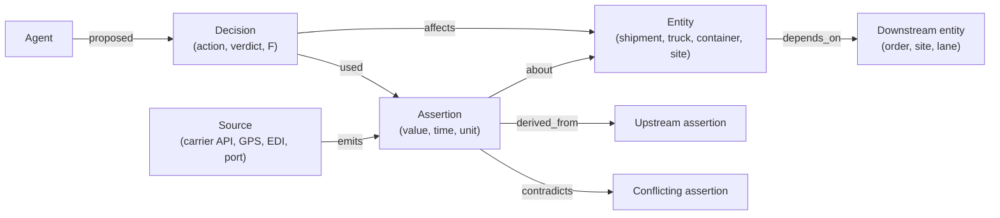
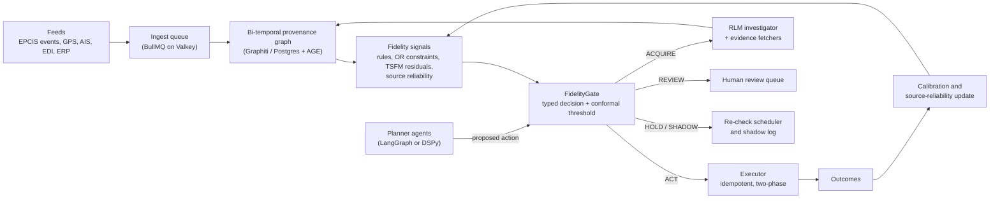

# Topic 1 · Know When Not to Act

*Decision-aware data fidelity and risk-gated autonomy for supply-chain AI agents*

| Field | Detail |
|---|---|
| Working title | Know When Not to Act: Decision-Weighted Data Fidelity and Blast-Radius-Aware Gating for Autonomous Supply-Chain Agents |
| Problem owner | Control-tower and exception-management teams at shippers, 3PLs and freight forwarders |
| Core question | Is this evidence good enough for *this* action, right now? |
| Covers your ideas | A (cascading failures), B (neurosymbolic checks), part of D (spoofed inputs) |
| Recent tech used | Recursive Language Models (RLM), typed "System One" decisions (Jev or an open equivalent), BullMQ, bi-temporal knowledge graphs, conformal risk control |
| Data | Open only: NOAA and Danish AIS, BTS FAF, OpenStreetMap, NOAA weather, synthetic GS1 EPCIS 2.0 events, Beer Game simulators |
| Compute | One DGX Spark (128 GB) is enough |
| Product | **FidelityGate**: a trust layer that sits between data feeds and any AI agent |
| Best-fit venues | IJPR, EJOR, Decision Support Systems, Transportation Research Part E, Omega; benchmark paper at NeurIPS Datasets & Benchmarks |

---

## 1. The problem in plain words

Supply-chain software is moving from **recommending** to **acting**. AI agents now rebook freight, reroute trucks, expedite orders, change safety stock and message customers on their own. They act on whatever data feed they are given, and in logistics that data is often wrong in quiet ways. A GPS ping is three hours old. Two systems disagree on whether a container was discharged. A "delivered" status was sent before the truck arrived. A unit changed from cases to pallets in one system but not the other.

A human planner usually notices that something "looks off" and picks up the phone. An agent does not. It acts at machine speed, and when several agents are connected, one bad data point can set off a chain of actions.

**A realistic example.** At 14:05 a truck enters a mountain pass with no signal. The visibility feed shows "no movement for 3 hours". The ETA agent predicts a 6-hour delay. The exception agent books an expedited replacement shipment. The inventory agent raises safety stock for the next two weeks. The customer agent warns the retailer, and the retailer's own agent cancels a promotion. The truck arrives on time. Every agent behaved "correctly" given the data it saw. The data was stale, and nothing in the chain asked whether it was good enough to act on.

**What is missing today.** Companies check data quality at the dataset level (is the table complete, are the formats valid). Nobody checks it at the **decision** level: is this specific evidence reliable enough for this specific action, given how costly a mistake would be? So firms either keep a human in the loop for everything, which removes the return on investment, or let agents run and accept the risk.

**Who loses money.** Shippers and 3PLs pay for unnecessary expedites, wrong reroutes and excess inventory. Customers receive false alarms. Teams lose trust in automation and switch it off.

## 2. Why this matters now

| Signal | What it says | Source |
|---|---|---|
| Autonomy is the stated direction | Gartner predicts 60% of supply-chain disruptions will be resolved **without human intervention by 2031** (press release, 18 March 2026). | [Gartner 2026](https://www.gartner.com/en/newsroom/press-releases/2026-03-18-gartner-predicts-60-percent-of-supply-chain-disruptions-will-be-resolved-without-human-intervention-by-2031) |
| Data is the bottleneck | Gartner's research note *What Agentic AI Demands From Your Supply Chain Data Strategy* says agentic AI exacerbates data fragmentation and asks for "Connected, Contextualized, Continuous" data to "prevent machine-speed operational failures". | [Gartner research note](https://www.gartner.com/en/documents/8141429) |
| ROI is not arriving | BCG's 2026 survey of 30 large logistics players: 97% call AI a strategic priority, only 13% see measurable financial impact. BCG names fragmented data as the first of three causes. | [BCG 2026](https://www.bcg.com/publications/2026/why-ai-isnt-delivering-roi-logistics) |
| Industry is shipping agents | DHL's Logistics Trend Radar 8.0 (24 Sept 2026) adds Agentic AI as a new high-impact trend. project44 launched a portfolio of six agents, including "AI Data Quality Agents"; FourKites launched agentic "digital workers". | [DHL LTR 8.0](https://group.dhl.com/en/media-relations/press-releases-teaser/2026/dhl-logistics-trend-radar-8.html), [agent round-up](https://resources.rework.com/tools/ai-agents/best-ai-agents-for-supply-chain-2026) |
| Feeds can be badly wrong | In August 2026, an analysis of Strait of Hormuz AIS data found 393 of 642 logged transits (61%) were artifacts of GPS jamming, not real ships. | [Hormuz transit analysis](https://timewell.jp/en/columns/hormuz-strait-transit-data-analysis) |
| Agents amplify instability | A May 2026 MIT/Harvard study of LLM agents in the Beer Game names the "agent bullwhip": run-to-run decision instability that amplifies across echelons even with a fixed demand path. | [Long et al. 2026](https://arxiv.org/abs/2605.17036) |

## 3. How we would solve it (plain words)

Put a **gate** between the data and every action an agent wants to take. For each proposed action, the gate asks five questions:

1. **Is the evidence fresh enough?** A 3-hour-old ping is fine for a weekly forecast and useless for a 30-minute dock decision.
2. **Do independent sources agree?** Two feeds that copy the same upstream system count as one source, not two. The gate uses a graph of where each data point came from to tell the difference.
3. **Is it physically and commercially possible?** A truck cannot do 400 km in an hour; a 40-ft container cannot hold 90 tonnes; a driver cannot exceed legal hours. Hard rules from operations research check this, not the LLM.
4. **How bad is it if we are wrong, and how far would the error spread?** The gate looks at the dependency graph: an expedite that triggers re-planning at five downstream sites needs stronger evidence than a customer notification.
5. **Can we cheaply get better evidence?** If the answer is unclear, the gate asks for more data first (re-ping the device, check the port system, ask the carrier) and only then decides.

The gate then returns one of five verdicts:

| Verdict | Meaning | Typical use |
|---|---|---|
| **ACT** | Execute automatically | High-fidelity evidence, low blast radius |
| **SHADOW** | Simulate and log, do not execute | New action types, models under evaluation |
| **ACQUIRE** | Fetch more evidence, then re-assess | Sources disagree but a cheap check exists |
| **REVIEW** | Send to a human with the evidence pack | High stakes, unresolved conflict |
| **HOLD** | Do nothing yet, re-check on a timer | Evidence is stale and no quick check exists |

The research contribution is to make this gate **principled and measurable**: a formal definition of fidelity relative to the action, thresholds with statistical guarantees, and a benchmark that shows how much harm the gate prevents and how much autonomy it keeps.

## 4. What already exists (and what you can reuse)

| Research stream | Key recent work | What it solved | What is still open |
|---|---|---|---|
| LLM agents in multi-echelon supply chains | Long, Simchi-Levi et al., *Reliability and Effectiveness of Autonomous AI Agents in SCM* ([arXiv 2605.17036](https://arxiv.org/abs/2605.17036), May 2026); Jannelli, Brintrup et al., consensus-seeking agents ([arXiv 2411.10184](https://arxiv.org/abs/2411.10184)) | Agents can beat humans in the Beer Game; "agent bullwhip"; GRPO post-training reduces tail events | Data is assumed clean. The instability studied comes from the model, not from corrupted evidence. |
| Autonomy governance | *Agentic AI Autonomy Assessment* (AAAA), SDU/Sherbrooke/CBS ([arXiv 2607.25405](https://arxiv.org/abs/2607.25405), July 2026) | Task-level autonomy measure; upstream tiers gain from autonomy, downstream tiers are harmed | Measures how much autonomy exists, not when evidence justifies it. |
| Error cascades in multi-agent LLM systems | *From Spark to Fire* ([arXiv 2603.04474](https://arxiv.org/abs/2603.04474), 2026); *Hallucination Cascade* ([arXiv 2606.07937](https://arxiv.org/abs/2606.07937), 2026) | One false "atom" spreads into system-wide false consensus; a genealogy-graph governance layer blocks most infections | Generic text tasks; no physical-world data, no operational cost, no action gating. |
| Provenance and trust in agent pipelines | *From Agent Traces to Trust* survey ([arXiv 2606.04990](https://arxiv.org/abs/2606.04990)); *Correct Is Not Governed* ([arXiv 2608.12761](https://arxiv.org/abs/2608.12761)); *Silence Is Endorsement* ([arXiv 2609.20211](https://arxiv.org/abs/2609.20211)) | Verification status gets "laundered" when it is dropped between agents; deterministic provenance layers help | Not tied to supply-chain data or to cost-aware decisions. |
| Agent robustness to noise | *AgentNoiseBench* ([arXiv 2602.11348](https://arxiv.org/abs/2602.11348), 2026) | Noise injected mid-trajectory hurts most | Generic tool noise; no domain constraints or consequences. |
| Supply-chain LLM benchmarks | *SupChain-Bench* (Findings of ACL 2026, [link](https://aclanthology.org/2026.findings-acl.371/)); *RetailBench*; *E-Commerce Bench* | Long-horizon SOP and tool orchestration is still unreliable | Clean inputs; no controlled data corruption. |
| Supply-chain knowledge graphs | *Helicase* ([arXiv 2605.26835](https://arxiv.org/abs/2605.26835), Brintrup group, 2026); KG + LLM visibility ([IJPR 2025](https://doi.org/10.1080/00207543.2025.2575841)) | Per-fact uncertainty on extracted supply-network facts | Discovery of the network, not gating of operational actions. |
| Neurosymbolic logistics planning | *Foundation Models for Logistics: certifiable conversational planning* ([arXiv 2507.11352](https://arxiv.org/abs/2507.11352)); *OptiRepair* ([arXiv 2602.19439](https://arxiv.org/abs/2602.19439)) | LLM + solver with uncertainty-triggered clarification | Checks the user's intent, not the fidelity of incoming operational data. |
| Selective prediction and abstention | Chow's reject rule (1970); conformal risk control (Angelopoulos et al., ICLR 2024); CAP conformal abstention ([PMLR v304](https://proceedings.mlr.press/v304/tayebati26a.html)) | Abstain-or-answer with guarantees for single predictions | Not extended to multi-action, multi-agent, cost-asymmetric operations. |
| Long-context reasoning | Recursive Language Models (Zhang, Kraska, Khattab, [arXiv 2512.24601](https://arxiv.org/abs/2512.24601)); RLM-Qwen3-8B; `dspy.RLM` | Treat long inputs as an environment the model explores with code and sub-calls | Not applied to operational evidence histories. |

**Reusable building blocks:** the Beer Game environments from the agent-bullwhip work, AgentNoiseBench's injection idea, the Helicase uncertainty layers, Graphiti's bi-temporal graph, the RLM library, and conformal-prediction libraries.

## 5. The gap and the novelty

No published work, as of October 2026, connects **corrupted operational evidence → agent belief → action → network consequence** and controls that chain with a decision-aware gate that has guarantees. Five contributions make the paper distinct:

1. **Decision-Weighted Data Fidelity (DWDF).** Fidelity is defined for a pair (evidence, action), not for a dataset. The same evidence can be fit for "notify customer" and unfit for "book air freight".
2. **Blast-radius-aware thresholds.** The bar an action must clear grows with the downstream harm it can trigger, computed on the supply-network dependency graph. This turns Topic A (cascades) into a design rule.
3. **Fidelity envelopes between agents.** Every inter-agent message carries its fidelity, provenance and verification status. A composition rule ensures fidelity can only fall along a pipeline unless new independent evidence is added, which blocks "verification-status laundering".
4. **Value-of-information evidence acquisition with RLM.** When the gate is unsure, an RLM program searches the long event history and live sources for the cheapest evidence that would change the decision.
5. **FidelityChain-Bench.** An open benchmark with versioned corruption operators, simulator ground truth and cost-based scoring, so any agent can be tested on bad data.

A sixth, smaller contribution: an **open "System One" gate**, a small open model that returns typed, calibrated decisions in well under a second, compared against TypeSafe's proprietary Jev where access is available.

## 6. Formal model (for reviewers)

**Setting.** At time *t* the agent sees an evidence packet *E* (a set of source-stamped assertions) about a latent true state *S*. It proposes an action *a* with operational loss *L(a, S)*. Let *a\*(S)* be the best action under the true state and *δ_a* a tolerance.

**Definition 1 (Decision-weighted fidelity).**
F(E, a) = P( L(a, S) − L(a\*(S), S) ≤ δ_a | E ).
This is the probability that acting on this evidence will not cause harm beyond tolerance.

**Definition 2 (Blast radius).** On the dependency graph *G* (sites, lanes, orders, agents), a wrong action at node *i* causes local harm *h_i* and triggers downstream harm with propagation probabilities *p_ij*. The blast-radius multiplier is
β_i = (1 / h_i) · Σ_{j ∈ Desc(i)} p_ij · h_j.

**Proposition 1 (Optimal gate threshold, to be proven in the paper).** With a calibrated *F*, a review option of cost *r* (including delay), and harm cost *H_i = h_i (1 + β_i)*, the expected-cost-minimising rule is
ACT if F(E, a) ≥ τ_i\* = 1 − r / ( h_i (1 + β_i) ), otherwise REVIEW.
This generalises Chow's reject rule to cascading operations. Thresholds tighten for actions with a large downstream footprint. The paper extends it to the ACQUIRE option (value of information) and HOLD (delay cost).

**Calibration with guarantees.** The threshold is learned from data with conformal risk control: choose τ̂ so that the expected rate of *harmful executed actions* stays below a target α per action class, with a finite-sample guarantee under exchangeability. Adaptive conformal inference handles drift over time.

**Definition 3 (Fidelity envelope and composition).** A message carries (claim, F̂, provenance roots, verification status). If a downstream action depends on claims c₁…cₙ, its fidelity is bounded by
F_down ≥ 1 − Σ_k (1 − F(c_k)),
a union bound that needs no independence assumption. Fidelity can rise again only when evidence with a new provenance root is added.

**Definition 4 (Fidelity-induced agent bullwhip).** Run the same latent world twice, with clean and with corrupted evidence. FABW is the extra order-variance amplification (or rerouting variance, or tail cost) caused by the corruption alone:
FABW = ( Var(orders | corrupted) − Var(orders | clean) ) / Var(demand).
This separates data-caused instability from the model-caused instability already studied in the agent-bullwhip paper.

**Estimating F̂.** A calibrated model over graph and rule features: distinct provenance roots supporting the claim, contradiction density, evidence age relative to process speed, constraint violations, per-source reliability (a Beta posterior updated from outcomes), and the residual against a time-series foundation model forecast. Candidates: gradient boosting, a small graph neural network, TabPFN, and the typed small-model gate.

## 7. Graph design

Graphs are the backbone of this topic. A bi-temporal graph records both when a fact was true in the world and when the system learned it, so any past decision can be replayed exactly as the agent saw it.



| Graph feature | How it is computed | Why it matters |
|---|---|---|
| Independent corroboration | Count distinct provenance roots (graph traversal to ancestors) | Two feeds that copy one upstream system are one source |
| Contradiction density | Share of `contradicts` edges in the claim's neighbourhood | Conflicts predict harm better than noise magnitude |
| Path freshness | Oldest timestamp on the derivation path | A fresh record built on stale inputs is stale |
| Blast radius β | Weighted descendant sum on the dependency graph | Sets how strict the gate must be |
| Source reliability | Beta posterior per source, updated from outcomes | Learns which feeds lie, and when |
| Corrupted-node centrality | Centrality of nodes touched by low-fidelity claims | Predicts cascade size in multi-agent runs |

Tools: [Graphiti](https://github.com/getzep/graphiti) (Apache-2.0, bi-temporal edges, MCP server) on Neo4j Community or FalkorDB, or PostgreSQL with Apache AGE and pgvector; PyTorch Geometric for graph models; W3C PROV-O and GS1 EPCIS 2.0 as the vocabularies.

## 8. System architecture



**Where the recent technologies fit**

| Technology | Role in this topic | Notes |
|---|---|---|
| **Recursive Language Models** ([paper](https://arxiv.org/abs/2512.24601), [code](https://github.com/alexzhang13/rlm), [`dspy.RLM`](https://dspy.ai/api/modules/RLM/)) | The ACQUIRE path. The full event history of a shipment (weeks of pings, EDI 214 messages, emails, port events) is loaded as a variable in a sandboxed REPL. The model writes code to filter it and calls sub-models on slices to find the smallest evidence set that confirms or rejects the action. | Compare against long-context prompting and RAG at equal cost. RLM-Qwen3-8B runs locally. |
| **Jev / "System One" models** (TypeSafe, released 15 Sept 2026) | The gate's verdicts are typed choices with probabilities, which is exactly what Jev produces: typed questions over JSON state, calibrated probabilities, reported latency of 70–500 ms. | Jev is proprietary and API-only, so it is an **optional baseline**. The reproducible core is an open equivalent: a small Qwen3.5 model with grammar-constrained decoding over the verdict enum, probabilities read from token log-probabilities, then calibrated. |
| **BullMQ** ([docs](https://docs.bullmq.io)) | Real-time backbone: `ingest`, `assess` (job ID = idempotency key), `acquire` (parent-child flows that wait for evidence fetchers with timeouts), `review` (human queue with SLA), `execute` (rate-limited per carrier API), `recheck` (job schedulers for HOLD), dead-letter queues. | Runs on Valkey (BSD) or Redis 6.2+. Node, Python, Rust, Elixir and PHP clients; check Python feature parity (deduplication arrived later in the Python client). |
| **Bi-temporal knowledge graphs** (Graphiti / Zep) | Evidence memory with replay "as of" any time | Peer-reviewed results on agent memory; Apache-2.0 |
| **Conformal risk control** (MAPIE, crepes) | Thresholds with a guaranteed harmful-action rate | Adaptive conformal for drift |
| **Time-series foundation models** (Chronos-2, TimesFM-2.5, Moirai-2) | "Expected value" plausibility checks on ETAs, dwell times and sensor streams | Open weights, zero-shot |
| **OR solvers** (OR-Tools CP-SAT, HiGHS) | Hard feasibility: capacity, time windows, hours of service, inventory balance | The LLM never overrides these |
| **MCP and A2A** | FidelityGate is exposed as an MCP tool so any agent framework can call it; A2A messages carry the fidelity envelope | Vendor-neutral integration |
| **OpenTelemetry GenAI conventions + Langfuse** | Traces every gate decision with its features, tokens and latency | Self-hosted |

## 9. Research questions and hypotheses

| # | Research question | Hypothesis |
|---|---|---|
| RQ1 | Which kinds of data fault cause the most operational harm when agents act on them? | H1: Staleness, contradiction and "echo" (duplicated sources) cause more harm than random noise of the same size. |
| RQ2 | Does action-specific fidelity predict harm better than dataset-level quality scores or the LLM's own confidence? | H2: DWDF gives a better risk–coverage curve than both. |
| RQ3 | Can conformal thresholds keep harmful actions below a target while keeping most actions automatic? | H3: The harmful-action rate stays at or below α on held-out and drifted data, with an autonomy rate that is reported, not assumed. |
| RQ4 | Do fidelity envelopes and blast-radius thresholds contain cascades? | H4: Lower FABW than ungated multi-agent systems and than a genealogy-graph governance baseline. |
| RQ5 | Does recursive evidence interrogation beat long-context prompting and RAG on long histories? | H5: Higher evidence recall at equal or lower cost and latency. |
| RQ6 | Can a small open typed model gate as well as a large LLM? | H6: Comparable accuracy at much lower latency; Jev as an optional comparator. |

## 10. Benchmark: FidelityChain-Bench

The benchmark is the long-lived asset. Other researchers and companies can use it to test their own agents.

| Scenario | Decision the agent makes | Ground truth from | Open data used |
|---|---|---|---|
| S1 Shipment exception desk | Notify, re-tender, expedite, reroute, hold | Discrete-event simulator of truckload and LTL moves | OSM road network, BTS FAF flows, NOAA weather |
| S2 Multi-echelon replenishment | Order quantities at four or more echelons | Beer Game and a two-tier network simulator | MIT Beer Game rules, open simulators |
| S3 Ocean ETA and port connection | Rebook a connection, move a drayage appointment | AIS replay with known true tracks | NOAA MarineCadastre AIS, Danish Maritime Authority AIS |
| S4 Cold chain excursion | Release, quarantine or discard a lot | Simulated thermal model | Synthetic GS1 EPCIS 2.0 sensor events |

**Perturbation library.** Each operator is versioned, seeded and documented, so every run is reproducible and the clean twin is always available.

| Operator | What it does | Severity knob |
|---|---|---|
| Staleness | Delays delivery of events while values stay plausible | Lag in minutes, burst length |
| Dropout | Removes events at random or in bursts | Missing rate, burst pattern |
| Contradiction | Makes two sources disagree | Gap size, share of entities |
| Echo | Creates a "second source" that copies the first | Number of echoes |
| Semantic drift | Changes units, time zones or ID mappings | Share of records |
| Implausible jump | Inserts physically impossible positions or values | Jump size |
| Targeted spoof | Changes chosen fields in a stealthy way | Attack budget |
| Replay | Re-sends an old valid event as new | Age of replayed event |

**Scoring.** Every agent is scored on decision cost against the simulator's optimum, harmful-action rate, autonomy rate, risk–coverage curve, FABW, calibration error and latency. Public leaderboard, with code and data under permissive licences.

## 11. Experiments, baselines and metrics

**Baselines**

| ID | Baseline | Purpose |
|---|---|---|
| B0 | Classical OR policy (base-stock, CP-SAT routing) | Non-AI reference |
| B1 | ReAct-style LLM agent, no gate | Shows the naive risk |
| B2 | Gate on the LLM's self-reported confidence | Tests "the model knows when it is wrong" |
| B3 | Gate on a classic data-quality score (Great Expectations / Soda checks) | Tests dataset-level quality |
| B4 | Multi-agent system with genealogy-graph governance (as in *From Spark to Fire*) | Strongest generic cascade defence |
| B5 | RLM investigator without the gate | Value of RLM alone |
| B6 | Jev as the gate (optional, if access) | Proprietary System One comparator |
| Full | DWDF + blast radius + envelopes + RLM acquisition + conformal thresholds | Proposed system |

**Experiments**

1. **Harm map.** Fault type × severity × action type. Which faults hurt which decisions?
2. **Gate comparison.** Risk–coverage curves for B2, B3, B6 and Full.
3. **Guarantee check.** Harmful-action rate vs. target α on in-distribution, shifted and adversarial splits.
4. **Cascade containment.** FABW for ungated, B4 and Full in S2 and in a networked S1.
5. **Evidence interrogation.** RLM vs. long context vs. RAG vs. summary compaction at matched budgets.
6. **Systems test.** Event bursts, slow tools, malformed records, queue retries and partial outages. Report p50/p95/p99 latency, throughput and recovery time.
7. **Optional pilot.** Shadow-mode run on a partner's anonymised event stream.

**Statistics.** Paired runs on the same latent world, at least 30 seeds per cell, bootstrap confidence intervals, Holm correction for multiple comparisons.

## 12. Compute plan (one DGX Spark)

The DGX Spark has a GB10 Grace Blackwell chip with **128 GB unified memory** (273 GB/s) and is rated by NVIDIA for inference on models up to about 200B parameters and fine-tuning up to about 70B ([NVIDIA hardware guide](https://docs.nvidia.com/dgx/dgx-spark/hardware.html)).

| Role | Open model (licence) | Fits on one Spark? |
|---|---|---|
| Planner agents | gpt-oss-120b (Apache-2.0, MXFP4) or Qwen3.5-122B-A10B (Apache-2.0, 4-bit) | Yes. Community benchmarks report roughly 45–70 tokens/s single-stream for gpt-oss-120b depending on the engine ([NVIDIA forum](https://forums.developer.nvidia.com/t/vllm-0-17-0-mxfp4-patches-for-dgx-spark-qwen3-5-35b-a3b-70-tok-s-gpt-oss-120b-80-tok-s-tp-2/362824)) |
| Fast agents and RLM sub-calls | Qwen3.5-35B-A3B or Qwen3.5-9B | Yes, with room to spare |
| Recursive investigator | RLM-Qwen3-8B | Yes |
| Typed gate | Qwen3.5-4B with constrained decoding, LoRA-tuned | Yes; fine-tuning fits easily |
| Forecast checks | Chronos-2 / TimesFM-2.5 | Yes |

Serving with vLLM or SGLang (structured outputs via XGrammar). Large sweeps can run with smaller models first; the 120B planner is used for the final runs. No paid API is required. Jev is the only optional paid component.

## 13. Product: FidelityGate

**What it is.** A vendor-neutral trust layer. It does not replace the TMS, WMS or ERP. It sits between event streams and any agent, and answers one question per proposed action: *act, shadow, acquire, review or hold, and why?*

**Who would use it**

| User | Pain today | What FidelityGate gives them |
|---|---|---|
| Shipper control tower | Agents create false expedites and alerts | Fewer harmful actions, an audit trail for each one |
| 3PL / forwarder | Customers blame them for wrong automated actions | Evidence pack for every decision |
| Visibility and TMS vendors | Their own agents need guardrails | An embeddable gate (open core) |
| Auditors and risk teams | No way to prove an agent was safe to run | Calibrated harm rate per action class, aligned with the NIST AI RMF and ISO/IEC 42001 |

**API sketch**

```json
POST /v1/assess
{
  "action": {"type": "expedite_air", "shipment_id": "SH-20931", "cost_usd": 18400},
  "evidence_refs": ["evt:gps:88123", "evt:edi214:5521", "evt:eta:991"],
  "context": {"deadline": "2026-10-09T08:00:00Z"}
}

200 OK
{
  "verdict": "ACQUIRE",
  "fidelity": 0.62,
  "threshold": 0.91,
  "blast_radius": 3.4,
  "reasons": ["latest GPS ping is 3h12m old", "EDI 214 and ETA feed share one upstream source"],
  "next_evidence": [{"type": "device_ping", "expected_gain": 0.21, "max_wait_s": 300}],
  "provenance_subgraph": "graph:snap:2026-10-07T14:05:00Z/SH-20931",
  "decision_id": "dec_7f3a…",
  "idempotency_key": "SH-20931:expedite_air:v3"
}
```

**Production hardening (so it does not break)**

| Concern | Practice |
|---|---|
| Duplicate side effects | Idempotency key on every job; transactional outbox; two-phase prepare → validate → commit |
| Model or service outage | Circuit breakers; fall back to rules-only gate; the safe default is HOLD, never "act anyway" |
| Bursts and runaway loops | BullMQ rate limits, backpressure, max retries with exponential backoff and jitter, dead-letter queues |
| Silent drift | Online calibration monitoring; alert when the harmful-action rate on recent outcomes exceeds α |
| Reproducibility and audit | Event-sourced log; bi-temporal graph snapshot ID, model version, prompt version and policy version stored with each decision |
| Bad inputs | Pydantic / JSON-Schema contracts at every boundary; structured outputs only |
| Prompt injection via documents | Documents are parsed into typed claims; text from documents never becomes instructions |
| Rollout risk | Shadow mode → canary on one lane → graduated autonomy per action class |
| Verification | Property-based tests (Hypothesis), load tests (k6 or Locust), chaos tests (kill workers, delay tools) |

**Service-level targets (to be validated, not claimed):** fast path (rules + graph features + small model) p95 under 250 ms; slow path with LLM or RLM p95 under 5 s; 99.9% availability for the gate API.

**Open-core model.** Gate engine, benchmark and connectors open source (Apache-2.0). Paid: hosted version, enterprise connectors (SAP, Oracle, Blue Yonder), compliance reporting.

## 14. Risks and how to handle them

| Risk | Mitigation |
|---|---|
| Overlap with 2026 work on agent bullwhip, autonomy assessment and error cascades | Cite them directly. Position this work as the **data-fidelity cause** and the **decision-level control**, with operational costs and guarantees. |
| Benchmark seen as "too synthetic" | Real network structure and real AIS tracks; corruption operators clearly labelled synthetic; optional shadow pilot. |
| Calibration breaks under drift | Adaptive conformal methods; report results on drifted splits. |
| The gate blocks too much | Report autonomy rate and risk–coverage curves; tune α per action class with the business. |
| Graph engineering eats the schedule | Start with Postgres + AGE; use graph features only where they measurably help. |

**Do not claim:** that LLM confidence measures data trust; that the system is "production-safe" before stress tests; that synthetic faults are real incidents; that Jev is open source.

## 15. Twelve-month plan

| Months | Work | Output |
|---|---|---|
| 1–2 | Literature review, formal model, Proposition 1 proof | Problem-formulation draft |
| 2–4 | Simulators S1–S4, perturbation library, event schema | FidelityChain-Bench v0.1 |
| 4–5 | Baselines B0–B5 | Harm map (Experiment 1) |
| 5–8 | DWDF estimator, conformal gate, envelopes, RLM acquisition | FidelityGate v0.1 |
| 8–10 | Experiments 2–6, ablations | Results tables |
| 10–12 | Writing; benchmark release; optional pilot | Journal submission + benchmark paper |

## 16. Papers you can get from this topic

| Paper | Venue type |
|---|---|
| Know When Not to Act: decision-weighted fidelity and blast-radius gating | Operations / decision science (IJPR, EJOR, DSS, Omega) |
| FidelityChain-Bench: stress-testing supply-chain agents on imperfect data | AI benchmark track (NeurIPS D&B, KDD) |
| Recursive evidence interrogation for long operational histories | AI systems / NLP venue |
| Open System One gates: typed, calibrated decisions for agent guardrails | ML systems workshop or journal |

## 17. Sources

1. Zhang, A. L., Kraska, T., Khattab, O. *Recursive Language Models.* arXiv:2512.24601 (2025; v2 2026 adds RLM-Qwen3-8B). https://arxiv.org/abs/2512.24601 · code https://github.com/alexzhang13/rlm · DSPy module https://dspy.ai/api/modules/RLM/
2. Long, C. X., Simchi-Levi, D., et al. *Reliability and Effectiveness of Autonomous AI Agents in Supply Chain Management.* arXiv:2605.17036 (May 2026). https://arxiv.org/abs/2605.17036
3. *Agentic AI Autonomy Assessment: A Decision-Support Framework Towards Governed Supply Chain Systems.* arXiv:2607.25405 (July 2026). https://arxiv.org/abs/2607.25405
4. *From Spark to Fire: Modeling and Mitigating Error Cascades in LLM-Based Multi-Agent Collaboration.* arXiv:2603.04474 (2026). https://arxiv.org/abs/2603.04474
5. *Hallucination Cascade: Analyzing Error Propagation in Multi-Agent LLM Systems.* arXiv:2606.07937 (2026). https://arxiv.org/abs/2606.07937
6. *From Agent Traces to Trust: A Survey of Evidence Tracing and Execution Provenance in LLM Agents.* arXiv:2606.04990 (2026). https://arxiv.org/abs/2606.04990
7. Salas, J. *Correct Is Not Governed: Provenance Integrity in Agentic Workflows.* arXiv:2608.12761 (2026). https://arxiv.org/abs/2608.12761
8. *Silence Is Endorsement: Verification-Status Laundering in LLM Agent Pipelines.* arXiv:2609.20211 (2026). https://arxiv.org/abs/2609.20211
9. *AgentNoiseBench: Benchmarking Robustness of Tool-Using LLM Agents Under Noisy Conditions.* arXiv:2602.11348 (2026). https://arxiv.org/abs/2602.11348
10. Guan, S., Liu, Y., Cao, L. *SupChain-Bench.* Findings of ACL 2026. https://aclanthology.org/2026.findings-acl.371/
11. *Helicase: Uncertainty-Guided Supply Chain Knowledge Graph Construction with Autonomous Multi-Agent LLMs.* arXiv:2605.26835 (2026). https://arxiv.org/abs/2605.26835
12. Jannelli, V., Schoepf, S., Bickel, M., Netland, T., Brintrup, A. *Agentic LLMs in the Supply Chain: Towards Autonomous Multi-Agent Consensus-Seeking.* arXiv:2411.10184. https://arxiv.org/abs/2411.10184
13. *Foundation Models for Logistics: Toward Certifiable, Conversational Planning Interfaces.* arXiv:2507.11352. https://arxiv.org/abs/2507.11352
14. *OptiRepair: Closed-Loop Diagnosis and Repair of Supply Chain Optimization Models with LLM Agents.* arXiv:2602.19439. https://arxiv.org/abs/2602.19439
15. *Masking Stale Observations Helps Search Agents, Until It Doesn't.* arXiv:2606.00408 (2026). https://arxiv.org/abs/2606.00408
16. Tayebati et al. *CAP: Conformalized Abstention Policies.* PMLR v304. https://proceedings.mlr.press/v304/tayebati26a.html
17. Angelopoulos, A. N., Bates, S., Fisch, A., Lei, L., Schuster, T. *Conformal Risk Control.* ICLR 2024.
18. Chow, C. K. *On optimum recognition error and reject tradeoff.* IEEE Transactions on Information Theory, 1970.
19. Lee, H. L., Padmanabhan, V., Whang, S. *Information distortion in a supply chain: the bullwhip effect.* Management Science, 1997.
20. Hazen, B. T., Boone, C. A., Ezell, J. D., Jones-Farmer, L. A. *Data quality for data science, predictive analytics, and big data in supply chain management.* IJPE, 2014.
21. Rasmussen, P. et al. *Zep: A Temporal Knowledge Graph Architecture for Agent Memory.* arXiv:2501.13956 (2025). Graphiti: https://github.com/getzep/graphiti
22. Gartner. *Gartner Predicts 60% of Supply Chain Disruptions Will Be Resolved Without Human Intervention by 2031.* 18 March 2026. https://www.gartner.com/en/newsroom/press-releases/2026-03-18-gartner-predicts-60-percent-of-supply-chain-disruptions-will-be-resolved-without-human-intervention-by-2031
23. Gartner. *What Agentic AI Demands From Your Supply Chain Data Strategy.* https://www.gartner.com/en/documents/8141429
24. BCG. *Why AI Isn't Delivering ROI in Logistics.* 2026. https://www.bcg.com/publications/2026/why-ai-isnt-delivering-roi-logistics
25. DHL. *Logistics Trend Radar 8.0.* 24 September 2026. https://group.dhl.com/en/media-relations/press-releases-teaser/2026/dhl-logistics-trend-radar-8.html
26. TypeSafe AI. *Introducing System One Models & Jev.* 15 September 2026. https://typesafe.ai/blog/introducing-system-one-models-and-jev
27. BullMQ documentation. https://docs.bullmq.io
28. NVIDIA. *DGX Spark hardware overview.* https://docs.nvidia.com/dgx/dgx-spark/hardware.html
29. GS1 EPCIS & CBV 2.0. https://www.gs1.org/standards/epcis · W3C PROV-Overview. https://www.w3.org/TR/prov-overview/
30. Hormuz AIS transit analysis, August 2026. https://timewell.jp/en/columns/hormuz-strait-transit-data-analysis

*Verification note: facts were checked through web search on 7 October 2026. arXiv, Gartner and BCG pages could not be opened directly from the research environment, so their details come from search-engine extracts. Open each source and re-check numbers before citing them in a manuscript.*
