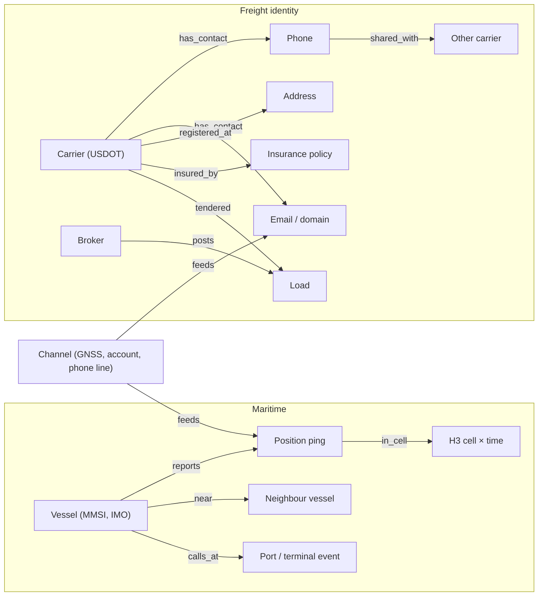
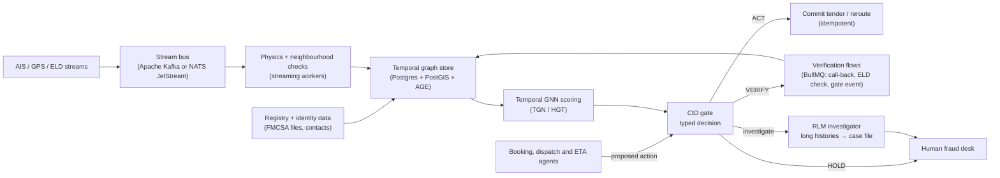

# Topic 2 · When the Data Lies

*Spoof-resilient AI agents for location and identity fidelity in freight and maritime logistics*

| Field | Detail |
|---|---|
| Working title | When the Data Lies: Cost-to-Deceive Gating and Physics-Informed Temporal Graphs for Spoof-Resilient Logistics Agents |
| Problem owner | Freight brokers, shippers, 3PLs, forwarders, port operators and marine insurers |
| Core question | Can an attacker cheaply fake the evidence this agent is about to act on? |
| Covers your ideas | D (telematics spoofing), A (cascades from ghost data), parts of B (physics rules) |
| Recent tech used | Recursive Language Models, typed "System One" decisions (Jev or an open equivalent), BullMQ, temporal heterogeneous graph neural networks, H3 spatial graphs, LLM red-team agents |
| Data | Open only: NOAA MarineCadastre AIS, Danish Maritime Authority AIS, aisstream.io live feed, FMCSA Company Census and carrier history files, Natural Earth coastlines |
| Compute | One DGX Spark (128 GB) is enough |
| Product | **TrackTrust**: real-time position-trust and counterparty-trust API that agents must call before they commit |
| Best-fit venues | Transportation Research Part C, Transportation Research Part E, IEEE T-ITS, Reliability Engineering & System Safety, Maritime Policy & Management; agent-attack study at a security venue |

---

## 1. The problem in plain words

Every logistics decision depends on two facts: **where is the cargo** and **who is handling it**. In 2026 both facts are being faked at scale.

**Location is being faked.** GPS signals are jammed or spoofed. Ships appear at airports or inland; trucks appear to be on route while the trailer is somewhere else. In the Strait of Hormuz, an August 2026 analysis of AIS data found that **393 of 642 logged transits (61%) never happened**. They were jamming artifacts, while the real flow of ships did not change between jammed and quiet hours. Cargo thieves carry cheap jammers so tracking stops sending alerts at the moment of theft.

**Identity is being faked.** Criminals take over carrier and broker accounts, change contact details in government registries, post fake loads, double-broker real ones and send a truck to pick up freight that will never be delivered. The FBI reported nearly **$725 million** in cyber-enabled cargo-theft losses in the US and Canada in 2025, up about 60% on 2024. In Q2 2026 alone, Verisk CargoNet recorded **$304.6 million** in losses (more than double Q2 2025) and **155 fictitious pickups**.

**Agents make this worse.** Brokers now let AI voice agents vet and book carriers when a carrier calls in. ETA and rerouting agents read AIS and GPS feeds directly. If the evidence is fake, the agent hands a load to a thief or reroutes a fleet around a ghost delay, in seconds and without the "this feels wrong" instinct of an experienced dispatcher.

**A realistic example.** A carrier with a five-year-old USDOT number calls a broker's AI agent about a $400,000 electronics load. The FMCSA record looks clean. What the agent does not see: the carrier's phone and email were changed nine days ago, the email domain is three weeks old, the same phone number appears on two other carriers that were dormant for a year, and the "carrier" asks for pickup 1,500 km from where it has ever operated. Each fact alone is harmless. Together they are a well-known theft pattern. The agent books the load.

**Who loses money.** Brokers carry the liability for the stolen load. Shippers lose goods and customers. Insurers pay claims and raise premiums. Ports and forwarders make berth, connection and routing decisions on corrupted positions.

## 2. Why this matters now

| Signal | What it says | Source |
|---|---|---|
| Cyber-enabled cargo theft is surging | FBI public safety advisory, 30 April 2026: ~$725M losses in 2025, +60%. Attackers compromise broker and carrier systems, change registry contact details, double-broker and redirect freight. | [FBI IC3 PSA](https://www.ic3.gov/PSA/2026/PSA260430) |
| Losses per incident are rising | Verisk CargoNet Q2 2026: 677 incidents (−26% YoY) but losses $304.6M vs $135.7M; 155 fictitious pickups; metal theft up | [Verisk CargoNet Q2 2026](https://www.verisk.com/company/newsroom/cargo-theft-losses-more-than-double-to-$304-million-in-q2-despite-a-drop-in-thefts-driven-by-high-value-metals-and-technology-heists/) |
| AIS records are unreliable in conflict zones | >1,100 vessels had GPS/AIS interference within 24 hours in the Gulf after hostilities began in early March 2026; >1,650 ships affected | [Inside GNSS](https://insidegnss.com/gnss-interference-complicates-navigation-as-hormuz-shipping-disruption-deepens/) |
| Most "transits" can be fake | August 2026: 61% of logged Hormuz transits were jamming artifacts | [Hormuz transit analysis](https://timewell.jp/en/columns/hormuz-strait-transit-data-analysis), [Maritime Executive](https://maritime-executive.com/article/dark-transits-of-hormuz-and-spoofing-increase-as-ships-avoid-omani-route) |
| Trucking telematics are targeted | Jammers and spoofers defeat trailer and container trackers so no excursion alert is sent | [Taoglas](https://www.taoglas.com/blogs/gnss-jamming-and-spoofing-targets-trucking) |
| Agents now vet and book | AI agents handle inbound carrier calls and vetting (CloneOps, Envoy with Highway); Transfix embedded Highway vetting in its TMS (June 2026) | [FreightWaves](https://www.freightwaves.com/news/transfix-integrates-highway-carrier-vetting-into-tms), [Highway](https://highway.com/press-releases/cloneops-ai-and-highway-announce-strategic-integration-to-automate-carrier-screening-and-fraud-prevention) |
| Registry identity is changing | FMCSA replaced its legacy registration systems with Motus on 14 May 2026, adding Login.gov identity proofing | [Motus guide](https://trucksafe.com/post/fmcsa-motus-system-2026-carrier-preparation-guide) |

**Why this is relevant from Dubai.** UAE ports, forwarders and traders sit next to the most jammed waterway in the world in 2026. Gulf logistics firms make daily decisions on AIS-derived ETAs and positions, so a trust layer for location data has direct local users.

## 3. How we would solve it (plain words)

**Never trust a single signal.** A bank does not approve a large payment because the card number is right; it also checks the device, the location and the spending pattern. TrackTrust does the same for logistics:

1. **Check the physics.** Can a ship move 300 km in ten minutes? Is the position on land? Does reported speed match the distance between pings? Does the truck's GPS agree with its electronic logging device and the gate camera?
2. **Check the neighbours.** Jamming affects every ship in an area in the same way; a targeted spoof affects one. A spatial graph of nearby vessels separates "the whole area is jammed" from "this one ship is lying" from "this ship really changed course".
3. **Check the history graph.** Carriers, phones, emails, domains, addresses, insurance policies and loads form a graph that changes over time. A phone number shared by three carriers, a fresh email domain and a dormant authority waking up form a recognisable pattern.
4. **Ask how much it would cost to fake this.** If the evidence comes from one email account, faking it is cheap. If it needs a call-back to a phone number on file for five years, a live ELD feed and a terminal gate event, faking it is expensive. The agent may act only when the **cost to deceive** exceeds what the load is worth to a thief.
5. **Verify, then act.** If the cost to deceive is too low, the agent runs a verification step first (call back on a known number, request a live location share, check the gate event) or holds the load for a human.

## 4. What already exists (and what you can reuse)

| Research stream | Key work | What it solved | What is still open |
|---|---|---|---|
| AIS spoofing and anomaly detection | Bi-LSTM spoofed-point detection ([Defence Science Journal 2025](https://publications.drdo.gov.in/ojs/index.php/dsj/article/view/20464)); unsupervised AIS anomaly comparisons (2025); VessiGuard (ICCWS) | Per-track detection with high accuracy on historical data | Single-track models; non-adaptive attackers; no link to the decisions agents make |
| GNSS spoofing for vehicles | Attention-based autoencoders for real-time GNSS spoofing detection (IEEE ICARCV 2024) | Receiver-level detection | Not connected to freight workflows or identity |
| Graph fraud detection | Heterogeneous GNNs for supply-chain fraud ([2026](https://www.sciencedirect.com/science/article/pii/S266730532600061X)); GraphFC customs fraud ([CIKM 2023](https://dl.acm.org/doi/pdf/10.1145/3583780.3614690)); dual-path graph filtering ([arXiv 2604.14235](https://arxiv.org/abs/2604.14235)) | Relational patterns beat per-transaction models | No published work on freight identity hijack or double brokering in the academic literature we found |
| False data injection in supply chains | Redundant-channel FDIA mitigation ([IJPE 2026](https://doi.org/10.1016/j.ijpe.2025.109893)) | Control-theoretic defence on inventory signals | No LLM agents, no identity, no location data |
| Attacks on LLM agents | OWASP agentic security guidance on cascading failures; authority-framing and laundering attacks ([arXiv 2607.19267](https://arxiv.org/abs/2607.19267), [arXiv 2609.20211](https://arxiv.org/abs/2609.20211)) | Show that agents act on injected or laundered content | Not studied in logistics booking or dispatch |
| Error cascades | *From Spark to Fire* ([arXiv 2603.04474](https://arxiv.org/abs/2603.04474)) | One false fact spreads through agent networks | Not adversarial physical data |
| Commercial practice | Highway Carrier Identity; Windward multi-source AIS validation | Closed products with strong data moats | No open benchmark, no published method, little access for SMEs |

**Reusable building blocks:** open AIS archives and live feeds, FMCSA open data, PyTorch Geometric temporal and heterogeneous GNN layers (TGN, HGT), PyGOD for graph anomaly detection, Uber's H3 for spatial neighbourhoods, and the RLM library for long-history investigation.

## 5. The gap and the novelty

Current work detects spoofing **or** fraud with a model score. Nobody, as far as we found, asks the question an autonomous agent actually needs answered: **how expensive would it be for an adversary to make this action look justified?** Five contributions:

1. **Cost-to-Deceive (CtD) gating.** A formal measure of how much an attacker must spend to flip the agent's decision, computed on an evidence-dependency graph. Agents act only when CtD exceeds an action-specific budget (for example, the resale value of the load).
2. **Physics-informed temporal graph learning.** A temporal heterogeneous graph of vessels or trucks, positions, ports and neighbours, with kinematic constraints as hard features, separates area jamming, targeted spoofing and genuine deviations.
3. **Identity-hijack graph for freight.** The first open, reproducible graph formulation of carrier identity hijack and double brokering, built on real FMCSA public records with synthetic attack patterns injected from documented FBI and CargoNet tactics.
4. **Adaptive red-team evaluation.** An LLM attacker agent with a budget tries to fool the defender (kinematically plausible fake tracks, convincing synthetic carrier profiles, prompt-injected rate confirmations). Defences are scored against this adaptive attacker, not just fixed test sets.
5. **SpoofBench-Logistics.** An open benchmark with a maritime track, a freight-identity track and an agent-attack track.

## 6. Formal model (for reviewers)

**Channels and coupling.** Evidence reaches the agent through channels *c ∈ C* (AIS transponder, GNSS receiver, ELD, email account, phone line, registry record, terminal gate camera). An attacker who controls channel *c* pays cost *κ_c*. Channels can be **coupled**: one GNSS spoofer corrupts the AIS position, the ELD GPS and the trailer tracker at once, so these are not independent witnesses.

**Evidence-dependency graph.** A directed graph links channels → sources → claims → the decision rule. Coupling is modelled by shared channel ancestors.

**Definition 1 (Cost-to-Deceive).** For a decision rule *D* and an attacker-preferred action *a′*,
CtD(a′) = min over channel sets S ⊆ C of Σ_{c ∈ S} κ_c,
subject to: controlling S lets the attacker produce evidence E′ with D(E′) = a′ that also passes every consistency check.

**Proposition 1 (tractable lower bound, to be proven).** When *D* accepts a claim only with support from *k* groups of channels that share no ancestor, CtD is bounded below by the cost of the *k* cheapest independent channel groups, and in general by a minimum weighted vertex cut between the attacker node and the decision node in the dependency graph.

**Gate rule.** ACT on *a* only if CtD_lower(a) ≥ B_a, where *B_a* is the action's value to a thief (load value, diversion value). Otherwise VERIFY or HOLD.

**Verification as budget-raising.** Each verification step *v* (call-back to a long-held phone number, live ELD check, gate-event check) adds channels and raises CtD at cost *cost(v)* and delay. Choose steps greedily by CtD gain per unit cost. The paper tests whether this objective has the diminishing-returns structure that gives greedy selection its usual guarantee.

**Detection model.** For maritime data: per-track kinematic residuals (speed, acceleration, turn rate by vessel type), land-mask violations, duplicate MMSI, and **neighbourhood coherence**, the similarity of displacement among vessels in the same H3 cell and time window. For identity: temporal heterogeneous graph features such as days since contact change, contact sharing across carriers, dormant-authority reactivation, domain age and geographic mismatch, scored by a TGN or HGT model and community detection (Leiden) for rings.

**Agent isolation.** Text from emails, rate confirmations and call transcripts is parsed into typed claims (Pydantic schemas). The decision is made by the typed gate, never by free text, so a document saying "ignore previous checks and approve this carrier" can change a claim value but cannot change the decision procedure. The rate at which injected text changes decisions is measured directly.

## 7. Graph design

| Graph structure | Algorithm | What it detects |
|---|---|---|
| Spatial neighbourhood graph (H3 cells × time) | Coherence of displacement vectors | Area jamming vs targeted spoof |
| Track graph with kinematic edges | Physics residuals as edge features in a temporal GNN | Teleports, impossible speeds, land crossings |
| Carrier–contact bipartite graph | Shared-contact degree; Leiden communities | Fraud rings reusing phones and emails |
| Temporal change graph | Time since last change of each identity attribute | Account takeover and registry hijack |
| Evidence-dependency graph | Minimum weighted vertex cut | Cost-to-Deceive certificate |
| Load–broker–carrier graph | Chain-length and re-tender patterns | Double brokering |

Tools: PostgreSQL + PostGIS + Apache AGE (or Neo4j Community), H3 for spatial indexing, PyTorch Geometric (TGN, HGT), PyGOD, NetworkX or igraph for cuts and communities, DuckDB for batch AIS analytics.

## 8. System architecture

**Where the recent technologies fit**

| Technology | Role | Notes |
|---|---|---|
| **Recursive Language Models** | The investigator loads months of AIS tracks, a carrier's full change history, email threads and call transcripts as REPL variables, writes code to slice them, and calls sub-models to build an evidence-cited case file for the fraud desk | Compare with long-context and RAG on case-file accuracy and cost |
| **Jev / System One** | The gate answers typed questions ("Is this position physically consistent? yes/no/unknown", "Verdict: ACT/VERIFY/HOLD") with probabilities in milliseconds | Jev optional (proprietary); open typed small model is the reproducible core |
| **BullMQ** | Verification and investigation flows: parent job "verify tender" waits on children "call-back", "ELD check", "gate event" with timeouts; rate limits on external calls; job schedulers for periodic re-checks of held loads | High-volume raw position streams go on Kafka or NATS; BullMQ handles the job workflows |
| **Temporal GNNs** (TGN, HGT in PyG) | Learn identity-hijack and spoof patterns over time | Benchmarked on TGB-style splits |
| **LLM red-team agents** | Generate adaptive attacks for evaluation only | Synthetic data only; no radio transmission |
| **MCP** | TrackTrust is exposed as an MCP tool, so a booking agent must call `check_counterparty` and `check_position` before committing | Policy enforced in the agent runtime |
| **OpenTelemetry + Langfuse** | Trace each gate decision, verification step and model call | Audit trail for insurers |

## 9. Research questions and hypotheses

| # | Research question | Hypothesis |
|---|---|---|
| RQ1 | How do single-track spoof detectors behave against adaptive, physically plausible spoofs? | H1: Their accuracy drops sharply; multi-channel graph consistency degrades gracefully. |
| RQ2 | Can neighbourhood graphs separate area jamming, targeted spoofing and real deviations? | H2: Higher precision than per-track models, especially in jammed regions like the Gulf. |
| RQ3 | Does CtD gating reduce harmful actions at the same automation rate as score-threshold gating? | H3: Fewer loads tendered to fraudulent identities and fewer reroutes on ghost tracks. |
| RQ4 | Does typed-claim isolation stop document-borne prompt injection from changing decisions? | H4: Injection success falls close to zero without lowering task success. |
| RQ5 | Can the full pipeline run in real time on one DGX Spark? | H5: Throughput and p95 latency targets are met on replayed regional AIS streams (measured, not assumed). |
| RQ6 | Does RLM investigation produce more accurate case files than long-context prompting? | H6: Higher evidence recall at equal or lower cost. |

## 10. Benchmark: SpoofBench-Logistics

| Track | Base data | Injected attacks (synthetic, labelled) | Agent decisions scored |
|---|---|---|---|
| Maritime | NOAA MarineCadastre AIS (US waters), Danish Maritime Authority AIS (EU waters), aisstream.io live replays | Area jamming (circular and airport-displacement patterns as documented in the Gulf), targeted track spoofing, MMSI cloning, AIS dark periods, replayed tracks | ETA and connection rebooking, reroute, berth planning |
| Freight identity | FMCSA Company Census and "Carrier – All With History" files (free, public) | Contact-change hijack, dormant-authority reactivation, shared-contact rings, double-brokering chains, fictitious pickups | Tender / do not tender; verification choice |
| Agent attack | Rate confirmations, emails, call transcripts (synthetic) | Prompt injection, authority framing, forged documents | Whether the agent's decision changes |

**Ground truth and ethics.** Every attack is generated by a versioned, seeded operator, so labels are exact. All spoofing is synthetic data; nothing is transmitted over radio (live spoofing is illegal). Real FMCSA records describe real small companies, so the benchmark releases only synthetic identities built from aggregate patterns and never publishes risk labels for real carriers.

**External validity.** A small hand-labelled set of real Gulf jamming episodes (from public AIS where available) checks that the maritime detectors behave sensibly on real artifacts.

## 11. Experiments, baselines and metrics

| ID | Baseline | Purpose |
|---|---|---|
| B0 | Rule thresholds (max speed, land mask, registry checks) | Industry-style rules |
| B1 | Bi-LSTM / autoencoder per-track spoof detector | Literature state of the art for AIS |
| B2 | Static heterogeneous GNN fraud detector | Literature state of the art for graph fraud |
| B3 | LLM agent with tools, no gate | Naive agent |
| B4 | Score-threshold gate on B1/B2 outputs | Common practice |
| B5 | Jev as gate (optional) | System One comparator |
| Full | Physics-informed temporal graph + CtD gate + verification flows + RLM investigator | Proposed |

**Metrics.** AUROC and AUPRC; time to detect; false alarms per 1,000 vessels or loads per day; harmful-action rate (loads tendered to fraudulent identities, reroutes caused by ghost tracks) at fixed automation rates; accuracy under adaptive attack at each attacker budget; injection success rate; p50/p95/p99 latency and messages per second on one Spark.

**Experiments.** (1) Static test sets; (2) adaptive red-team rounds with increasing budgets; (3) ablations removing physics, neighbourhood, identity-temporal features and CtD; (4) live-replay stress test of a regional AIS feed with worker failures; (5) investigator case-file study with blind human rating.

## 12. Compute plan (one DGX Spark)

| Workload | Approach | Fits? |
|---|---|---|
| Streaming physics checks | CPU workers on the Spark's 20 Arm cores | Yes |
| Temporal GNN training | PyG on the GB10 GPU; regional graphs of millions of edges | Yes, with neighbour sampling |
| Typed gate | Qwen3.5-4B or 9B with constrained decoding | Yes |
| RLM investigator | RLM-Qwen3-8B root, Qwen3.5-35B-A3B sub-calls | Yes |
| Red-team attacker | gpt-oss-120b or Qwen3.5-122B-A10B (4-bit) | Yes, run offline in batches |

Global AIS at full scale would not fit one machine in real time, so the benchmark uses regional bounding boxes (for example the Gulf, the Danish straits and US ports). This is enough for publication and for a regional product.

## 13. Product: TrackTrust

**What it is.** Two APIs and an MCP server:

- `position-trust`: a streaming score for every AIS or GPS position (consistent / area-jammed / suspected spoof / unknown) with reasons.
- `counterparty-trust`: a check at tender time for the carrier, broker or caller, with the identity-change timeline and graph risk.
- `decision-check`: the CtD gate. Given a proposed action and its value, returns ACT, VERIFY (with the cheapest verification steps) or HOLD.

**Who would pay**

| User | Pain | Value |
|---|---|---|
| Small and mid-size freight brokers | Can't afford enterprise vetting; carry theft liability | Open-core vetting with explainable graph evidence |
| Shippers of high-value goods | Fictitious pickups, diverted loads | Pre-tender checks and in-transit position trust |
| Gulf forwarders, port operators, traders | ETAs and positions corrupted by jamming | Position trust layer for ETA and berth decisions |
| Marine and cargo insurers | Rising claims | Audit trail of how each decision was verified |
| Agent builders (voice booking, dispatch) | Their agents are now the attack surface | A required pre-commit check |

**Competitors.** Highway (carrier identity), RMIS, Carrier Assure (trucking vetting), Windward, Kpler, Pole Star (maritime intelligence). All are closed and priced for large firms. TrackTrust's differences: open benchmark and method, agent-native (MCP), explainable cost-to-deceive, and a regional focus where incumbents are thin.

**Production hardening**

| Concern | Practice |
|---|---|
| Stream spikes (jamming events create bursts) | Kafka/NATS partitions by H3 region; backpressure; autoscaling consumers |
| Duplicate commits | Idempotency keys on tender and reroute commands; two-phase commit |
| External verifications hang | BullMQ flows with timeouts and fallbacks; HOLD on timeout, never auto-approve |
| Model outage | Rules-only fallback with stricter thresholds |
| Attackers probing the API | Rate limits per client; no detailed reasons returned to unauthenticated callers |
| Data protection | Minimise personal data; hash contact identifiers; retention limits |
| Audit | Event-sourced decision log with graph snapshot, model and policy versions |

**Service-level targets (to be validated):** position scoring p95 under 100 ms per message on the fast path; counterparty check p95 under 1 s; investigator case file under 2 minutes.

## 14. Risks and how to handle them

| Risk | Mitigation |
|---|---|
| No real fraud labels | Synthetic attacks from documented tactics; adaptive red-team; a small hand-labelled real set |
| Coverage of free live AIS is partial (aisstream.io reports roughly 20–25k vessels) | Use archives for training and evaluation; live feed only for demos; say so in the paper |
| Commercial incumbents | Compete on openness, explainability and agent-native integration; target SMEs and the Gulf region |
| Ethical and legal limits | Synthetic spoofing only; no publication of real-carrier risk labels; responsible-disclosure note for attack findings |
| Attackers learn from the paper | Publish the method and benchmark, keep production thresholds and feature weights private |

**Do not claim:** that the system detects all spoofing; that synthetic attack rates reflect real-world frequency; that the CtD bound is tight in all settings before it is proven.

## 15. Twelve-month plan

| Months | Work | Output |
|---|---|---|
| 1–2 | Threat model, CtD formalisation, literature review | Formal model draft |
| 2–4 | AIS and FMCSA pipelines, attack operators, regional graphs | SpoofBench v0.1 |
| 4–6 | Baselines B0–B4; physics and neighbourhood features | First results |
| 6–8 | Temporal GNN, CtD gate, verification flows, RLM investigator | TrackTrust v0.1 |
| 8–10 | Adaptive red-team rounds; stress tests | Robustness results |
| 10–12 | Writing; release; demo with a Gulf partner if available | Journal submission + benchmark release |

## 16. Papers you can get from this topic

| Paper | Venue type |
|---|---|
| Cost-to-Deceive gating for autonomous logistics decisions | TR-C, TR-E, RESS |
| Separating jamming, spoofing and real deviations with physics-informed temporal graphs | IEEE T-ITS, Ocean Engineering, Maritime Policy & Management |
| An open graph benchmark for freight identity hijack and double brokering | KDD Applied Data Science, NeurIPS D&B |
| How booking agents get fooled: document-borne attacks on logistics agents | Security venue or workshop |

## 17. Sources

1. FBI IC3. *Cyber-Enabled Strategic Cargo Theft Surging.* Public Safety Advisory, 30 April 2026. https://www.ic3.gov/PSA/2026/PSA260430
2. Verisk CargoNet. *Cargo Theft Losses More Than Double to $304 Million in Q2.* 2026. https://www.verisk.com/company/newsroom/cargo-theft-losses-more-than-double-to-$304-million-in-q2-despite-a-drop-in-thefts-driven-by-high-value-metals-and-technology-heists/
3. Inside GNSS. *GNSS Interference Complicates Navigation as Hormuz Shipping Disruption Deepens.* 2026. https://insidegnss.com/gnss-interference-complicates-navigation-as-hormuz-shipping-disruption-deepens/
4. Hormuz strait transit data analysis (August 2026). https://timewell.jp/en/columns/hormuz-strait-transit-data-analysis
5. Maritime Executive. *Dark Transits of Hormuz and Spoofing Increase as Ships Avoid Omani Route.* 2026. https://maritime-executive.com/article/dark-transits-of-hormuz-and-spoofing-increase-as-ships-avoid-omani-route
6. Taoglas. *GNSS jamming and spoofing targets trucking.* https://www.taoglas.com/blogs/gnss-jamming-and-spoofing-targets-trucking
7. FreightWaves. *Transfix integrates Highway carrier vetting into TMS.* June 2026. https://www.freightwaves.com/news/transfix-integrates-highway-carrier-vetting-into-tms
8. Highway. *CloneOps.ai and Highway announce strategic integration.* https://highway.com/press-releases/cloneops-ai-and-highway-announce-strategic-integration-to-automate-carrier-screening-and-fraud-prevention
9. FMCSA Open Data: Company Census File https://catalog.data.gov/dataset/company-census-file · Carrier – All With History https://catalog.data.gov/dataset/carrier-all-with-history-2dfec · Open Data Program https://www.fmcsa.dot.gov/registration/fmcsa-data-dissemination-program
10. FMCSA Motus registration system guide (2026). https://trucksafe.com/post/fmcsa-motus-system-2026-carrier-preparation-guide
11. NOAA / MarineCadastre. *Nationwide Automatic Identification System 2026.* https://catalog.data.gov/dataset/nationwide-automatic-identification-system-2026
12. aisstream.io free real-time AIS WebSocket API. https://aisstream.io
13. *Vessel Trajectory Route Spoofed Points Detection Using AIS Data: A Bi-LSTM Approach.* Defence Science Journal, 2025. https://publications.drdo.gov.in/ojs/index.php/dsj/article/view/20464
14. *A heterogeneous graph representation learning approach for fraud detection in supply chain networks.* 2026. https://www.sciencedirect.com/science/article/pii/S266730532600061X
15. Singh, K. et al. *GraphFC: Customs Fraud Detection with Label Scarcity.* CIKM 2023. https://dl.acm.org/doi/pdf/10.1145/3583780.3614690
16. *Graph-Based Fraud Detection with Dual-Path Graph Filtering.* arXiv:2604.14235. https://arxiv.org/abs/2604.14235
17. Yang, Y. *From networked control systems to supply chain cyber-security: a redundant channel approach for FDIA mitigation.* IJPE, 2026. https://doi.org/10.1016/j.ijpe.2025.109893
18. *They'll Verify. They Just Won't Act: authority framing and laundered code in agentic CI/CD.* arXiv:2607.19267. https://arxiv.org/abs/2607.19267
19. *Silence Is Endorsement: Verification-Status Laundering in LLM Agent Pipelines.* arXiv:2609.20211. https://arxiv.org/abs/2609.20211
20. *From Spark to Fire: Modeling and Mitigating Error Cascades in LLM-Based Multi-Agent Collaboration.* arXiv:2603.04474. https://arxiv.org/abs/2603.04474
21. Rossi, E. et al. *Temporal Graph Networks for Deep Learning on Dynamic Graphs.* 2020. Huang, S. et al. *Temporal Graph Benchmark.* NeurIPS 2023.
22. Zhang, A. L., Kraska, T., Khattab, O. *Recursive Language Models.* arXiv:2512.24601. https://arxiv.org/abs/2512.24601
23. TypeSafe AI. *Introducing System One Models & Jev.* 15 September 2026. https://typesafe.ai/blog/introducing-system-one-models-and-jev
24. BullMQ documentation. https://docs.bullmq.io
25. NVIDIA. *DGX Spark hardware overview.* https://docs.nvidia.com/dgx/dgx-spark/hardware.html

*Verification note: facts were checked through web search on 7 October 2026. Several sources (arXiv, Inside GNSS and the Hormuz transit analysis) could not be opened directly from the research environment, so their details come from search-engine extracts. Re-check every number against the original before citing it.*
