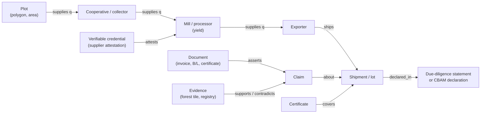
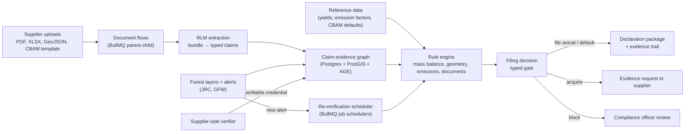

# Topic 3 · Prove It Before It Ships

*Graph-grounded, privacy-preserving evidence agents for multi-tier supply-chain compliance data (EUDR, CBAM, Digital Product Passport)*

| Field | Detail |
|---|---|
| Working title | Prove It Before It Ships: Neurosymbolic Claim-Evidence Graphs and Privacy-Preserving Verification Agents for Multi-Tier Regulatory Supply-Chain Data |
| Problem owner | EU importers, and the non-EU exporters, mills, smelters and traders who supply them (India, UAE, Africa, South-East Asia, Latin America) |
| Core question | Is the supplier data behind this declaration true enough to sign, and can we check it without forcing suppliers to reveal their secrets? |
| Covers your ideas | C (federated, cross-border fidelity), B (neurosymbolic checks), A (errors spreading across tiers) |
| Recent tech used | Recursive Language Models over document bundles, typed "System One" decisions (Jev or open equivalent), BullMQ flows and schedulers, multi-tier flow graphs, W3C Verifiable Credentials 2.0, UN Transparency Protocol |
| Data | Open only: JRC Global Forest Cover 2020 (10 m), Global Forest Watch alerts, Sentinel-2, FAOSTAT yields, UN Comtrade, EU CBAM default values, Ember grid emission factors, Open Supply Hub (research access) |
| Compute | One DGX Spark (128 GB) is enough |
| Product | **ProofTrail**: a compliance-evidence copilot that builds and checks the claim graph before a declaration is filed |
| Best-fit venues | IJPE, IJPR, Transportation Research Part E, Decision Support Systems, Journal of Cleaner Production, Resources Conservation & Recycling |

---

## 1. The problem in plain words

From 2026, many goods cannot enter or be sold in the EU unless the company can **prove** facts about where and how they were made:

- **EUDR (deforestation).** Cocoa, coffee, palm oil, soy, cattle, rubber and wood need the GPS location of every plot they came from and proof that no forest was cleared there after 31 December 2020. The rules apply from **30 December 2026** for medium and large companies and **30 June 2027** for micro and small ones. The Commission confirmed in 2026 that there will be no further delay.
- **CBAM (carbon border tax).** Steel, aluminium, cement, fertilisers, hydrogen and electricity imports have been in the definitive regime since **1 January 2026**. Importers must report verified embedded emissions or fall back on default values that are deliberately conservative, which means higher cost. Certificate sales start on **1 February 2027**; the first annual declaration is due on **30 September 2027**.
- **Digital Product Passport.** Every EV battery and every industrial battery above 2 kWh placed on the EU market needs a digital passport from **18 February 2027**, including carbon footprint and supply-chain due-diligence data. Textiles, electronics and other products follow under ESPR.

The data needed comes from many tiers: smallholder farmers, cooperatives, mills, smelters, traders. It arrives as PDFs, spreadsheets, phone-collected GPS points and certificates. It is often **incomplete** (polygons missing corners), **inconsistent** (a mill ships more than its farms can grow), **recycled** (one certificate reused for many lots) or **simply wrong** (units, dates, plant IDs). Suppliers also do not want to share raw data such as volumes, prices and energy bills with customers or competitors.

**Where AI agents make it worse.** Companies are starting to use AI agents to fill in due-diligence statements and emissions reports. An agent that copies supplier data into an official declaration without checking it turns a supplier's mistake into the importer's legal liability. It launders bad data into a signed document.

**A realistic example.** A trader exports 2,000 tonnes of coffee to Germany. The supplier file lists 1,140 plots with GPS points. Forty polygons overlap each other, twelve points fall in a lake, and the plots' combined area could produce at most 1,300 tonnes at regional yields. One cooperative's certificate appears on lots shipped by three unrelated exporters. A document-reading agent would see 1,140 valid-looking rows and file the statement. A graph-based check would flag all of these in minutes.

**Who loses money.** EU importers face fines, seized goods and reputational damage. Non-EU exporters, especially small and medium firms, lose market access or pay default-value carbon costs. Indian steel and aluminium MSMEs, for example, often buy inputs from larger producers and do not receive the verified plant-level emissions data CBAM requires.

## 2. Why this matters now

| Signal | What it says | Source |
|---|---|---|
| EUDR date is fixed | Applies 30 Dec 2026 (medium/large) and 30 June 2027 (micro/small); simplification package published 4 May 2026; no further postponement | [Herbert Smith Freehills Kramer](https://www.hlc.com/en/publications/eu-deforestation-regulation-commission-publishes-simplification-package-ahead-of-december-2026), [European Commission](https://environment.ec.europa.eu/news/commission-updates-product-scope-and-tools-support-eudr-2026-07-13_en) |
| Geolocation data quality is poor | Plots above 4 ha need polygons; field data is often collected manually, with broken shapes that cannot be checked against satellite data | [TraceX](https://tracextech.com/geographic-coordinate-requirements-for-eudr/), [Koltiva](https://www.koltiva.com/post/polygon-quality-matters-why-geolocation-accuracy-will-define-eudr-ready-coffee-procurement) |
| CBAM costs started in 2026 | Definitive regime since 1 Jan 2026; verified emissions required; default values are conservative and their use is being restricted | [iPoint](https://www.ipoint-systems.com/news/details/cbam-start-2026/) |
| CBAM timeline after simplification | 50-tonne de minimis threshold; certificate sales from 1 Feb 2027; first declaration 30 Sept 2027 | [Arthur Cox](https://www.arthurcox.com/knowledge/carbon-border-adjustment-mechanism-simplification/) |
| Exporters feel it | GTRI estimates CBAM-related cost increases for Indian crude steel of ~15% in 2026, rising later; small exporters lack plant-level verified data | [Maritime Gateway / GTRI](https://www.maritimegateway.com/eu-carbon-tax-from-2026-set-to-dent-indias-steel-aluminium-exports-gtri) |
| Battery passport date is fixed | EV and industrial batteries >2 kWh need a DPP from 18 Feb 2027 | [European Commission](https://single-market-economy.ec.europa.eu/single-market/digital-product-passport/batteries_en), [Bluestone PIM](https://www.bluestonepim.com/blog/digital-product-passport-for-batteries) |
| Open standards exist | UN Transparency Protocol (UNTP) defines DPPs, traceability events and conformity credentials as verifiable credentials; v1.0 targeted for September 2026 | [UNTP specification](https://spec-untp-fbb45f.opensource.unicc.org/docs/specification/Architecture) |

**Why this is relevant from Dubai.** The UAE is a major aluminium exporter and a trading hub for coffee, cocoa and other EUDR commodities, and India's steel and aluminium MSMEs are among the most exposed to CBAM. A tool that helps these exporters prove their data has an immediate regional market.

## 3. How we would solve it (plain words)

Build an **AI evidence auditor** that runs before any declaration is signed:

1. **Turn every document into claims.** An agent reads the supplier bundle (certificates, invoices, bills of lading, GPS files, emissions templates) and extracts each fact as a typed claim: *Plot P, 3.2 ha, at these coordinates, produced 4.1 t on these dates.* Recursive Language Models handle bundles of hundreds of pages.
2. **Connect the claims into a graph.** Plots feed cooperatives, cooperatives feed mills, mills feed exporters, exporters feed shipments. Each link carries quantities, dates and documents.
3. **Check the graph against hard rules and independent evidence.**
   - *Mass balance:* a mill cannot ship more than it received, after normal yield losses.
   - *Productivity:* a plot cannot produce more than its area allows at regional yields.
   - *Forest check:* the plot polygon must be valid and must not overlap forest that was lost after 2020 (JRC and Global Forest Watch maps).
   - *Emissions physics:* reported steel or aluminium emissions must be consistent with the production route and the energy actually used.
   - *Document consistency:* quantities, dates, HS codes and parties must match across invoices, bills of lading and certificates; one certificate cannot cover more volume than it was issued for.
4. **Protect supplier secrets.** Suppliers run a local checker on their own data. It sends the buyer only a signed statement ("lot L passes mass balance for Q3, checked by verifier V") as a verifiable credential, not the raw volumes or energy bills.
5. **Decide what to file.** For each lot the system recommends: file with actual data, file with default values, request more evidence, or block the lot. It shows the evidence trail behind each recommendation.

## 4. What already exists (and what you can reuse)

| Research stream | Key work | What it solved | What is still open |
|---|---|---|---|
| Supply-network discovery with LLMs | *Helicase* ([arXiv 2605.26835](https://arxiv.org/abs/2605.26835)); KG + LLM visibility ([IJPR 2025](https://doi.org/10.1080/00207543.2025.2575841)) | Build multi-tier graphs from public sources with uncertainty | Discovery, not verification of supplier-declared regulatory data |
| Privacy-preserving supply-chain learning | Federated GNNs for supply-chain data sharing ([Applied Soft Computing 2025](https://www.sciencedirect.com/science/article/pii/S1568494624012493)) | Share models, not data | Not about verifying specific declarations or regulatory rules |
| Cross-organisational agent trust | *When Agentic Trust Crosses Organizational Boundaries* ([arXiv 2609.22961](https://arxiv.org/abs/2609.22961)); *AgentLeak* privacy-leak benchmark ([arXiv 2602.11510](https://arxiv.org/abs/2602.11510)) | Reference models for trust evidence across organisations; leakage risks in multi-agent systems | No commodity, emissions or mass-balance semantics |
| Agent provenance | *Correct Is Not Governed* ([arXiv 2608.12761](https://arxiv.org/abs/2608.12761)); *Silence Is Endorsement* ([arXiv 2609.20211](https://arxiv.org/abs/2609.20211)) | Agents drop verification status; provenance layers fix it | Not applied to regulatory filings |
| Regulatory multi-agent systems | *Enabling Regulatory Multi-Agent Collaboration* ([arXiv 2509.09215](https://arxiv.org/abs/2509.09215)); LLM agents in law survey ([arXiv 2601.06216](https://arxiv.org/abs/2601.06216)) | Decompose obligations into plan, execute, verify roles | Generic; no physical consistency checks |
| Remote sensing for deforestation | JRC Global Forest Cover 2020; GFW integrated alerts; Hansen forest change | Open, global forest data aligned with the EUDR cut-off | Rarely joined with supply-network graphs and document claims |
| Data standards | UNTP, W3C VC 2.0, GS1 EPCIS 2.0 and Digital Link, EU battery passport schemas | Shared vocabularies for credentials and events | Standards say how to share data, not how to test whether it is true |
| Commercial tools | Coolset, osapiens, TraceX, Koltiva, Satelligence | Data collection, satellite checks, reporting | Closed; mainly collection and reporting; limited cross-tier consistency logic |

**Reusable building blocks:** JRC GFC2020 and GFW alert layers through open APIs, FAOSTAT yield tables, the EU's CBAM communication template and default values, UNTP schemas, the RLM library, OR-Tools for flow checks, and verifiable-credential libraries from the OpenWallet Foundation.

## 5. The gap and the novelty

Compliance tools collect data and produce reports. Research builds supply-network graphs or protects privacy. **No published work we found tests whether multi-tier regulatory data is internally and physically consistent, measures how much checking power is lost when suppliers keep data private, and turns that into a filing decision.** Five contributions:

1. **Claim-evidence graph with cross-tier physical constraints.** Mass balance, plot productivity, forest overlap and emissions physics are encoded as constraints over a multi-tier flow graph. They catch volume laundering and over-claiming that document-by-document review misses.
2. **Neurosymbolic regulation-as-code.** LLMs translate regulation and guidance into candidate executable rules; experts validate them; a symbolic engine applies them. The LLM extracts and explains; it never decides compliance alone.
3. **Measured price of privacy.** Each rule is checked in three modes: full data, supplier-side attestations (verifiable credentials with selective disclosure), and cryptographic aggregate proofs. The paper reports how much detection power each privacy level costs for each fraud type.
4. **Fidelity-aware filing decisions.** A decision model chooses actual data, default values, more evidence or blocking a lot, by comparing expected carbon cost, penalty risk and the cost of collecting evidence. It puts a money value on data fidelity.
5. **TraceProof-Bench.** An open benchmark of synthetic multi-tier supply networks (coffee, cocoa, palm; steel, aluminium; batteries) grounded in open data, with labelled faults and document bundles.

## 6. Formal model (for reviewers)

**Graph.** G = (V, E) with node types: Plot, Installation, Organisation, Lot, Shipment, Document, Certificate, Claim, EvidenceTile, Rule. Flow edges (u → v) carry quantity *q_uv*, period and unit. Claims are atomic assertions with value, unit, issuer and document anchor.

**Constraint families (the symbolic layer).**

- *Flow conservation with yield:* for each processing node v and period t, Σ_out q ≤ y_max(v) · Σ_in q + ε.
- *Plot productivity:* for each plot p, Σ q attributed to p ≤ area(p) · Y_p95(crop, region) · Δt.
- *Deforestation-free:* polygon(p) is valid (closed, not self-intersecting, plausible area, on land) and polygon(p) ∩ Forest₂₀₂₀ ∩ Loss_after(2020-12-31) = ∅.
- *Emissions plausibility:* reported intensity of installation i lies in the band for its production route (for example BF-BOF vs EAF steel; smelter electricity source), and direct plus indirect emissions are consistent with fuel and electricity inputs times emission factors.
- *Document consistency:* quantities, dates, HS codes and parties agree across documents; certificate volume used ≤ volume issued.

**Definition 1 (Claim fidelity).** For a claim c, F(c) is the probability that c is true given the graph, estimated from rule outcomes, corroboration by independent evidence and issuer history. A declaration's fidelity is bounded below by the union bound over the claims it relies on (as in Topic 1), so a single weak link is visible.

**Definition 2 (Price of privacy).** For fault type f and privacy mode m, PoP(f, m) = Recall_full(f) − Recall_m(f), measured at a fixed false-alarm rate.

**Filing decision.** For lot ℓ with options {actual, default, acquire, block}:
- cost(actual) = p_c · E_actual + P(non-compliance | F) · Penalty
- cost(default) = p_c · E_default
- cost(acquire) = cost of evidence + delay cost + expected cost after re-assessment
- cost(block) = lost margin.

Here p_c is the carbon price (CBAM) or zero (EUDR, where only the penalty term applies). The paper derives the threshold on F above which filing actual data is cheaper, and tests it on the benchmark. This gives a direct answer to "what is good supplier data worth?"

**Privacy mechanisms, in order of complexity.**
1. Supplier-side verifier issues a W3C VC 2.0 / UNTP conformity credential stating which rules passed; selective disclosure (SD-JWT or BBS signatures) reveals only needed fields.
2. Cross-tier mass balance with additively homomorphic commitments and range proofs, so each tier proves Σ out ≤ Σ in without revealing quantities.
3. Federated learning (Flower with secure aggregation) to train anomaly models across suppliers without pooling data.

Start with mechanism 1; mechanisms 2 and 3 are extensions if time allows.

## 7. Graph design

| Graph check | Algorithm | What it detects |
|---|---|---|
| Flow conservation | Linear constraints / max-flow feasibility per period | Volume laundering, over-claiming |
| Plot capacity | Aggregation over plot subtrees | Phantom plots, inflated yields |
| Geometry | Polygon validity, overlap graph of plots, spatial join with forest layers | Duplicate, fabricated or forest-overlapping plots |
| Certificate usage | Sum of volumes per certificate across all lots | Certificate reuse |
| Cross-document consistency | Entity resolution + contradiction edges | Mismatched quantities, dates, parties |
| Change propagation | Descendant traversal when a new forest alert arrives | Which open lots are affected right now |

Tools: PostgreSQL + PostGIS + Apache AGE (or Neo4j Community), Shapely and GeoPandas for geometry, OR-Tools or HiGHS for flow feasibility, Google Earth Engine or local Sentinel-2/JRC tiles for forest layers.

## 8. System architecture

**Where the recent technologies fit**

| Technology | Role | Notes |
|---|---|---|
| **Recursive Language Models** | A supplier bundle (hundreds of pages, thousands of plot rows) is a REPL variable. The model writes code to split it by document type, calls sub-models to extract claims from each part, and cross-checks totals in code. This avoids context rot on very long bundles. | Compare extraction recall and cost against long-context and RAG |
| **Jev / System One** | Typed decisions per claim or lot ("polygon valid?", "filing option?") with probabilities | Optional Jev baseline; open typed small model is the core |
| **BullMQ** | One parent flow per declaration with child jobs per document and per rule family; retries for flaky OCR or satellite calls; job schedulers re-run checks when weekly forest alerts arrive; rate limits for external registries | Runs on Valkey; Python and Node workers |
| **Graphs** | Flow graph for mass balance, overlap graph for plots, provenance graph for claims, descendant traversal for alert impact | The core of the method |
| **Verifiable credentials (W3C VC 2.0, UNTP)** | Supplier attestations instead of raw data | OpenWallet Foundation libraries |
| **GraphRAG over regulation texts** | Answer "which rule applies to this HS code and this date?" with citations | Rules are still validated by people |
| **OpenTelemetry + Langfuse** | Trace every extraction, rule check and decision | Audit evidence for regulators |

## 9. Research questions and hypotheses

| # | Research question | Hypothesis |
|---|---|---|
| RQ1 | Do cross-tier graph constraints catch faults that document-level review misses? | H1: Volume laundering, phantom plots and certificate reuse are mostly invisible to document-level checks and mostly visible to graph checks. |
| RQ2 | Do LLM-only pipelines launder errors into declarations? | H2: An LLM agent that extracts and files without symbolic checks passes a measurable share of injected faults; the neurosymbolic pipeline cuts this sharply. |
| RQ3 | How much detection power is lost when suppliers share attestations instead of data? | H3: The price of privacy is small for local faults (bad polygons) and large for cross-tier faults (laundering) unless cryptographic aggregation is used. |
| RQ4 | Does fidelity-aware filing lower expected compliance cost? | H4: Lower expected cost than "always actual" and "always default" policies across carbon-price and penalty scenarios. |
| RQ5 | Does RLM extraction beat long-context and RAG on long bundles? | H5: Higher claim recall at equal or lower cost. |

## 10. Benchmark: TraceProof-Bench

| Track | Network generator grounded in | Injected faults (synthetic, labelled) |
|---|---|---|
| EUDR commodities (coffee, cocoa, palm) | Real producing regions, FAOSTAT yields, JRC GFC2020 forest map, GFW alerts | Invalid or overlapping polygons, points in water or towns, forest-overlap plots, phantom plots, volume laundering at mills, certificate reuse, date errors |
| CBAM goods (steel, aluminium) | Production routes, Ember grid factors, CBAM default values, trade flows from UN Comtrade | Under-reported emissions, wrong production route, energy-emission mismatch, unit errors, wrong installation IDs |
| Battery passport | Public battery chemistries and published carbon-footprint ranges | Missing due-diligence links, carbon-footprint inconsistencies, recycled-content over-claims |

Each case ships with a **document bundle**: generated certificates, invoices, bills of lading, CBAM templates and GeoJSON files, with realistic layout noise and OCR errors. Labels are exact because faults are injected by versioned operators.

## 11. Experiments, baselines and metrics

| ID | Baseline | Purpose |
|---|---|---|
| B0 | Rule checks on single documents (completeness, format) | Typical current tooling |
| B1 | LLM agent reads bundle and fills the declaration | Shows error laundering |
| B2 | LLM agent with RAG over regulation | Better rules, no physical checks |
| B3 | Graph constraints without LLM extraction (perfect claims) | Upper bound on symbolic checking |
| B4 | Jev as the typed gate (optional) | System One comparator |
| Full | RLM extraction + claim graph + constraints + privacy modes + filing decision | Proposed |

**Metrics.** Fault recall and precision by fault type; laundering rate (share of faults that reach a filed declaration); price of privacy per fault type; expected compliance cost under carbon-price and penalty scenarios; extraction recall; time and cost per declaration; time from a new forest alert to the flagging of affected lots.

## 12. Compute plan (one DGX Spark)

| Workload | Approach | Fits? |
|---|---|---|
| Document extraction | RLM-Qwen3-8B root with Qwen3.5-35B-A3B sub-calls; vision model for scanned pages | Yes |
| Regulation reasoning | gpt-oss-120b or Qwen3.5-122B-A10B (4-bit) | Yes |
| Geometry and forest checks | PostGIS and GeoPandas on CPU; pre-downloaded tiles for study regions | Yes |
| Flow checks | OR-Tools / HiGHS | Yes |
| Typed gate | Qwen3.5-4B with constrained decoding | Yes |

Satellite processing is limited to study regions, which keeps storage and compute small.

## 13. Product: ProofTrail

**What it is.** A compliance-evidence copilot. Exporters and importers upload supplier bundles; ProofTrail builds the claim graph, runs the checks, explains every flag, and produces a filing package with its evidence trail. Suppliers get a free local verifier that issues credentials, so they can prove compliance once and reuse it with many buyers.

**Who would pay**

| User | Pain | Value |
|---|---|---|
| EU importers (operators) | Legal liability for supplier data | Evidence trail behind every filing |
| Non-EU exporters and traders (India, UAE, Africa, LatAm) | Risk losing EU buyers; default-value carbon costs | Prove data once, reuse with all buyers |
| Mills, smelters, cooperatives | Asked for raw data by many customers | Share attestations instead of secrets |
| Freight forwarders and customs brokers | Customers ask them for compliance help | A new value-added service at the shipment level |
| Verifiers and certification bodies | Manual review of large bundles | Pre-checked bundles with flagged faults |

**Real-time behaviour.** Compliance is event-driven rather than millisecond-critical. A supplier upload triggers a flow that finishes in minutes. A new weekly forest alert triggers a graph traversal that flags every open lot sourced from the affected plots. A shipment booking triggers a final check before customs filing.

**Production hardening**

| Concern | Practice |
|---|---|
| Regulatory change | Rules versioned as code with effective dates; every decision records the rule version |
| Bad uploads | Schema validation, file-type checks, malware scanning, size limits |
| OCR and extraction errors | Confidence per claim; low-confidence claims go to review, never straight to a filing |
| External services down (satellite, registries) | BullMQ retries with backoff, cached tiles, explicit "unverified" state rather than silent pass |
| Duplicate filings | Idempotency key per lot and declaration version |
| Confidential supplier data | Supplier-side verification by default; encryption at rest; tenant isolation; data-residency options |
| Audit | Immutable decision log linking each filed value to claims, documents, rule versions and model versions |

**Competitors.** Coolset, osapiens, TraceX, Koltiva, Satelligence and large ERP vendors. ProofTrail's differences: cross-tier consistency logic, measured privacy-preserving verification, open benchmark, and a free supplier-side verifier that builds a network effect.

## 14. Risks and how to handle them

| Risk | Mitigation |
|---|---|
| Regulations keep changing (EUDR simplification, CBAM revisions) | Rules as versioned code; the method is regulation-agnostic; include a "rule change" experiment |
| No real labelled fraud data | Synthetic faults from documented failure modes; expert review of a sample; optional anonymised partner data |
| Cryptography takes over the schedule | Ship credentials-based privacy first; treat homomorphic commitments and federated learning as extensions |
| Crowded commercial market | Position the open verification engine as infrastructure that tools and verifiers can embed |
| Legal reliance on the tool | Tool supports, never replaces, the operator's due diligence; say so in product and paper |

**Do not claim:** that the system guarantees compliance; that synthetic faults reflect real fraud rates; that satellite forest maps are legally binding (the JRC map is explicitly non-binding).

## 15. Twelve-month plan

| Months | Work | Output |
|---|---|---|
| 1–2 | Regulation analysis, constraint catalogue, formal model | Problem-formulation draft |
| 2–4 | Network generators, fault operators, document-bundle generator | TraceProof-Bench v0.1 |
| 4–6 | Baselines B0–B3; RLM extraction | First results on laundering rate |
| 6–8 | Claim graph, rule engine, filing decision, credential-based privacy | ProofTrail v0.1 |
| 8–10 | Price-of-privacy experiments; cost scenarios | Results tables |
| 10–12 | Writing; release; pilot with an exporter or forwarder if available | Journal submission + benchmark release |

## 16. Papers you can get from this topic

| Paper | Venue type |
|---|---|
| Prove it before it ships: claim-evidence graphs for multi-tier regulatory data | IJPE, IJPR, DSS |
| The price of privacy in supply-chain compliance verification | TR-E, POM, Information & Management |
| What is good supplier data worth? Fidelity-aware CBAM filing decisions | Journal of Cleaner Production, RCR, EJOR |
| TraceProof-Bench | NeurIPS D&B, KDD Applied Data Science |

## 17. Sources

1. Herbert Smith Freehills Kramer. *EU Deforestation Regulation: Commission publishes simplification package ahead of December 2026 application date.* 2026. https://www.hlc.com/en/publications/eu-deforestation-regulation-commission-publishes-simplification-package-ahead-of-december-2026
2. European Commission. *Commission updates product scope and tools to support EUDR.* 13 July 2026. https://environment.ec.europa.eu/news/commission-updates-product-scope-and-tools-support-eudr-2026-07-13_en
3. TraceX. *EUDR geolocation requirements.* https://tracextech.com/geographic-coordinate-requirements-for-eudr/
4. Koltiva. *Polygon quality matters.* https://www.koltiva.com/post/polygon-quality-matters-why-geolocation-accuracy-will-define-eudr-ready-coffee-procurement
5. iPoint. *CBAM: Start of the Definitive Regime in January 2026.* https://www.ipoint-systems.com/news/details/cbam-start-2026/
6. Arthur Cox. *Simplification of the CBAM.* https://www.arthurcox.com/knowledge/carbon-border-adjustment-mechanism-simplification/
7. Maritime Gateway / GTRI. *EU carbon tax from 2026 set to dent India's steel, aluminium exports.* https://www.maritimegateway.com/eu-carbon-tax-from-2026-set-to-dent-indias-steel-aluminium-exports-gtri
8. European Commission. *Digital Product Passport for batteries.* https://single-market-economy.ec.europa.eu/single-market/digital-product-passport/batteries_en
9. Bluestone PIM. *Digital Product Passport for Batteries: The February 2027 Deadline.* https://www.bluestonepim.com/blog/digital-product-passport-for-batteries
10. UN/CEFACT. *UN Transparency Protocol specification.* https://spec-untp-fbb45f.opensource.unicc.org/docs/specification/Architecture
11. EC JRC. *Global map of forest cover 2020, V4.* https://developers.google.com/earth-engine/datasets/catalog/JRC_GFC2020_V4
12. Open Supply Hub API and researcher access. https://info.opensupplyhub.org/api · https://info.opensupplyhub.org/researchers
13. *Helicase: Uncertainty-Guided Supply Chain Knowledge Graph Construction with Autonomous Multi-Agent LLMs.* arXiv:2605.26835. https://arxiv.org/abs/2605.26835
14. *Federated graph neural network for privacy-preserved supply chain data sharing.* Applied Soft Computing, 2025. https://www.sciencedirect.com/science/article/pii/S1568494624012493
15. *When Agentic Trust Crosses Organizational Boundaries.* arXiv:2609.22961. https://arxiv.org/abs/2609.22961
16. *AgentLeak: A Full-Stack Benchmark for Privacy Leakage in Multi-Agent LLM Systems.* arXiv:2602.11510. https://arxiv.org/abs/2602.11510
17. *Correct Is Not Governed: Provenance Integrity in Agentic Workflows.* arXiv:2608.12761. https://arxiv.org/abs/2608.12761
18. *Silence Is Endorsement: Verification-Status Laundering in LLM Agent Pipelines.* arXiv:2609.20211. https://arxiv.org/abs/2609.20211
19. *Enabling Regulatory Multi-Agent Collaboration: Architecture, Challenges, and Solutions.* arXiv:2509.09215. https://arxiv.org/abs/2509.09215
20. *LLM Agents in Law: Taxonomy, Applications, and Challenges.* arXiv:2601.06216. https://arxiv.org/abs/2601.06216
21. *Enhancing supply chain visibility with knowledge graphs and large language models.* IJPR, 2025. https://doi.org/10.1080/00207543.2025.2575841
22. Zhang, A. L., Kraska, T., Khattab, O. *Recursive Language Models.* arXiv:2512.24601. https://arxiv.org/abs/2512.24601
23. TypeSafe AI. *Introducing System One Models & Jev.* 15 September 2026. https://typesafe.ai/blog/introducing-system-one-models-and-jev
24. BullMQ documentation. https://docs.bullmq.io
25. W3C. *Verifiable Credentials Data Model v2.0.* https://www.w3.org/TR/vc-data-model-2.0/
26. GS1. *EPCIS & CBV 2.0.* https://www.gs1.org/standards/epcis

*Verification note: regulatory dates were checked through web search on 7 October 2026 and can change. Re-check the EUDR, CBAM and battery-passport timelines on the official EU pages before submission.*
